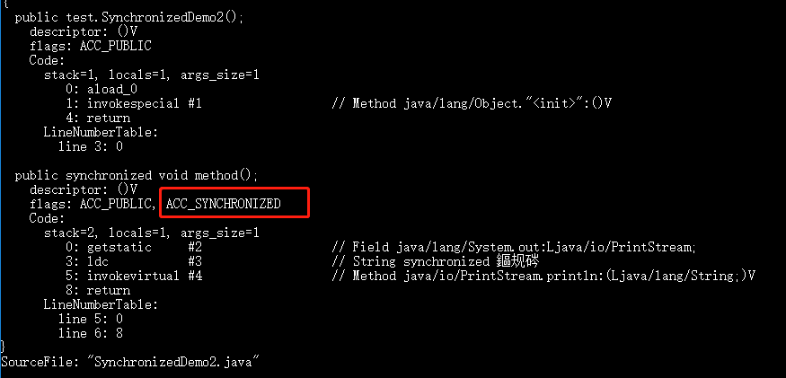

# 一、synchronized 是什么？有什么用？

`synchronized` 是 Java 中的一个关键字，翻译成中文是同步的意思，主要解决的是多个线程之间访问资源的同步性，可以保证被它修饰的方法或者代码块在任意时刻只能有一个线程执行。

# 二、如何使用 synchronized？

`synchronized` 关键字的使用方式主要有下面 3 种：

1. 修饰实例方法
2. 修饰静态方法
3. 修饰代码块

**1、修饰实例方法** （锁当前对象实例）

给当前对象实例加锁，进入同步代码前要获得 **当前对象实例的锁** 。

**2、修饰静态方法** （锁当前类）

给当前类加锁，会作用于类的所有对象实例 ，进入同步代码前要获得 **当前 class 的锁**。

这是因为**静态成员不属于任何一个实例对象，归整个类所有**，不依赖于类的特定实例，被类的所有实例共享。

**静态 `synchronized` 方法和非静态 `synchronized` 方法之间的调用互斥么？不互斥**！如果一个线程 A 调用一个实例对象的非静态 `synchronized` 方法，而线程 B 需要调用这个实例对象所属类的静态 `synchronized` 方法，是允许的，不会发生互斥现象，因为访问静态 `synchronized` 方法占用的锁是当前类的锁，而访问非静态 `synchronized` 方法占用的锁是当前实例对象锁。

**3、修饰代码块** （锁指定对象/类）

对括号里指定的对象/类加锁：

- `synchronized(object)` 表示进入同步代码库前要获得 **给定对象的锁**。
- `synchronized(类.class)` 表示进入同步代码前要获得 **给定 Class 的锁**

**总结：**

- `synchronized` 关键字加到 `static` 静态方法和 `synchronized(xx.class)` 代码块上都是是给 Class 类上锁；
- `synchronized` 关键字加到实例方法上是给对象实例上锁；
- 尽量不要使用 `synchronized(String a)` 因为 JVM 中，字符串常量池具有缓存功能。

# 三、构造方法可以用 synchronized 修饰么？

**构造方法不能使用 synchronized 关键字修饰**。不过，**可以在构造方法内部使用 synchronized 代码块**。

另外，**构造方法本身是线程安全的**，但如果在**构造方法中涉及到共享资源**的操作，就**需要采取适当的同步措施**来保证整个构造过程的线程安全。

# 四、synchronized 底层原理了解吗？

synchronized 关键字底层原理属于 JVM 层面的东西。

## synchronized 同步语句块的情况

```java
public class SynchronizedDemo {
    public void method() {
        synchronized (this) {
            System.out.println("synchronized 代码块");
        }
    }
}
```

通过 JDK 自带的 `javap` 命令查看 `SynchronizedDemo` 类的相关字节码信息：首先切换到类的对应目录执行 `javac SynchronizedDemo.java` 命令生成编译后的 .class 文件，然后执行`javap -c -s -v -l SynchronizedDemo.class`。


从上面我们可以看出：**`synchronized` 同步语句块的实现使用的是 `monitorenter` 和 `monitorexit` 指令，其中 `monitorenter` 指令指向同步代码块的开始位置，`monitorexit` 指令则指明同步代码块的结束位置。**

上面的字节码中包含一个 `monitorenter` 指令以及两个 `monitorexit` 指令，这是为了保证锁在同步代码块代码正常执行以及出现异常的这两种情况下都能被正确释放。

当执行 `monitorenter` 指令时，线程试图获取锁也就是获取 **对象监视器 `monitor`** 的持有权。

在**执行`monitorenter`时，会尝试获取对象的锁**，如果**锁的计数器为 0 则表示锁可以被获取，获取后将锁计数器设为 1 也就是加 1**。


对象锁的的拥有者线程才可以执行 `monitorexit` 指令来释放锁。在执行 `monitorexit` 指令后，将锁计数器设为 0，表明锁被释放，其他线程可以尝试获取锁。


如果获取对象锁失败，那当前线程就要阻塞等待，直到锁被另外一个线程释放为止。

## synchronized 修饰方法的的情况

```java
public class SynchronizedDemo2 {
    public synchronized void method() {
        System.out.println("synchronized 方法");
    }
}
```



**`synchronized` 修饰的方法并没有 `monitorenter` 指令和 `monitorexit` 指令，取而代之的是 `ACC_SYNCHRONIZED` 标识，该标识指明了该方法是一个同步方法**。JVM 通过该 `ACC_SYNCHRONIZED` 访问标志来辨别一个方法是否声明为同步方法，从而执行相应的同步调用。

如果是**实例方法，JVM 会尝试获取实例对象的锁**。如果是**静态方法，JVM 会尝试获取当前 class 的锁**。

## 总结

- `synchronized` 同步语句块的实现使用的是 `monitorenter` 和 `monitorexit` 指令，其中 `monitorenter` 指令指向同步代码块的开始位置，`monitorexit` 指令则指明同步代码块的结束位置。

- `synchronized` 修饰的方法并没有 `monitorenter` 指令和 `monitorexit` 指令，取而代之的是 `ACC_SYNCHRONIZED` 标识，该标识指明了该方法是一个同步方法。

**不过两者的本质都是对对象监视器 monitor 的获取。**

相关推荐：[Java 锁与线程的那些事 - 有赞技术团队](https://tech.youzan.com/javasuo-yu-xian-cheng-de-na-xie-shi/) 。

🧗🏻 进阶一下：学有余力的小伙伴可以抽时间详细研究一下对象监视器 `monitor`。


# 五、JDK1.6 之后的 synchronized 底层做了哪些优化？锁升级原理了解吗？

在 Java 6 之后， `synchronized` 引入了大量的优化如自旋锁、适应性自旋锁、锁消除、锁粗化、偏向锁、轻量级锁等技术来减少锁操作的开销，这些优化让 `synchronized` 锁的效率提升了很多（JDK18 中，偏向锁已经被彻底废弃，前面已经提到过了）。

锁主要存在四种状态，依次是：无锁状态、偏向锁状态、轻量级锁状态、重量级锁状态，他们会随着竞争的激烈而逐渐升级。注意锁可以升级不可降级，这种策略是为了提高获得锁和释放锁的效率。

`synchronized` 锁升级是一个比较复杂的过程，面试也很少问到，如果你想要详细了解的话，可以看看这篇文章：[浅析 synchronized 锁升级的原理与实现](https://www.cnblogs.com/star95/p/17542850.html)。

# 六、synchronized 和 volatile 有什么区别？

`synchronized` 关键字和 `volatile` 关键字**是两个互补的存在（通常会结合使用），而不是对立的存在**！

> synchronized 完成变量的更新，volatile 确保更新变量的可见性

- `volatile` 关键字是线程同步的轻量级实现，所以 `volatile`性能肯定比`synchronized`关键字要好 。但是 **`volatile` 关键字只能用于变量**而 **`synchronized` 关键字**可以修饰**方法以及代码块** 。
- `volatile` 关键字能保证数据的可见性，但不能保证数据的原子性。`synchronized` 关键字两者都能保证。
- `volatile`关键字主要用于解决**变量在多个线程之间的可见性**，而 `synchronized` 关键字解决的是**多个线程之间访问资源的同步性**。

