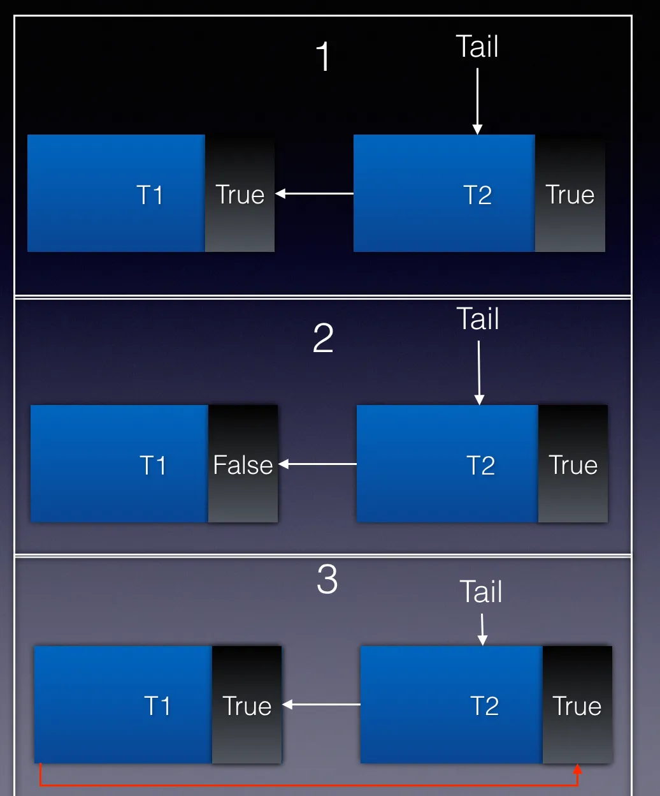

CLH 锁是对自旋锁的一种改良。在介绍 CLH 锁前，先简单介绍一下自旋锁。

# 一、自旋锁

## 1.1 什么是自旋锁

自旋锁是互斥锁的一种实现，Java 实现如下方所示。

```java

public class SpinLock {
    private AtomicReference<Thread> owner = new AtomicReference<Thread>();

    public void lock() {
        Thread currentThread = Thread.currentThread();
        // 如果锁未被占用，则设置当前线程为锁的拥有者，否则的话会轮训等待
        while (!owner.compareAndSet(null, currentThread)) {
        }
    }

    public void unlock() {
        Thread currentThread = Thread.currentThread();
        // 只有锁的拥有者才能释放锁
        owner.compareAndSet(currentThread, null);
    }
}
```

如代码所示，获取锁时，线程会**对一个原子变量循环执行 compareAndSet 方法，直到该方法返回成功时即为成功获取锁**。compareAndSet 方法底层是通用 compare-and-swap （下称 CAS）实现的。该操作通过将内存中的值与指定数据进行比较，当数值一样时将内存中的数据替换为新的值。该操作是原子操作。原子性保证了根据最新信息计算出新值，如果与此同时值已由另一个线程更新，则写入将失败。因此，这段代码可以实现互斥锁的功能。

## 1.2 自旋锁缺点

自旋锁实现简单，同时**避免了操作系统进程调度和线程上下文切换的开销**，但他有两个缺点：

- 第一个是**锁饥饿问题**。在锁竞争激烈的情况下，可能存在**一个线程一直被其他线程”插队“而一直获取不到锁**的情况。
- 第二是**性能问题**。在传统的自旋锁中，所有试图获取锁的线程都会在一个共享的状态变量上自旋（即不断检查锁是否可用）。这意味着：
  1. 当一个线程释放锁时，所有正在自旋等待该锁的线程都需要更新它们的缓存以反映这一变化，这会导致大量的缓存一致性流量。
  2. 这种全局可见性的需求使得性能受到限制，尤其是在有大量竞争的情况下。

**因此自旋锁适用于锁竞争不激烈、锁持有时间短的场景。**

# 二、CLH 锁

## 2.1 什么是 CLH 锁

CLH 锁是对自旋锁的一种改进，有效的解决了以上的两个缺点。

1. 饥饿问题：**将线程组织成一个队列，保证先请求的线程先获得锁，避免了饥饿问题**。
2. 性能问题：
   1. 去中心化的锁状态：与传统自旋锁不同，CLH锁为每个线程分配了一个独立的状态变量（waitStatus），这些状态变量链接形成一个队列。**每个线程仅在其本地状态变量上自旋，而不是在共享锁变量上**。
   2. 缩小影响范围：当持有锁的线程完成其临界区操作并准备释放锁时，**它只需通知其后续节点**（下一个等待线程），告知它可以继续前进。这种通知通常是**通过设置前驱节点的状态来实现的**。因此，只有直接相关的两个线程需要进行同步处理，而不需要整个系统都感知到这个变化。
   3. 缓存失效的影响最小化：由于每次只涉及到两个相邻节点之间的通信，其他线程的缓存不会受到影响。这就意味着，**当一个线程释放它的锁时，只会导致其后继节点的高速缓存失效**，而非所有等待线程的缓存。这种方式显著减少了缓存一致性协议带来的开销，提高了整体性能。

CLH 锁数据结构很简单，类似一个链表队列，所有请求获取锁的线程会排列在链表队列中，自旋访问队列中前一个节点的状态。**当一个节点释放锁时，只有它的后一个节点才可以得到锁**。

CLH 锁本身有一个队尾指针 Tail，它是一个原子变量，指向队列最末端的 CLH 节点。每一个 CLH 节点有两个属性：**所代表的线程**和标识**是否持有锁的状态变量**。

当**一个线程要获取锁时，它会对 Tail 进行一个 getAndSet 的原子操作**。该操作会返回 Tail 当前指向的节点，也就是当前队尾节点，然后**使 Tail 指向这个线程对应的 CLH 节点，成为新的队尾节点**。

入队成功后，该**线程会不断轮询上一个队尾节点的状态变量，当上一个节点释放锁后，它将得到这个锁**。

下面用图来展示 CLH 锁从获取到释放锁的全过程。


1. CLH 锁**初始化**时会 Tail 会指向一个**状态为 false 的空节点**，如图1所示。
2. 当 Thread 1（下称 T1）**请求获取锁**时，Tail 节点**指向 T1 对应的节点**，同时**返回空节点**。T1 **检查到上一个节点状态为 false，就成功获取到锁**，可以执行相应的逻辑了，如图2所示。
3. 当 Thread 2（下称 T2）**请求获取锁**时，Tail 节点**指向 T2 对应的节点**，同时**返回 T1 对应的节点**。T2**检查到上一个节点状态为 True，无法获取到锁**，于是开始**轮询上一个节点的状态**，如图3所示。
4. 当 T1 **释放锁时，会将状态变量置为 False**，如图4所示。
5. T2 轮询到检查到上一个节点状态变为 False，则获取锁成功，如图5所示。

## 2.2 CLH 锁 Java 实现解析

通过上面的图形象的展示了 CLH 的数据结构以及初始化、获取、释放锁的全过程，便于大家理解 CLH 锁的原理。但是就算理解了原理，也不一定能够实现一个线程安全的 CLH 互斥锁。在并发编程领域，“细节是魔鬼”这一格言同样适用。下面将解读 CLH 锁 Java 实现源码并分享并发编程的一些细节。


**1、节点中的状态变量为什么用 volatile 修饰？可以不用 volatile 吗？**

**使用 volatile 修饰状态变量不是为了利用 volatile 的内存可见性**，因为这个状态变量**只会被持有该状态变量的线程写入**，**只会被队列中该线程的后驱节点对应的线程读**，而且后者会轮询读取。因此，可见性问题不会影响锁的正确性。以上面的例子为例，**T2 会不断轮询T1的状态变量，T1 将它的状态变更为 False 时 T2 没有立即感知也没有关系**。该**状态变量最终会写回内存并被 T2 终感知到变更后的值。**

但要实现一个可以在多线程程序中正确执行的锁，还**需要解决重排序问题**。在《Java 并发编程实战》一书对于重排序问题是这么描述的：在没有同步的情况下，编译器、处理器以及运行时等都可能对操作的执行顺序进行一些意想不到的调整。在缺乏足够同步的多线程程序中，要想对内存操作的执行顺序进行判断，几乎无法得到正确的结论。对于 Java synchronized 关键字提供的内置锁(又叫监视器)，Java Memory Model（下称 JMM）规范中有一条 Happens-Before（先行发生）规则：“一个监视器锁上的解锁发生在该监视器锁的后续锁定之前”，因此 JVM 会保证这条规则成立。

而自定义互斥锁就需要自己保证这一规则的成立，因此上述代码通过 volatile 的 Happens-Before（先行发生）规则来解决重排序问题。JMM 的 Happens-Before（先行发生）规则有**一条针对 volatile 关键字的规则：“volatile 变量的写操作发生在该变量的后续读之前”。**

**2、CLH 锁是一个链表队列，为什么 Node 节点没有指向前驱或后继指针呢？**

CLH 锁是一种隐式的链表队列，没有显式的维护前驱或后继指针。因为**每个等待获取锁的线程只需要轮询前一个节点的状态就够了，而不需要遍历整个队列**。在这种情况下，**只需要使用一个局部变量保存前驱节点**，而不需要显式的维护前驱或后继指针。

**3、this.node.set(new Node()) 这行代码有何意义？**

如果没有这行代码，**Node 可能被复用，导致死锁**，如下图所示：



1.一开始，T1 持有锁，T2 自旋等待，如图1开始。

2.当 T1 释放锁（设置为 false），但此时 T2 尚未抢占到锁，如图2所示。

3.此时如果 **T1 再次调用 lock()请求获取锁，会将状态设为 True，同时自旋等待 T2 释放锁**。而**T2也自旋等待前驱节点状态变为 False，这样就造成了死锁**，如图3所示。

因此需要这行代码生成新的 Node 节点，避免 Node 节点复用带来的死锁。

## 2.3 CLH 优缺点分析

CLH 锁作为自旋锁的改进，有以下几个优点：

1. 性能优异，获取和释放锁开销小。**CLH 的锁状态不再是单一的原子变量，而是分散在每个节点的状态中，降低了自旋锁在竞争激烈时频繁同步的开销**。在释放锁的开销也因为不需要使用 CAS 指令而降低了。
2. 公平锁。**先入队的线程会先得到锁**。
3. 实现简单，易于理解。
4. **扩展性强**。下面会提到 AQS 如何扩展 CLH 锁实现了 juc 包下各类丰富的同步器。

当然，它也有两个缺点：第一是因为**有自旋操作**，当锁持有时间长时会带来较大的 CPU 开销。第二是基本的 CLH **锁功能单一，不改造不能支持复杂的功能**。

# 三、AQS 对 CLH 队列锁的改造

`AQS`（AbstractQueuedSynchronizer）是 Java 并发包中用于实现同步器的基础框架，它借鉴了 CLH 锁的设计思想，但对其进行了扩展和优化，以支持更复杂的同步场景。以下是 AQS 如何对 CLH 锁进行升级优化的详细分析：

---

### 1. **引入双向链表结构**

- **CLH 锁的特点**：CLH 锁使用单向链表来维护等待线程队列，每个线程仅需要关注其前驱节点的状态。
- **AQS 的改进**：AQS 使用**双向链表**来管理等待线程队列。这种设计使得在处理复杂的同步操作时更加灵活：
  - **双向链表的优势**：
    - 支持快速定位前驱和后继节点。
    - 在某些场景下（如条件变量），需要从队列尾部插入或删除节点，双向链表可以高效地完成这些操作。

---

### 2. **支持多种同步模式**

- **CLH 锁的局限性**：CLH 锁主要用于实现简单的互斥锁（独占锁），无法直接支持共享锁或其他复杂的同步语义。
- **AQS 的改进**：AQS 提供了对两种主要同步模式的支持：
  - **独占模式**：适用于互斥锁（如 `ReentrantLock`）。
  - **共享模式**：适用于信号量（`Semaphore`）、读写锁（`ReadWriteLock`）等需要多个线程同时访问资源的场景。
  - AQS 通过模板方法模式，允许子类根据需求重写 `tryAcquire`、`tryRelease`、`tryAcquireShared` 和 `tryReleaseShared` 等方法，从而实现不同的同步逻辑。

---

### 3. **状态管理**

- **CLH 锁的状态管理**：CLH 锁的状态管理较为简单，每个线程只关心其前驱节点的状态。

- **AQS 的改进**：

  - AQS 各线程内部的状态变量，提供了该状态变量的原子读写操作，但和同步器状态不同的是，**节点状态在 AQS 中被清晰的定义（不再是简单的 true 和 false）**，如下表所示：

  | 状态名    | 描述                                     |
  | --------- | ---------------------------------------- |
  | SIGNAL    | 表示该节点正常等待                       |
  | PROPAGATE | 应将 releaseShared 传播到其他节点        |
  | CONDITION | 该节点位于条件队列，不能用于同步队列节点 |
  | CANCELLED | 由于超时、中断或其他原因，该节点被取消   |

  - AQS 引入了一个共享的 `state` 变量（通常是一个整数），用于表示同步器的状态。这个状态变量可以通过 CAS 操作进行原子更新，并且可以根据具体的同步器需求被赋予不同的含义：
    - 在 `ReentrantLock` 中，`state` 表示锁的持有次数。
    - 在 `Semaphore` 中，`state` 表示剩余的许可数量。
    - 在 `CountDownLatch` 中，`state` 表示计数值。
    - 这种设计使得 AQS 能够适应各种同步器的需求，而不仅仅局限于简单的互斥锁。


---

### 4. **阻塞与唤醒机制**

- **CLH 锁的行为**：CLH 锁本质上是一种自旋锁，线程在未获取到锁时会持续检查前驱节点的状态，直到锁可用为止。这种方式在高竞争场景下可能导致 CPU 资源浪费。
- **AQS 的改进**：AQS 引入了基于 **LockSupport.park()** 和 **LockSupport.unpark()** 的线程阻塞与唤醒机制：
  - 当一个线程无法获取锁时，它会被挂起（进入等待状态），而不是持续自旋。
  - 当锁变得可用时，**前驱线程会显式唤醒后继线程**。
  - 这种机制减少了 CPU 的开销，特别适合于长时间等待的场景。

---

### 5. **公平性支持**

- **CLH 锁的公平性**：CLH 锁本身是公平的，因为线程按照加入队列的顺序依次获取锁。
- **AQS 的改进**：AQS 同时支持**公平锁**和**非公平锁**：
  - 公平锁：严格按照线程加入队列的顺序分配锁。
  - 非公平锁：新到来的线程有机会“插队”，即尝试直接获取锁，而不必排队。这提高了吞吐量，但在某些情况下可能会导致饥饿问题。
  - AQS 的灵活性使得开发者可以根据具体需求选择合适的公平性策略。

---

### 6. **条件变量支持**

- **CLH 锁的局限性**：CLH 锁不支持条件变量（Condition Variables），因此无法实现类似于 `wait()` 和 `notify()` 的功能。
- **AQS 的改进**：AQS 提供了对条件变量的支持，通过 `ConditionObject` 类实现了类似的功能：
  - 条件变量允许线程在某种条件下等待，并在条件满足时被唤醒。
  - 这一功能广泛应用于高级同步工具，如 `ReentrantLock` 的 `newCondition()` 方法。

---

### 7. **可扩展性**

- **CLH 锁的固定用途**：CLH 锁的设计目标是实现简单的互斥锁，难以扩展到其他场景。
- **AQS 的改进**：AQS 是一个高度可扩展的框架，允许开发者通过继承和重写特定的方法来自定义同步器的行为。例如：
  - `ReentrantLock` 实现了可重入的互斥锁。
  - `CountDownLatch` 实现了一次性的计数器。
  - `CyclicBarrier` 实现了循环屏障。
  - 这种设计使得 AQS 成为构建各种同步工具的基础。

### 8. 辅助 GC

JVM 的垃圾回收机制使开发者无需手动释放对象。但在 AQS 中需要在释放锁时显式的设置为 null，避免引用的残留，辅助垃圾回收。