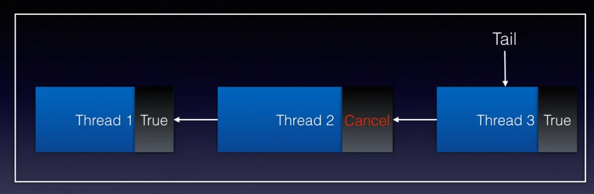
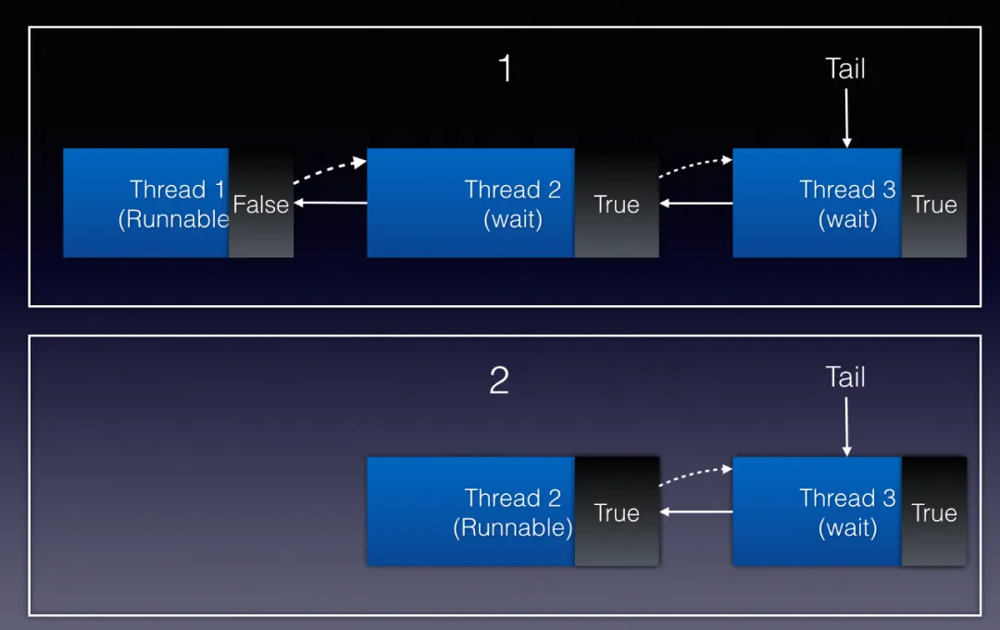

CLH 锁是对自旋锁的一种改良。在介绍 CLH 锁前，先简单介绍一下自旋锁。

# 一、自旋锁

## 1.1 什么是自旋锁

自旋锁是互斥锁的一种实现，Java 实现如下方所示。

```java

public class SpinLock {
    private AtomicReference<Thread> owner = new AtomicReference<Thread>();

    public void lock() {
        Thread currentThread = Thread.currentThread();
        // 如果锁未被占用，则设置当前线程为锁的拥有者
        while (!owner.compareAndSet(null, currentThread)) {
        }
    }

    public void unlock() {
        Thread currentThread = Thread.currentThread();
        // 只有锁的拥有者才能释放锁
        owner.compareAndSet(currentThread, null);
    }
}
```

如代码所示，获取锁时，线程会**对一个原子变量循环执行 compareAndSet 方法，直到该方法返回成功时即为成功获取锁**。compareAndSet 方法底层是通用 compare-and-swap （下称 CAS）实现的。该操作通过将内存中的值与指定数据进行比较，当数值一样时将内存中的数据替换为新的值。该操作是原子操作。原子性保证了根据最新信息计算出新值，如果与此同时值已由另一个线程更新，则写入将失败。因此，这段代码可以实现互斥锁的功能。

## 1.2 自旋锁缺点

自旋锁实现简单，同时**避免了操作系统进程调度和线程上下文切换的开销**，但他有两个缺点：

- 第一个是**锁饥饿问题**。在锁竞争激烈的情况下，可能存在**一个线程一直被其他线程”插队“而一直获取不到锁**的情况。
- 第二是**性能问题**。在实际的多处理上运行的自旋锁在锁竞争激烈时性能较差。

下图是引用自《多处理器编程的艺术》的 n 个线程固定地执行一段临界区所需的时间。

TASLock 和 TTASLock 与上文代码类似，都是针对一个原子状态变量轮询的自旋锁实现，最下面的曲线表示线程在没有干扰的情况下所需的时间。


显然，自旋锁的性能和理想情况相距甚远。这是因为自旋锁锁状态中心化，在**竞争激烈的情况下，锁状态变更会导致多个 CPU 的高速缓存的频繁同步，从而拖慢 CPU 效率**(这里涉及到 CPU 底层的一些知识，这里不再展开)。

**因此自旋锁适用于锁竞争不激烈、锁持有时间短的场景。**

# 二、CLH 锁

## 2.1 什么是 CLH 锁

CLH 锁是对自旋锁的一种改进，有效的解决了以上的两个缺点。首先它**将线程组织成一个队列，保证先请求的线程先获得锁，避免了饥饿问题**。其次**锁状态去中心化，让每个线程在不同的状态变量中自旋，这样当一个线程释放它的锁时，只能使其后续线程的高速缓存失效**，缩小了影响范围，从而减少了 CPU 的开销。

CLH 锁数据结构很简单，类似一个链表队列，所有请求获取锁的线程会排列在链表队列中，自旋访问队列中前一个节点的状态。**当一个节点释放锁时，只有它的后一个节点才可以得到锁**。

CLH 锁本身有一个队尾指针 Tail，它是一个原子变量，指向队列最末端的 CLH 节点。**每一个 CLH 节点有两个属性：所代表的线程和标识是否持有锁的状态变量**。当**一个线程要获取锁时，它会对 Tail 进行一个 getAndSet 的原子操作**。该操作会返回 Tail 当前指向的节点，也就是当前队尾节点，然后**使 Tail 指向这个线程对应的 CLH 节点，成为新的队尾节点**。入队成功后，该**线程会轮询上一个队尾节点的状态变量，当上一个节点释放锁后，它将得到这个锁**。

下面用图来展示 CLH 锁从获取到释放锁的全过程。


1. CLH 锁**初始化**时会 Tail 会指向一个**状态为 false 的空节点**，如图1所示。
2. 当 Thread 1（下称 T1）**请求获取锁**时，Tail 节点**指向 T1 对应的节点**，同时**返回空节点**。T1 **检查到上一个节点状态为 false，就成功获取到锁**，可以执行相应的逻辑了，如图2所示。
3. 当 Thread 2（下称 T2）**请求获取锁**时，Tail 节点**指向 T2 对应的节点**，同时**返回 T1 对应的节点**。T2**检查到上一个节点状态为 True，无法获取到锁**，于是开始**轮询上一个节点的状态**，如图3所示。
4. 当 T1 **释放锁时，会将状态变量置为 False**，如图4所示。
5. T2 轮询到检查到上一个节点状态变为 False，则获取锁成功，如图5所示。

## 2.2 CLH 锁 Java 实现解析

通过上面的图形象的展示了 CLH 的数据结构以及初始化、获取、释放锁的全过程，便于大家理解 CLH 锁的原理。但是就算理解了原理，也不一定能够实现一个线程安全的 CLH 互斥锁。在并发编程领域，“细节是魔鬼”这一格言同样适用。下面将解读 CLH 锁 Java 实现源码并分享并发编程的一些细节。


**1、节点中的状态变量为什么用 volatile 修饰？可以不用 volatile 吗？**

**使用 volatile 修饰状态变量不是为了利用 volatile 的内存可见性**，因为这个状态变量**只会被持有该状态变量的线程写入**，**只会被队列中该线程的后驱节点对应的线程读**，而且后者会轮询读取。因此，可见性问题不会影响锁的正确性。以上面的例子为例，**T2 会不断轮询T1的状态变量，T1 将它的状态变更为 False 时 T2 没有立即感知也没有关系**。该**状态变量最终会写回内存并被 T2 终感知到变更后的值。**

但要实现一个可以在多线程程序中正确执行的锁，还**需要解决重排序问题**。在《Java 并发编程实战》一书对于重排序问题是这么描述的：在没有同步的情况下，编译器、处理器以及运行时等都可能对操作的执行顺序进行一些意想不到的调整。在缺乏足够同步的多线程程序中，要想对内存操作的执行顺序进行判断，几乎无法得到正确的结论。对于 Java synchronized 关键字提供的内置锁(又叫监视器)，Java Memory Model（下称 JMM）规范中有一条 Happens-Before（先行发生）规则：“一个监视器锁上的解锁发生在该监视器锁的后续锁定之前”，因此 JVM 会保证这条规则成立。

而自定义互斥锁就需要自己保证这一规则的成立，因此上述代码通过 volatile 的 Happens-Before（先行发生）规则来解决重排序问题。JMM 的 Happens-Before（先行发生）规则有**一条针对 volatile 关键字的规则：“volatile 变量的写操作发生在该变量的后续读之前”。**

**2、CLH 锁是一个链表队列，为什么 Node 节点没有指向前驱或后继指针呢？**

CLH 锁是一种隐式的链表队列，没有显式的维护前驱或后继指针。因为**每个等待获取锁的线程只需要轮询前一个节点的状态就够了，而不需要遍历整个队列**。在这种情况下，**只需要使用一个局部变量保存前驱节点**，而不需要显式的维护前驱或后继指针。

**3、this.node.set(new Node()) 这行代码有何意义？**

如果没有这行代码，**Node 可能被复用，导致死锁**，如下图所示：


1.一开始，T1 持有锁，T2 自旋等待，如图1开始。

2.当 T1 释放锁（设置为 false），但此时 T2 尚未抢占到锁，如图2所示。

3.此时如果 **T1 再次调用 lock()请求获取锁，会将状态设为 True，同时自旋等待 T2 释放锁**。而**T2也自旋等待前驱节点状态变为 False，这样就造成了死锁**，如图3所示。

因此需要这行代码生成新的 Node 节点，避免 Node 节点复用带来的死锁。

## 2.3 CLH 优缺点分析

CLH 锁作为自旋锁的改进，有以下几个优点：

1. 性能优异，获取和释放锁开销小。**CLH 的锁状态不再是单一的原子变量，而是分散在每个节点的状态中，降低了自旋锁在竞争激烈时频繁同步的开销**。在释放锁的开销也因为不需要使用 CAS 指令而降低了。
2. 公平锁。**先入队的线程会先得到锁**。
3. 实现简单，易于理解。
4. **扩展性强**。下面会提到 AQS 如何扩展 CLH 锁实现了 j.u.c 包下各类丰富的同步器。

当然，它也有两个缺点：第一是因为**有自旋操作**，当锁持有时间长时会带来较大的 CPU 开销。第二是基本的 CLH **锁功能单一，不改造不能支持复杂的功能**。

# 三、AQS 对 CLH 队列锁的改造

针对 CLH 的缺点，AQS 对 CLH 队列锁进行了一定的改造。针对第一个缺点，**AQS 将自旋操作改为阻塞线程操作**。针对第二个缺点，**AQS 对 CLH 锁进行改造和扩展**，原作者 Doug Lea 称之为“CLH 锁的变体”。

下面将详细讲 AQS 底层细节以及对 CLH 锁的改进。AQS 中的对 CLH 锁数据结构的改进主要包括三方面：**扩展每个节点的状态**、**显式的维护前驱节点和后继节点**以及诸如**出队节点显式设为 null** 等辅助 GC 的优化。正是这些改进使 AQS 可以支撑 j.u.c 丰富多彩的同步器实现。

## 3.1 扩展每个节点的状态

AQS 每个节点的状态如下所示，在源码中如下所示：

```
volatile int waitStatus;
```

AQS 同样提供了该状态变量的原子读写操作，但和同步器状态不同的是，**节点状态在 AQS 中被清晰的定义**，如下表所示：

| 状态名    | 描述                                     |
| --------- | ---------------------------------------- |
| SIGNAL    | 表示该节点正常等待                       |
| PROPAGATE | 应将 releaseShared 传播到其他节点        |
| CONDITION | 该节点位于条件队列，不能用于同步队列节点 |
| CANCELLED | 由于超时、中断或其他原因，该节点被取消   |

## 3.2 显式的维护前驱节点和后继节点

上文我们提到在原始版本的 CLH 锁中，节点间甚至都没有互相链接。但是，通过在节点中**显式地维护前驱节点，CLH 锁就可以处理“超时”和各种形式的“取消”**：**如果一个节点的前驱节点取消了，这个节点就可以滑动去使用前面一个节点的状态字段**。对于通过自旋获取锁的 CLH 锁来说，只需要显式的维护前驱节点就可以实现取消功能，如下图所示：



但是在 AQS 的实现稍有不同。因为 **AQS 用阻塞等待替换了自旋操作**，线程会阻塞等待锁的释放，**不能主动感知到前驱节点状态变化的信息**。AQS 中显式的维护前驱节点和后继节点，**需要释放锁的节点会显式通知下一个节点解除阻塞**，如下图所示，T1 释放锁后主动唤醒 T2，使 T2 检测到锁已释放，获取锁成功。



其中需要关注的一个细节是：由于没有针对双向链表节点的类似 compareAndSet 的原子性无锁插入指令，因此**后驱节点的设置并非作为原子性插入操作的一部分**，而**仅是在节点被插入后简单地赋值**。在**释放锁时，如果当前节点的后驱节点不可用时，将从利用队尾指针 Tail 从尾部遍历到直到找到当前节点正确的后驱节点**。

## 3.3 辅助 GC

JVM 的垃圾回收机制使开发者无需手动释放对象。但在 AQS 中需要在释放锁时显式的设置为 null，避免引用的残留，辅助垃圾回收。