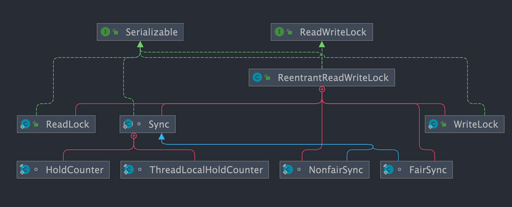

`ReentrantReadWriteLock` 在实际项目中使用的并不多，面试中也问的比较少，简单了解即可。JDK 1.8 引入了性能更好的读写锁 `StampedLock` 。

# 一、ReentrantReadWriteLock 是什么？

`ReentrantReadWriteLock` 实现了 `ReadWriteLock` ，是一个可重入的读写锁，既可以保证**多个线程同时读**的效率，同时又可以保证**有写入操作时的线程安全**。

```java
public class ReentrantReadWriteLock
        implements ReadWriteLock, java.io.Serializable{
}
public interface ReadWriteLock {
    Lock readLock();
    Lock writeLock();
}
```

- 一般锁进行并发控制的规则：读读互斥、读写互斥、写写互斥。
- 读写锁进行并发控制的规则：**读读不互斥**、读写互斥、写写互斥（只有读读不互斥）。

`ReentrantReadWriteLock` 其实是**两把锁**，一把是 `WriteLock` (写锁)，一把是 `ReadLock`（读锁） 。**读锁是共享锁，写锁是独占锁**。**读锁可以被同时读，可以同时被多个线程持有，而写锁最多只能同时被一个线程持有。**

和 `ReentrantLock` 一样，`ReentrantReadWriteLock` 底层也是基于 AQS 实现的。



`ReentrantReadWriteLock` 也支持公平锁和非公平锁，默认使用非公平锁，可以通过构造器来显示的指定

```java
// 传入一个 boolean 值，true 时为公平锁，false 时为非公平锁
public ReentrantReadWriteLock(boolean fair) {
    sync = fair ? new FairSync() : new NonfairSync();
    readerLock = new ReadLock(this);
    writerLock = new WriteLock(this);
}
```

# 二、ReentrantReadWriteLock 适合什么场景？

由于 `ReentrantReadWriteLock` 既可以保证多个线程同时读的效率，同时又可以保证有写入操作时的线程安全。因此，在**读多写少的情况下**，使用 `ReentrantReadWriteLock` 能够明显提升系统性能。

## 2.1 读锁为什么不能升级为写锁？

**写锁可以降级为读锁，但是读锁却不能升级为写锁**。这是因为读锁升级为写锁会引起线程的争夺，毕竟写锁属于是独占锁，这样的话，会影响性能。

另外，**还可能会有死锁问题发生**。举个例子：假设**两个线程的读锁都想升级写锁，则需要对方都释放自己锁，而双方都不释放，就会产生死锁**。

# 三、StampedLock

## 3.1 StampedLock 是什么？

`StampedLock` 是 JDK 1.8 引入的性能更好的读写锁，**不可重入**且**不支持条件变量 `Condition`**。

不同于一般的 `Lock` 类，`StampedLock` 并不是直接实现 `Lock`或 `ReadWriteLock`接口，而是基于 **CLH 锁** 独立实现的（AQS 也是基于这玩意）。

```
public class StampedLock implements java.io.Serializable {
}
```

`StampedLock` 提供了**三种模式**的读写控制模式：读锁、写锁和**乐观读**。

- **写锁**：独占锁，一把锁只能被一个线程获得。当一个线程获取写锁后，其他请求读锁和写锁的线程必须等待。类似于 `ReentrantReadWriteLock` 的写锁，不过这里的写锁是不可重入的。
- **读锁** （悲观读）：共享锁，没有线程获取写锁的情况下，多个线程可以同时持有读锁。如果己经有线程持有写锁，则其他线程请求获取该读锁会被阻塞。类似于 `ReentrantReadWriteLock` 的读锁，不过这里的读锁是不可重入的。
- **乐观读**：允许多个线程获取乐观读以及读锁。同时允许一个写线程获取写锁。

另外，`StampedLock` 还支持这三种锁在一定条件下进行相互转换 。

```java
long tryConvertToWriteLock(long stamp){}
long tryConvertToReadLock(long stamp){}
long tryConvertToOptimisticRead(long stamp){}
```

`StampedLock` 在**获取锁**的时候会**返回一个 long 型的数据戳**，该数据戳**用于稍后的锁释放参数**，如果返回的数据戳为 0 则表示锁获取失败。**当前线程持有了锁再次获取锁还是会返回一个新的数据戳，这也是`StampedLock`不可重入的原因。**

```java
// 写锁
public long writeLock() {
    long s, next;  // bypass acquireWrite in fully unlocked case only
    return ((((s = state) & ABITS) == 0L &&
             U.compareAndSwapLong(this, STATE, s, next = s + WBIT)) ?
            next : acquireWrite(false, 0L));
}
// 读锁
public long readLock() {
    long s = state, next;  // bypass acquireRead on common uncontended case
    return ((whead == wtail && (s & ABITS) < RFULL &&
             U.compareAndSwapLong(this, STATE, s, next = s + RUNIT)) ?
            next : acquireRead(false, 0L));
}
// 乐观读
public long tryOptimisticRead() {
    long s;
    return (((s = state) & WBIT) == 0L) ? (s & SBITS) : 0L;
}
```

## 3.2 StampedLock 的性能为什么更好？

相比于传统读写锁多出来的乐观读是`StampedLock`比 `ReadWriteLock` 性能更好的关键原因。`StampedLock` 的**乐观读允许一个写线程获取写锁，所以不会导致所有写线程阻塞**，也就是当读多写少的时候，写线程有机会获取写锁，减少了线程饥饿的问题，吞吐量大大提高。

## 3.3 StampedLock 适合什么场景？

和 `ReentrantReadWriteLock` 一样，`StampedLock` 同样适合读多写少的业务场景，可以作为 `ReentrantReadWriteLock`的替代品，性能更好。

不过，需要注意的是**`StampedLock`不可重入，不支持条件变量 `Condition`，对中断操作支持也不友好（使用不当容易导致 CPU 飙升）**。如果你需要用到 `ReentrantLock` 的一些高级性能，就不太建议使用 `StampedLock` 了。

另外，`StampedLock` 性能虽好，但使用起来相对比较麻烦，一旦使用不当，就会出现生产问题。强烈建议你在使用`StampedLock` 之前，看看 [StampedLock 官方文档中的案例](https://docs.oracle.com/javase/8/docs/api/java/util/concurrent/locks/StampedLock.html)。

## 3.4 StampedLock 的底层原理了解吗？

`StampedLock` 不是直接实现 `Lock`或 `ReadWriteLock`接口，而是基于 **CLH 锁** 实现的（AQS 也是基于这玩意），CLH 锁是对自旋锁的一种改良，是一种隐式的链表队列。`StampedLock` 通过 CLH 队列进行线程的管理，通过同步状态值 `state` 来表示锁的状态和类型。

`StampedLock` 的原理和 AQS 原理比较类似，这里就不详细介绍了，感兴趣的可以看看下面这两篇文章：

- [AQS 详解](https://javaguide.cn/java/concurrent/aqs.html)
- [StampedLock 底层原理分析](https://segmentfault.com/a/1190000015808032)

