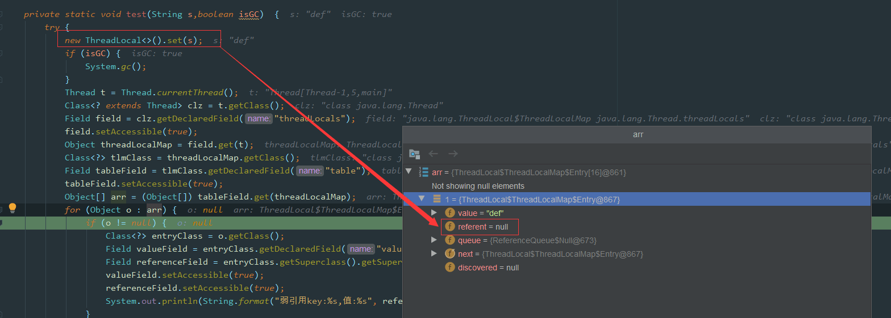

# 一、ThreadLocal 有什么用？

通常情况下，我们创建的变量是可以被任何一个线程访问并修改的。**如果想实现每一个线程都有自己的专属本地变量该如何解决呢？**

JDK 中自带的`ThreadLocal`类正是为了解决这样的问题。 **`ThreadLocal`类主要解决的就是让每个线程绑定自己的值，可以将`ThreadLocal`类形象的比喻成存放数据的盒子，盒子中可以存储每个线程的私有数据。**

如果你**创建了一个`ThreadLocal`变量，那么访问这个变量的每个线程都会有这个变量的本地副本**，这也是`ThreadLocal`变量名的由来。他们可以使用 `get()` 和 `set()` 方法来获取默认值或将其值更改为当前线程所存的副本的值，从而避免了线程安全问题。

再举个简单的例子：两个人去宝屋收集宝物，这两个共用一个袋子的话肯定会产生争执，但是给他们两个人每个人分配一个袋子的话就不会出现这样的问题。如果把这两个人比作线程的话，那么 ThreadLocal 就是用来避免这两个线程竞争的。

# 二、如何使用 ThreadLocal？

```java
import java.text.SimpleDateFormat;
import java.util.Random;

public class ThreadLocalExample implements Runnable{

     // SimpleDateFormat 不是线程安全的，所以每个线程都要有自己独立的副本
    private static final ThreadLocal<SimpleDateFormat> formatter = ThreadLocal.withInitial(() -> new SimpleDateFormat("yyyyMMdd HHmm"));

    public static void main(String[] args) throws InterruptedException {
        ThreadLocalExample obj = new ThreadLocalExample();
        for(int i=0 ; i<10; i++){
            Thread t = new Thread(obj, ""+i);
            Thread.sleep(new Random().nextInt(1000));
            t.start();
        }
    }

    @Override
    public void run() {
        System.out.println("Thread Name= "+Thread.currentThread().getName()+" default Formatter = "+formatter.get().toPattern());
        try {
            Thread.sleep(new Random().nextInt(1000));
        } catch (InterruptedException e) {
            e.printStackTrace();
        }
        //formatter pattern is changed here by thread, but it won't reflect to other threads
        formatter.set(new SimpleDateFormat());

        System.out.println("Thread Name= "+Thread.currentThread().getName()+" formatter = "+formatter.get().toPattern());
    }

}
```

输出结果：

```
Thread Name= 0 default Formatter = yyyyMMdd HHmm
Thread Name= 0 formatter = yy-M-d ah:mm
Thread Name= 1 default Formatter = yyyyMMdd HHmm
Thread Name= 2 default Formatter = yyyyMMdd HHmm
Thread Name= 1 formatter = yy-M-d ah:mm
Thread Name= 3 default Formatter = yyyyMMdd HHmm
Thread Name= 2 formatter = yy-M-d ah:mm
Thread Name= 4 default Formatter = yyyyMMdd HHmm
Thread Name= 3 formatter = yy-M-d ah:mm
Thread Name= 4 formatter = yy-M-d ah:mm
Thread Name= 5 default Formatter = yyyyMMdd HHmm
Thread Name= 5 formatter = yy-M-d ah:mm
Thread Name= 6 default Formatter = yyyyMMdd HHmm
Thread Name= 6 formatter = yy-M-d ah:mm
Thread Name= 7 default Formatter = yyyyMMdd HHmm
Thread Name= 7 formatter = yy-M-d ah:mm
Thread Name= 8 default Formatter = yyyyMMdd HHmm
Thread Name= 9 default Formatter = yyyyMMdd HHmm
Thread Name= 8 formatter = yy-M-d ah:mm
Thread Name= 9 formatter = yy-M-d ah:mm
```

从输出中可以看出，虽然 **`Thread-0` 已经改变了 `formatter` 的值**，但 **`Thread-1` 默认格式化值与初始化值相同，其他线程也一样**。

上面用于创建 `ThreadLocal` 变量的那段代码用到了 Java8 的知识，它等于下面这段代码，如果你写了下面这段代码的话，IDEA 会提示你转换为 Java8 的格式(IDEA 真的不错！)。因为 ThreadLocal 类在 Java 8 中扩展，使用一个新的方法`withInitial()`，将 Supplier 功能接口作为参数。

```java
private static final ThreadLocal<SimpleDateFormat> formatter = new ThreadLocal<SimpleDateFormat>(){
    @Override
    protected SimpleDateFormat initialValue(){
        return new SimpleDateFormat("yyyyMMdd HHmm");
    }
};
```

# 三、ThreadLocal 原理了解吗？

从 `Thread`类源代码入手。

```java
public class Thread implements Runnable {
    //......
    //与此线程有关的ThreadLocal值。由ThreadLocal类维护
    ThreadLocal.ThreadLocalMap threadLocals = null;

    //与此线程有关的InheritableThreadLocal值。由InheritableThreadLocal类维护
    ThreadLocal.ThreadLocalMap inheritableThreadLocals = null;
    //......
}
```

从上面`Thread`类 源代码可以看出`Thread` 类中有一个 `threadLocals` 和 一个 `inheritableThreadLocals` 变量，它们**都是 `ThreadLocalMap` 类型的变量**,我们**可以把 `ThreadLocalMap` 理解为`ThreadLocal` 类实现的定制化的 `HashMap`**。

默认情况下这两个变量都是 null，只有当前线程**调用 `ThreadLocal` 类的 `set`或`get`方法**时才创建它们，**实际上调用这两个方法的时候，我们调用的是`ThreadLocalMap`类对应的 `get()`、`set()`方法。**

`ThreadLocal`类的`set()`方法

```java
public void set(T value) {
    //获取当前请求的线程
    Thread t = Thread.currentThread();
    //取出 Thread 类内部的 threadLocals 变量(哈希表结构)
    ThreadLocalMap map = getMap(t);
    if (map != null)
        // 将需要存储的值放入到这个哈希表中
        map.set(this, value);
    else
        createMap(t, value);
}
ThreadLocalMap getMap(Thread t) {
    return t.threadLocals;
}
```

通过上面这些内容，我们足以通过猜测得出结论：**最终的变量是放在了当前线程的 `ThreadLocalMap` 中，并不是存在 `ThreadLocal` 上，`ThreadLocal` 可以理解为只是`ThreadLocalMap`的封装，传递了变量值。** `ThrealLocal` 类中可以通过`Thread.currentThread()`获取到当前线程对象后，直接通过`getMap(Thread t)`可以访问到该线程的`ThreadLocalMap`对象。

**每个`Thread`中都具备一个`ThreadLocalMap`，而`ThreadLocalMap`可以存储以`ThreadLocal`为 key ，Object 对象为 value 的键值对。**

```java
ThreadLocalMap(ThreadLocal<?> firstKey, Object firstValue) {
    //......
}
```

比如我们在同一个线程中声明了两个 `ThreadLocal` 对象的话， `Thread`内部都是使用仅有的那个`ThreadLocalMap` 存放数据的，`ThreadLocalMap`的 key 就是 `ThreadLocal`对象，value 就是 `ThreadLocal` 对象调用`set`方法设置的值。

`ThreadLocal` 数据结构如下图所示：


`ThreadLocalMap`是`ThreadLocal`的静态内部类。


# 四、ThreadLocal 内存泄露问题是怎么导致的？

`ThreadLocalMap` 中使用的 **key 为 `ThreadLocal` 的弱引用**，而 **value 是强引用**。所以，如果 `ThreadLocal` 没有被外部强引用的情况下，在**垃圾回收的时候，key 会被清理掉，而 value 不会被清理掉。**

这样一来，`ThreadLocalMap` 中就会**出现 key 为 null 的 Entry**。假如我们**不做任何措施的话，value 永远无法被 GC 回收，这个时候就可能会产生内存泄露**。`ThreadLocalMap` 实现中已经考虑了这种情况，在**调用 `set()`、`get()`、`remove()` 方法的时候，会清理掉 key 为 null 的记录**。使用完 `ThreadLocal`方法后**最好手动调用`remove()`方法**

```java
static class Entry extends WeakReference<ThreadLocal<?>> {
    /** The value associated with this ThreadLocal. */
    Object value;

    Entry(ThreadLocal<?> k, Object v) {
        super(k);
        value = v;
    }
}
```

## 4.1 弱引用

在Java中，弱引用（Weak Reference）是**通过 `java.lang.ref.WeakReference` 类来实现**的。与强引用不同，弱引用不会阻止垃圾收集器回收它所指向的对象。当一个对象仅被弱引用关联时，即没有强引用或软引用存在时，该对象可以被垃圾收集器回收。

**弱引用的作用**

- 避免内存泄漏：比如在缓存系统中使用弱引用来持有对象，这样即使缓存未显式清理，一旦对象不再被其他地方使用，也可以被及时回收。
- 提高性能：在某些情况下，使用弱引用可以减少内存占用，提升应用性能。

**示例代码**

下面是一个简单的例子，展示了如何在Java中使用弱引用：

```java
import java.lang.ref.WeakReference;

public class WeakRefDemo {
    public static void main(String[] args) {
        // 创建一个String对象
        String str = new String("Hello, World!");

        // 创建对str的弱引用
        WeakReference<String> weakRef = new WeakReference<>(str);

        // 通过弱引用获取对象，并打印
        System.out.println(weakRef.get());  // 输出: Hello, World!

        // 删除原始对象的强引用
        str = null;

        // 显式调用垃圾收集器
        System.gc();

        // 尝试再次通过弱引用访问对象
        System.out.println(weakRef.get());  // 可能输出: null
    }
}
```

在这个例子中：

- 我们创建了一个String对象str。
- 使用WeakReference构造函数创建了对str的一个弱引用weakRef。
- 当我们删除了对str的强引用后（通过设置str = null），并且显式地调用了垃圾收集器（System.gc()），如果此时垃圾收集器决定回收str对象，那么通过weakRef.get()将返回null。
- 注意，System.gc()只是建议JVM执行垃圾回收，是否立即执行由JVM决定。

## 4.2 其他引用

`Java`的**四种引用类型**：

**强引用**：我们常常 **new 出来的对象**就是强引用类型，只要强引用存在，垃圾回收器将永远不会回收被引用的对象，哪怕内存不足的时候

**软引用**：使用 SoftReference 修饰的对象被称为软引用，软引用指向的对象**在内存要溢出的时候被回收**

**弱引用**：使用 WeakReference 修饰的对象被称为弱引用，**只要发生垃圾回收，若这个对象只被弱引用指向，那么就会被回收**

**虚引用**：虚引用是最弱的引用，在 Java 中使用 PhantomReference 进行定义。虚引用中唯一的作用就是**用队列接收对象即将死亡的通知**

## 4.3 内存泄漏案例

```java
public class ThreadLocalDemo {

    public static void main(String[] args) throws NoSuchFieldException, IllegalAccessException, InterruptedException {
        Thread t = new Thread(()->test("abc",false));
        t.start();
        t.join();
        System.out.println("--gc后--");
        Thread t2 = new Thread(() -> test("def", true));
        t2.start();
        t2.join();
    }

    private static void test(String s,boolean isGC)  {
        try {
            new ThreadLocal<>().set(s);
            if (isGC) {
                System.gc();
            }
            Thread t = Thread.currentThread();
            Class<? extends Thread> clz = t.getClass();
            Field field = clz.getDeclaredField("threadLocals");
            field.setAccessible(true);
            Object ThreadLocalMap = field.get(t);
            Class<?> tlmClass = ThreadLocalMap.getClass();
            Field tableField = tlmClass.getDeclaredField("table");
            tableField.setAccessible(true);
            Object[] arr = (Object[]) tableField.get(ThreadLocalMap);
            for (Object o : arr) {
                if (o != null) {
                    Class<?> entryClass = o.getClass();
                    Field valueField = entryClass.getDeclaredField("value");
                    Field referenceField = entryClass.getSuperclass().getSuperclass().getDeclaredField("referent");
                    valueField.setAccessible(true);
                    referenceField.setAccessible(true);
                    System.out.println(String.format("弱引用key:%s,值:%s", referenceField.get(o), valueField.get(o)));
                }
            }
        } catch (Exception e) {
            e.printStackTrace();
        }
    }
}
```

main 方法：

- 创建并启动一个新线程t，该线程执行test("abc", false)方法。
- 使用join()等待线程t完成。
- 打印“--gc后--”以区分前后两次操作。
- 创建并启动另一个新线程t2，该线程执行test("def", true)方法，其中true表示在设置ThreadLocal值之后会尝试触发垃圾回收。
- 再次使用join()等待线程t2完成。

test 方法：

- 接收两个参数：String s和boolean isGC。
- 在当前线程中设置一个新的ThreadLocal实例，并将其值设为s。
- 如果isGC为true，则调用System.gc()建议JVM执行垃圾收集。
- 获取当前线程对象Thread t。
- 通过反射获取Thread类中的threadLocals字段（这是一个ThreadLocal.ThreadLocalMap类型的成员），这个字段保存了与当前线程相关的所有ThreadLocal变量。
- 设置threadLocals字段可访问，并获取其值。
- 获取ThreadLocalMap类中的table字段，这实际上是一个数组，每个元素都是一个Entry对象，代表一个键值对。
- 遍历table数组，对于非空的Entry对象，通过反射获取其value字段（即ThreadLocal的值）以及referent字段（即弱引用的键，这里指的是ThreadLocal实例）。
- 打印出这些信息。

结果如下：

```
弱引用key:java.lang.ThreadLocal@433619b6,值:abc
--gc后--
弱引用key:null,值:def
```



如图所示，因为这里创建的**`ThreadLocal`并没有指向任何值，也就是没有任何引用**：

```
new ThreadLocal<>().set(s);
```

所以这里在**`GC`之后，`key`就会被回收**，我们看到上面`debug`中的`referent=null`, 如果**改动一下代码**：


这个问题刚开始看，如果没有过多思考，**弱引用**，还有**垃圾回收**，那么肯定会觉得是`null`。

其实是不对的，因为题目说的是在做 `ThreadLocal.get()` 操作，证明其实还是有**强引用**存在的，所以 `key` 并不为 `null`，如下图所示，`ThreadLocal`的**强引用**仍然是存在的。


如果我们的**强引用**不存在的话，那么 `key` 就会被回收，也就是会出现我们 `value` 没被回收，`key` 被回收，导致 `value` 永远存在，出现内存泄漏。