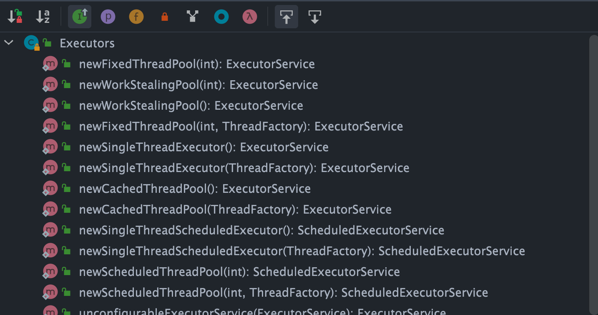

# 一、为什么要用线程池？

池化技术想必大家已经屡见不鲜了，线程池、数据库连接池、HTTP 连接池等等都是对这个思想的应用。池化技术的思想主要是为了减少每次获取资源的消耗，提高对资源的利用率。

**线程池**提供了一种限制和管理资源（包括执行一个任务）的方式。 每个**线程池**还维护一些基本统计信息，例如已完成任务的数量。

这里借用《Java 并发编程的艺术》提到的来说一下**使用线程池的好处**：

- **降低资源消耗**。通过重复利用已创建的线程降低线程创建和销毁造成的消耗。
- **提高响应速度**。当任务到达时，任务可以不需要等到线程创建就能立即执行。
- **提高线程的可管理性**。线程是稀缺资源，如果无限制的创建，不仅会消耗系统资源，还会降低系统的稳定性，使用线程池可以进行统一的分配，调优和监控。

# 二、如何创建线程池？

**方式一：通过`ThreadPoolExecutor`构造函数来创建（推荐）。**


**方式二：通过 `Executor` 框架的工具类 `Executors` 来创建。**

`Executors`工具类提供的创建线程池的方法如下图所示：



可以看出，通过`Executors`工具类可以创建多种类型的线程池，包括：

- `FixedThreadPool`：**固定线程数量**的线程池。该线程池中的线程数量始终不变。当有一个新的任务提交时，线程池中若有空闲线程，则立即执行。若没有，则**新的任务会被暂存在一个任务队列中**，待有线程空闲时，便处理在任务队列中的任务。
- `SingleThreadExecutor`： **只有一个线程的线程池**。若多余一个任务被提交到该线程池，任务会被保存在一个任务队列中，待线程空闲，按先入先出的顺序执行队列中的任务。
- `CachedThreadPool`： 可**根据实际情况调整线程数量**的线程池。线程池的线程数量不确定，但若有空闲线程可以复用，则会优先使用可复用的线程。若所有线程均在工作，又有新的任务提交，则会创建新的线程处理任务。所有线程在当前任务执行完毕后，将返回线程池进行复用。
- `ScheduledThreadPool`：**给定的延迟后运行任务**或者**定期执行任务**的线程池。

# 三、为什么不推荐使用内置线程池？

在《阿里巴巴 Java 开发手册》“并发处理”这一章节，明确指出**线程资源必须通过线程池提供**，**不允许在应用中自行显式创建线程**。

**为什么呢？**

> 使用线程池的好处是减少在创建和销毁线程上所消耗的时间以及系统资源开销，解决资源不足的问题。如果不使用线程池，有可能会造成**系统创建大量同类线程**而导致**消耗完内存**或者**“过度切换”**的问题。

另外，《阿里巴巴 Java 开发手册》中强制线程池**不允许使用 `Executors` 去创建**，而是**通过 `ThreadPoolExecutor` 构造函数的方式**，这样的处理方式让写的同学更加明确线程池的运行规则，规避资源耗尽的风险

`xecutors` 返回线程池对象的弊端如下：

- `FixedThreadPool` 和 `SingleThreadExecutor`:使用的是有界阻塞队列是 `LinkedBlockingQueue` ，其任务队列的最大长度为 `Integer.MAX_VALUE` ，可能堆积大量的请求，从而导致 OOM。
- `CachedThreadPool`:使用的是同步队列 `SynchronousQueue`, 允许创建的线程数量为 `Integer.MAX_VALUE` ，如果任务数量过多且执行速度较慢，可能会创建大量的线程，从而导致 OOM。
- `ScheduledThreadPool` 和 `SingleThreadScheduledExecutor` :使用的无界的延迟阻塞队列 `DelayedWorkQueue` ，任务队列最大长度为 `Integer.MAX_VALUE` ，可能堆积大量的请求，从而导致 OOM。

```java
// 有界队列 LinkedBlockingQueue
public static ExecutorService newFixedThreadPool(int nThreads) {

    return new ThreadPoolExecutor(nThreads, nThreads,0L, TimeUnit.MILLISECONDS,new LinkedBlockingQueue<Runnable>());

}

// 无界队列 LinkedBlockingQueue
public static ExecutorService newSingleThreadExecutor() {

    return new FinalizableDelegatedExecutorService (new ThreadPoolExecutor(1, 1,0L, TimeUnit.MILLISECONDS,new LinkedBlockingQueue<Runnable>()));

}

// 同步队列 SynchronousQueue，没有容量，最大线程数是 Integer.MAX_VALUE`
public static ExecutorService newCachedThreadPool() {

    return new ThreadPoolExecutor(0, Integer.MAX_VALUE,60L, TimeUnit.SECONDS,new SynchronousQueue<Runnable>());

}

// DelayedWorkQueue（延迟阻塞队列）
public static ScheduledExecutorService newScheduledThreadPool(int corePoolSize) {
    return new ScheduledThreadPoolExecutor(corePoolSize);
}
public ScheduledThreadPoolExecutor(int corePoolSize) {
    super(corePoolSize, Integer.MAX_VALUE, 0, NANOSECONDS,
          new DelayedWorkQueue());
}
```

# 四、线程池常见参数有哪些？如何解释？

```java
    /**
     * 用给定的初始参数创建一个新的ThreadPoolExecutor。
     */
    public ThreadPoolExecutor(int corePoolSize,//线程池的核心线程数量
                              int maximumPoolSize,//线程池的最大线程数
                              long keepAliveTime,//当线程数大于核心线程数时，多余的空闲线程存活的最长时间
                              TimeUnit unit,//时间单位
                              BlockingQueue<Runnable> workQueue,//任务队列，用来储存等待执行任务的队列
                              ThreadFactory threadFactory,//线程工厂，用来创建线程，一般默认即可
                              RejectedExecutionHandler handler//拒绝策略，当提交的任务过多而不能及时处理时，我们可以定制策略来处理任务
                               ) {
        if (corePoolSize < 0 ||
            maximumPoolSize <= 0 ||
            maximumPoolSize < corePoolSize ||
            keepAliveTime < 0)
            throw new IllegalArgumentException();
        if (workQueue == null || threadFactory == null || handler == null)
            throw new NullPointerException();
        this.corePoolSize = corePoolSize;
        this.maximumPoolSize = maximumPoolSize;
        this.workQueue = workQueue;
        this.keepAliveTime = unit.toNanos(keepAliveTime);
        this.threadFactory = threadFactory;
        this.handler = handler;
    }
```

`ThreadPoolExecutor` 3 个最重要的参数：

- `corePoolSize` : 任务队列未达到队列容量时，最大可以同时运行的线程数量。
- `maximumPoolSize` : 任务队列中存放的任务达到队列容量的时候，当前可以同时运行的线程数量变为最大线程数。
- `workQueue`: 新任务来的时候会先判断当前运行的线程数量是否达到核心线程数，如果达到的话，新任务就会被存放在队列中。

`ThreadPoolExecutor`其他常见参数 :

- `keepAliveTime`:当线程池中的线程数量大于 `corePoolSize` ，即有非核心线程（线程池中核心线程以外的线程）时，这些非核心线程空闲后不会立即销毁，而是会等待，直到等待的时间超过了 `keepAliveTime`才会被回收销毁。
- `unit` : `keepAliveTime` 参数的时间单位。
- `threadFactory` :executor 创建新线程的时候会用到。
- `handler` :拒绝策略（后面会单独详细介绍一下）。

下面这张图可以加深你对线程池中各个参数的相互关系的理解（图片来源：《Java 性能调优实战》）：


# 五、线程池的核心线程会被回收吗？

`ThreadPoolExecutor` **默认不会回收核心线程**，即使它们已经空闲了。这是为了减少创建线程的开销，因为核心线程通常是要长期保持活跃的。但是，如果线程池是被用于周期性使用的场景，且频率不高（周期之间有明显的空闲时间），可**以考虑将 `allowCoreThreadTimeOut(boolean value)` 方法的参数设置为 `true`，这样就会回收空闲**（时间间隔由 `keepAliveTime` 指定）的**核心线程**了。

```java
 ThreadPoolExecutor threadPoolExecutor = new ThreadPoolExecutor(4, 6, 6, TimeUnit.SECONDS, new SynchronousQueue<>());

threadPoolExecutor.allowCoreThreadTimeOut(true);
```

# 六、线程池的拒绝策略有哪些？

如果当前同时运行的线程数量达到最大线程数量并且队列也已经被放满了任务时，`ThreadPoolExecutor` 定义一些策略:

- `ThreadPoolExecutor.AbortPolicy`：抛出 `RejectedExecutionException`来拒绝新任务的处理。
- `ThreadPoolExecutor.CallerRunsPolicy`：调用执行自己的线程运行任务，也就是**直接在调用`execute`方法的线程中运行(`run`)被拒绝的任务**，如果执行程序已关闭，则会丢弃该任务。因此这种策略会降低对于新任务提交速度，影响程序的整体性能。如果你的应用程序可以承受此延迟并且你要求任何一个任务请求都要被执行的话，你可以选择这个策略。
- `ThreadPoolExecutor.DiscardPolicy`：不处理新任务，直接丢弃掉。
- `ThreadPoolExecutor.DiscardOldestPolicy`：此策略将丢弃最早的未处理的任务请求。

举个例子：Spring 通过 `ThreadPoolTaskExecutor` 或者我们直接通过 `ThreadPoolExecutor` 的构造函数创建线程池的时候，当我们不指定 `RejectedExecutionHandler` 拒绝策略来配置线程池的时候，**默认使用的是 `AbortPolicy`**。在这种拒绝策略下，如果队列满了，`ThreadPoolExecutor` 将抛出 `RejectedExecutionException` 异常来拒绝新来的任务 ，这代表你将丢失对这个任务的处理。如果不想丢弃任务的话，可以使用`CallerRunsPolicy`。**`CallerRunsPolicy`** 和其他的几个策略不同，它既不会抛弃任务，也不会抛出异常，而是**将任务回退给调用者，使用调用者的线程来执行任务。**

```java
public static class CallerRunsPolicy implements RejectedExecutionHandler {

        public CallerRunsPolicy() { }

        public void rejectedExecution(Runnable r, ThreadPoolExecutor e) {
            if (!e.isShutdown()) {
                // 直接主线程执行，而不是线程池中的线程执行
                r.run();
            }
        }
    }
```

## 6.1 如果不允许丢弃任务任务，应该选择哪个拒绝策略？

根据上面对线程池拒绝策略的介绍，相信大家很容易能够得出答案是：`CallerRunsPolicy` 。

这里我们再来结合`CallerRunsPolicy` 的源码来看看：

```java
public static class CallerRunsPolicy implements RejectedExecutionHandler {

        public CallerRunsPolicy() { }


        public void rejectedExecution(Runnable r, ThreadPoolExecutor e) {
            //只要当前程序没有关闭，就用执行execute方法的线程执行该任务
            if (!e.isShutdown()) {

                r.run();
            }
        }
    }
```

从源码可以看出，只要当前程序不关闭就会使用执行`execute`方法的线程执行该任务。

## 6.2 CallerRunsPolicy 拒绝策略有什么风险？如何解决？

我们上面也提到了：如果想要保证任何一个任务请求都要被执行的话，那选择 `CallerRunsPolicy` 拒绝策略更合适一些。

不过，如果走到`CallerRunsPolicy`的任务是个非常耗时的任务，且**处理提交任务的线程是主线程，可能会导致主线程阻塞**，影响程序的正常运行。

这里简单举一个例子，该线程池限定了**最大线程数为 2，阻塞队列大小为 1(这意味着第 4 个任务就会走到拒绝策略)**，`ThreadUtil`为 Hutool 提供的工具类：

```java
public class ThreadPoolTest {

    private static final Logger log = LoggerFactory.getLogger(ThreadPoolTest.class);

    public static void main(String[] args) {
        // 创建一个线程池，核心线程数为1，最大线程数为2
        // 当线程数大于核心线程数时，多余的空闲线程存活的最长时间为60秒，
        // 任务队列为容量为1的ArrayBlockingQueue，饱和策略为CallerRunsPolicy。
        ThreadPoolExecutor threadPoolExecutor = new ThreadPoolExecutor(1,
                2,
                60,
                TimeUnit.SECONDS,
                new ArrayBlockingQueue<>(1),
                new ThreadPoolExecutor.CallerRunsPolicy());

        // 提交第一个任务，由核心线程执行
        threadPoolExecutor.execute(() -> {
            log.info("核心线程执行第一个任务");
            ThreadUtil.sleep(1, TimeUnit.MINUTES);
        });

        // 提交第二个任务，由于核心线程被占用，任务将进入队列等待
        threadPoolExecutor.execute(() -> {
            log.info("非核心线程处理入队的第二个任务");
            ThreadUtil.sleep(1, TimeUnit.MINUTES);
        });

        // 提交第三个任务，由于核心线程被占用且队列已满，创建非核心线程处理
        threadPoolExecutor.execute(() -> {
            log.info("非核心线程处理第三个任务");
            ThreadUtil.sleep(1, TimeUnit.MINUTES);
        });

        // 提交第四个任务，由于核心线程和非核心线程都被占用，队列也满了，根据CallerRunsPolicy策略，任务将由提交任务的线程（即主线程）来执行
        threadPoolExecutor.execute(() -> {
            log.info("主线程处理第四个任务");
            ThreadUtil.sleep(2, TimeUnit.MINUTES);
        });

        // 提交第五个任务，主线程被第四个任务卡住，该任务必须等到主线程执行完才能提交
        threadPoolExecutor.execute(() -> {
            log.info("核心线程执行第五个任务");
        });

        // 关闭线程池
        threadPoolExecutor.shutdown();
    }
}
```

输出：

```
18:19:48.203 INFO  [pool-1-thread-1] c.j.concurrent.ThreadPoolTest - 核心线程执行第一个任务
18:19:48.203 INFO  [pool-1-thread-2] c.j.concurrent.ThreadPoolTest - 非核心线程处理第三个任务
18:19:48.203 INFO  [main] c.j.concurrent.ThreadPoolTest - 主线程处理第四个任务
18:20:48.212 INFO  [pool-1-thread-2] c.j.concurrent.ThreadPoolTest - 非核心线程处理入队的第二个任务
18:21:48.219 INFO  [pool-1-thread-2] c.j.concurrent.ThreadPoolTest - 核心线程执行第五个任务
```

从输出结果可以看出，因为`CallerRunsPolicy`这个拒绝策略，导致**耗时的任务用了主线程执行，导致线程池阻塞，进而导致后续任务无法及时执行**，严重的情况下很可能导致 OOM。

我们从问题的本质入手，调用者采用`CallerRunsPolicy`是希望所有的任务都能够被执行，暂时无法处理的任务又被保存在阻塞队列`BlockingQueue`中。这样的话，在内存允许的情况下，我们**可以增加阻塞队列`BlockingQueue`的大小并调整堆内存以容纳更多的任务**，确保任务能够被准确执行。

为了充分利用 CPU，我们**还可以调整线程池的`maximumPoolSize` （最大线程数）参数**，这样可以提高任务处理速度，避免累计在 `BlockingQueue`的任务过多导致内存用完。


如果服务器资源以达到可利用的极限，这就意味我们要在设计策略上改变线程池的调度了，我们都知道，导致主线程卡死的本质就是因为我们不希望任何一个任务被丢弃。换个思路，有没有办法既能保证任务不被丢弃且在服务器有余力时及时处理呢？

这里提供的一种**任务持久化**的思路，这里所谓的任务持久化，包括但不限于:

1. 设计一张任务表将任务存储到 MySQL 数据库中。
2. Redis 缓存任务。
3. 将任务提交到消息队列中。

这里以**方案一为例**，简单介绍一下实现逻辑：

1. 实现`RejectedExecutionHandler`接口**自定义拒绝策略**，自定义拒绝策略负责**将线程池暂时无法处理（此时阻塞队列已满）的任务入库（保存到 MySQL 中）**。注意：线程池暂时无法处理的任务会先被放在阻塞队列中，**阻塞队列满了才会触发拒绝策略**。
2. 继承`BlockingQueue`实现一个混合式阻塞队列，该队列包含 JDK 自带的`ArrayBlockingQueue`。另外，该混合式阻塞队列需要修改取任务处理的逻辑，也就是**重写`take()`方法，取任务时优先从数据库中读取最早的任务，数据库中无任务时再从 `ArrayBlockingQueue`中去取任务**。


整个实现逻辑还是比较简单的，核心在于自定义拒绝策略和阻塞队列。如此一来，一旦我们的线程池中线程以达到满载时，我们就可以通过拒绝策略将最新任务持久化到 MySQL 数据库中，等到线程池有了有余力处理所有任务时，让其**优先处理数据库中的任务以避免"饥饿"问题**。

# 七、线程池常用的阻塞队列有哪些？

新任务来的时候会先判断当前运行的线程数量是否达到核心线程数，如果达到的话，新任务就会被存放在队列中。

不同的线程池会选用不同的阻塞队列，我们可以结合内置线程池来分析。

- 容量为 `Integer.MAX_VALUE` 的 `LinkedBlockingQueue`（有界阻塞队列）：`FixedThreadPool` 和 `SingleThreadExecutor` 。`FixedThreadPool`最多只能创建核心线程数的线程（核心线程数和最大线程数相等），`SingleThreadExecutor`只能创建一个线程（核心线程数和最大线程数都是 1），**二者的任务队列永远不会被放满**。
- `SynchronousQueue`（同步队列）：`CachedThreadPool` 。`SynchronousQueue` 没有容量，不存储元素，目的是保证对于提交的任务，如果有空闲线程，则使用空闲线程来处理；否则新建一个线程来处理任务。也就是说，`CachedThreadPool` 的最大线程数是 `Integer.MAX_VALUE` ，可以理解为**线程数是可以无限扩展的，可能会创建大量线程**，从而导致 OOM。
- `DelayedWorkQueue`（延迟队列）：`ScheduledThreadPool` 和 `SingleThreadScheduledExecutor` 。`DelayedWorkQueue` 的内部元素并不是按照放入的时间排序，而是会**按照延迟的时间长短对任务进行排序**，内部采用的是“堆”的数据结构，可以保证**每次出队的任务都是当前队列中执行时间最靠前的**。`DelayedWorkQueue` 添加**元素满了之后会自动扩容，增加原来容量的 50%，即永远不会阻塞，最大扩容可达 `Integer.MAX_VALUE`**，所以最多只能创建核心线程数的线程。
- `ArrayBlockingQueue`（有界阻塞队列）：底层由**数组**实现，**容量一旦创建，就不能修改**。

# 八、线程池处理任务的流程了解吗？


1. 如果当前运行的线程数小于核心线程数，那么就会新建一个线程来执行任务。
2. 如果当前运行的线程数等于或大于核心线程数，但是小于最大线程数，那么就把该任务放入到任务队列里等待执行。
3. 如果向任务队列投放任务失败（任务队列已经满了），但是当前运行的线程数是小于最大线程数的，就新建一个线程来执行任务。
4. 如果当前运行的线程数已经等同于最大线程数了，新建线程将会使当前运行的线程超出最大线程数，那么当前任务会被拒绝，拒绝策略会调用`RejectedExecutionHandler.rejectedExecution()`方法。

再提一个有意思的小问题：**线程池在提交任务前，可以提前创建线程吗？**

答案是可以的！`ThreadPoolExecutor` 提供了两个方法帮助我们在提交任务之前，完成核心线程的创建，从而实现**线程池预热**的效果：

- `prestartCoreThread()`:启动一个线程，等待任务，如果已达到核心线程数，这个方法返回 false，否则返回 true；
- `prestartAllCoreThreads()`:启动所有的核心线程，并返回启动成功的核心线程数。

# 九、线程池中线程异常后，销毁还是复用？

直接说结论，需要分两种情况：

- **使用`execute()`提交任务**：当任务通过`execute()`提交到线程池并在执行过程中抛出异常时，如果这个**异常没有在任务内被捕获，那么该异常会导致当前线程终止**，并且异常会被打印到控制台或日志文件中。**线程池会检测到这种线程终止，并创建一个新线程来替换它**，从而保持配置的线程数不变。
- **使用`submit()`提交任务**：对于通过`submit()`提交的任务，如果在任务执行中发生异常，这个异常不会直接打印出来。相反，**异常会被封装在由`submit()`返回的`Future`对象中。当调用`Future.get()`方法时，可以捕获到一个`ExecutionException`**。在这种情况下，**线程不会因为异常而终止，它会继续存在于线程池中，准备执行后续的任务**。

简单来说：使用`execute()`时，未捕获异常导致线程终止，线程池创建新线程替代；使用`submit()`时，异常被封装在`Future`中，线程继续复用。

这种设计允许`submit()`提供更灵活的错误处理机制，因为它允许调用者决定如何处理异常，而`execute()`则适用于那些不需要关注执行结果的场景。

具体的源码分析可以参考这篇：[线程池中线程异常后：销毁还是复用？ - 京东技术](https://mp.weixin.qq.com/s/9ODjdUU-EwQFF5PrnzOGfw)。

# 十、如何给线程池命名？

初始化线程池的时候需要显示命名（设置**线程池名称前缀**），有**利于定位问题**。

**默认情况下创建的线程名字类似 `pool-1-thread-n` 这样**的，没有业务含义，不利于我们定位问题。

给线程池里的**线程命名**通常有下面两种方式：

**1、利用 guava 的 `ThreadFactoryBuilder`**

```
ThreadFactory threadFactory = new ThreadFactoryBuilder()
                        .setNameFormat(threadNamePrefix + "-%d")
                        .setDaemon(true).build();
ExecutorService threadPool = new ThreadPoolExecutor(corePoolSize, maximumPoolSize, keepAliveTime, TimeUnit.MINUTES, workQueue, threadFactory);
```

**2、自己实现 `ThreadFactory`**。

```java
import java.util.concurrent.ThreadFactory;
import java.util.concurrent.atomic.AtomicInteger;

/**
 * 线程工厂，它设置线程名称，有利于我们定位问题。
 */
public final class NamingThreadFactory implements ThreadFactory {

    private final AtomicInteger threadNum = new AtomicInteger();
    private final String name;

    /**
     * 创建一个带名字的线程池生产工厂
     */
    public NamingThreadFactory(String name) {
        this.name = name;
    }

    @Override
    public Thread newThread(Runnable r) {
        Thread t = new Thread(r);
        t.setName(name + " [#" + threadNum.incrementAndGet() + "]");
        return t;
    }
}
```

# 十一、如何设定线程池的大小？

很多人甚至可能都会觉得把线程池配置过大一点比较好！我觉得这明显是有问题的。就拿我们生活中非常常见的一例子来说：**并不是人多就能把事情做好，增加了沟通交流成本。你本来一件事情只需要 3 个人做，你硬是拉来了 6 个人，会提升做事效率嘛？我想并不会。** 线程数量过多的影响也是和我们分配多少人做事情一样，对于多线程这个场景来说主要是增加了**上下文切换**成本。

类比于实现世界中的人类通过合作做某件事情，我们可以肯定的一点是线程池大小设置过大或者过小都会有问题，合适的才是最好。

- 如果我们设置的线程池数量太小的话，如果同一时间有大量任务/请求需要处理，可能会导致大量的请求/任务在任务队列中排队等待执行，甚至会出现任务队列满了之后任务/请求无法处理的情况，或者大量任务堆积在任务队列导致 OOM。这样很明显是有问题的，CPU 根本没有得到充分利用。
- 如果我们设置线程数量太大，大量线程可能会同时在争取 CPU 资源，这样会导致大量的上下文切换，从而增加线程的执行时间，影响了整体执行效率。

有一个简单并且适用面比较广的公式：

- **CPU 密集型任务(N+1)：** 这种任务消耗的主要是 CPU 资源，可以**将线程数设置为 N（CPU 核心数）+1**。比 CPU 核心数**多出来的一个线程是为了防止线程偶发的缺页中断，或者其它原因导致的任务暂停而带来的影响**。一旦任务暂停，CPU 就会处于空闲状态，而在这种情况下**多出来的一个线程就可以充分利用 CPU 的空闲时间**。
- **I/O 密集型任务(2N)：** 这种任务应用起来，系统会用大部分的时间来处理 I/O 交互，而线程在处理 I/O 的时间段内不会占用 CPU 来处理，这时就可以将 CPU 交出给其它线程使用。因此在 I/O 密集型任务的应用中，我们可以多配置一些线程，**具体的计算方法是 2N**。

**如何判断是 CPU 密集任务还是 IO 密集任务？**

CPU 密集型简单理解就是利用 CPU 计算能力的任务比如你在内存中对大量数据进行排序。但凡涉及到网络读取，文件读取这类都是 IO 密集型，这类任务的特点是 CPU 计算耗费时间相比于等待 IO 操作完成的时间来说很少，大部分时间都花在了等待 IO 操作完成上。

> 线程数更严谨的计算的方法应该是：`最佳线程数 = N（CPU 核心数）∗（1+WT（线程等待时间）/ST（线程计算时间））`，其中 `WT（线程等待时间）=线程运行总时间 - ST（线程计算时间）`。
>
> 线程等待时间所占比例越高，需要越多线程。线程计算时间所占比例越高，需要越少线程。
>
> 我们可以通过 JDK 自带的工具 VisualVM 来查看 `WT/ST` 比例。
>
> CPU 密集型任务的 `WT/ST` 接近或者等于 0，因此， 线程数可以设置为 N（CPU 核心数）∗（1+0）= N，和我们上面说的 N（CPU 核心数）+1 差不多。
>
> IO 密集型任务下，几乎全是线程等待时间，从理论上来说，你就可以将线程数设置为 2N（按道理来说，WT/ST 的结果应该比较大，这里选择 2N 的原因应该是为了避免创建过多线程吧）。

# 十二、如何动态修改线程池的参数？

美团技术团队在[《Java 线程池实现原理及其在美团业务中的实践》](https://tech.meituan.com/2020/04/02/java-pooling-pratice-in-meituan.html)这篇文章中介绍到对线程池参数实现可自定义配置的思路和方法。

美团技术团队的思路是主要**对线程池的核心参数实现自定义可配置**。这**三个核心参数**是：

- **`corePoolSize` :** 核心线程数线程数定义了最小可以同时运行的线程数量。
- **`maximumPoolSize` :** 当队列中存放的任务达到队列容量的时候，当前可以同时运行的线程数量变为最大线程数。
- **`workQueue`:** 当新任务来的时候会先判断当前运行的线程数量是否达到核心线程数，如果达到的话，新任务就会被存放在队列中。

**如何支持参数动态配置？** 且看 `ThreadPoolExecutor` 提供的下面这些方法。


格外需要注意的是`corePoolSize`， **程序运行期间的时候，我们调用 `setCorePoolSize()`这个方法的话，线程池会首先判断当前工作线程数是否大于`corePoolSize`，如果大于的话就会回收工作线程。**

另外，你也看到了上面**并没有动态指定队列长度的方法**，美团的方式是**自定义**了一个叫做 `ResizableCapacityLinkedBlockIngQueue` 的队列（主要就是把`LinkedBlockingQueue`的 **capacity 字段的 final 关键字修饰给去掉**了，让它**变为可变的**）。

如果我们的项目也想要实现这种效果的话，可以借助现成的开源项目：

- **[Hippo4j](https://github.com/opengoofy/hippo4j)**：异步线程池框架，支持线程池动态变更&监控&报警，无需修改代码轻松引入。支持多种使用模式，轻松引入，致力于提高系统运行保障能力。
- **[Dynamic TP](https://github.com/dromara/dynamic-tp)**：轻量级动态线程池，内置监控告警功能，集成三方中间件线程池管理，基于主流配置中心（已支持 Nacos、Apollo，Zookeeper、Consul、Etcd，可通过 SPI 自定义实现）。

# 十三、如何设计一个能够根据任务的优先级来执行的线程池？

假如我们需要实现一个优先级任务线程池的话，那可以考虑使用 `PriorityBlockingQueue` （优先级阻塞队列）作为任务队列（`ThreadPoolExecutor` 的构造函数有一个 `workQueue` 参数可以传入任务队列）。


`PriorityBlockingQueue` 是一个支持优先级的**无界阻塞队列**，可以看作是**线程安全的 `PriorityQueue`**，两者底层都是使用小顶堆形式的二叉堆，即**值最小的元素优先出队**。不过，`PriorityQueue` 不支持阻塞操作。

要想让 `PriorityBlockingQueue` 实现对任务的排序，**传入其中的任务必须是具备排序能力的**，方式有两种：

1. 提交到线程池的任务实现 `Comparable` 接口，并重写 `compareTo` 方法来指定任务之间的优先级比较规则。
2. 创建 `PriorityBlockingQueue` 时传入一个 `Comparator` 对象来指定任务之间的排序规则(推荐)。

不过，这存在一些风险和问题，比如：

- `PriorityBlockingQueue` 是无界的，可能堆积大量的请求，从而导致 OOM。
- 可能会导致饥饿问题，即低优先级的任务长时间得不到执行。
- 由于需要对队列中的元素进行排序操作以及保证线程安全（并发控制采用的是可重入锁 `ReentrantLock`），因此会降低性能。

对于 **OOM 这个问题**的解决比较简单粗暴，就是**继承`PriorityBlockingQueue` 并重写一下 `offer` 方法**(入队)的逻辑，**当插入的元素数量超过指定值就返回 false** 。

**饥饿问题**这个可以通过优化设计来解决（比较麻烦），比如等**待时间过长的任务会被移除并重新添加到队列中，但是优先级会被提升**。

对于性能方面的影响，是没办法避免的，毕竟需要对任务进行排序操作。并且，对于大部分业务场景来说，这点性能影响是可以接受的。

# 十四、别忘记关闭线程池

当线程池不再需要使用时，应该显式地关闭线程池，释放线程资源。

线程池提供了两个关闭方法：

- **`shutdown（）`** :关闭线程池，线程池的状态变为 `SHUTDOWN`。线程池不再接受新任务了，但是队列里的任务得执行完毕。
- **`shutdownNow（）`** :关闭线程池，线程池的状态变为 `STOP`。线程池会**终止当前正在运行的任务**，停止处理排队的任务并返回正在等待执行的 List。

调用完 `shutdownNow` 和 `shuwdown` 方法后，并**不代表线程池已经完成关闭操作，它只是异步的通知线程池进行关闭处理**。如果**要同步等待线程池彻底关闭后才继续往下执行，需要调用`awaitTermination`方法进行同步等待**。

在**调用 `awaitTermination()` 方法时，应该设置合理的超时时间**，以避免程序长时间阻塞而导致性能问题。另外。由于**线程池中的任务可能会被取消或抛出异常，因此在使用 `awaitTermination()` 方法时还需要进行异常处理**。`awaitTermination()` 方法会抛出 `InterruptedException` 异常，需要捕获并处理该异常，以避免程序崩溃或者无法正常退出。

```java
// ...
// 关闭线程池
executor.shutdown();
try {
    // 等待线程池关闭，最多等待5分钟
    if (!executor.awaitTermination(5, TimeUnit.MINUTES)) {
        // 如果等待超时，则打印日志
        System.err.println("线程池未能在5分钟内完全关闭");
    }
} catch (InterruptedException e) {
    // 异常处理
}
```

# 十五、线程池使用的一些小坑

## 15.1 重复创建线程池的坑

线程池是可以复用的，一定**不要频繁创建线程池**比如一个用户请求到了就单独创建一个线程池。

```java
@GetMapping("wrong")
public String wrong() throws InterruptedException {
    // 自定义线程池
    ThreadPoolExecutor executor = new ThreadPoolExecutor(5,10,1L,TimeUnit.SECONDS,new ArrayBlockingQueue<>(100),new ThreadPoolExecutor.CallerRunsPolicy());

    //  处理任务
    executor.execute(() -> {
      // ......
    }
    return "OK";
}
```

## 15.2 Spring 内部线程池的坑

使用 **Spring 内部线程池**时，**一定要手动自定义线程池，配置合理的参数**，不然会出现生产问题（一个请求创建一个线程）。

```java
@Configuration
@EnableAsync
public class ThreadPoolExecutorConfig {

    @Bean(name="threadPoolExecutor")
    public Executor threadPoolExecutor(){
        ThreadPoolTaskExecutor threadPoolExecutor = new ThreadPoolTaskExecutor();
        int processNum = Runtime.getRuntime().availableProcessors(); // 返回可用处理器的Java虚拟机的数量
        int corePoolSize = (int) (processNum / (1 - 0.2));
        int maxPoolSize = (int) (processNum / (1 - 0.5));
        threadPoolExecutor.setCorePoolSize(corePoolSize); // 核心池大小
        threadPoolExecutor.setMaxPoolSize(maxPoolSize); // 最大线程数
        threadPoolExecutor.setQueueCapacity(maxPoolSize * 1000); // 队列程度
        threadPoolExecutor.setThreadPriority(Thread.MAX_PRIORITY);
        threadPoolExecutor.setDaemon(false);
        threadPoolExecutor.setKeepAliveSeconds(300);// 线程空闲时间
        threadPoolExecutor.setThreadNamePrefix("test-Executor-"); // 线程名字前缀
        return threadPoolExecutor;
    }
}
```

## 15.3 线程池和 ThreadLocal 共用的坑

线程池和 `ThreadLocal`共用，可能会导致**线程从`ThreadLocal`获取到的是旧值/脏数据**。这是因为**线程池会复用线程对象，与线程对象绑定的类的静态属性 `ThreadLocal` 变量也会被重用，这就导致一个线程可能获取到其他线程的`ThreadLocal` 值。**

不要以为代码中没有显示使用线程池就不存在线程池了，像**常用的 Web 服务器 Tomcat 处理任务为了提高并发量，就使用到了线程池**，并且使用的是基于原生 Java 线程池改进完善得到的自定义线程池。

当然了，你可以将 Tomcat 设置为单线程处理任务。不过，这并不合适，会严重影响其处理任务的速度。

```
server.tomcat.max-threads=1
```

解决上述问题比较建议的办法是使用阿里巴巴开源的 `TransmittableThreadLocal`(`TTL`)。`TransmittableThreadLocal`类继承并加强了 JDK 内置的`InheritableThreadLocal`类，在使用线程池等会池化复用线程的执行组件情况下，提供`ThreadLocal`值的传递功能，解决异步执行时上下文传递的问题。

`TransmittableThreadLocal` 项目地址：https://github.com/alibaba/transmittable-thread-local 。
