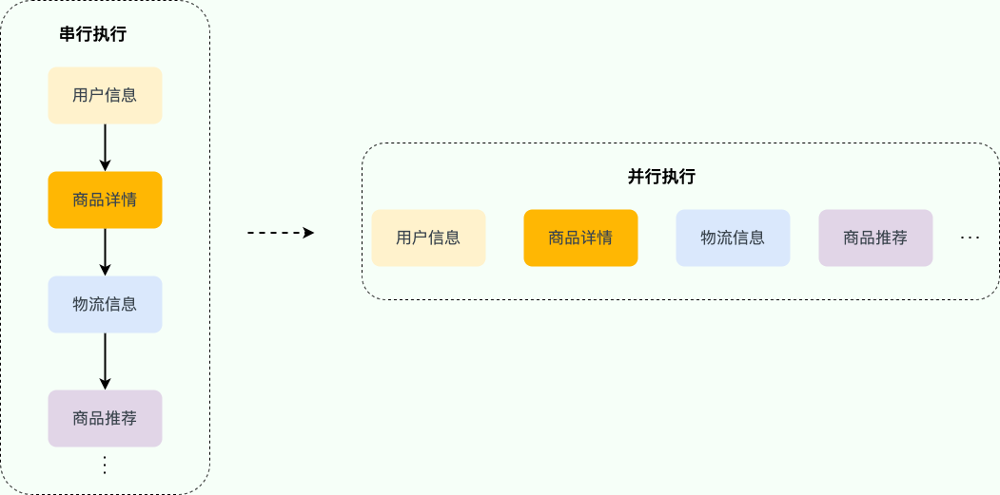
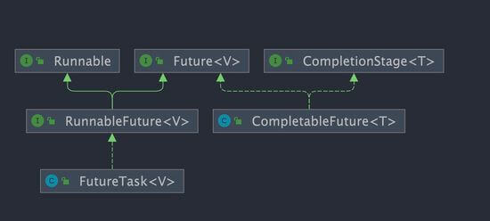
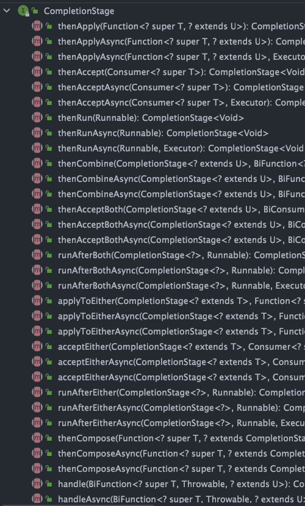

# 一、背景介绍

实际项目中，**一个接口可能需要同时获取多种不同的数据，然后再汇总返回**，这种场景还是挺常见的。举个例子：用户请求获取订单信息，可能需要同时获取用户信息、商品详情、物流信息、商品推荐等数据。

如果是串行（按顺序依次执行每个任务）执行的话，接口的响应速度会非常慢。考虑到这些任务之间有大部分都是 **无前后顺序关联** 的，可以 **并行执行** ，就比如说调用获取商品详情的时候，可以同时调用获取物流信息。**通过并行执行多个任务的方式，接口的响应速度会得到大幅优化。**



对于存在**前后调用顺序关系**的任务，可以进行**任务编排**。


1. 获取用户信息之后，才能调用商品详情和物流信息接口。
2. 成功获取商品详情和物流信息之后，才能调用商品推荐接口。

可能会用到**多线程异步任务编排**的场景（这里只是举例，数据不一定是一次返回，可能会对接口进行拆分）：

1. 首页：例如技术社区的首页可能需要同时获取文章推荐列表、广告栏、文章排行榜、热门话题等信息。
2. 详情页：例如技术社区的文章详情页可能需要同时获取作者信息、文章详情、文章评论等信息。
3. 统计模块：例如技术社区的后台统计模块可能需要同时获取粉丝数汇总、文章数据（阅读量、评论量、收藏量）汇总等信息。

对于 Java 程序来说，Java 8 才被引入的 `CompletableFuture` 可以帮助我们来做多个任务的编排，功能非常强大。

这篇文章是 `CompletableFuture` 的简单入门，带大家看看 `CompletableFuture` 常用的 API。


# 二、CompletableFuture 介绍

`Future` 在实际使用过程中存在一些局限性比如**不支持异步任务的编排组合**、**获取计算结果的 `get()` 方法为阻塞调用**。

Java 8 才被引入`CompletableFuture` 类可以解决`Future` 的这些缺陷。`CompletableFuture` 除了提供了更为好用和强大的 `Future` 特性之外，还提供了函数式编程、异步任务编排组合（可以将多个异步任务串联起来，组成一个完整的链式调用）等能力。

下面我们来简单看看 `CompletableFuture` 类的定义。

```
public class CompletableFuture<T> implements Future<T>, CompletionStage<T> {
}
```

可以看到，`CompletableFuture` 同时实现了 `Future` 和 `CompletionStage` 接口。



`CompletionStage` 接口描述了一个异步计算的阶段。很多计算可以分成多个阶段或步骤，此时可以通过它将所有步骤组合起来，形成异步计算的流水线。

`CompletionStage` 接口中的方法比较多，`CompletableFuture` 的函数式能力就是这个接口赋予的。从这个接口的方法参数你就可以发现其大量使用了 Java8 引入的函数式编程。



# 三、CompletableFuture 常见操作

## 3.1 创建 CompletableFuture

常见的创建 `CompletableFuture` 对象的方法如下：

1. 通过 new 关键字。
2. 基于 `CompletableFuture` 自带的静态工厂方法：`runAsync()`、`supplyAsync()` 。

### 3.1.1 new 关键字

通过 new 关键字创建 `CompletableFuture` 对象这种使用方式可以看作是**将 `CompletableFuture` 当做 `Future` 来使用。**

我在我的开源项目 [guide-rpc-framework](https://github.com/Snailclimb/guide-rpc-framework) 中就是这种方式创建的 `CompletableFuture` 对象。

下面咱们来看一个简单的案例。

我们通过创建了一个结果值类型为 `RpcResponse<Object>` 的 `CompletableFuture`，你可以**把 `resultFuture` 看作是异步运算结果的载体**。

```java
CompletableFuture<RpcResponse<Object>> resultFuture = new CompletableFuture<>();
```

**假设在未来的某个时刻，我们得到了最终的结果**。这时，我们可以**调用 `complete()` 方法为其传入结果**，这表示 `resultFuture` 已经被完成了。

```java
// complete() 方法只能调用一次，后续调用将被忽略。
resultFuture.complete(rpcResponse);
```

你可以通过 `isDone()` 方法来检查是否已经完成。

```java
public boolean isDone() {
    return result != null;
}
```

获取异步计算的结果也非常简单，直接调用 `get()` 方法即可。调用 `get()` 方法的线程会阻塞直到 `CompletableFuture` 完成运算。

```
rpcResponse = resultFuture.get();
```

### 3.1.2 直接完成的 CompletableFuture

如果你已经知道计算的结果的话，可以使用静态方法 `completedFuture()` 来创建 `CompletableFuture` 。

```java
CompletableFuture<String> future = CompletableFuture.completedFuture("hello!");
assertEquals("hello!", future.get());
```

`completedFuture()` 方法底层调用的是**带参数的 new 方法**，只不过，这个方法不对外暴露。

```java
public static <U> CompletableFuture<U> completedFuture(U value) {
    return new CompletableFuture<U>((value == null) ? NIL : value);
}
```

### 3.1.3 静态工厂方法

这两个方法可以帮助我们封装计算逻辑。

```java
static <U> CompletableFuture<U> supplyAsync(Supplier<U> supplier);
// 使用自定义线程池(推荐)
static <U> CompletableFuture<U> supplyAsync(Supplier<U> supplier, Executor executor);
static CompletableFuture<Void> runAsync(Runnable runnable);
// 使用自定义线程池(推荐)
static CompletableFuture<Void> runAsync(Runnable runnable, Executor executor);
```

`runAsync()` 方法接受的参数是 `Runnable` ，这是一个函数式接口，**不允许返回值**。当你**需要异步操作且不关心返回结果**的时候可以使用 `runAsync()` 方法。

```java
CompletableFuture<Void> future = CompletableFuture.runAsync(() -> {
    // 执行某些操作
    System.out.println("Running async task");
});
```

`supplyAsync()` 方法接受的参数是 `Supplier<U>` ，这也是一个函数式接口，`U` 是返回结果值的类型。当你**需要异步操作且关心返回结果**的时候,可以使用 `supplyAsync()` 方法。

```java
CompletableFuture<String> future = CompletableFuture.supplyAsync(() -> {
    // 模拟耗时操作
    try { Thread.sleep(1000); } catch (InterruptedException e) { e.printStackTrace(); }
    return "Result of async computation";
});
```

## 3.2 获取结果

### 3.2.1 使用 get() 方法

这是最直接的方式，但也是阻塞的。调用 get() 会一直等待直到 CompletableFuture 完成，并返回其结果或抛出异常（如果执行过程中有异常）。

```java
CompletableFuture<String> future = CompletableFuture.supplyAsync(() -> "Hello, World!");
try {
    String result = future.get();  // 阻塞等待结果
    System.out.println(result);
} catch (InterruptedException | ExecutionException e) {
    e.printStackTrace();
}
```

### 3.2.2 使用 get(long timeout, TimeUnit unit) 方法

如果你不想无限期地等待，可以指定一个超时时间。如果在给定时间内未完成，则抛出 TimeoutException。

```java
CompletableFuture<String> future = CompletableFuture.supplyAsync(() -> "Hello, World!");
try {
    String result = future.get(1, TimeUnit.SECONDS);  // 最多等待1秒
    System.out.println(result);
} catch (InterruptedException | ExecutionException | TimeoutException e) {
    e.printStackTrace();
}
```

### 3.2.3 使用 join() 方法

类似于 get()，但是 **join() 不会抛出受检异常**，而是**直接抛出执行期间发生的异常**。这使得代码更简洁，尤其是在已经处理了异常的情况下。

```java
CompletableFuture<String> future = CompletableFuture.supplyAsync(() -> "Hello, World!");
try {
    String result = future.join();  // 等待结果
    System.out.println(result);
} catch (CompletionException e) {  // 包装了原始异常
    e.getCause().printStackTrace();
}
```

## 3.3 链式调用

通过 thenApply, thenAccept, 或 thenRun 方法链式调用

这些方法允许你非阻塞地处理结果。它们各自有不同的用途：

1. thenApply：用于对结果进行转换，产生新的返回值。
2. thenAccept：用于消费结果而不返回任何值。
3. thenRun：当 CompletableFuture 完成后运行一个动作，不关心前一个阶段的结果。

> CompletableFuture 是一个**不可变对象**，这意味着：
>
> - 调用 thenApply、thenAccept 等方法不会修改原始的 CompletableFuture 对象。
> - 每次调用这些方法时，都会返回一个新的 CompletableFuture 对象，表示对该操作的结果进行封装。

`thenApply()` 方法接受一个 `Function` 实例，用它来处理结果。

```java
// 沿用上一个任务的线程池
public <U> CompletableFuture<U> thenApply(
    Function<? super T,? extends U> fn) {
    return uniApplyStage(null, fn);
}

//使用默认的 ForkJoinPool 线程池（不推荐）
public <U> CompletableFuture<U> thenApplyAsync(
    Function<? super T,? extends U> fn) {
    return uniApplyStage(defaultExecutor(), fn);
}
// 使用自定义线程池(推荐)
public <U> CompletableFuture<U> thenApplyAsync(
    Function<? super T,? extends U> fn, Executor executor) {
    return uniApplyStage(screenExecutor(executor), fn);
}
```

`thenApply()` 方法使用示例如下：

```java
CompletableFuture<String> future = CompletableFuture.completedFuture("hello!")
        .thenApply(s -> s + "world!");
assertEquals("hello!world!", future.get());
// 这次调用将被忽略, 因为返回值没有用 future 承接
future.thenApply(s -> s + "nice!");
assertEquals("hello!world!", future.get());
```

你还可以进行 **流式调用**：

```java
CompletableFuture<String> future = CompletableFuture.completedFuture("hello!")
        .thenApply(s -> s + "world!").thenApply(s -> s + "nice!");
assertEquals("hello!world!nice!", future.get());
```

**如果你不需要从回调函数中获取返回结果，可以使用 `thenAccept()` 或者 `thenRun()`。这两个方法的区别在于 `thenRun()` 不能访问异步计算的结果。**

`thenAccept()` 方法的参数是 `Consumer<? super T>` 。

```java
public CompletableFuture<Void> thenAccept(Consumer<? super T> action) {
    return uniAcceptStage(null, action);
}

public CompletableFuture<Void> thenAcceptAsync(Consumer<? super T> action) {
    return uniAcceptStage(defaultExecutor(), action);
}

public CompletableFuture<Void> thenAcceptAsync(Consumer<? super T> action,
                                               Executor executor) {
    return uniAcceptStage(screenExecutor(executor), action);
}
```

顾名思义，`Consumer` 属于**消费型接口**，它可以**接收 1 个输入对象然后进行“消费”**。

```java
@FunctionalInterface
public interface Consumer<T> {

    void accept(T t);

    default Consumer<T> andThen(Consumer<? super T> after) {
        Objects.requireNonNull(after);
        return (T t) -> { accept(t); after.accept(t); };
    }
}
```

`thenRun()` 的方法的参数是 `Runnable` 。

```java
public CompletableFuture<Void> thenRun(Runnable action) {
    return uniRunStage(null, action);
}

public CompletableFuture<Void> thenRunAsync(Runnable action) {
    return uniRunStage(defaultExecutor(), action);
}

public CompletableFuture<Void> thenRunAsync(Runnable action,
                                            Executor executor) {
    return uniRunStage(screenExecutor(executor), action);
}
```

`thenAccept()` 和 `thenRun()` 使用示例如下：

```java
CompletableFuture.completedFuture("hello!")
        .thenApply(s -> s + "world!").thenApply(s -> s + "nice!").thenAccept(System.out::println);//hello!world!nice!

CompletableFuture.completedFuture("hello!")
        .thenApply(s -> s + "world!").thenApply(s -> s + "nice!").thenRun(() -> System.out.println("hello!"));//hello!
```

## 3.4 异常处理

使用 whenComplete 或 handle 方法。这两个方法允许你在计算完成后执行一些额外的操作，同时**能够访问到结果或者发生的异常**。

1. whenComplete 只是简单地接受一个BiConsumer，而不会改变结果。
2. handle 接收一个函数，该函数可以根据结果或异常返回一个新的值。

`whenComplete()` 的方法的参数是 `BiConsumer<? super T, ? super Throwable>` 。

```java
public CompletableFuture<T> whenComplete(
    BiConsumer<? super T, ? super Throwable> action) {
    return uniWhenCompleteStage(null, action);
}


public CompletableFuture<T> whenCompleteAsync(
    BiConsumer<? super T, ? super Throwable> action) {
    return uniWhenCompleteStage(defaultExecutor(), action);
}
// 使用自定义线程池(推荐)
public CompletableFuture<T> whenCompleteAsync(
    BiConsumer<? super T, ? super Throwable> action, Executor executor) {
    return uniWhenCompleteStage(screenExecutor(executor), action);
}
```

相对于 `Consumer` ， `BiConsumer` 可以接收 2 个输入对象然后进行“消费”。

```java
@FunctionalInterface
public interface BiConsumer<T, U> {
    void accept(T t, U u);

    default BiConsumer<T, U> andThen(BiConsumer<? super T, ? super U> after) {
        Objects.requireNonNull(after);

        return (l, r) -> {
            accept(l, r);
            after.accept(l, r);
        };
    }
}
```

`whenComplete()` 使用示例如下：

```java
CompletableFuture<String> future = CompletableFuture.supplyAsync(() -> "hello!")
        .whenComplete((res, ex) -> {
            // res 代表返回的结果
            // ex 的类型为 Throwable ，代表抛出的异常
            System.out.println(res);
            // 这里没有抛出异常所有为 null
            assertNull(ex);
        });
assertEquals("hello!", future.get());
```

你可以通过 `handle()` 方法来处理任务执行过程中可能出现的抛出异常的情况。

```java
public <U> CompletableFuture<U> handle(
    BiFunction<? super T, Throwable, ? extends U> fn) {
    return uniHandleStage(null, fn);
}

public <U> CompletableFuture<U> handleAsync(
    BiFunction<? super T, Throwable, ? extends U> fn) {
    return uniHandleStage(defaultExecutor(), fn);
}

public <U> CompletableFuture<U> handleAsync(
    BiFunction<? super T, Throwable, ? extends U> fn, Executor executor) {
    return uniHandleStage(screenExecutor(executor), fn);
}
```

示例代码如下：

```java
CompletableFuture<String> future
        = CompletableFuture.supplyAsync(() -> {
    if (true) {
        throw new RuntimeException("Computation error!");
    }
    return "hello!";
}).handle((res, ex) -> {
    // res 代表返回的结果
    // ex 的类型为 Throwable ，代表抛出的异常
    return res != null ? res : "world!";
});
assertEquals("world!", future.get());
```

你还可以通过 `exceptionally()` 方法来处理异常情况。

```java
CompletableFuture<String> future
        = CompletableFuture.supplyAsync(() -> {
    if (true) {
        throw new RuntimeException("Computation error!");
    }
    return "hello!";
}).exceptionally(ex -> {
    System.out.println(ex.toString());// CompletionException
    return "world!";
});
assertEquals("world!", future.get()
```

如果你想让 `CompletableFuture` 的结果就是异常的话，可以使用 `completeExceptionally()` 方法为其赋值。

```java
CompletableFuture<String> completableFuture = new CompletableFuture<>();
// ...
completableFuture.completeExceptionally(
  new RuntimeException("Calculation failed!"));
// ...
completableFuture.get(); // ExecutionException
```

## 3.5 组合 CompletableFuture

你可以使用 `thenCompose()` 按**顺序链接两个 `CompletableFuture` 对象**，实现异步的任务链。它的作用是将**前一个任务的返回结果作为下一个任务的输入参数**，从而形成一个依赖关系。

`thenCompose()` 方法会使用示例如下：

```java
CompletableFuture<String> future
        = CompletableFuture.supplyAsync(() -> "hello!")
        .thenCompose(s -> CompletableFuture.supplyAsync(() -> s + "world!"));
assertEquals("hello!world!", future.get());
```

在实际开发中，这个方法还是非常有用的。比如说，**task1 和 task2 都是异步执行的，但 task1 必须执行完成后才能开始执行 task2**（task2 依赖 task1 的执行结果）。

和 `thenCompose()` 方法类似的还有 `thenCombine()` 方法， 它同样可以组合两个 `CompletableFuture` 对象。

```java
CompletableFuture<String> completableFuture
        = CompletableFuture.supplyAsync(() -> "hello!")
        .thenCombine(CompletableFuture.supplyAsync(
                () -> "world!"), (s1, s2) -> s1 + s2)
        .thenCompose(s -> CompletableFuture.supplyAsync(() -> s + "nice!"));
assertEquals("hello!world!nice!", completableFuture.get());
```

**那 `thenCompose()` 和 `thenCombine()` 有什么区别呢？**

- `thenCompose()` 可以链接两个 `CompletableFuture` 对象，并将**前一个任务的返回结果作为下一个任务的参数**，它们之间**存在着先后顺序**。
- `thenCombine()` 会在**两个任务都执行完成后，把两个任务的结果合并**。两个任务是并行执行的，它们之间并**没有先后依赖顺序**。

除了 `thenCompose()` 和 `thenCombine()` 之外， 还有一些其他的组合 `CompletableFuture` 的方法用于实现不同的效果，满足不同的业务需求。

例如，如果我们**想要实现 task1 和 task2 中的任意一个任务执行完后就执行 task3** 的话，**可以使用 `acceptEither()`**。

简单举一个例子：

```java
CompletableFuture<String> task = CompletableFuture.supplyAsync(() -> {
    System.out.println("任务1开始执行，当前时间：" + System.currentTimeMillis());
    try {
        Thread.sleep(500);
    } catch (InterruptedException e) {
        e.printStackTrace();
    }
    System.out.println("任务1执行完毕，当前时间：" + System.currentTimeMillis());
    return "task1";
});

CompletableFuture<String> task2 = CompletableFuture.supplyAsync(() -> {
    System.out.println("任务2开始执行，当前时间：" + System.currentTimeMillis());
    try {
        Thread.sleep(1000);
    } catch (InterruptedException e) {
        e.printStackTrace();
    }
    System.out.println("任务2执行完毕，当前时间：" + System.currentTimeMillis());
    return "task2";
});

task.acceptEitherAsync(task2, (res) -> {
    System.out.println("任务3开始执行，当前时间：" + System.currentTimeMillis());
    System.out.println("上一个任务的结果为：" + res);
});

// 增加一些延迟时间，确保异步任务有足够的时间完成
try {
    Thread.sleep(2000);
} catch (InterruptedException e) {
    e.printStackTrace();
}
```

输出：

```
任务1开始执行，当前时间：1695088058520
任务2开始执行，当前时间：1695088058521
任务1执行完毕，当前时间：1695088059023
任务3开始执行，当前时间：1695088059023
上一个任务的结果为：task1
任务2执行完毕，当前时间：1695088059523
```

任务组合操作`acceptEitherAsync()`会在**异步任务 1 和异步任务 2 中的任意一个完成时触发执行任务 3**，但是需要注意，这个触发时机是不确定的。如果任务 1 和任务 2 都还未完成，那么任务 3 就不能被执行。

## 3.6 并行运行多个 CompletableFuture

你可以通过 `CompletableFuture` 的 `allOf()`这个静态方法来**并行运行多个 `CompletableFuture` 。**

实际项目中，我们经常需要并行运行多个互不相关的任务，这些**任务之间没有依赖关系，可以互相独立地运行。**

比说我们要读取处理 6 个文件，这 6 个任务都是没有执行顺序依赖的任务，但是我们需要返回给用户的时候将这几个文件的处理的结果进行统计整理。像这种情况我们就可以使用并行运行多个 `CompletableFuture` 来处理.

```java
CompletableFuture<Void> task1 =
  CompletableFuture.supplyAsync(()->{
    //自定义业务操作
  });
......
CompletableFuture<Void> task6 =
  CompletableFuture.supplyAsync(()->{
    //自定义业务操作
  });
......
 CompletableFuture<Void> headerFuture=CompletableFuture.allOf(task1,.....,task6);

  try {
    headerFuture.join();
  } catch (Exception ex) {
    ......
  }
System.out.println("all done. ");
```

经常和 `allOf()` 方法拿来对比的是 `anyOf()` 方法。

**`allOf()` 方法会等到所有的 `CompletableFuture` 都运行完成之后再返回**。调用 `join()` 可以让程序等所有`future`都运行完了之后再继续执行。

**`anyOf()` 方法不会等待所有的 `CompletableFuture` 都运行完成之后再返回，只要有一个执行完成即可！**

```java
CompletableFuture<Object> f = CompletableFuture.anyOf(future1, future2);
System.out.println(f.get());
```

输出结果可能是：

```
future2 done...
```

也可能是：

```
future1 done...
```

# 四、CompletableFuture 使用建议

## 4.1 使用自定义线程池

我们上面的代码示例中，为了方便，都没有选择自定义线程池。实际项目中，这是不可取的。

`CompletableFuture` **默认使用全局共享的 `ForkJoinPool.commonPool()` 作为执行器**，**所有未指定执行器的异步任务都会使用该线程池**。这意味着应用程序、多个库或框架（如 Spring、第三方库）若都依赖 `CompletableFuture`，默认情况下它们都会共享同一个线程池。

虽然 `ForkJoinPool` 效率很高，但当同时提交大量任务时，可能会导致资源竞争和线程饥饿，进而影响系统性能。

为避免这些问题，建议为 `CompletableFuture` 提供自定义线程池，带来以下优势：

```java
private ThreadPoolExecutor executor = new ThreadPoolExecutor(10, 10,
        0L, TimeUnit.MILLISECONDS,
        new LinkedBlockingQueue<Runnable>());

CompletableFuture.runAsync(() -> {
     //...
}, executor);
```

## 4.2 尽量避免使用 get()

`CompletableFuture`的`get()`方法是阻塞的，尽量避免使用。如果必须要使用的话，需要添加超时时间，否则可能会导致主线程一直等待，无法执行其他任务。

```java
    CompletableFuture<String> future = CompletableFuture.supplyAsync(() -> {
        try {
            Thread.sleep(10_000);
        } catch (InterruptedException e) {
            e.printStackTrace();
        }
        return "Hello, world!";
    });

    // 获取异步任务的返回值，设置超时时间为 5 秒
    try {
        String result = future.get(5, TimeUnit.SECONDS);
        System.out.println(result);
    } catch (InterruptedException | ExecutionException | TimeoutException e) {
        // 处理异常
        e.printStackTrace();
    }
}
```

上面这段代码在调用 `get()` 时抛出了 `TimeoutException` 异常。这样我们就可以在异常处理中进行相应的操作，比如取消任务、重试任务、记录日志等。

## 4.3 正确进行异常处理

使用 `CompletableFuture`的时候一定要以正确的方式进行异常处理，避免异常丢失或者出现不可控问题。

下面是一些建议：

- 使用 `whenComplete` 方法可以在任务完成时触发回调函数，并正确地处理异常，而不是让异常被吞噬或丢失。
- 使用 `exceptionally` 方法可以处理异常并重新抛出，以便异常能够传播到后续阶段，而不是让异常被忽略或终止。
- 使用 `handle` 方法可以处理正常的返回结果和异常，并返回一个新的结果，而不是让异常影响正常的业务逻辑。
- 使用 `CompletableFuture.allOf` 方法可以组合多个 `CompletableFuture`，并统一处理所有任务的异常，而不是让异常处理过于冗长或重复。

## 4.4 合理组合多个异步任务

正确使用 `thenCompose()` 、 `thenCombine()` 、`acceptEither()`、`allOf()`、`anyOf()`等方法来组合多个异步任务，以满足实际业务的需求，提高程序执行效率。

实际使用中，我们还可以利用或者参考现成的异步任务编排框架，比如京东的 [asyncTool](https://gitee.com/jd-platform-opensource/asyncTool) 。

