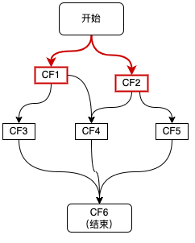

# 一、CompletableFuture的背景和定义

## 1.1 CompletableFuture解决的问题

CompletableFuture是由Java 8引入的，在**Java8之前我们一般通过Future实现异步**。

- **Future**用于表示异步计算的结果，**只能通过阻塞或者轮询的方式获取结果**，而且**不支持设置回调方法**，Java 8之前若要**设置回调一般会使用java的ListenableFuture**，回调的引入又会导致臭名昭著的**回调地狱**（下面的例子会通过ListenableFuture的使用来具体进行展示）。
- **CompletableFuture对Future进行了扩展**，**可以通过设置回调的方式处理计算结果**，同时也支持组合操作，支持进一步的编排，同时一定程度解决了回调地狱的问题。

下面将举例来说明，我们通过ListenableFuture、CompletableFuture来实现异步的差异。假设有三个操作step1、step2、step3存在依赖关系，其中**step3的执行依赖step1和step2的结果**。

Future(ListenableFuture)的实现（回调地狱）如下：

```java
ExecutorService executor = Executors.newFixedThreadPool(5);
ListeningExecutorService guavaExecutor = MoreExecutors.listeningDecorator(executor);
ListenableFuture<String> future1 = guavaExecutor.submit(() -> {
    //step 1
    System.out.println("执行step 1");
    return "step1 result";
});
ListenableFuture<String> future2 = guavaExecutor.submit(() -> {
    //step 2
    System.out.println("执行step 2");
    return "step2 result";
});
ListenableFuture<List<String>> future1And2 = Futures.allAsList(future1, future2);
Futures.addCallback(future1And2, new FutureCallback<List<String>>() {
    @Override
    public void onSuccess(List<String> result) {
        System.out.println(result);
        ListenableFuture<String> future3 = guavaExecutor.submit(() -> {
            System.out.println("执行step 3");
            return "step3 result";
        });
        Futures.addCallback(future3, new FutureCallback<String>() {
            @Override
            public void onSuccess(String result) {
                System.out.println(result);
            }        
            @Override
            public void onFailure(Throwable t) {
            }
        }, guavaExecutor);
    }

    @Override
    public void onFailure(Throwable t) {
    }}, guavaExecutor);
```

CompletableFuture的实现如下：

```java
ExecutorService executor = Executors.newFixedThreadPool(5);
CompletableFuture<String> cf1 = CompletableFuture.supplyAsync(() -> {
    System.out.println("执行step 1");
    return "step1 result";
}, executor);
CompletableFuture<String> cf2 = CompletableFuture.supplyAsync(() -> {
    System.out.println("执行step 2");
    return "step2 result";
});
cf1.thenCombine(cf2, (result1, result2) -> {
    System.out.println(result1 + " , " + result2);
    System.out.println("执行step 3");
    return "step3 result";
}).thenAccept(result3 -> System.out.println(result3));
```

## 1.2 CompletableFuture的定义


CompletableFuture实现了两个接口（如上图所示）：Future、CompletionStage。Future表示异步计算的结果，CompletionStage用于表示异步执行过程中的一个步骤（Stage），这个步骤可能是由另外一个CompletionStage触发的，随着当前步骤的完成，也可能会触发其他一系列CompletionStage的执行。从而我们可以根据实际业务对这些步骤进行多样化的编排组合，CompletionStage接口正是定义了这样的能力，我们可以通过其提供的thenAppy、thenCompose等函数式编程方法来组合编排这些步骤。

# 二、CompletableFuture的使用

下面我们通过一个例子来讲解CompletableFuture如何使用，使用CompletableFuture也是**构建依赖树**的过程。一个CompletableFuture的完成会触发另外一系列依赖它的CompletableFuture的执行：


如上图所示，这里描绘的是一个业务接口的流程，其中包括CF1\CF2\CF3\CF4\CF5共5个步骤，并描绘了这些步骤之间的依赖关系，每个步骤可以是一次RPC调用、一次数据库操作或者是一次本地方法调用等，在**使用CompletableFuture进行异步化编程时，图中的每个步骤都会产生一个CompletableFuture对象，最终结果也会用一个CompletableFuture来进行表示**。

根据CompletableFuture依赖数量，可以分为以下几类：**零依赖、一元依赖、二元依赖和多元依赖**。

## 2.1 零依赖：CompletableFuture的创建

我们先看下如何不依赖其他CompletableFuture来创建新的CompletableFuture：



如上图红色链路所示，接口接收到请求后，首先发起两个异步调用CF1、CF2，主要有三种方式：

```java
ExecutorService executor = Executors.newFixedThreadPool(5);
//1、使用runAsync或supplyAsync发起异步调用
CompletableFuture<String> cf1 = CompletableFuture.supplyAsync(() -> {
  return "result1";
}, executor);
//2、CompletableFuture.completedFuture()直接创建一个已完成状态的CompletableFuture
CompletableFuture<String> cf2 = CompletableFuture.completedFuture("result2");
//3、先初始化一个未完成的CompletableFuture，然后通过complete()、completeExceptionally()，完成该CompletableFuture
CompletableFuture<String> cf = new CompletableFuture<>();
cf.complete("success");
```

**第三种方式**的一个典型使用场景，就是**将回调方法转为CompletableFuture**，然后**再依赖CompletableFure的能力进行调用编排**，示例如下：

```java
@FunctionalInterface
public interface ThriftAsyncCall {
    void invoke() throws TException;
}
 /**
  * 该方法为美团内部rpc注册监听的封装，可以作为其他实现的参照
  * OctoThriftCallback 为thrift回调方法
  * ThriftAsyncCall 为自定义函数，用来表示一次thrift调用（定义如上）
  */
  public static <T> CompletableFuture<T> toCompletableFuture(final OctoThriftCallback<?,T> callback , ThriftAsyncCall thriftCall) {
   //新建一个未完成的CompletableFuture
   CompletableFuture<T> resultFuture = new CompletableFuture<>();
   //监听回调的完成，并且与CompletableFuture同步状态
   callback.addObserver(new OctoObserver<T>() {
       @Override
       public void onSuccess(T t) {
           resultFuture.complete(t);
       }
       @Override
       public void onFailure(Throwable throwable) {
           resultFuture.completeExceptionally(throwable);
       }
   });
   if (thriftCall != null) {
       try {
           thriftCall.invoke();
       } catch (TException e) {
           resultFuture.completeExceptionally(e);
       }
   }
   return resultFuture;
  }
```

## 2.2 一元依赖：依赖一个CF


如上图红色链路所示，CF3，CF5分别依赖于CF1和CF2，这种对于单个CompletableFuture的依赖可以通过thenApply、thenAccept、thenCompose等方法来实现，代码如下所示：

```java
CompletableFuture<String> cf3 = cf1.thenApply(result1 -> {
  //result1为CF1的结果
  //......
  return "result3";
});
CompletableFuture<String> cf5 = cf2.thenApply(result2 -> {
  //result2为CF2的结果
  //......
  return "result5";
});
```

## 2.3 二元依赖：依赖两个CF


如上图红色链路所示，CF4同时依赖于两个CF1和CF2，这种二元依赖可以通过thenCombine等回调来实现，如下代码所示：

```java
CompletableFuture<String> cf4 = cf1.thenCombine(cf2, (result1, result2) -> {
  //result1和result2分别为cf1和cf2的结果
  return "result4";
});
```

## 2.4 多元依赖：依赖多个CF


如上图红色链路所示，整个流程的结束依赖于三个步骤CF3、CF4、CF5，这种多元依赖可以通过`allOf`或`anyOf`方法来实现，区别是当需要多个依赖全部完成时使用`allOf`，当多个依赖中的任意一个完成即可时使用`anyOf`，如下代码所示：

```java
CompletableFuture<Void> cf6 = CompletableFuture.allOf(cf3, cf4, cf5);
CompletableFuture<String> result = cf6.thenApply(v -> {
  //这里的join并不会阻塞，因为传给thenApply的CompletableFuture是在CF3、CF4、CF5全部完成时，才会执行 
  result3 = cf3.join();
  result4 = cf4.join();
  result5 = cf5.join();
  //根据result3、result4、result5组装最终result;
  return "result";
});
```

# 三、CompletableFuture原理

CompletableFuture中包含两个字段：**result**和**stack**。**result用于存储当前CF的结果**，**stack（Completion）表示当前CF完成后需要触发的依赖动作（Dependency Actions）**，去触发依赖它的CF的计算，**依赖动作可以有多个（表示有多个依赖它的CF）**，以栈（[Treiber stack](https://en.wikipedia.org/wiki/Treiber_stack)）的形式存储，stack表示栈顶元素。


这种方式类似“观察者模式”，依赖动作（Dependency Action）都封装在一个单独Completion子类中。下面是Completion类关系结构图。CompletableFuture中的每个方法都对应了图中的一个Completion的子类，Completion本身是**观察者**的基类。

- UniCompletion继承了Completion，是**一元依赖的基类**，例如thenApply的实现类UniApply就继承自UniCompletion。
- BiCompletion继承了UniCompletion，是**二元依赖的基类**，同时也是**多元依赖的基类**。例如thenCombine的实现类BiRelay就继承自BiCompletion。


## 3.1 CompletableFuture的设计思想

按照类似“观察者模式”的设计思想，原理分析可以从“**观察者**”和“**被观察者**”两个方面着手。由于回调种类多，但结构差异不大，所以这里单以一元依赖中的thenApply为例，不再枚举全部回调类型。如下图所示：


### 3.1.1 **被观察者**

1. **每个CompletableFuture**都可以被看作一个**被观察者**，其内部有一个Completion类型的**链表成员变量stack**，用来**存储注册到其中的所有观察者**。当**被观察者执行完成**后会弹栈stack属性，**依次通知注册到其中的观察者**。上面例子中步骤fn2就是作为观察者被封装在UniApply中。
2. **被观察者CF中的result属性**，用来**存储返回结果数据**。这里可能是一次RPC调用的返回值，也可能是任意对象，在上面的例子中对应**步骤fn1的执行结果**。

### 3.1.2 观察者

CompletableFuture支持很多回调方法，例如thenAccept、thenApply、exceptionally等，这些方法**接收一个函数类型的参数f，生成一个Completion类型的对象（即观察者）**，并将**入参函数f赋值给Completion的成员变量fn**，然后**检查当前被观察者CF是否已处于完成状态（即result != null）**，如果**已完成直接触发fn，否则将观察者Completion加入到CF的观察者链stack中**，再次尝试触发，如果被观察者未执行完则其执行完毕之后通知触发。

1. 观察者中的dep属性：指向其对应的CompletableFuture，在上面的例子中dep指向CF2。
2. 观察者中的src属性：指向其依赖的CompletableFuture，在上面的例子中src指向CF1。
3. 观察者Completion中的fn属性：用来存储具体的等待被回调的函数。这里需要注意的是不同的回调方法（thenAccept、thenApply、exceptionally等）接收的函数类型也不同，即fn的类型有很多种，在上面的例子中fn指向fn2。

## 3.2 整体流程

### 3.2.1 一元依赖

这里仍然以thenApply为例来说明一元依赖的流程：

1. 将**观察者**Completion注册到CF1，此时CF1**将Completion压栈**。
2. 当CF1的**操作运行完成**时，会将结果赋值给CF1中的result属性。
3. **依次弹栈**，通知**观察者**尝试运行。


初步流程设计如上图所示，这里有几个关于注册与通知的并发问题，大家可以思考下：

**Q1**：在**观察者注册之前，如果CF已经执行完成**，并且已经发出通知，那么这时观察者由于**错过了通知**是不是将**永远不会被触发**呢 ？ 

**A1**：不会。在**注册时检查依赖的CF是否已经完成**。如果未完成（即result == null）则将观察者入栈，如果**已完成（result != null）则直接触发观察者操作**。

**Q2**：在”**入栈**“前会有**”result == null“的判断**，这两个操作为**非原子操作**，CompletableFufure的实现也没有对两个操作进行加锁，**完成时间在这两个操作之间**，观察者仍然得不到通知，是不是仍然无法触发？


**A2**：不会。**入栈之后再次检查CF是否完成**，如果完成则触发。

**Q3**：当**依赖多个CF**时，观察者会**被压入所有依赖的CF的栈中**，每个CF完成的时候都会进行，那么会不会导致**一个操作被多次执行**呢 ？如下图所示，即当CF1、CF2同时完成时，**如何避免CF3被多次触发**。


**A3**：CompletableFuture的实现是这样解决该问题的：**观察者**在**执行之前**会先通过**CAS操作设置一个状态位**，将status由0改为1。如果观察者**已经执行过了，那么CAS操作将会失败，取消执行**。

通过对以上3个问题的分析可以看出，CompletableFuture在处理并行问题时，**全程无加锁操作**，极大地提高了程序的执行效率。我们将并行问题考虑纳入之后，可以得到完善的整体流程图如下所示：


CompletableFuture支持的回调方法十分丰富，但是正如上一章节的整体流程图所述，他们的整体流程是一致的。所有回调复用同一套流程架构，不同的回调监听通过**策略模式**实现差异化。

### 3.2.2 **二元依赖**

我们以thenCombine为例来说明二元依赖：


thenCombine操作表示依赖两个CompletableFuture。其观察者实现类为BiApply，如上图所示，BiApply通过src和snd两个属性关联被依赖的两个CF，fn属性的类型为BiFunction。与单个依赖不同的是，在依赖的CF未完成的情况下，thenCombine会**尝试将BiApply压入这两个被依赖的CF的栈中**，**每个被依赖的CF完成时都会尝试触发观察者BiApply，BiApply会检查两个依赖是否都完成，如果完成则开始执行**。这里为了**解决重复触发**的问题，同样用的是上一章节提到的**CAS操作**，执行时会先通过CAS设置状态位，避免重复触发。

### 3.2.3 多元依赖

依赖多个CompletableFuture的回调方法包括`allOf`、`anyOf`，区别在于`allOf`观察者实现类为BiRelay，需要所有被依赖的CF完成后才会执行回调；而`anyOf`观察者实现类为OrRelay，任意一个被依赖的CF完成后就会触发。二者的实现方式都是**将多个被依赖的CF构建成一棵平衡二叉树**，执行结果**层层通知**，**直到根节点**，触发回调监听。


# 四、实践总结

## 4.1 线程阻塞问题

**代码执行在哪个线程上？**

要合理治理线程资源，最基本的前提条件就是要在写代码时，清楚地知道每一行代码都将执行在哪个线程上。下面我们看一下CompletableFuture的执行线程情况。

CompletableFuture实现了CompletionStage接口，通过丰富的回调方法，支持各种组合操作，每种组合场景都有同步和异步两种方法。

**同步方法**（即不带Async后缀的方法）有两种情况。

- 如果注册时被依赖的操作**已经执行完成**，则直接由**当前线程**执行。
- 如果注册时被依赖的操作还**未执行完**，则由**回调线程**执行。

**异步方法**（即带Async后缀的方法）：可以选择是否**传递线程池参数**Executor**运行在指定线程池**中；当**不传递**Executor时，会**使用ForkJoinPool中的共用线程池CommonPool**（CommonPool的大小是CPU核数-1，如果是IO密集的应用，线程数可能成为瓶颈）。

```java
ExecutorService threadPool1 = new ThreadPoolExecutor(10, 10, 0L, TimeUnit.MILLISECONDS, new ArrayBlockingQueue<>(100));
CompletableFuture<String> future1 = CompletableFuture.supplyAsync(() -> {
    System.out.println("supplyAsync 执行线程：" + Thread.currentThread().getName());
    //业务操作
    return "";
}, threadPool1);
//此时，如果future1中的业务操作已经执行完毕并返回，则该thenApply直接由当前main线程执行；否则，将会由执行以上业务操作的threadPool1中的线程执行。
future1.thenApply(value -> {
    System.out.println("thenApply 执行线程：" + Thread.currentThread().getName());
    return value + "1";
});
//使用ForkJoinPool中的共用线程池CommonPool
future1.thenApplyAsync(value -> {
//do something
  return value + "1";
});
//使用指定线程池
future1.thenApplyAsync(value -> {
//do something
  return value + "1";
}, threadPool1);
```

## 4.2 线程池须知

### 4.2.1 异步回调要传线程池

前面提到，异步回调方法可以选择是否传递线程池参数Executor，这里我们建议**强制传线程池，且根据实际情况做线程池隔离**。

当不传递线程池时，会使用ForkJoinPool中的公共线程池CommonPool，这里所有调用将共用该线程池，核心线程数=处理器数量-1（单核核心线程数为1），所有异步回调都会共用该CommonPool，核心与非核心业务都竞争同一个池中的线程，很容易成为系统瓶颈。手动传递线程池参数可以更方便的调节参数，并且可以给不同的业务分配不同的线程池，以求资源隔离，减少不同业务之间的相互干扰。

### 4.2.2 线程池循环引用会导致死锁

```java
public Object doGet() {
  ExecutorService threadPool1 = new ThreadPoolExecutor(10, 10, 0L, TimeUnit.MILLISECONDS, new ArrayBlockingQueue<>(100));
  CompletableFuture cf1 = CompletableFuture.supplyAsync(() -> {
  //do sth
    return CompletableFuture.supplyAsync(() -> {
        System.out.println("child");
        return "child";
      }, threadPool1).join();//子任务
    }, threadPool1);
  return cf1.join();
}
```

如上代码块所示，doGet方法第三行**通过supplyAsync向threadPool1请求线程**，并且**内部子任务又向threadPool1请求线程**。threadPool1大小为10，当同一时刻有10个请求到达，则threadPool1被打满，**子任务请求线程时进入阻塞队列排队，但是父任务的完成又依赖于子任务，这时由于子任务得不到线程，父任务无法完成**。主线程执行cf1.join()进入阻塞状态，并且永远无法恢复。

为了修复该问题，**需要将父任务与子任务做线程池隔离，两个任务请求不同的线程池**，避免循环依赖导致的阻塞。

### 4.2.3 异步RPC调用注意不要阻塞IO线程池

服务异步化后很多步骤都会依赖于异步RPC调用的结果，这时需要特别注意一点，如果是**使用基于NIO（比如Netty）的异步RPC**，则**返回结果是由IO线程负责设置**的，即**回调方法由IO线程触发**，**CompletableFuture同步回调（如thenApply、thenAccept等无Async后缀的方法）如果依赖的异步RPC调用的返回结果，那么这些同步回调将运行在IO线程上**，而**整个服务只有一个IO线程池**，这时需要保证**同步回调中不能有阻塞等耗时过长的逻辑**，否则在这些逻辑执行完成前，IO线程将一直被占用，影响整个服务的响应。

## 4.3 其他

### 4.3.1 异常处理

由于**异步执行的任务在其他线程上**执行，而**异常信息存储在线程栈中**，因此**当前线程除非阻塞等待返回结果，否则无法通过try\catch捕获异常**。CompletableFuture提供了**异常捕获回调exceptionally**，**相当于同步调用中的try\catch**。使用方法如下所示：

```java
@Autowired
private WmOrderAdditionInfoThriftService wmOrderAdditionInfoThriftService;//内部接口
public CompletableFuture<Integer> getCancelTypeAsync(long orderId) {
    CompletableFuture<WmOrderOpRemarkResult> remarkResultFuture = wmOrderAdditionInfoThriftService.findOrderCancelledRemarkByOrderIdAsync(orderId);//业务方法，内部会发起异步rpc调用
    return remarkResultFuture
      .exceptionally(err -> {//通过exceptionally 捕获异常，打印日志并返回默认值
         log.error("WmOrderRemarkService.getCancelTypeAsync Exception orderId={}", orderId, err);
         return 0;
      });
}
```

有一点需要注意，**CompletableFuture在回调方法中对异常进行了包装**。大部分异常会**封装成CompletionException后抛出**，**真正的异常存储在cause属性**中，因此如果调用链中经过了回调方法处理那么就需要**用Throwable.getCause()方法提取真正的异常**。但是，有些情况下会直接返回真正的异常（[Stack Overflow的讨论](https://stackoverflow.com/questions/49230980/does-completionstage-always-wrap-exceptions-in-completionexception)），**最好使用工具类提取异常**，如下代码所示：

```java
@Autowired
private WmOrderAdditionInfoThriftService wmOrderAdditionInfoThriftService;//内部接口
public CompletableFuture<Integer> getCancelTypeAsync(long orderId) {
    CompletableFuture<WmOrderOpRemarkResult> remarkResultFuture = wmOrderAdditionInfoThriftService.findOrderCancelledRemarkByOrderIdAsync(orderId);//业务方法，内部会发起异步rpc调用
    return remarkResultFuture
          .thenApply(result -> {//这里增加了一个回调方法thenApply，如果发生异常thenApply内部会通过new CompletionException(throwable) 对异常进行包装
      //这里是一些业务操作
        })
      .exceptionally(err -> {//通过exceptionally 捕获异常，这里的err已经被thenApply包装过，因此需要通过Throwable.getCause()提取异常
         log.error("WmOrderRemarkService.getCancelTypeAsync Exception orderId={}", orderId, ExceptionUtils.extractRealException(err));
         return 0;
      });
}
```

上面代码中用到了一个**自定义的工具类ExceptionUtils**，**用于CompletableFuture的异常提取**，在使用CompletableFuture做异步编程时，可以直接使用该工具类处理异常。实现代码如下：

```java
public class ExceptionUtils {
    public static Throwable extractRealException(Throwable throwable) {
          //这里判断异常类型是否为CompletionException、ExecutionException，如果是则进行提取，否则直接返回。
        if (throwable instanceof CompletionException || throwable instanceof ExecutionException) {
            if (throwable.getCause() != null) {
                return throwable.getCause();
            }
        }
        return throwable;
    }
}
```