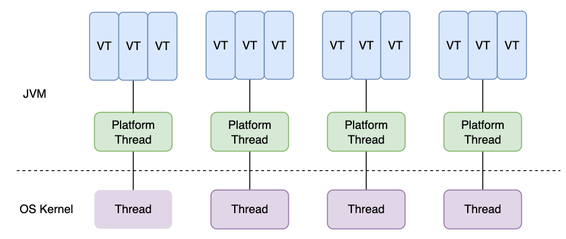

# 一、什么是虚拟线程？

虚拟线程（Virtual Thread）**是 JDK 而不是 OS 实现的轻量级线程**(Lightweight Process，LWP），**由 JVM 调度**。**许多虚拟线程共享同一个操作系统线程**，虚拟线程的数量可以远大于操作系统线程的数量。

# 二、虚拟线程和平台线程有什么关系？

在引入虚拟线程之前，`java.lang.Thread` 包已经支持所谓的平台线程（Platform Thread），也就是没有虚拟线程之前，我们一直使用的线程。JVM 调度程序通过平台线程（载体线程）来管理虚拟线程，**一个平台线程可以在不同的时间执行不同的虚拟线程**（多个虚拟线程挂载在一个平台线程上），当**虚拟线程被阻塞或等待时，平台线程可以切换到执行另一个虚拟线程**。

虚拟线程、平台线程和系统内核线程的关系图如下所示



关于平台线程和系统内核线程的对应关系多提一点：在 Windows 和 Linux 等主流操作系统中，Java 线程采用的是一对一的线程模型，也就是一个平台线程对应一个系统内核线程。Solaris 系统是一个特例，HotSpot VM 在 Solaris 上支持多对多和一对一。

# 三、虚拟线程有什么优点和缺点？

## 3.1 优点

- **非常轻量级**：可以在单个线程中创建成百上千个虚拟线程而不会导致过多的线程创建和上下文切换。
- **简化异步编程**： 虚拟线程可以简化异步编程，使代码更易于理解和维护。它可以将异步代码编写得更像同步代码，避免了回调地狱（Callback Hell）。
- **减少资源开销**： 由于虚拟线程是由 JVM 实现的，它能够更高效地利用底层资源，例如 CPU 和内存。虚拟线程的上下文切换比平台线程更轻量，因此能够更好地支持高并发场景。

## 3.2 缺点

- **不适用于计算密集型任务**： 虚拟线程适用于 I/O 密集型任务，但不适用于计算密集型任务，因为密集型计算始终需要 CPU 资源作为支持。
- **与某些第三方库不兼容**： 虽然虚拟线程设计时考虑了与现有代码的兼容性，但某些依赖平台线程特性的第三方库可能不完全兼容虚拟线程。

# 四、如何创建虚拟线程？

官方提供了以下四种方式创建虚拟线程：

1. 使用 `Thread.startVirtualThread()` 创建
2. 使用 `Thread.ofVirtual()` 创建
3. 使用 `ThreadFactory` 创建
4. 使用 `Executors.newVirtualThreadPerTaskExecutor()`创建

**1、使用 `Thread.startVirtualThread()` 创建**

```java
public class VirtualThreadTest {
  public static void main(String[] args) {
    CustomThread customThread = new CustomThread();
    Thread.startVirtualThread(customThread);
  }
}

static class CustomThread implements Runnable {
  @Override
  public void run() {
    System.out.println("CustomThread run");
  }
}
```

**2、使用 `Thread.ofVirtual()` 创建**

```java
public class VirtualThreadTest {
  public static void main(String[] args) {
    CustomThread customThread = new CustomThread();
    // 创建不启动
    Thread unStarted = Thread.ofVirtual().unstarted(customThread);
    unStarted.start();
    // 创建直接启动
    Thread.ofVirtual().start(customThread);
  }
}
static class CustomThread implements Runnable {
  @Override
  public void run() {
    System.out.println("CustomThread run");
  }
}
```

**3、使用 `ThreadFactory` 创建**

```java
public class VirtualThreadTest {
  public static void main(String[] args) {
    CustomThread customThread = new CustomThread();
    ThreadFactory factory = Thread.ofVirtual().factory();
    Thread thread = factory.newThread(customThread);
    thread.start();
  }
}

static class CustomThread implements Runnable {
  @Override
  public void run() {
    System.out.println("CustomThread run");
  }
}
```

**4、使用`Executors.newVirtualThreadPerTaskExecutor()`创建**

```java
public class VirtualThreadTest {
  public static void main(String[] args) {
    CustomThread customThread = new CustomThread();
    ExecutorService executor = Executors.newVirtualThreadPerTaskExecutor();
    executor.submit(customThread);
  }
}
static class CustomThread implements Runnable {
  @Override
  public void run() {
    System.out.println("CustomThread run");
  }
}
```

