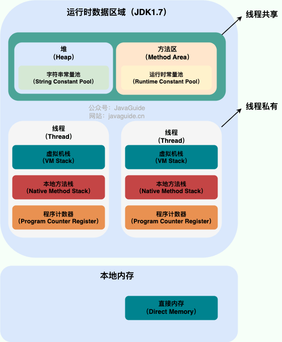

# 一、JVM 内存区域


在 Java 虚拟机（JVM）中，内存被划分为 **运行时数据区** 和 **本地内存** 两部分。这两部分的划分是为了满足不同的功能需求，并优化 JVM 的性能和资源管理。以下是对它们的区别以及为什么要单独分成这两部分的详细解释：

---

## 1. **JVM 运行时数据区**
   JVM 运行时数据区是 **JVM 自己管理**的内存区域，主要用于存储**与 Java 程序执行相关的数据**。根据《Java 虚拟机规范》，运行时数据区包括以下几个部分：

   - **方法区（Method Area）**：
     存储类信息、常量、静态变量、即时编译器编译后的代码等。
   - **堆（Heap）**：
     存储对象实例和数组，是垃圾回收的主要区域。
   - **虚拟机栈（VM Stack）**：
     每个线程都有一个私有的虚拟机栈，用于存储局部变量表、操作数栈、动态链接、方法出口等信息。
   - **程序计数器（Program Counter Register）**：
     记录当前线程正在执行的字节码指令地址。
   - **本地方法栈（Native Method Stack）**：
     为 JVM 执行 native 方法提供服务，类似于虚拟机栈。

   这些区域是由 JVM 直接管理的，专门用于支持 Java 程序的运行。

---

## 2. **本地内存（Native Memory）**
   本地内存是指 JVM 之外的操作系统分配给 JVM 使用的内存区域，也称为 **堆外内存（Off-Heap Memory）**。它不直接由 JVM 管理，而是通过本地方法接口（JNI，Java Native Interface）调用底层操作系统或本地库来分配和使用。

   - **用途**：
     - 存储 JVM 自身运行所需的元数据（如类加载器的元数据、GC 数据结构等）。
     - 支持 Java 应用程序中的某些特殊功能（如 NIO 的直接缓冲区、JNI 调用等）。
   - **特点**：
     - 不受 JVM 堆大小限制。
     - 需要手动管理或依赖底层实现进行释放（容易引发内存泄漏）。
     - 性能更高，因为避免了 JVM 垃圾回收的开销。

---

## 3. **为什么要单独分成这两部分？**

### （1）**职责分离**
   - JVM 运行时数据区专注于 Java 程序的执行，所有与 Java 字节码和对象相关的数据都存储在这里。
   - 本地内存则用于支持 JVM 自身运行所需的额外资源，或者为 Java 程序提供更高效的内存访问方式。

### （2）**性能优化**
   - JVM 堆内存需要经过垃圾回收（GC）机制管理，这会带来一定的性能开销。
   - 本地内存不受 GC 影响，因此可以提供更快的内存分配和释放速度，适合处理高性能场景（如大文件读写、网络通信等）。

### （3）**扩展性和灵活性**
   - JVM 运行时数据区的大小通常受到 `-Xms` 和 `-Xmx` 参数的限制，而本地内存的大小理论上只受限于操作系统的可用内存。
   - 通过将部分数据存储在本地内存中，可以突破 JVM 堆内存的限制，从而支持更大的数据处理需求。

### （4）**支持底层功能**
   - JVM 需要与底层操作系统交互（如文件 I/O、网络通信等），这些功能通常需要通过本地方法（native methods）实现。
   - 本地内存为这些底层功能提供了必要的资源支持。

---

## 4. **典型应用场景**
   - **NIO（非阻塞 I/O）**：
     Java 的 `ByteBuffer.allocateDirect()` 方法会在本地内存中分配缓冲区，避免了 JVM 堆内存和本地内存之间的频繁数据拷贝，提高了 I/O 性能。
   - **JNI 调用**：
     当 Java 程序通过 JNI 调用本地方法时，可能会使用本地内存来存储参数和返回值。
   - **大对象存储**：
     在某些场景下（如缓存系统），为了减少 GC 的压力，开发者会选择将大对象存储在本地内存中。

---

## 5. **总结**
   - **JVM 运行时数据区** 是 JVM 管理的核心内存区域，专为支持 Java 程序的执行而设计。
   - **本地内存** 是 JVM 外部的内存区域，主要用于支持 JVM 自身运行或提供高性能的内存访问能力。
   - 将这两部分分开，既能保证 JVM 的稳定性和可管理性，又能满足高性能和扩展性的需求。

# 二、数据区域

JDK 1.8 和之前的版本略有不同，我们这里以 JDK 1.7 和 JDK 1.8 这两个版本为例介绍。

**JDK 1.7**



**JDK 1.8**


**线程私有的：**

- 程序计数器
- 虚拟机栈
- 本地方法栈

**线程共享的：**

- 堆
- 方法区(元空间)
- 直接内存 (非运行时数据区的一部分)

Java 虚拟机规范**对于运行时数据区域的规定是相当宽松的**。以堆为例：堆可以是连续空间，也可以不连续。堆的大小可以固定，也可以在运行时按需扩展 。虚拟机实现者可以使用任何垃圾回收算法管理堆，甚至完全不进行垃圾收集也是可以的。


## 1. 程序计数器

程序计数器是一块较小的内存空间，可以看作是**当前线程所执行的字节码的行号指示器**。字节码解释器工作时**通过改变这个计数器的值来选取下一条需要执行的字节码指令**，分支、循环、跳转、异常处理、线程恢复等功能都需要依赖这个计数器来完成。

另外，为了**线程切换后能恢复到正确的执行位置**，**每条线程都需要有一个独立的程序计数器**，各线程之间计数器互不影响，独立存储，我们称这类内存区域为“线程私有”的内存。

从上面的介绍中我们知道了**程序计数器主要有两个作用**：

- 字节码解释器通过改变程序计数器来依次读取指令，从而实现代码的流程控制，如：顺序执行、选择、循环、异常处理。
- 在多线程的情况下，程序计数器用于记录当前线程执行的位置，从而当线程被切换回来的时候能够知道该线程上次运行到哪儿了。

⚠️ 注意：程序计数器是**唯一一个不会出现 `OutOfMemoryError` 的内存区域**，它的生命周期随着线程的创建而创建，随着线程的结束而死亡。

## 2 Java 虚拟机栈

与程序计数器一样，Java 虚拟机栈（后文简称栈）也是线程私有的，它的生命周期和线程相同，随着线程的创建而创建，随着线程的死亡而死亡。

栈绝对算的上是 JVM 运行时数据区域的一个核心，**除了一些 Native 方法调用是通过本地方法栈实现的(后面会提到)，其他所有的 Java 方法调用都是通过栈来实现的**（也需要和其他运行时数据区域比如程序计数器配合）。

方法调用的数据需要通过栈进行传递，**每一次方法调用都会有一个对应的栈帧被压入栈中**，**每一个方法调用结束后，都会有一个栈帧被弹出**。

栈由一个个栈帧组成，而**每个栈帧中都拥有：局部变量表、操作数栈、动态链接、方法返回地址**。和数据结构上的栈类似，两者都是先进后出的数据结构，只支持出栈和入栈两种操作。


**局部变量表** 主要存放了编译期可知的各种数据类型（boolean、byte、char、short、int、float、long、double）、对象引用（reference 类型，它不同于对象本身，可能是一个指向对象起始地址的引用指针，也可能是指向一个代表对象的句柄或其他与此对象相关的位置）。


**操作数栈** 主要作为方法调用的中转站使用，用于存放方法执行过程中产生的中间计算结果。另外，计算过程中产生的临时变量也会放在操作数栈中。

**动态链接** 主要服务一个方法需要调用其他方法的场景。Class 文件的常量池里保存有大量的符号引用比如方法引用的符号引用。当一个方法要调用其他方法，需要将常量池中指向方法的符号引用转化为其在内存地址中的直接引用。动态链接的作用就是为了将符号引用转换为调用方法的直接引用，这个过程也被称为 **动态连接** 。

> 1. 何为符号引用？
>
> 当一个类的方法需要调用另一个类的方法时，它并不直接持有该方法的内存地址，而是持有该方法的一个符号引用。这个符号引用类似于一种间接引用，它描述了要调用的方法的特征（如类名、方法名、参数类型等），但不是具体的内存位置。
>
> 每个.class文件中都有一个常量池，它是.class文件的一部分，其中包含了多种类型的常量信息，包括但不限于字符串字面量、类和接口的名字、字段和方法的描述符等。对于方法调用而言，常量池中保存的是方法的符号引用。
>
> 2. 何为直接引用？
>
> 当你创建了一个对象或者调用了某个方法，JVM需要知道这些对象或方法的确切内存地址。然而，在类加载阶段，JVM只知道它们的符号引用。因此，在首次调用这些方法或访问这些字段时，JVM会查找并解析这些符号引用，找到相应的直接引用（即实际的内存地址）。一旦解析完成，通常这些直接引用会被缓存起来以供后续使用，从而避免重复的查找过程。
>
> 3. 动态链接到底是什么？
>
> 在程序执行期间，而不是编译时，将代码中的符号引用转换为可以直接调用的方法或访问的字段的具体内存地址（直接引用）的过程。每当一个新的类被加载进JVM，它的方法和字段的符号引用就会在这个过程中被解析为实际的内存地址，以便于之后能够高效地调用这些方法或访问这些字段。

栈空间虽然不是无限的，但一般正常调用的情况下是不会出现问题的。不过，如果函数调用陷入无限循环的话，就会导致栈中被压入太多栈帧而占用太多空间，导致栈空间过深。那么当线程请求栈的深度超过当前 Java 虚拟机栈的最大深度的时候，就抛出 `StackOverFlowError` 错误。

Java 方法有两种返回方式，一种是 return 语句正常返回，一种是抛出异常。不管哪种返回方式，都会导致栈帧被弹出。也就是说， **栈帧随着方法调用而创建，随着方法结束而销毁。无论方法正常完成还是异常完成都算作方法结束。**

除了 `StackOverFlowError` 错误之外，栈还可能会出现`OutOfMemoryError`错误，这是因为如果栈的内存大小可以动态扩展， 如果虚拟机在动态扩展栈时无法申请到足够的内存空间，则抛出`OutOfMemoryError`异常。

简单总结一下程序运行中栈可能会出现两种错误：

- **`StackOverFlowError`：** 若栈的内存大小不允许动态扩展，那么当线程请求栈的深度超过当前 Java 虚拟机栈的最大深度的时候，就抛出 `StackOverFlowError` 错误。
- **`OutOfMemoryError`：** 如果栈的内存大小可以动态扩展， 如果虚拟机在动态扩展栈时无法申请到足够的内存空间，则抛出`OutOfMemoryError`异常。

## 3 本地方法栈

和虚拟机栈所发挥的作用非常相似，区别是：**虚拟机栈为虚拟机执行 Java 方法 （也就是字节码）服务，而本地方法栈则为虚拟机使用到的 Native 方法服务。** 在 HotSpot 虚拟机中和 Java 虚拟机栈合二为一。

本地方法被执行的时候，在本地方法栈也会创建一个栈帧，用于存放该本地方法的局部变量表、操作数栈、动态链接、出口信息。

方法执行完毕后相应的栈帧也会出栈并释放内存空间，也会出现 `StackOverFlowError` 和 `OutOfMemoryError` 两种错误。

## 4 堆

Java 虚拟机所管理的内存中最大的一块，Java 堆是所有线程共享的一块内存区域，在虚拟机启动时创建。**此内存区域的唯一目的就是存放对象实例，几乎所有的对象实例以及数组都在这里分配内存。**

Java 世界中“几乎”所有的对象都在堆中分配，但是，随着 JIT 编译器的发展与逃逸分析技术逐渐成熟，栈上分配、标量替换优化技术将会导致一些微妙的变化，所有的对象都分配到堆上也渐渐变得不那么“绝对”了。**从 JDK 1.7 开始已经默认开启逃逸分析**，如果某些方法中的**对象引用没有被返回或者未被外面使用（也就是未逃逸出去），那么对象可以直接在栈上分配内存**。

Java 堆是垃圾收集器管理的主要区域，因此也被称作 **GC 堆（Garbage Collected Heap）**。从垃圾回收的角度，由于现在收集器基本都采用**分代垃圾收集算法**，所以 **Java 堆还可以细分**为：**新生代和老年代；再细致一点有：Eden、Survivor、Old 等空间**。进一步划分的目的是更好地回收内存，或者更快地分配内存。

在 JDK 7 版本及 JDK 7 版本之前，堆内存被通常分为下面三部分：

1. 新生代内存(Young Generation)
2. 老生代(Old Generation)
3. 永久代(Permanent Generation)

下图所示的 Eden 区、两个 Survivor 区 S0 和 S1 都属于新生代，中间一层属于老年代，最下面一层属于永久代。


**JDK 8 版本之后 PermGen(永久代) 已被 Metaspace(元空间) 取代，元空间使用的是本地内存。** （我会在方法区这部分内容详细介绍到）。

大部分情况，**对象都会首先在 Eden 区域分配**，在**一次新生代垃圾回收后，如果对象还存活，则会进入 S0 或者 S1**，并且**对象的年龄还会加 1**(Eden 区->Survivor 区后对象的初始年龄变为 1)，当它的**年龄增加到一定程度（默认为 15 岁），就会被晋升到老年代中**。对象**晋升到老年代的年龄阈值**，可以通过参数 `-XX:MaxTenuringThreshold` 来设置。不过，**设置的值应该在 0-15**，否则会爆出以下错误：

```
MaxTenuringThreshold of 20 is invalid; must be between 0 and 15
```

**为什么年龄只能是 0-15?**

因为**记录年龄的区域在对象头**中，**这个区域的大小通常是 4 位**。这 4 位可以表示的最大二进制数字是 1111，即十进制的 15。因此，对象的年龄被限制为 0 到 15。

这里我们简单结合对象布局来详细介绍一下。

在 HotSpot 虚拟机中，**对象在内存中存储的布局可以分为 3 块区域：对象头（Header）、实例数据（Instance Data）和对齐填充（Padding）**。其中，**对象头包括两部分：标记字段（Mark Word）和类型指针（Klass Word）**。关于对象内存布局的详细介绍，后文会介绍到，这里就不重复提了。

这个**年龄信息就是在标记字段中存放**的（标记字段还存放了对象自身的其他信息比如哈希码、锁状态信息等等）。`markOop.hpp`定义了标记字（mark word）的结构：

堆这里最容易出现的就是 `OutOfMemoryError` 错误，并且出现这种错误之后的表现形式还会有几种，比如：

1. **`java.lang.OutOfMemoryError: GC Overhead Limit Exceeded`**：当 JVM 花太多时间执行垃圾回收并且只能回收很少的堆空间时，就会发生此错误。
2. **`java.lang.OutOfMemoryError: Java heap space`** :假如在创建新的对象时, 堆内存中的空间不足以存放新创建的对象, 就会引发此错误。(和配置的最大堆内存有关，且受制于物理内存大小。最大堆内存可通过`-Xmx`参数配置，若没有特别配置，将会使用默认值，详见：[Default Java 8 max heap size](https://stackoverflow.com/questions/28272923/default-xmxsize-in-java-8-max-heap-size))
3. ……

## 5 方法区

方法区属于是 JVM 运行时数据区域的一块逻辑区域，是各个线程共享的内存区域。

《Java 虚拟机规范》只是规定了有方法区这么个概念和它的作用，方法区到底要如何实现那就是虚拟机自己要考虑的事情了。也就是说，**在不同的虚拟机实现上，方法区的实现是不同的**。

当虚拟机要使用一个类时，它需要**读取并解析 Class 文件**获取相关信息，再将信息存入到方法区。方法区会存储已被虚拟机加载的 **类信息、字段信息、方法信息、常量、静态变量、即时编译器编译后的代码缓存等数据**。

**方法区和永久代以及元空间是什么关系呢？** 方法区和永久代以及元空间的关系很像 Java 中接口和类的关系，类实现了接口，这里的类就可以看作是永久代和元空间，接口可以看作是方法区，也就是说**永久代以及元空间是 HotSpot 虚拟机对虚拟机规范中方法区的两种实现方式**。并且，**永久代是 JDK 1.8 之前的方法区实现，JDK 1.8 及以后方法区的实现变成了元空间**。


**为什么要将永久代 (PermGen) 替换为元空间 (MetaSpace) 呢?**

下图来自《深入理解 Java 虚拟机》第 3 版 2.2.5


1、整个永久代有一个 JVM 本身设置的固定大小上限，无法进行调整（也就是受到 JVM 内存的限制），而元空间使用的是本地内存，受本机可用内存的限制，虽然元空间仍旧可能溢出，但是比原来出现的几率会更小。

> 当元空间溢出时会得到如下错误：`java.lang.OutOfMemoryError: MetaSpace`

你可以使用 `-XX：MaxMetaspaceSize` 标志设置最大元空间大小，默认值为 unlimited，这意味着它只受系统内存的限制。`-XX：MetaspaceSize` 调整标志定义元空间的初始大小如果未指定此标志，则 Metaspace 将根据运行时的应用程序需求动态地重新调整大小。

2、元空间里面存放的是类的元数据，这样加载多少类的元数据就不由 `MaxPermSize` 控制了, 而由系统的实际可用空间来控制，这样能加载的类就更多了。

3、在 JDK8，合并 HotSpot 和 JRockit 的代码时, JRockit 从来没有一个叫永久代的东西, 合并之后就没有必要额外的设置这么一个永久代的地方了。

4、永久代会为 GC 带来不必要的复杂度，并且回收效率偏低。

**方法区常用参数有哪些？**

JDK 1.8 之前永久代还没被彻底移除的时候通常通过下面这些参数来调节方法区大小。

```
-XX:PermSize=N //方法区 (永久代) 初始大小
-XX:MaxPermSize=N //方法区 (永久代) 最大大小,超过这个值将会抛出 OutOfMemoryError 异常:java.lang.OutOfMemoryError: PermGen
```

相对而言，垃圾收集行为在这个区域是比较少出现的，但并非数据进入方法区后就“永久存在”了。

JDK 1.8 的时候，方法区（HotSpot 的永久代）被彻底移除了（JDK1.7 就已经开始了），取而代之是元空间，元空间使用的是本地内存。下面是一些常用参数：

```
-XX:MetaspaceSize=N //设置 Metaspace 的初始（和最小大小）
-XX:MaxMetaspaceSize=N //设置 Metaspace 的最大大小
```

与永久代很大的不同就是，如果不指定大小的话，随着更多类的创建，虚拟机会耗尽所有可用的系统内存。

## 6 运行时常量池

在 Class 文件中，除了包含类的版本信息（用于指定该 Class 文件兼容的 JVM 版本）、字段描述（包括所有实例变量和类变量的信息）、方法描述（包括所有方法的声明及其属性）以及接口描述（如果该类实现了某些接口的话），还有一个非常重要的部分叫做常量池表（Constant Pool Table）。

**常量池表是一个数组**，**每个元素都是一个指向特定数据项的指针或引用**。这个表用于存放两类信息：

> runtime constant pool 中，引用类型常量（例如CONSTANT_String、CONSTANT_Class、CONSTANT_MethodHandle、CONSTANT_MethodType之类）都存的是引用，实际的对象还是存在Java heap上的。

- 字面量（Literals）：
  - 字符串字面量：如直接在代码中使用的字符串。
  - 基本类型字面量：例如整数、浮点数等，它们是在编译时已知的具体值。
- 符号引用（Symbolic References）：
  - **类和接口的全限定名**（Fully Qualified Names）：用来唯一标识类或接口。
  - 字段的符号引用：包括**字段的名字和它的描述符**（Descriptor），**后者定义了字段的数据类型**。
  - 方法的符号引用：包括**方法的名字和它的描述符**，其中描述符包含了**方法的参数类型和返回类型**。

这些信息在**编译期**就已经确定，并且会被存储到 Class 文件的常量池表中。当 JVM 加载 Class 文件时，会解析并使用这些常量池中的信息来完成对类、字段、方法等的引用解析。例如，在运行时，JVM 会根据**符号引用**找到**实际的方法或字段的位置**，从而能够正确地调用方法或访问字段。

总结来说，常量池表在 Class 文件中扮演着关键角色，它是连接编译期代码和运行时环境的桥梁，确保了程序能够在不同的环境中正确执行。

此外，**运行时常量池的大小是有限的**，并且它是一个运行时共享资源，所以**过多的常量可能导致溢出错误（如java.lang.OutOfMemoryError: ConstantPool）**。因此，编写代码时应当注意避免不必要的大常量池。

## 7 **字符串常量池**

JDK1.8 版本中，**[String常量池](https://zhida.zhihu.com/search?content_id=402158515&content_type=Answer&match_order=1&q=String常量池&zhida_source=entity)**已经从**方法区**中的**运行时常量池**分离到**堆**中了。**字符串常量池** 是 JVM 为了提升性能和减少内存消耗针对字符串（String 类）专门开辟的一块区域，主要目的是为了避免字符串的重复创建。

```java
// 在字符串常量池中创建字符串对象 ”ab“
// 将字符串对象 ”ab“ 的引用赋值给给 aa
String aa = "ab";
// 直接返回字符串常量池中字符串对象 ”ab“，赋值给引用 bb
String bb = "ab";
System.out.println(aa==bb); // true
```

HotSpot 虚拟机中字符串常量池的实现是 `src/hotspot/share/classfile/stringTable.cpp` ,`StringTable` 可以简单理解为**一个固定大小的`HashTable` ，容量为 `StringTableSize`（可以通过 `-XX:StringTableSize` 参数来设置）**，保存的是**字符串（key）和 字符串对象的引用（value）的映射关系**，**字符串对象的引用指向堆中的字符串对象**。

JDK1.7 之前，字符串常量池存放在永久代。JDK1.7 字符串常量池和静态变量从永久代移动了 Java 堆中。


**JDK 1.7 为什么要将字符串常量池移动到堆中？**

主要是因为永久代（方法区实现）的 GC 回收效率太低，只有在整堆收集 (Full GC)的时候才会被执行 GC。Java 程序中通常会有大量的被创建的字符串等待回收，将字符串常量池放到堆中，能够更高效及时地回收字符串内存。

相关问题：[JVM 常量池中存储的是对象还是引用呢？ - RednaxelaFX - 知乎](https://www.zhihu.com/question/57109429/answer/151717241)

## 8 直接内存

直接内存（Direct Memory），也称为堆外内存（Off-Heap Memory），并**不是 Java 虚拟机（JVM）管理的内存的一部分，而是指 JVM 之外的本地内存**。它**由操作系统直接管理**，并且可以通过 JNI（Java Native Interface）、Unsafe 类或者 NIO（New Input/Output）包中的 `ByteBuffer.allocateDirect()` 方法从 Java 应用程序访问。

**直接内存的作用**

1. **提高I/O操作性能**：在进行文件或网络I/O操作时，使用直接内存在某些情况下可以减少数据复制的次数。例如，在执行网络传输时，如果数据已经在直接内存中，那么可以直接将其发送到网络接口，而不需要先复制到JVM的堆内存中再发送，这样可以减少CPU和内存带宽的消耗。

2. **绕过JVM垃圾回收机制**：由于直接内存不受JVM的垃圾收集器管理，因此对于一些需要长期存活的对象，或者是生命周期非常明确的对象来说，将它们存储在直接内存中可以减轻垃圾回收的压力，从而可能提高应用的整体性能。

3. **大对象存储**：当需要处理非常大的对象或数据结构，而这些对象又不适合放在JVM的堆内存中时（因为可能会触发频繁的GC活动），可以选择使用直接内存来存储这些大对象。

4. **与本地代码交互**：当Java应用程序需要调用本地库或与其他非Java应用程序共享数据时，直接内存提供了一种高效的途径来进行这种交互，因为它允许更直接地访问底层硬件资源。

5. **避免JVM堆内存限制**：有时，JVM堆内存大小是有限制的，尤其是在设置了最大堆大小的情况下。如果应用程序需要使用的内存超出了这个限制，那么直接内存提供了一个额外的存储空间选项。

需要注意的是，虽然直接内存有上述优点，但它也有一些缺点，比如它的分配和释放通常比普通的堆内存更慢，而且如果**管理不当，可能导致内存泄漏**，因为这部分内存不在JVM的自动垃圾回收系统控制之下。因此，开发者在选择是否使用直接内存时应当谨慎考虑其利弊，并确保正确地管理这部分资源。

# 三、HotSpot 虚拟机对象探秘

通过上面的介绍我们大概知道了虚拟机的内存情况，下面我们来详细的了解一下 HotSpot 虚拟机在 Java 堆中对象分配、布局和访问的全过程。

## 1 对象的创建

Java 对象的创建过程我建议最好是能默写出来，并且要掌握每一步在做什么。

### 1.1 Step1:类加载检查

虚拟机遇到一条 new 指令时，首先将去检查这个指令的参数**是否能在常量池中定位到这个类的符号引用**，并且**检查这个符号引用代表的类是否已被加载过、解析和初始化过**。如果没有，那必须先执行相应的**类加载过程**。

### 1.2 Step2:分配内存

在**类加载检查**通过后，接下来虚拟机将为新生对象**分配内存**。对象所需的内存大小在类加载完成后便可确定，为对象分配空间的任务等同于把一块确定大小的内存从 Java 堆中划分出来。**分配方式**有 **“指针碰撞”** 和 **“空闲列表”** 两种，**选择哪种分配方式由 Java 堆是否规整决定，而 Java 堆是否规整又由所采用的垃圾收集器是否带有压缩整理功能决定**。

**内存分配的两种方式** （补充内容，需要掌握）：

- 指针碰撞： 
  - 适用场合：堆内存规整（即没有内存碎片）的情况下。
  - 原理：用过的内存全部整合到一边，没有用过的内存放在另一边，中间有一个分界指针，只需要向着没用过的内存方向将该指针移动对象内存大小位置即可。
  - 使用该分配方式的 GC 收集器：Serial, ParNew
- 空闲列表： 
  - 适用场合：堆内存不规整的情况下。
  - 原理：虚拟机会维护一个列表，该列表中会记录哪些内存块是可用的，在分配的时候，找一块儿足够大的内存块儿来划分给对象实例，最后更新列表记录。
  - 使用该分配方式的 GC 收集器：CMS

选择以上两种方式中的哪一种，取决于 Java 堆内存是否规整。而 Java 堆内存是否规整，取决于 GC 收集器的算法是"标记-清除"，还是"标记-整理"（也称作"标记-压缩"），值得注意的是，复制算法内存也是规整的。

**内存分配并发问题（补充内容，需要掌握）**

在创建对象的时候有一个很重要的问题，就是线程安全，因为在实际开发过程中，创建对象是很频繁的事情，作为虚拟机来说，必须要保证线程是安全的，通常来讲，虚拟机采用两种方式来保证线程安全：

- **CAS+失败重试：** CAS 是乐观锁的一种实现方式。所谓乐观锁就是，每次不加锁而是假设没有冲突而去完成某项操作，如果因为冲突失败就重试，直到成功为止。**虚拟机采用 CAS 配上失败重试的方式保证更新操作的原子性。**
- **TLAB：** 为每一个线程预先在 Eden 区分配一块儿内存，JVM 在给线程中的对象分配内存时，首先在 TLAB 分配，当对象大于 TLAB 中的剩余内存或 TLAB 的内存已用尽时，再采用上述的 CAS 进行内存分配

### 1.3 Step3:初始化零值

内存分配完成后，虚拟机需要将分配到的内存空间都初始化为零值（不包括对象头），这一步操作保证了对象的实例字段在 Java 代码中可以不赋初始值就直接使用，程序能访问到这些字段的数据类型所对应的零值。

### 1.4 Step4:设置对象头

初始化零值完成之后，**虚拟机要对对象进行必要的设置**，例如这个对象是哪个类的实例、如何才能找到类的元数据信息、对象的哈希码、对象的 GC 分代年龄等信息。 **这些信息存放在对象头中。** 另外，根据虚拟机当前运行状态的不同，如是否启用偏向锁等，对象头会有不同的设置方式。

### 1.5 Step5:执行 init 方法

在上面工作都完成之后，从虚拟机的视角来看，一个新的对象已经产生了，但从 Java 程序的视角来看，对象创建才刚开始，`<init>` 方法还没有执行，所有的字段都还为零。所以一般来说，执行 new 指令之后会接着执行 `<init>` 方法，把对象按照程序员的意愿进行初始化，这样一个真正可用的对象才算完全产生出来。

## 2 对象的内存布局

在 Hotspot 虚拟机中，对象在内存中的布局可以分为 3 块区域：**对象头（Header）**、**实例数据（Instance Data）和对齐填充（Padding）**。

对象头包括两部分信息：

1. 标记字段（Mark Word）：用于存储对象自身的运行时数据， 如哈希码（HashCode）、GC 分代年龄、锁状态标志、线程持有的锁、偏向线程 ID、偏向时间戳等等。
2. 类型指针（Klass Word）：对象指向它的类元数据的指针，虚拟机通过这个指针来确定这个对象是哪个类的实例。

**实例数据部分是对象真正存储的有效信息**，也是在程序中所定义的各种类型的字段内容。

**对齐填充部分不是必然存在的，也没有什么特别的含义，仅仅起占位作用。** 因为 Hotspot 虚拟机的自动内存管理系统要求对象起始地址必须是 8 字节的整数倍，换句话说就是对象的大小必须是 8 字节的整数倍。而对象头部分正好是 8 字节的倍数（1 倍或 2 倍），因此，当对象实例数据部分没有对齐时，就需要通过对齐填充来补全。

## 3 对象的访问定位

建立对象就是为了使用对象，我们的 Java 程序通过栈上的 reference 数据来操作堆上的具体对象。对象的访问方式由虚拟机实现而定，目前主流的访问方式有：**使用句柄**、**直接指针**。

### 3.1 句柄

如果使用句柄的话，那么 Java 堆中将会划分出一块内存来作为句柄池，reference 中存储的就是对象的句柄地址，而**句柄中包含了对象实例数据与对象类型数据各自的具体地址信息**。


### 3.2 直接指针

如果使用直接指针访问，**reference 中存储的直接就是对象的地址**。在大多数情况下，HotSpot 使用直接指针来引用对象。


这两种对象访问方式各有优势。**使用句柄来访问的最大好处是 reference 中存储的是稳定的句柄地址**，**在对象被移动时只会改变句柄中的实例数据指针，而 reference 本身不需要修改**。使用直接指针访问方式最大的好处就是速度快，它节省了一次指针定位的时间开销。


对于HotSpot JVM，随着G1收集器的引入以及后续版本中对垃圾收集技术的发展，越来越多地倾向于使用直接指针，因为它们提供了更好的性能。特别是在Java 9之后，元空间（Metaspace）替代了永久代（PermGen），并且许多优化使得直接指针成为可能和更加高效的选择。

需要注意的是，具体选择哪种方式取决于JVM的具体实现细节及所使用的垃圾收集器。例如，在某些特殊场景或特定的GC配置下，HotSpot仍可能会使用句柄。此外，为了兼容性和灵活性，HotSpot内部可能同时支持这两种引用形式，并根据实际情况进行切换。