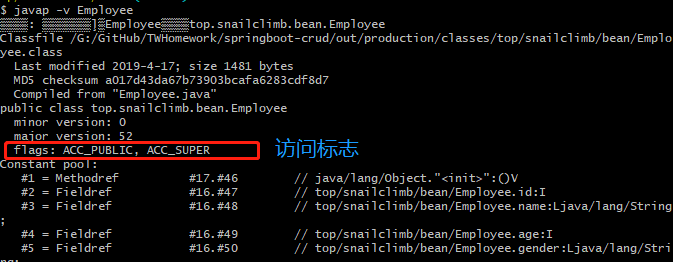

# 一、Class 文件结构总结

根据 Java 虚拟机规范，Class 文件通过 `ClassFile` 定义，有点类似 C 语言的结构体。

`ClassFile` 的结构如下：

```class
ClassFile {
    u4             magic; //Class 文件的标志
    u2             minor_version;//Class 的小版本号
    u2             major_version;//Class 的大版本号
    u2             constant_pool_count;//常量池的数量
    cp_info        constant_pool[constant_pool_count-1];//常量池
    u2             access_flags;//Class 的访问标记
    u2             this_class;//当前类
    u2             super_class;//父类
    u2             interfaces_count;//接口数量
    u2             interfaces[interfaces_count];//一个类可以实现多个接口
    u2             fields_count;//字段数量
    field_info     fields[fields_count];//一个类可以有多个字段
    u2             methods_count;//方法数量
    method_info    methods[methods_count];//一个类可以有个多个方法
    u2             attributes_count;//此类的属性表中的属性数
    attribute_info attributes[attributes_count];//属性表集合
}
```

通过分析 `ClassFile` 的内容，我们便可以知道 class 文件的组成。


下面这张图是通过 IDEA 插件 `jclasslib` 查看的，你可以更直观看到 Class 文件结构。


使用 `jclasslib` 不光可以直观地查看某个类对应的字节码文件，还可以查看类的基本信息、常量池、接口、属性、函数等信息。

下面详细介绍一下 Class 文件结构涉及到的一些组件。

## 1.1 魔数（Magic Number）

```
    u4             magic; //Class 文件的标志
```

每个 Class 文件的头 4 个字节称为魔数（Magic Number）,它的唯一作用是**确定这个文件是否为一个能被虚拟机接收的 Class 文件**。Java 规范规定**魔数为固定值：0xCAFEBABE**。如果读取的文件不是以这个魔数开头，Java 虚拟机将拒绝加载它。

## 1.2 Class 文件版本号（Minor&Major Version）

```
    u2             minor_version;//Class 的小版本号
    u2             major_version;//Class 的大版本号
```

紧接着魔数的四个字节存储的是 Class 文件的版本号：第 5 和第 6 个字节是**次版本号**，第 7 和第 8 个字节是**主版本号**。

每当 Java 发布大版本（比如 Java 8，Java9）的时候，主版本号都会加 1。你可以使用 `javap -v` 命令来快速查看 Class 文件的版本号信息。

**高版本的 Java 虚拟机可以执行低版本编译器生成的 Class 文件**，但是**低版本的 Java 虚拟机不能执行高版本编译器生成的 Class 文件**。所以，我们在实际开发的时候要确保开发的的 JDK 版本和生产环境的 JDK 版本保持一致。

## 1.3 常量池（Constant Pool）

```
    u2             constant_pool_count;//常量池的数量
    cp_info        constant_pool[constant_pool_count-1];//常量池
```

紧接着主次版本号之后的是常量池，常量池的数量是 `constant_pool_count-1`（**常量池计数器是从 1 开始计数的，将第 0 项常量空出来是有特殊考虑的，索引值为 0 代表“不引用任何一个常量池项”**）。

常量池主要存放两大常量：**字面量和符号引用**。字面量比较接近于 Java 语言层面的的常量概念，如文本字符串、声明为 final 的常量值等。而符号引用则属于编译原理方面的概念。包括下面三类常量：

- 类和接口的全限定名
- 字段的名称和描述符
- 方法的名称和描述符

常量池中每一项常量都是一个表，这 14 种表有一个共同的特点：**开始的第一位是一个 u1 类型的标志位 -tag 来标识常量的类型，代表当前这个常量属于哪种常量类型．**

|               类型               | 标志（tag） |          描述          |
| :------------------------------: | :---------: | :--------------------: |
|        CONSTANT_utf8_info        |      1      |   UTF-8 编码的字符串   |
|      CONSTANT_Integer_info       |      3      |       整形字面量       |
|       CONSTANT_Float_info        |      4      |      浮点型字面量      |
|        CONSTANT_Long_info        |      5      |      长整型字面量      |
|       CONSTANT_Double_info       |      6      |   双精度浮点型字面量   |
|       CONSTANT_Class_info        |      7      |   类或接口的符号引用   |
|       CONSTANT_String_info       |      8      |    字符串类型字面量    |
|      CONSTANT_FieldRef_info      |      9      |     字段的符号引用     |
|     CONSTANT_MethodRef_info      |     10      |   类中方法的符号引用   |
| CONSTANT_InterfaceMethodRef_info |     11      |  接口中方法的符号引用  |
|    CONSTANT_NameAndType_info     |     12      |  字段或方法的符号引用  |
|     CONSTANT_MethodType_info     |     16      |      标志方法类型      |
|    CONSTANT_MethodHandle_info    |     15      |      表示方法句柄      |
|   CONSTANT_InvokeDynamic_info    |     18      | 表示一个动态方法调用点 |

**`.class` 文件**可以通过`javap -v class类名` 指令来看一下其常量池中的信息(`javap -v class类名-> temp.txt`：将结果输出到 temp.txt 文件)。

## 1.4 访问标志(Access Flags)

```
    u2             access_flags;//Class 的访问标记
```

在常量池结束之后，紧接着的两个字节代表访问标志，这个标志用于识别一些类或者接口层次的访问信息，包括：这个 Class 是类还是接口，是否为 `public` 或者 `abstract` 类型，如果是类的话是否声明为 `final` 等等。

在Java的`class`文件中，`access_flags`是一个重要的字段，用于描述类或接口、字段、方法的访问权限和特性。它是一个16位的标志位集合，不同的位表示不同的含义。以下是`access_flags`的主要标志位及其意义：

---

### **1. 类或接口的访问标志（Class Access Flags）**
这些标志位用于描述类或接口的访问权限和特性：

| 标志位名称       | 值 (十六进制) | 含义                                                         |
| ---------------- | ------------- | ------------------------------------------------------------ |
| `ACC_PUBLIC`     | 0x0001        | 声明为 `public`，可以从任何地方访问。                        |
| `ACC_FINAL`      | 0x0010        | 声明为 `final`，不能被继承。                                 |
| `ACC_SUPER`      | 0x0020        | 表示该类使用了新的 `invokespecial` 指令语义（从 JDK 1.2 开始，所有编译的类都会自动加上 ACC_SUPER 标志）。确保 super 关键字能够正确调用直接父类的方法，而不是跳过某些层级。 |
| `ACC_INTERFACE`  | 0x0200        | 表示这是一个接口，而不是普通类。                             |
| `ACC_ABSTRACT`   | 0x0400        | 声明为 `abstract`，不能被实例化。                            |
| `ACC_SYNTHETIC`  | 0x1000        | 表示该类是由编译器生成的，而不是由源代码生成的。             |
| `ACC_ANNOTATION` | 0x2000        | 表示这是一个注解类型（Annotation）。                         |
| `ACC_ENUM`       | 0x4000        | 表示这是一个枚举类型（Enum）。                               |

---

### **2. 字段的访问标志（Field Access Flags）**
这些标志位用于描述字段的访问权限和特性：

| 标志位名称      | 值 (十六进制) | 含义                                                         |
| --------------- | ------------- | ------------------------------------------------------------ |
| `ACC_PUBLIC`    | 0x0001        | 声明为 `public`，可以从任何地方访问。                        |
| `ACC_PRIVATE`   | 0x0002        | 声明为 `private`，只能在定义它的类内部访问。                 |
| `ACC_PROTECTED` | 0x0004        | 声明为 `protected`，可以在同一个包或子类中访问。             |
| `ACC_STATIC`    | 0x0008        | 声明为 `static`，属于类而不是实例。                          |
| `ACC_FINAL`     | 0x0010        | 声明为 `final`，字段值不能被修改（对于基本类型和引用类型）。 |
| `ACC_VOLATILE`  | 0x0040        | 声明为 `volatile`，确保多线程环境下的可见性和有序性。        |
| `ACC_TRANSIENT` | 0x0080        | 声明为 `transient`，不会被序列化。                           |
| `ACC_SYNTHETIC` | 0x1000        | 表示该字段是由编译器生成的，而不是由源代码生成的。           |
| `ACC_ENUM`      | 0x4000        | 表示这是一个枚举常量。                                       |

---

### **3. 方法的访问标志（Method Access Flags）**
这些标志位用于描述方法的访问权限和特性：

| 标志位名称         | 值 (十六进制) | 含义                                                      |
| ------------------ | ------------- | --------------------------------------------------------- |
| `ACC_PUBLIC`       | 0x0001        | 声明为 `public`，可以从任何地方访问。                     |
| `ACC_PRIVATE`      | 0x0002        | 声明为 `private`，只能在定义它的类内部访问。              |
| `ACC_PROTECTED`    | 0x0004        | 声明为 `protected`，可以在同一个包或子类中访问。          |
| `ACC_STATIC`       | 0x0008        | 声明为 `static`，属于类而不是实例。                       |
| `ACC_FINAL`        | 0x0010        | 声明为 `final`，不能被子类重写。                          |
| `ACC_SYNCHRONIZED` | 0x0020        | 声明为 `synchronized`，方法执行时会对当前对象加锁。       |
| `ACC_BRIDGE`       | 0x0040        | 表示这是一个桥接方法（Bridge Method），通常由编译器生成。 |
| `ACC_VARARGS`      | 0x0080        | 表示这是一个可变参数方法（Varargs）。                     |
| `ACC_NATIVE`       | 0x0100        | 声明为 `native`，方法实现由本地代码提供（如C/C++）。      |
| `ACC_ABSTRACT`     | 0x0400        | 声明为 `abstract`，没有具体实现，必须由子类实现。         |
| `ACC_STRICT`       | 0x0800        | 声明为 `strictfp`，浮点运算遵循严格的精度规则。           |
| `ACC_SYNTHETIC`    | 0x1000        | 表示该方法是由编译器生成的，而不是由源代码生成的。        |

---

> `ACC_SYNTHETIC`标志位用于标识类、字段或方法是**由编译器生成而非直接在源代码中定义的**。它主要用于以下几种场景：
>
> 1. **桥接方法（Bridge Methods）**：这是`ACC_SYNTHETIC`标志最常见的一种使用场景。当一个类实现了泛型接口或继承了泛型父类，并且子类的方法签名因为类型擦除而需要调整时，编译器会自动生成桥接方法来确保多态性能够正常工作。例如，在Java中实现带有泛型参数的接口时，编译器可能会生成桥接方法以保持兼容性。
>
> 2. **内部类访问外部类成员**：为了允许内部类访问其外部类的私有成员变量和方法，编译器可能需要生成一些合成（synthetic）的方法或字段。这些合成元素充当“桥梁”，让内部类能够间接地访问那些本应无法访问的外部类成员。
>
> 3. **匿名内部类与局部类**：对于匿名内部类或局部类来说，如果它们需要引用所在方法中的局部变量，则编译器可能会为这些类生成合成的构造函数或者字段，以便将所需的局部变量传递给内部类实例。
>
> 4. **Lambda表达式**：从Java 8开始引入的Lambda表达式实际上会被编译成私有的静态方法以及对应的合成的函数式接口实现类。这里的实现类和调用方法都可能是标记为`ACC_SYNTHETIC`的。
>
> 5. **解决命名冲突**：在某些情况下，比如当两个不同的包中有相同名字的类被导入到同一个文件中时，编译器可能需要创建合成的类名或其他结构来避免命名冲突。
>
> 6. **增强功能**：有些框架或工具可能会利用编译期插件或注解处理器来生成额外的类或方法，以提供诸如依赖注入、AOP（面向切面编程）等功能，这些生成的元素也可能被标记为`ACC_SYNTHETIC`。
>
> 总之，`ACC_SYNTHETIC`标志帮助开发者识别出哪些部分是编译器自动生成的，这有助于理解复杂的字节码结构，尤其是在进行性能优化、调试或安全检查的时候。不过，普通应用开发过程中很少直接操作这个标志，更多的是在底层或高级特性开发中遇到。

通过`javap -v class类名` 指令来看一下类的访问标志。



## 1.5 当前类（This Class）、父类（Super Class）、接口（Interfaces）索引集合

```
    u2             this_class;//当前类
    u2             super_class;//父类
    u2             interfaces_count;//接口数量
    u2             interfaces[interfaces_count];//一个类可以实现多个接口
```

Java 类的继承关系由**类索引、父类索引和接口索引集合**三项确定。类索引、父类索引和接口索引集合按照顺序排在访问标志之后，

**类索引用于确定这个类的全限定名**，**父类索引用于确定这个类的父类的全限定名**，由于 Java 语言的单继承，所以父类索引只有一个，除了 `java.lang.Object` 之外，所有的 Java 类都有父类，因此**除了 `java.lang.Object` 外，所有 Java 类的父类索引都不为 0**。

**接口索引集合用来描述这个类实现了那些接口**，这些被实现的接口将按 `implements` (如果这个类本身是接口的话则是`extends`) 后的接口顺序从左到右排列在接口索引集合中。

## 1.6 字段表集合（Fields）

```
    u2             fields_count;//字段数量
    field_info     fields[fields_count];//一个类会可以有个字段
```

字段表（field info）用于描述接口或类中声明的变量。字段包括类级变量以及实例变量，但不包括在方法内部声明的局部变量。

**field info(字段表) 的结构:**


- **access_flags:** 字段的作用域（`public` ,`private`,`protected`修饰符），是实例变量还是类变量（`static`修饰符）,可否被序列化（transient 修饰符）,可变性（final）,可见性（volatile 修饰符，是否强制从主内存读写）。
- **name_index:** 对常量池的引用，表示的字段的名称；
- **descriptor_index:** 对常量池的引用，表示字段的描述符；
- **attributes_count:** 一个字段还会拥有一些额外的属性，attributes_count 存放属性的个数；
- **attributes[attributes_count]:** 存放具体属性具体内容。

上述这些信息中，各个修饰符都是布尔值，要么有某个修饰符，要么没有，很适合使用标志位来表示。而**字段叫什么名字、字段被定义为什么数据类型这些都是无法固定的，只能引用常量池中常量来描述**。

**字段的 access_flag 的取值:**


## 1.7 方法表集合（Methods）

```
    u2             methods_count;//方法数量
    method_info    methods[methods_count];//一个类可以有个多个方法
```

methods_count 表示方法的数量，而 method_info 表示方法表。

Class 文件存储格式中对方法的描述与对字段的描述几乎采用了完全一致的方式。方法表的结构如同字段表一样，依次包括了访问标志、名称索引、描述符索引、属性表集合几项。

**method_info(方法表的) 结构:**


**方法表的 access_flag 取值：**


注意：因为`volatile`修饰符和`transient`修饰符不可以修饰方法，所以方法表的访问标志中没有这两个对应的标志，但是增加了`synchronized`、`native`、`abstract`等关键字修饰方法，所以也就多了这些关键字对应的标志。

## 1.8 属性表集合（Attributes）

```
   u2             attributes_count;//此类的属性表中的属性数
   attribute_info attributes[attributes_count];//属性表集合
```

在 Java 的 `class` 文件中，字段表（Field Info）、方法表（Method Info）以及类或接口本身都可以携带自己的**属性表集合**（Attributes）。这些属性表集合主要用于存储额外的元信息，它们是 `class` 文件格式中非常灵活的一部分，允许编译器、运行时环境和工具链附加各种与类、字段或方法相关的数据。与 Class 文件中其它的数据项目要求的顺序、长度和内容不同，属性表集合的限制稍微宽松一些，不再要求各个属性表具有严格的顺序，并且**只要不与已有的属性名重复，任何人实现的编译器都可以向属性表中写 入自己定义的属性信息**，**Java 虚拟机运行时会忽略掉它不认识的属性**.

### **属性表集合的作用**
属性表集合的主要作用是为类、字段和方法提供扩展性。它允许在不改变 `class` 文件基本结构的情况下，添加更多的信息。以下是一些常见的用途：

---

### **1. 存储调试信息**
- **`LineNumberTable` 属性**  
  用于将字节码指令与源代码中的行号对应起来，便于调试和异常堆栈跟踪。
  - 示例：当抛出异常时，JVM 可以利用 `LineNumberTable` 找到对应的源代码行号。
  
- **`LocalVariableTable` 和 `LocalVariableTypeTable` 属性**  
  用于描述方法中局部变量的名称、类型及其作用范围。这对调试器和反编译器非常重要。
  - 示例：在调试时，IDE 可以显示局部变量的名称和值。

- **`SourceFile` 属性**  
  用于记录生成该 `class` 文件的源文件名称（通常是 `.java` 文件的名称）。
  - 示例：当你在异常堆栈中看到类似 `at MyClass.method(MyClass.java:10)` 的信息时，`MyClass.java` 就是由 `SourceFile` 属性提供的。

---

### **2. 支持注解**
- **`RuntimeVisibleAnnotations` 和 `RuntimeInvisibleAnnotations` 属性**  
  用于存储类、字段或方法上的注解信息。前者表示注解在运行时可见（通过反射可以访问），后者表示注解仅在编译期可用。
  - 示例：`@Override`、`@Deprecated` 等注解会被存储在这些属性中。

- **`RuntimeVisibleParameterAnnotations` 和 `RuntimeInvisibleParameterAnnotations` 属性**  
  专门用于存储方法参数上的注解信息。

---

### **3. 提供字节码相关信息**
- **`Code` 属性**  
  这是最重要且最常见的属性之一，它存储了方法的字节码指令、异常处理表、局部变量表等信息。
  - 示例：方法体中的所有逻辑（如控制流、操作数栈等）都存储在 `Code` 属性中。

- **`Exceptions` 属性**  
  用于声明方法可能抛出的受检异常（checked exceptions）。
  - 示例：如果一个方法声明了 `throws IOException`，那么这个信息会存储在 `Exceptions` 属性中。

---

### **4. 支持泛型和签名信息**
- **`Signature` 属性**  
  用于支持泛型和复杂的类型签名。由于泛型在编译后会进行类型擦除，`Signature` 属性保留了泛型信息以便在运行时可以通过反射获取。
  - 示例：对于泛型类 `List<String>`，`Signature` 属性会保存其原始类型信息。

---

### **5. 提供模块化和版本信息**
- **`Module` 属性**  
  在 Java 9 引入模块化系统后，`Module` 属性用于描述模块的相关信息，例如模块名称、依赖关系和导出包。

- **`BootstrapMethods` 属性**  
  用于支持动态调用（`invokedynamic` 指令），常见于 Lambda 表达式和动态语言支持。

---

### **6. 其他用途**
- **`StackMapTable` 属性**  
  用于优化字节码验证过程，特别是在 Java 7 及之后的版本中，它提供了字节码帧的状态信息。

- **`InnerClasses` 属性**  
  用于描述内部类的信息，包括其外部类、访问权限等。

- **`EnclosingMethod` 属性**  
  用于描述匿名内部类或局部类所在的外部方法。

- **`Deprecated` 属性**  
  标记类、字段或方法已被弃用（即使没有显式使用 `@Deprecated` 注解）。

---

### **总结**
属性表集合的设计使得 `class` 文件具有高度的灵活性和扩展性，允许 JVM 和其他工具在不破坏兼容性的情况下附加更多信息。这些信息广泛应用于：
- 调试（如 `LineNumberTable`、`LocalVariableTable`）。
- 注解处理（如 `RuntimeVisibleAnnotations`）。
- 泛型支持（如 `Signature`）。
- 字节码执行和优化（如 `Code`、`StackMapTable`）。
- 模块化和动态语言支持（如 `Module`、`BootstrapMethods`）。

开发者通常不需要直接操作这些属性，但了解它们的存在和作用有助于更好地理解 Java 的底层机制，尤其是在涉及字节码操作（如 ASM、Javassist）或性能优化时。


