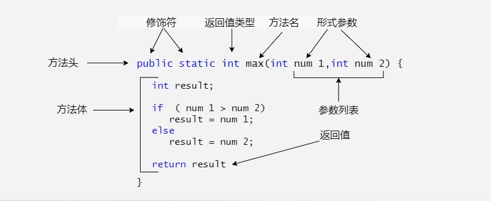

# 一、方法的定义

一般情况下，定义一个方法包含以下语法：

```java
修饰符 返回值类型 方法名(参数类型 参数名){
    ...
    方法体
    ...
    return 返回值;
}
```

方法包含一个方法头和一个方法体。下面是一个方法的所有部分：

- **修饰符：**修饰符，这是可选的，告诉编译器如何调用该方法。定义了该方法的访问类型。
- **返回值类型 ：**方法可能会返回值。`returnValueType` 是方法返回值的数据类型。有些方法执行所需的操作，但**没有返回值**。在这种情况下，**`returnValueType` 是关键字void。**
- **方法名：**是方法的实际名称。方法名和参数表共同构成方法签名。
- **参数类型：**参数像是一个占位符。当方法被调用时，传递值给参数。这个值被称为实参或变量。参数列表是指方法的参数类型、顺序和参数的个数。参数是可选的，方法可以不包含任何参数。
- **方法体：**方法体包含具体的语句，定义该方法的功能。



# 二、方法的重载

有的时候 自定义的 max 方法仅仅适用于int型数据。但如果你想得到两个浮点类型数据的最大值呢？

解决方法是创建另一个**有相同名字**但**参数不同**的方法，如下面代码所示：

```java
public static double max(double num1, double num2) {
  if (num1 > num2)
    return num1;
  else
    return num2;
}
```

如果你**调用max方法时传递的是int型参数，则 int型参数的max方法就会被调用**；

如果**传递的是double型参数，则double类型的max方法体会被调用**，这叫做方法重载；

就是说**一个类的两个方法拥有相同的名字，但是有不同的参数列表**。

**Java编译器**根据**方法签名**判断哪个方法应该被调用。

方法重载可以让程序更清晰易读。执行密切相关任务的方法应该使用相同的名字。

重载的方法**必须拥有不同的参数列表**。你不能仅仅依据**修饰符**或者**返回类型**的不同来重载方法。

# 三、命令行参数的使用

有时候你希望运行一个程序时候再传递给它消息。这要靠**传递命令行参数给main()函数**实现。

命令行参数是在执行程序时候**紧跟在程序名字后面的信息**。

下面的程序打印所有的命令行参数：

```java
public class CommandLine {
   public static void main(String[] args){ 
      for(int i=0; i<args.length; i++){
         System.out.println("args[" + i + "]: " + args[i]);
      }
   }
}
```

如下所示，运行这个程序：

```
$ javac CommandLine.java 
$ java CommandLine this is a command line 200 -100
args[0]: this
args[1]: is
args[2]: a
args[3]: command
args[4]: line
args[5]: 200
args[6]: -100
```

# 四、可变参数

JDK 1.5 开始，Java支持传递**同类型**的**可变参数**给一个方法。

方法的可变参数的声明如下所示：

```
typeName... parameterName
```

在方法声明中，在指定**参数类型**后加一个**省略号(...)** 。

一个方法中**只能指定一个可变参数**，它**必须是方法的最后一个参数**。任何普通的参数必须在它之前声明。

```java
public class VarargsDemo {
    public static void main(String[] args) {
        // 调用可变参数的方法
        printMax(34, 3, 3, 2, 56.5);
        printMax(new double[]{1, 2, 3});   // 可以是数组形式
    }
 
    public static void printMax( double... numbers) {
        if (numbers.length == 0) {
            System.out.println("No argument passed");
            return;
        }
 
        double result = numbers[0];
 
        for (int i = 1; i <  numbers.length; i++){
            if (numbers[i] >  result) {
                result = numbers[i];
            }
        }
        System.out.println("The max value is " + result);
    }
}
```

以上实例编译运行结果如下：

```
The max value is 56.5
The max value is 3.0
```

# 五、finalize() 方法