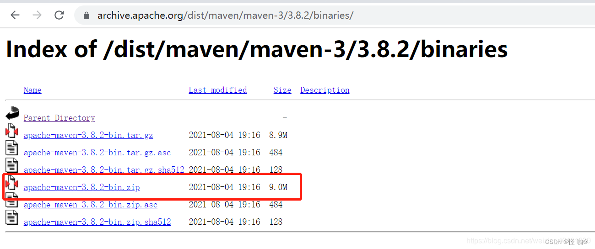
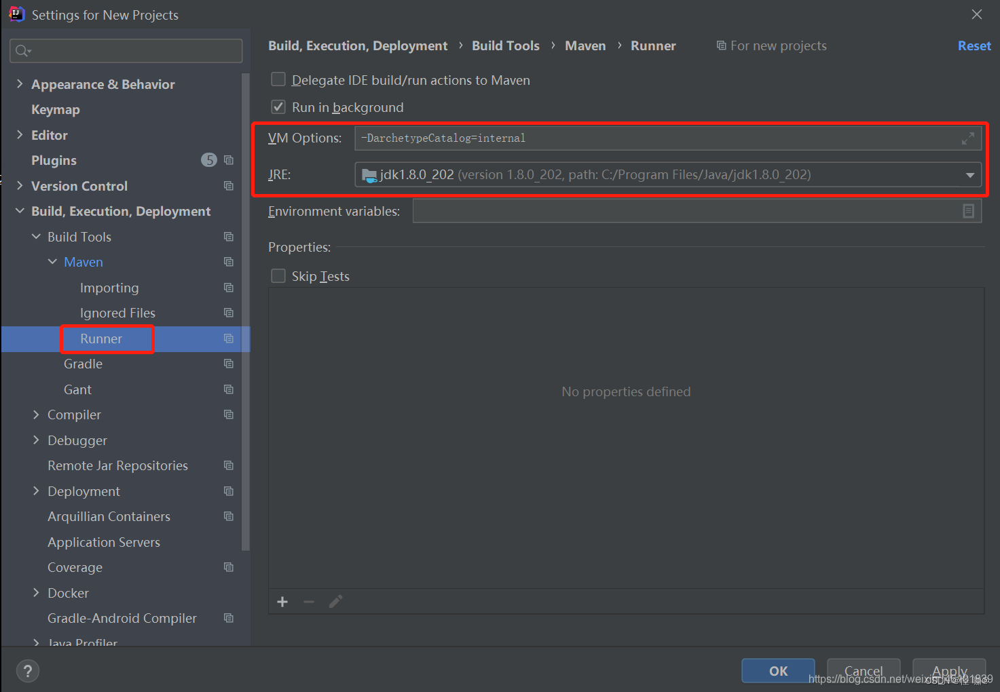

# 一、下载 Maven

**`Maven是一个基于 Java 的项目管理工具，因此最基本的要求是在计算机上安装 JDK。`**

Maven 对系统要求如下表（如下是官网提出的要求）：


官网下载地址：https://archive.apache.org/dist/maven/maven-3/

```
目前最新最稳定的版本是3.8.7，下一版本是4.0.0，目前4.0.0已经在内部测试版。这里我选择的是下载3.8.2版本，因为我的ider用的是2020 03版本，和3.8.7版本的maven不兼容，ide配置maven后下载jar包什么的会出各种问题，这个我是亲自试验过的! 如果您是要的ider版本高，可以尝试使用最新版本！
```




下载好后就是一个zip，我们直接解压即可，都不需要安装，我们只需要配置一下环境变量就可以使用了！


# 二、配置 Maven 环境变量

> 变量名：MAVEN_HOME
>  变量值：D:\maven\apache-maven-3.8.7（这是你自己[安装Maven](https://so.csdn.net/so/search?q=安装Maven&spm=1001.2101.3001.7020)时的路径）
>  作用：定义一个变量，供其他地方使用

> 双击`系统变量下的PATH`变量，新建：`%MAVEN_HOME%\bin`

在命令提示符下执行 mvn -version ，输出结果如下图所示，证明 Maven 配置成功：


# 三、配置文件修改

## 3.1 配置 Maven 仓库地址

Maven 默认存储 Jar 包的地址是 `C:\%USER_HOME%\.m2\repository` ，其实 maven 并占不了多少内存，但是 **maven 本地仓库就比较占用内存**了，相当于是我们配置xml坐标，然后maven根据坐标通过网络从中央仓库将jar包下载到我们本地，**下载到本地存储jar包的地址我们可以称他为本地仓库，这个地址我们可以自己指定的。**

> 所谓的中央仓库就好比是一个网络云盘，里面存储了各种各样的jar包，需要下载什么直接下载即可。之所以叫中央，就是所有人皆可使用。

修改 `%MAVEN_HOME%\conf` 目录下的 `settings.xml` 文件，**通过 localRepository 元素定义另一个本地仓库地址**，例如：


构件只有储存在本地仓库中，才能被其他的 Maven 项目使用。构件想要进入本地仓库，除了从远程仓库下载到本地仓库外，还可以使用**命令 `mvn install`** 将**本地项目的输出构件安装到本地仓库**中。

## 3.2 配置 Maven 镜像

Maven默认下载是从Maven当中的中央仓库，但是中央仓库是国外的相对来说下载的比较慢，往往我们会通过`镜像`来更快的下载。

配置 Maven 镜像的方法也非常的简单，我们只需要在 Maven 安装目录中 **setting.xml 文件的 mirrors 节点中**，**使用 mirror 标签添加镜像的相关信息**即可。

目前国内使用最多，最稳定的中央仓库镜像分别是由阿里云和华为云提供的，它们的地址配置如下。

阿里云镜像地址：

```xml
<mirror>
    <id>aliyun</id>
    <mirrorOf>central</mirrorOf>
    <name>aliyun</name>
    <url>https://maven.aliyun.com/repository/public</url>
</mirror>
```

华为云镜像地址：

```xml
<mirror>
    <id>huaweicloud</id>
    <name>mirror from maven huaweicloud</name>
    <mirrorOf>central</mirrorOf>
    <url>https://repo.huaweicloud.com/repository/maven/</url>
</mirror>
```


以上配置中，`mirrorOf` 的取值为 `central`，表示该配置为**中央仓库的镜像**，所有对于中央仓库的请求都会转到该镜像。`当然，我们也可以使用以上方式配置其他仓库的镜像`。**另外三个元素 id、name 和 url 分别表示镜像的唯一标识、名称和地址。**

## 3.3 配置 Maven JDK

在 `settings.xml` 配置文件中找到 `profiles` 节点，添加如下配置：

```xml
<profiles>
	<profile>
	  <id>jdk-1.8</id>
	  <activation>
	    <activeByDefault>true</activeByDefault>
	  </activation>
	  <properties>
	    <maven.compiler.source>1.8</maven.compiler.source>
	    <maven.compiler.target>1.8</maven.compiler.target>
		<maven.compiler.compilerVersion>1.8</maven.compiler.compilerVersion>
	  </properties>
	</profile>
</profiles>
```

springboot项目当中应该都用过profile根据环境区分配置，maven的settings配置当中也是如此，上面的**activeByDefault为true代表的是默认生效**，这样我们**就算项目当中properties没有定义这些，构建的时候照样也会使用。**

# 四、IDE配置 Maven

配置ide的全局maven：我使用的是2020-3版本，不同的版本可能配置所在的位置不一样，但是都是存在这个配置的！


> 上面页面是ide的欢迎页面，初学者很容易找不到那个页面，其实点击close project之后就可以回到ide的欢迎页面！

选择全局配置：


推荐配置：**设置maven在不联网的情况下使用本地插件**

一般使用maven为我们提供好的骨架时，是需要联网的，配置这个，可以在没有网路的情况下，我们可以正常创建工程，并从之前已经使用过的工程中找到相应的骨架。

输入内容：`-DarchetypeCatalog=internal`

