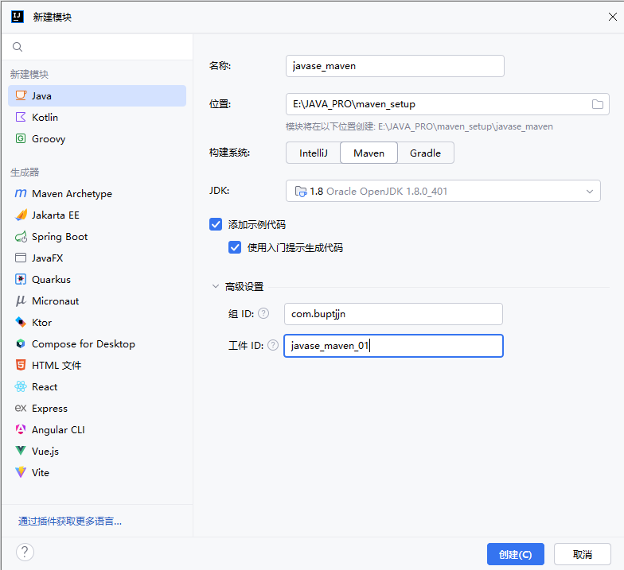
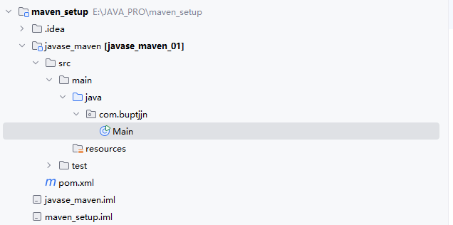
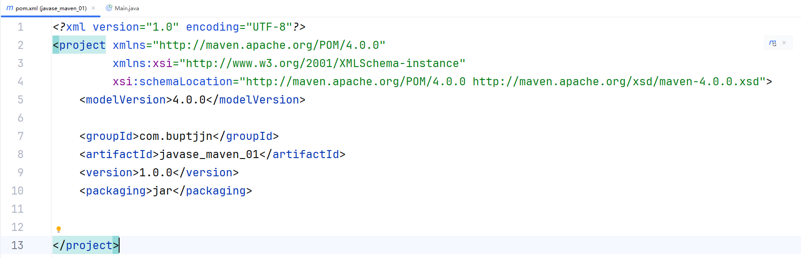
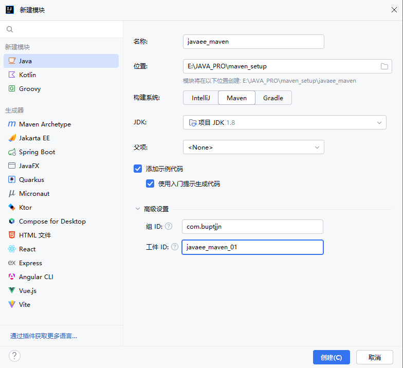
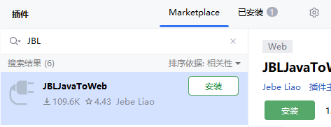
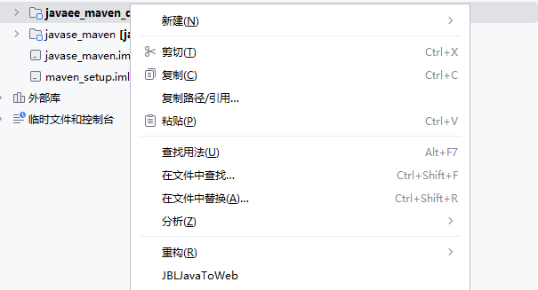
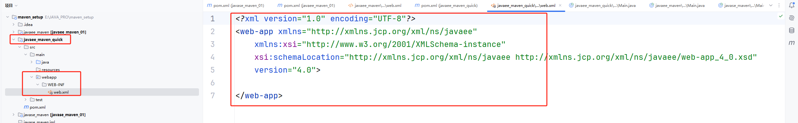
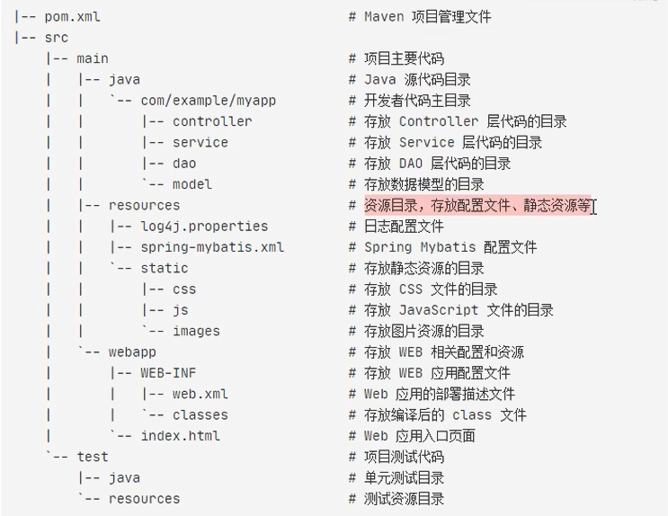
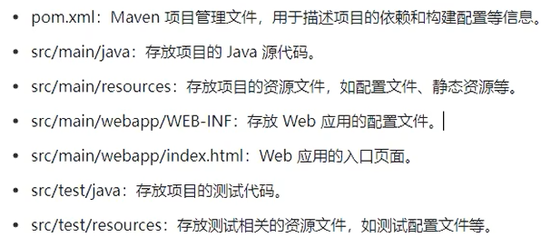

# 一、搭建 `JAVASE` 工程

新建一个空项目，在空项目下添加一个模块。

效果：

生成一个 `src` 文件和一个 `pom.xml` 配置文件。

在 `pom.xml` 文件中可以配置 `GAVP` 四属性：

# 二、搭建 `JAVAEE` 工程

## 2.1 方式一：`JAVASE` + 手动添加 `JAVAEE` 相关文件

1. 首先安装 `JAVASE` 的搭建方式搭建一个 `JAVASE ` 工程，然后补全缺失的文件：

2. 在 `main` 文件夹下，新增一个 `webapp` 文件夹
3. 在 `webapp` 文件夹下，新增一个 `WEB-INF` 文件夹
4. 在 `WEB-INF` 文件夹下，新增一个 `web.xml` 配置文件
5. 在 `pom.xml` 中，选择 `packaging` 为 `war`

## 2.2 方法二：插件生成

1. 下载插件 `JBLJavaToWeb`：

2. 先构建一个 `JAVASE` 的 maven 项目
3. 利用插件将 `JAVASE` 项目变成一个 `JAVAEE` 项目（`JBLJavaToWeb`）

4. 效果:

# 三、`Maven` 工程项目结构说明

`Maven Web` 项目的结果说明如下：

