# 一、依赖管理和配置

## 1.1 `pom.xml` 文件

### 1.1.1 `GAVP` 属性

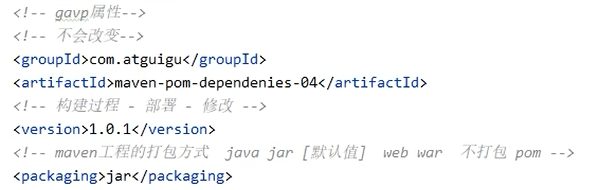

### 1.1.2 `properties` 属性

### 1.1.3 `dependencies` 属性

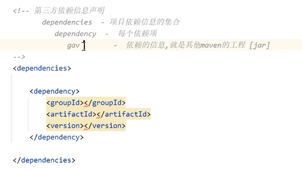

第三方的 `jar` 包，如何知道其 `GAV` 信息？有两种方式：

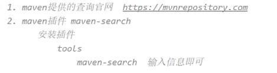

下面介绍的是第二种方式：（使用 `Maven Search`）

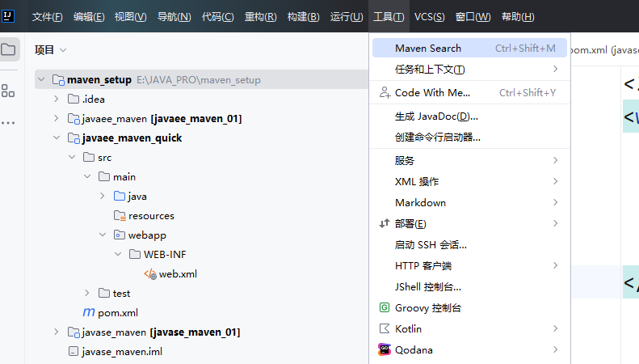

例如，要获取 `jackson-core` 的 `GAV` 信息：

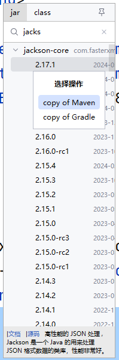

复制到粘贴板，进行粘贴：

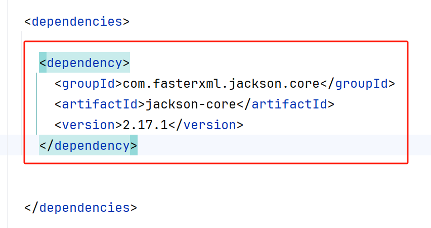

## 1.2 扩展项

### 1.2.1 提取版本号，统一管理

每个依赖都有自己的 `version`，有时候同一个技术会需要导入多个 `jar` 包，他们的版本需要一致/统一管理。

在 `properties` 中进行版本标识，假设我们需要统一管理 `jackson` 技术的相关包的版本：

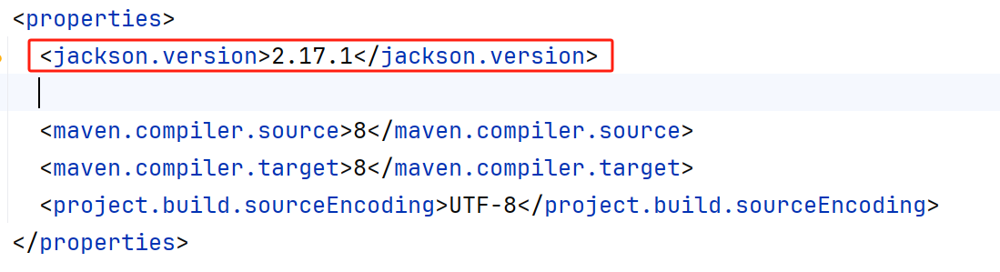

接着，在 `dependency` 的 `version` 中，不使用具体的版本，而是用 `${jackson.version}` 进行指代：

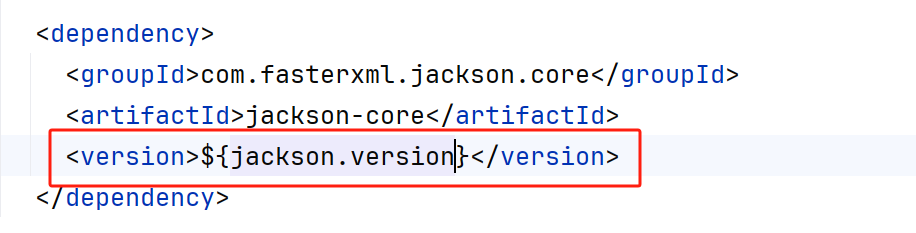

### 1.2.2 `scope` 作用域

有的时候，想要限定依赖包的作用范围。

一个依赖包的作用域可以分为三大类：

1. `main` 中使用
2. `test` 中使用
3. 打包和运行时使用

作用域的分类：

1. `compile`：main/test/打包和运行 阶段都使用
2. `test`：只有 test 时会使用
3. `runtime`：只有 打包和运行 阶段会使用
4. `provided` ：main/test 时会使用

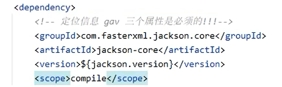

> 这是一种锦上添花的手段，如果掌握不好，就默认值（compile），全部生效。

# 二、依赖传递

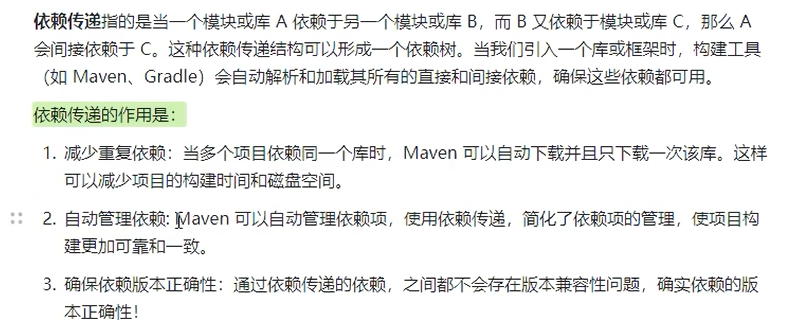

举例：

`jackson` 项目需要三个包：`jackson-databind`；`jackson-core`；`jackson-annotation`。

其实我们只需要导入 `jackson-databind`，`maven` 就会自动导入剩余的两个包（因为 `jackson-databind` 依赖剩余的两个包）：

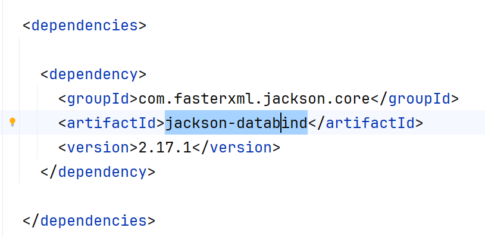

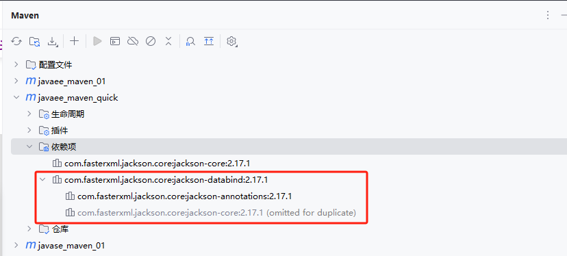

# 三、依赖冲突

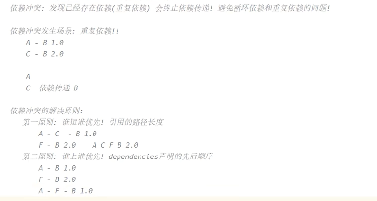

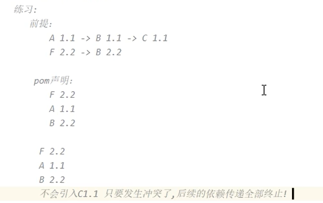

# 四、依赖下载失败的解决

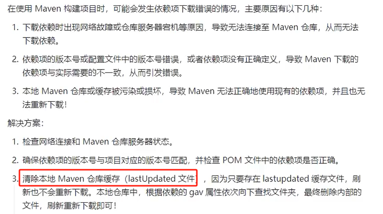

为什么会出现 `lastUpdated` 文件？

有时候网络不好，包下载到一半后失败了，就会出现  `lastUpdated` 文件。

直接到本地仓库中，删除包对应的  `lastUpdated` 文件即可。