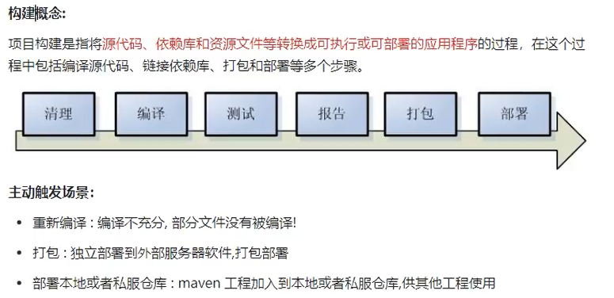
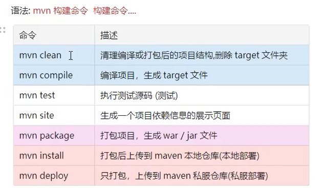
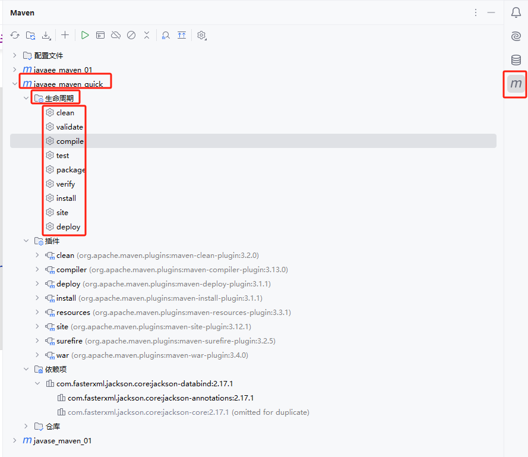
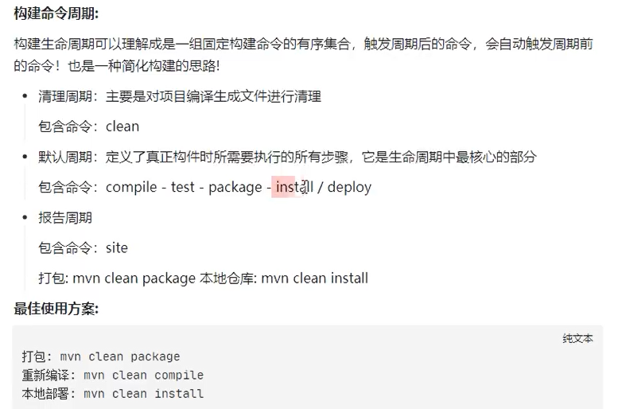
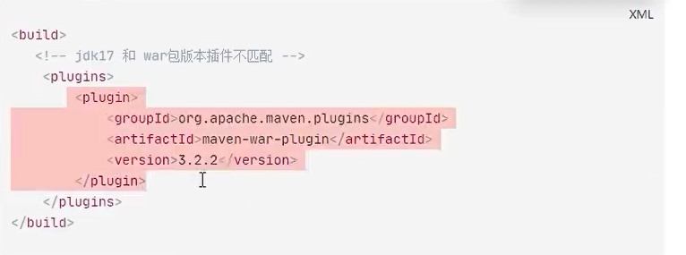

# 一、项目构建的概念

# 二、`Maven` 构建项目

## 2.1 方法一：使用 `mvn` 命令 

## 2.2 方法二：使用 `IDEA` 提供的可视化操作

## 2.3 构建命令的周期

一个 `mvn` 命令其实通常会包含多个插件的执行

# 三、自定义插件的使用

有的时候，插件可能和 `jdk` 版本不匹配，导致插件无法使用，这个时候需要我们手动引入正确的插件：

也是在 `pom.xml` 中引入插件。依赖包是通过 `dependencies` 引入，插件则是通过 `build` 进行引入：

