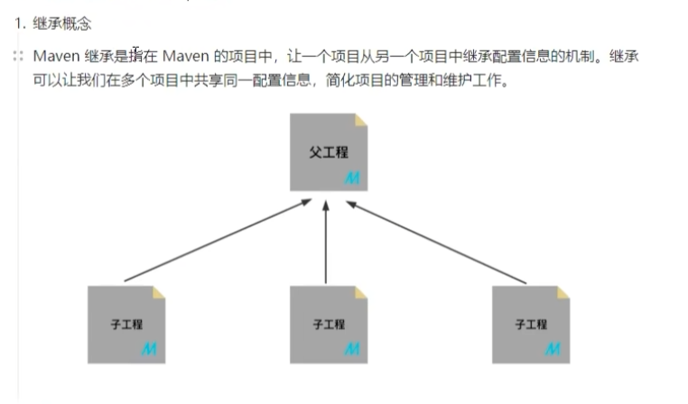
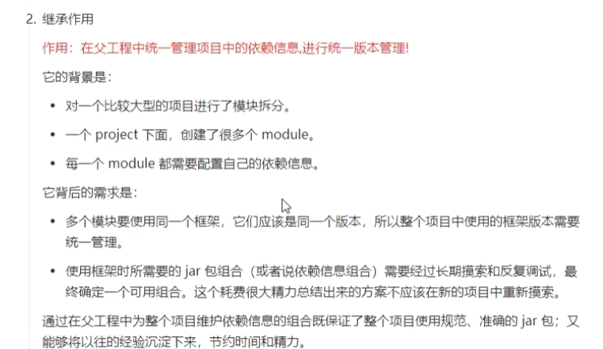
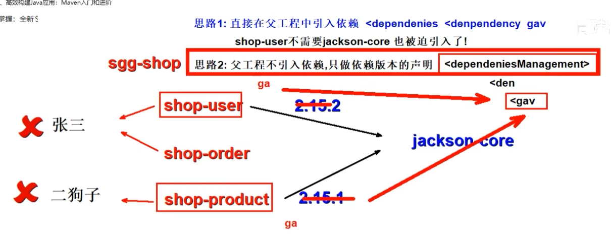
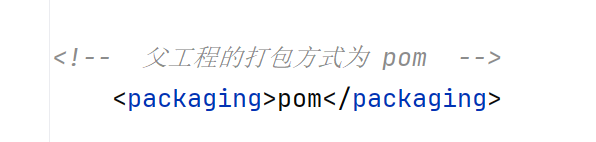
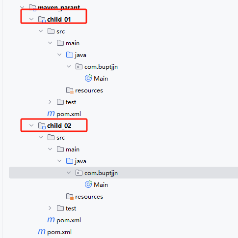
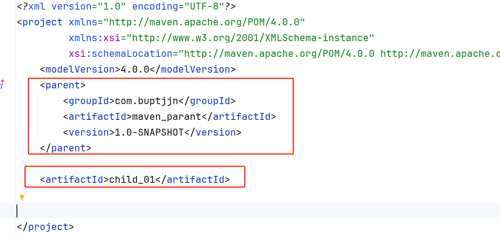
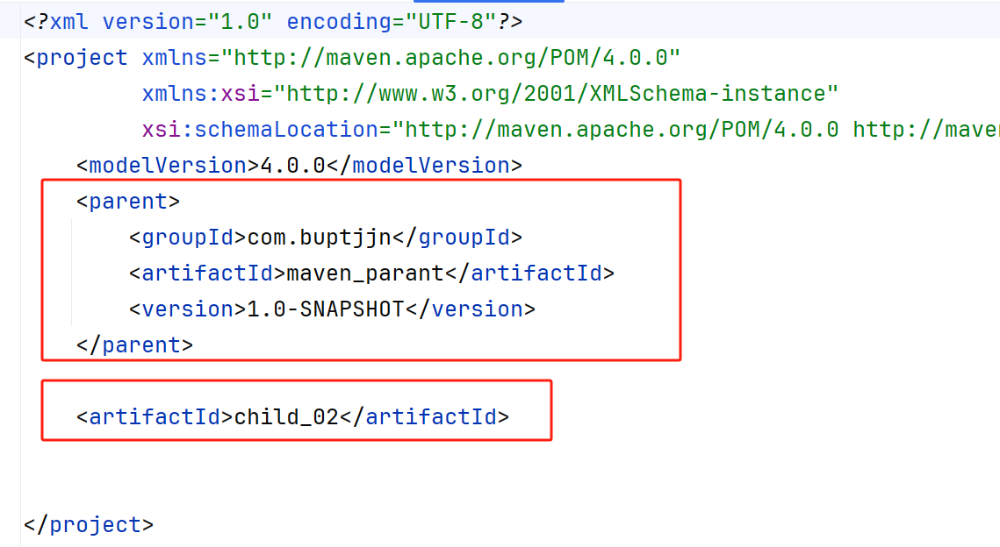
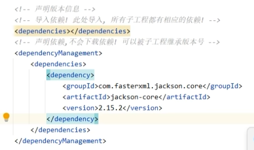
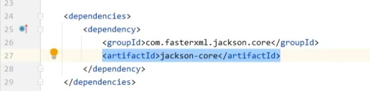

# 一、`Maven` 工程的继承







# 二、`Maven` 项目如何实现继承

## 2.1 可视化操作

### 2.1.1 创建一个父工程

1. `pom.xml` 中父工程的打包方式为 ·`pom`·



2. 父工程不包含任何源文件，所以删除父工程的 `src` 文件夹
3. 在父工程下新建模块，也就是子工程



上述操作，即可实现继承关系。

## 2.2 配置文件操作

实际上，继承关系通过父子工程的 `pom.xml` 文件实现。

我们先看一下父工程的 `pom.xml`：

```xml
<?xml version="1.0" encoding="UTF-8"?>
<project xmlns="http://maven.apache.org/POM/4.0.0"
         xmlns:xsi="http://www.w3.org/2001/XMLSchema-instance"
         xsi:schemaLocation="http://maven.apache.org/POM/4.0.0 http://maven.apache.org/xsd/maven-4.0.0.xsd">
    <modelVersion>4.0.0</modelVersion>

    <groupId>com.buptjjn</groupId>
    <artifactId>maven_parant</artifactId>
    <version>1.0-SNAPSHOT</version>

<!--  父工程的打包方式为 pom  -->
    <packaging>pom</packaging>
    <modules>
        <module>child_01</module>
        <module>child_02</module>
    </modules>


</project>
```

再看下两个子工程的 `pom.xml` 文件：





如上所示，通过标签 `parent` 完成对父工程的继承，对于子工程只需要实现自己的 `artifactId` 即可（如果子工程写了自己的 `groupID` 和 `version` ，那么会覆盖掉父工程相关配置项） 

# 三、父子工程的依赖控制

为了保证子工程的依赖不会出现版本冲突问题，通常会在父工程中指定依赖包的版本，子工程继承父工程指定的版本即可。

**需要注意：父工程只会指定依赖包的 `GAV` 属性，而不会实际对包进行导入（父工程不含任何代码），真正导入的是子工程。**

如下图所示，父工程通过 `dependencyManagement` 完成依赖的声明：



而对于需要此模块的子工程，不需要指定模块的版本号：

