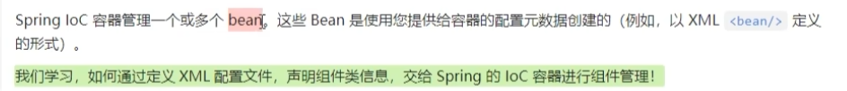
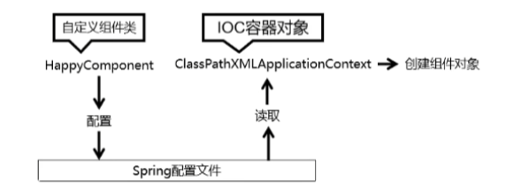
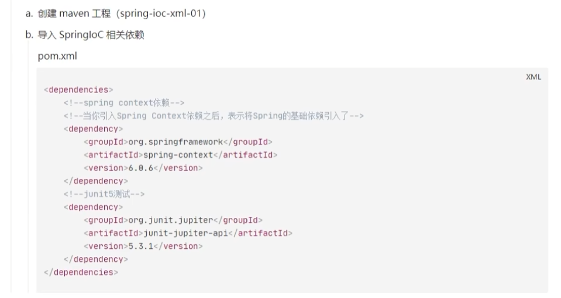
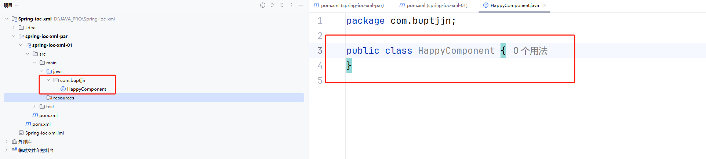
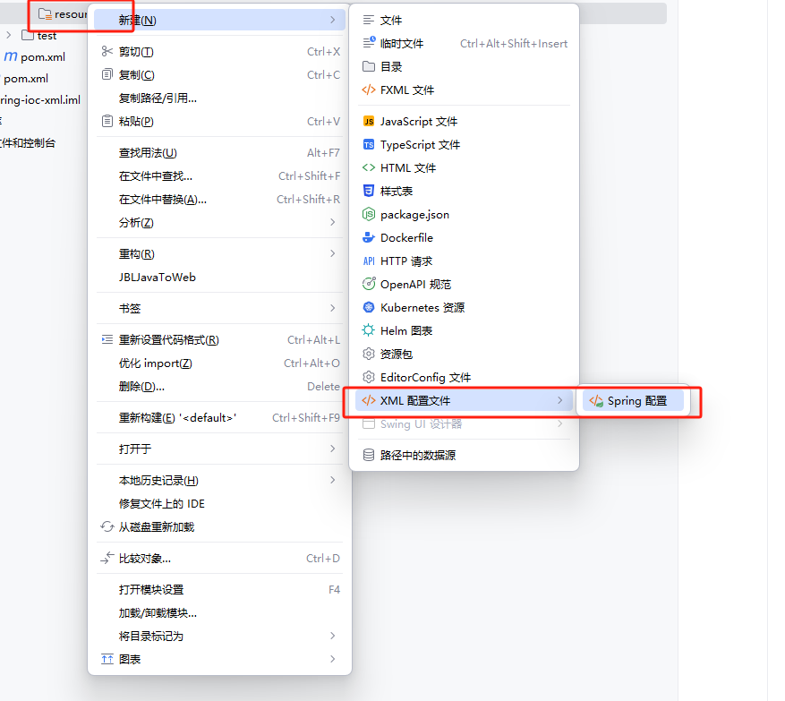
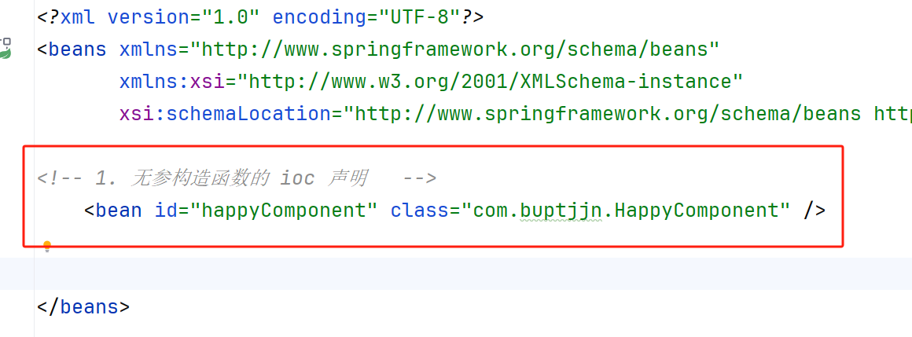
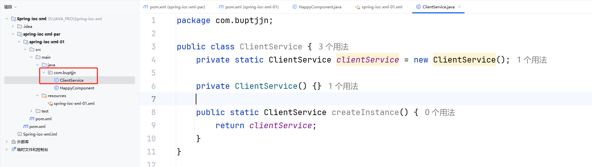
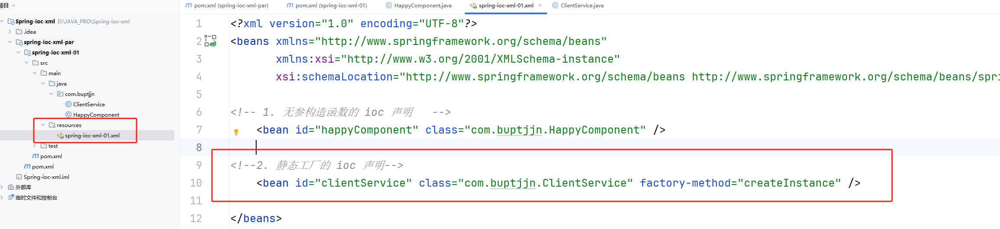
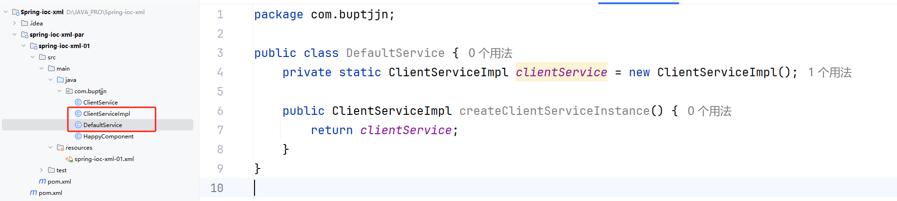
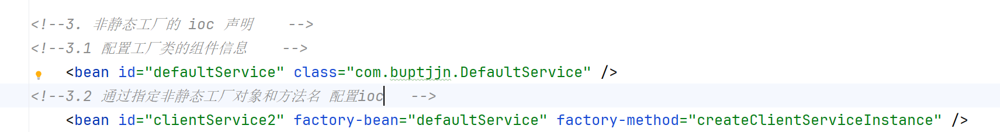

# 一、组件( `Bean` ) 信息声明配置（`Ioc`）

## 1.1 准备项目

## 1.2 基于类的无参构造函数

1. 创建一个基于无参构造函数的类

2. 生成 Spring 配置文件

3. 在配置文件中进行声明

一条 `bean` 创建一个对象，`id` 表示后期该 `bean` 组件的名称，`class` 表示组件对应的类的全限定符。

## 1.3 基于静态工厂方法实例化

1. 创建基于静态工厂模式的类

2. 在配置文件中进行声明

`factory-method` 用于表示获取类的静态工厂方法。

## 1.4 基于实例工厂方法实例化

1. 创建基于实例工厂实例化的类

2. 在配置文件中进行声明

