# 一、如何通过注解完成引用类型的 `di` 注入

通过使用 `@Autowired` 进行注解，注解后 Spring 将在 `ioc` 容器中查找符合注入条件的 `bean`

主要可以通过三种方式进行注解：

## 1.1 对成员变量进行注解

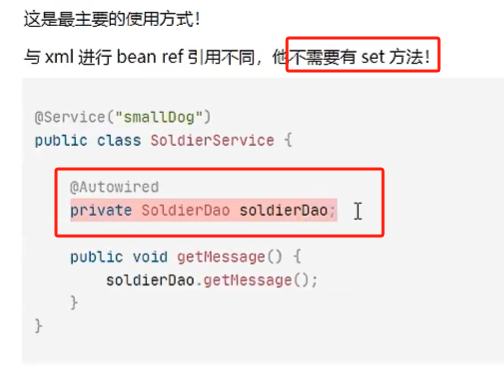

## 1.2 对构造方法进行注解

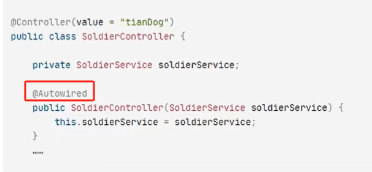

## 1.3 对 `Setter` 方法进行注解

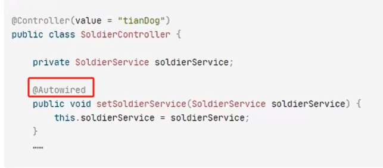

# 二、`@Autowired` 的工作流程

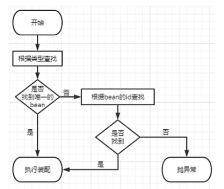

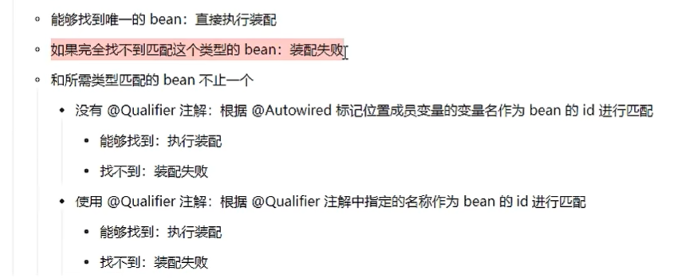

## 2.1 装配失败的一种解决方案

使用佛系装配进行解决：

在需要进行注入的字段上的 `@Autowired` 选择 `required = false`，这样即使找不到对应的组件进行注入，也不会报错。

但是**不推荐使用这样方式，因为如果后期引用到该字段，就会出现空指针异常。**

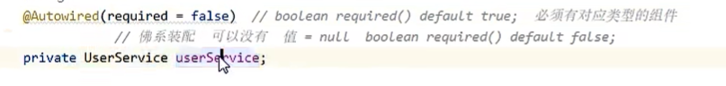

## 2.2 `@Qualifier` 的使用

场景：`@Autowired` 注解的字段是一个接口，在 `ioc` 容器中正好有多个实现该接口的 `bean`，导致选择哪一个 `bean` 来进行注入是不明确的。

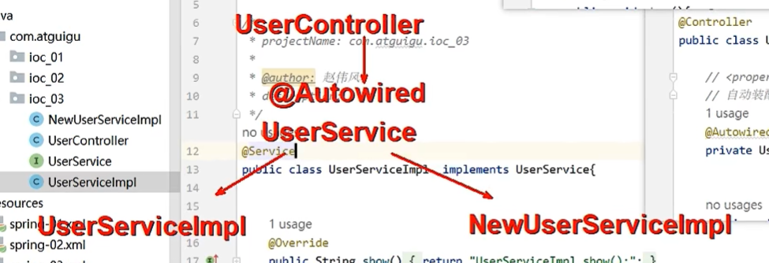

### 2.2.1 方法一

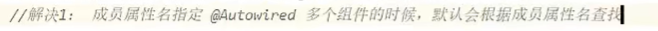

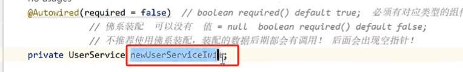

我们有两个实现 `UserService` 接口的类，但这里通过属性名 `newUserServiceImpl` 指定使用唯一的实现类 `NewUserServiceImpl`

### 2.2.2 方法二

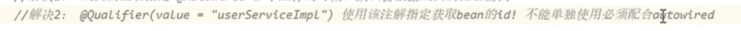

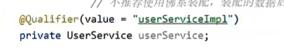

通过使用 `@Qualifier` 手动指定唯一类。

## 2.3 优化点

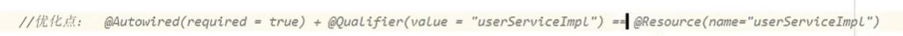

`@Resource` 一个注解同时发挥两个注解的作用。它是 `JSR-250` 中规定的一个注解，有 `Spring` 进行了实现。

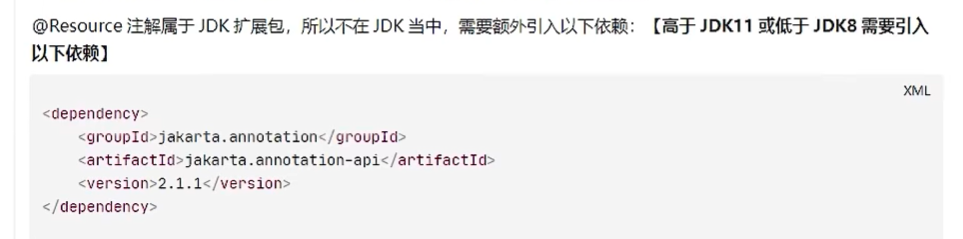

# 三、基本数据类型如何完成 `di` 注入

创建对象时，所需的基本数据类型基本上只有两种方式提供：

1. 声明时赋予初始值
2. 读取外部文件获取

下面介绍如何通过外部文件获取：

1. 外部文件（保存数据库信息）

2. `xml` 配置文件导入 ioc 容器

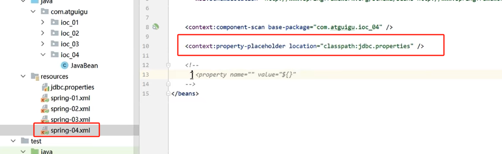

3. 通过 `@Value` 注解完成注入

`@Value` 注解设置默认值：

这里的`jdbc.username` 的默认值就被设置为 `admin`

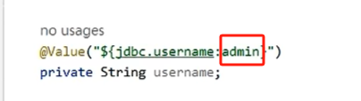

# 四、第三方类的 `ioc` 和 `di` 配置

项目中引入的包中的第三方类，默认情况下都是没有注解的，而且其所在的 `jar` 包都是只读的，也没有办法为其额外添加注解。

因此对于这些**第三方的类，依然只能通过 `xml` 文件中编写 `<bean  />` 的方式引入到 `ioc` 容器中。**

对于 `di` 来说，因为都在 `ioc` 容器中，因此不受限制。 