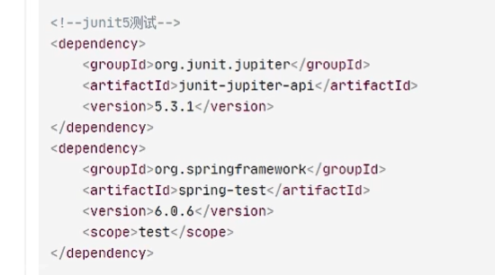
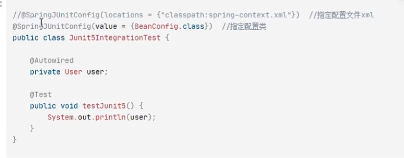

正常情况下，在测试程序中都需要手动 new 一个 `ioc` 容器，但如果使用 `Spring` 的整合测试环境，可以避免此创建环节，测试环境将自动为我们创建对应的 `ioc` 容器：

1. 导入相关依赖

2. 整合测试环境的注解使用

在测试类（拥有 @Test 方法的类）上添加注解。

通过**配置文件 xml** 和通过**配置类**创建的 `ioc` 容器的注解使用是不一样的，按照需要进行注解

添加 `@SpringJUnitConfig` 注解之后，在测试方法中可以自由使用相应的 `bean`，只需要将其作为类成员装载（ `@Autowired` ）到类中即可