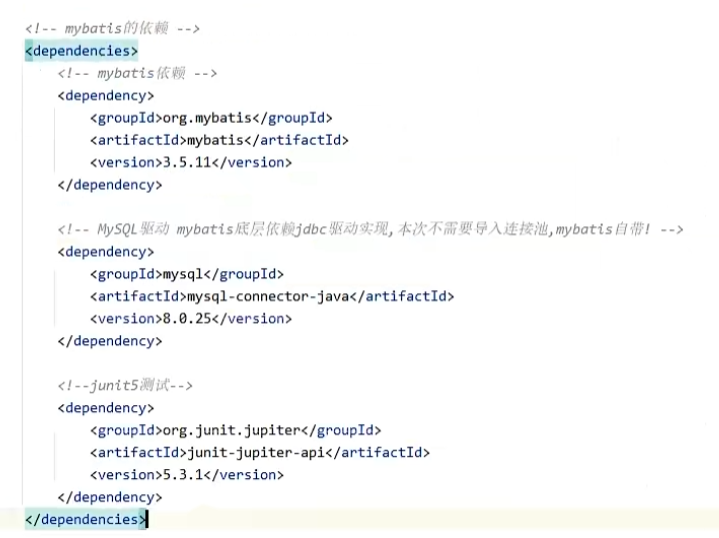
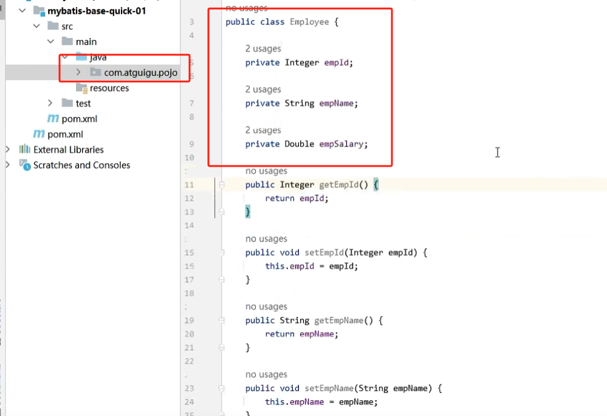
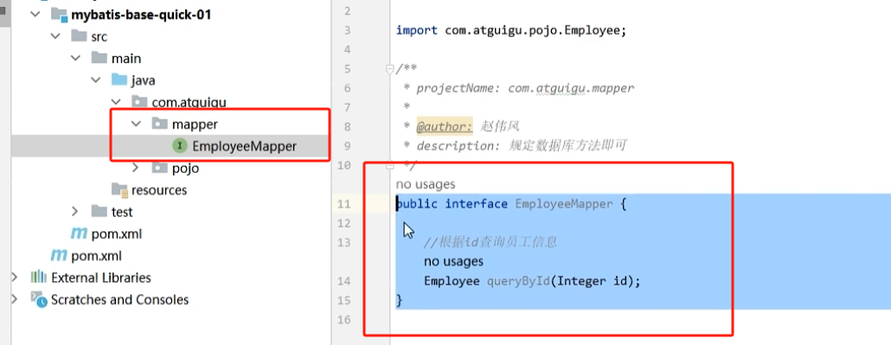
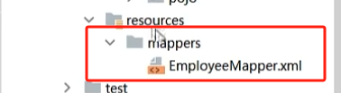
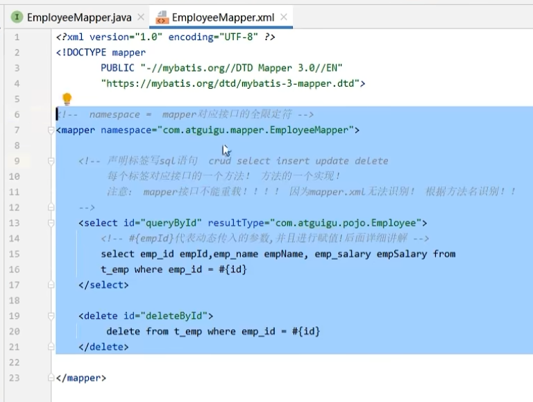
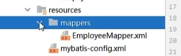
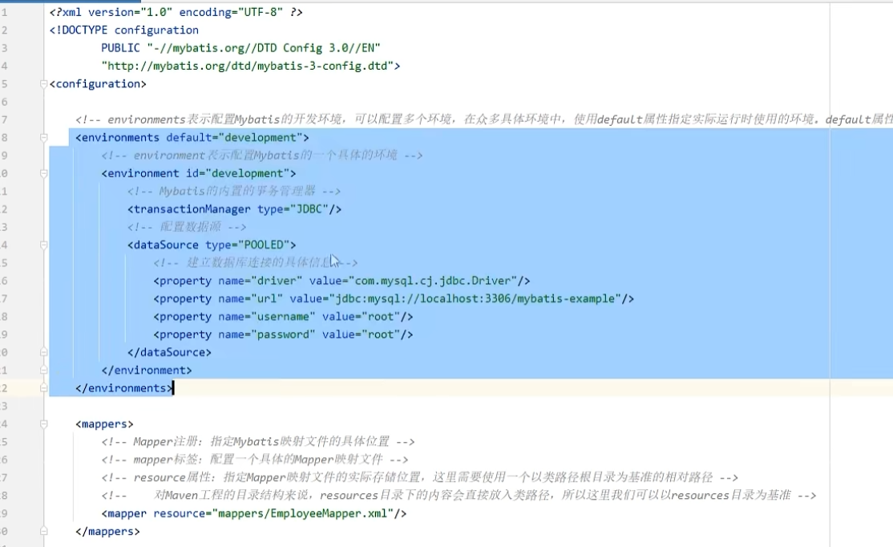
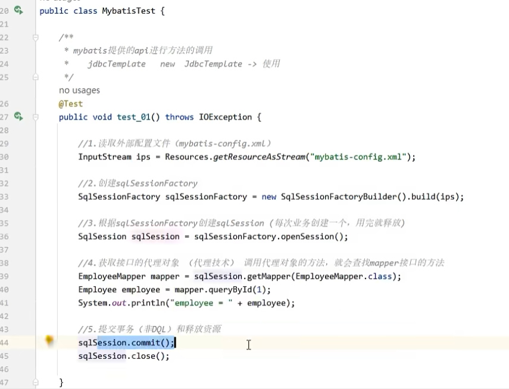

# 一、导入依赖

# 二、准备实体类

这个实体类对应 `mysql` 数据库中的一个表：

# 三、准备 `Mapper` 接口

`Mapper` 接口就是原来的 `DAO` 层接口，包括所有对于当前表的操作方法：

# 四、准备 `MapperXML` 文件

在该文件中，专注于写 `SQL` 语句，具体就是实现 `Mapper` 接口的各个方法

该文件是有具体的模板的：

# 五、准备数据库配置文件

如何连接到数据库的一些配置信息，习惯上命名为 `mybatis-config.xml` 

主要包含两部分：1. MySQL 数据库的信息   2. mapperXML 文件所在的位置

# 六、调用 `mybatis` 提供的 `API` 进行调用

