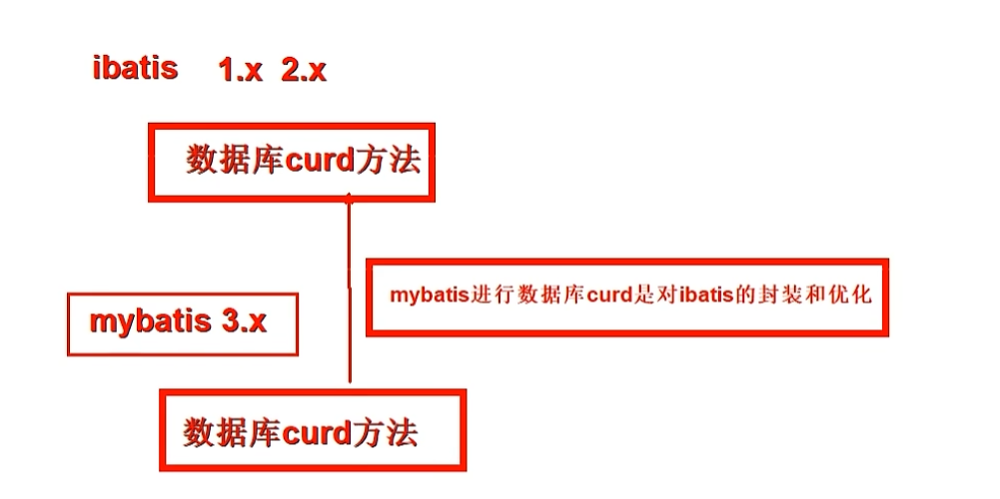
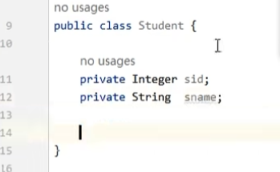
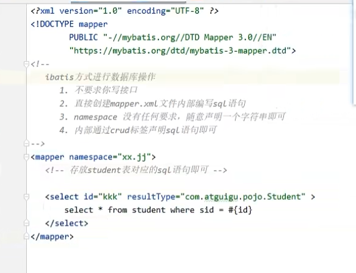
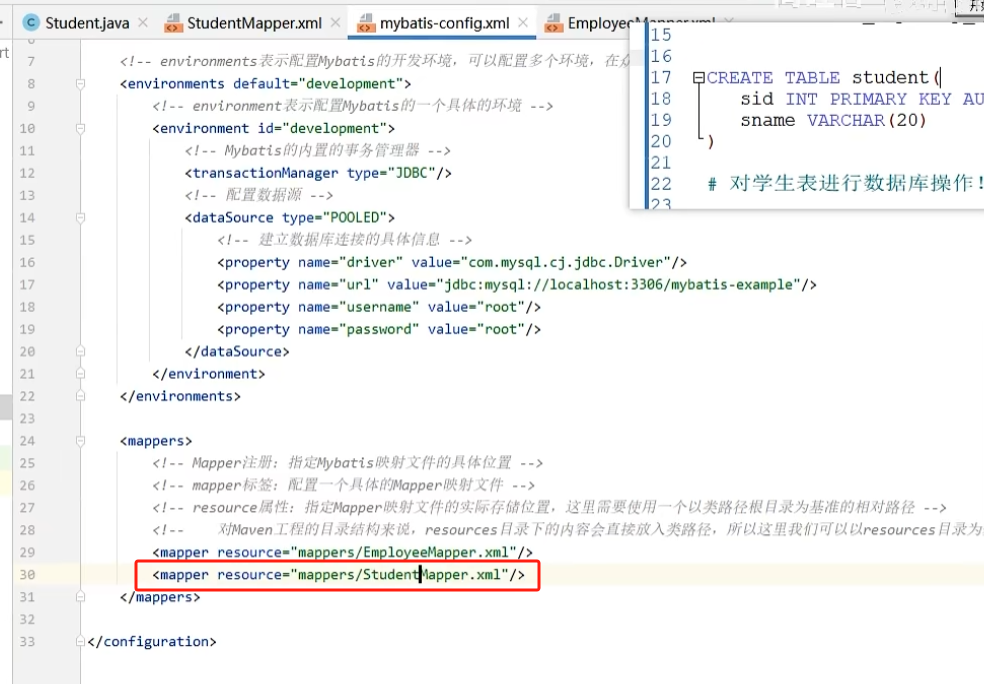
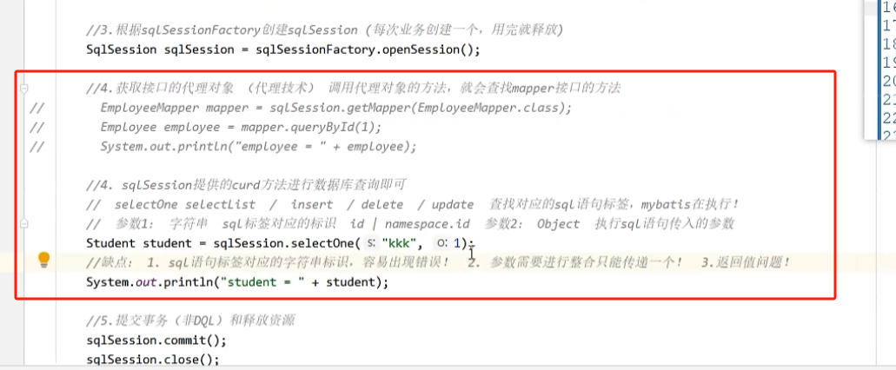

# 一、`ibatis` 介绍

`ibatis` 是 `mybatis` 的前身版本，`ibatis 3.x` 更名为 `mybatis`。

# 二、使用

## 2.1 创建实体类

## 2.2 准备 `Mapper.xml` 文件

`ibatis` 没有 `Mapper` 接口，只需要在 `Mapper.xml` 中实现自定义的 `sql` 语句即可。

因为没有`Mapper` 接口，因此 `xml` 文件中的 `namespace` 和 `sql` 对应的 `id` 都没有之前的意义，仅仅是用于表示不同而已。

## 2.3 准备 `ibatis-config.xml` 配置文件

## 2.4 调用 `ibatis` 的 `API`

唯一的不同在于第四步，也就是具体进行查询的时候，因为 `ibatis` 没有接口，因此直接是使用 `sqlSession` 的 `API` 进行查询：

缺点：

1. 第一个 `sql` 标签是字符串，容易拼写出错
2. 只能传入一个参数，如果有多个参数，需要进行整合
3. 返回值默认是 `Object` 类型，需要手动调整至所需的类型