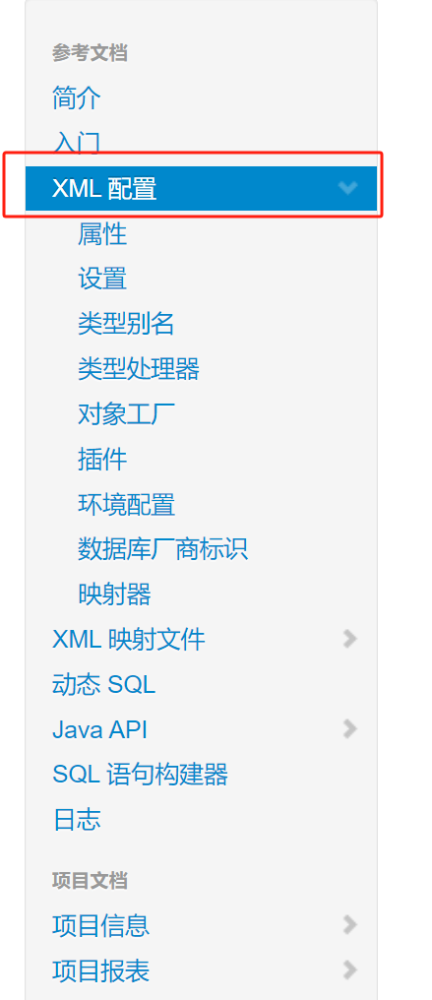
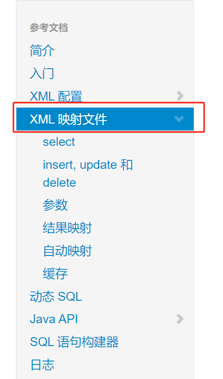

# 一、`Mybatis` 官方文档

https://mybatis.org/mybatis-3/zh_CN/index.html

# 二、`Mybatis-config.xml` 的具体配置项

此配置文件在官网文档中对应的是：



## 2.1 环境配置（environments）

MyBatis 可以配置成适应多种环境，这种机制有助于将 SQL 映射应用于多种数据库之中， 现实情况下有多种理由需要这么做。例如，开发、测试和生产环境需要有不同的配置；或者想在具有相同 Schema 的多个生产数据库中使用相同的 SQL 映射。还有许多类似的使用场景。

**不过要记住：尽管可以配置多个环境，但每个 SqlSessionFactory 实例只能选择一种环境。**

environments 元素定义了如何配置环境：

下面就有两个 `environment`，通过 `default` 标签来指定当前使用哪一个环境。

```xml
<environments default="development">
    
  <environment id="development">
    <transactionManager type="JDBC">
      <property name="..." value="..."/>
    </transactionManager>
    <dataSource type="POOLED">
      <property name="driver" value="${driver}"/>
      <property name="url" value="${url}"/>
      <property name="username" value="${username}"/>
      <property name="password" value="${password}"/>
    </dataSource>
  </environment>
    
    <environment id="test">
        <transactionManager type="JDBC">
            <property name="..." value="..."/>
        </transactionManager>
        <dataSource type="POOLED">
            <property name="driver" value="${driver}"/>
            <property name="url" value="${url}"/>
            <property name="username" value="${username}"/>
            <property name="password" value="${password}"/>
        </dataSource>
    </environment>
    
    
</environments>
```

### 2.1.1 **事务管理器（transactionManager）**

在 MyBatis 中有两种类型的事务管理器（也就是 type="[JDBC|MANAGED]"），通常都会使用 `JDBC` 事务管理器

- JDBC – 这个配置直接**使用了 JDBC 的提交和回滚功能**，它依赖从数据源获得的连接来管理事务作用域。默认情况下，为了与某些驱动程序兼容，它在关闭连接时启用自动提交。然而，**对于某些驱动程序来说，启用自动提交不仅是不必要的**，而且是一个代价高昂的操作。因此，从 3.5.10 版本开始，你**可以通过将 "skipSetAutoCommitOnClose" 属性设置为 "true" 来跳过这个步骤**。例如：

  ```xml
  <transactionManager type="JDBC">
    <property name="skipSetAutoCommitOnClose" value="true"/>
  </transactionManager>
  ```

- MANAGED – 这个配置几乎没做什么。它**从不提交或回滚一个连接**，而是让容器来管理事务的整个生命周期（比如 JEE 应用服务器的上下文）。 **默认情况下它会关闭连接**。然而一些容器并不希望连接被关闭，因此需要**将 closeConnection 属性设置为 false 来阻止默认的关闭行为**。例如:

  ```xml
  <transactionManager type="MANAGED">
    <property name="closeConnection" value="false"/>
  </transactionManager>
  ```

### 2.1.2 **数据源（dataSource）**

dataSource 元素使用标准的 JDBC 数据源接口来配置 JDBC 连接对象的资源。

- 大多数 MyBatis 应用程序会按示例中的例子来配置数据源。虽然数据源配置是可选的，但如果要启用延迟加载特性，就必须配置数据源。

有三种内建的数据源类型（也就是 type="[UNPOOLED|POOLED|JNDI]"）：

主要使用的就是前两者：

**UNPOOLED**– 这个数据源的实现会**每次请求时打开和关闭连接**。虽然有点慢，但对那些数据库连接可用性要求不高的简单应用程序来说，是一个很好的选择。 性能表现则依赖于使用的数据库，对某些数据库来说，使用连接池并不重要，这个配置就很适合这种情形。UNPOOLED 类型的数据源**仅仅需要配置以下 5 种属性**：

- `driver` – 这是 JDBC 驱动的 Java 类全限定名（并不是 JDBC 驱动中可能包含的数据源类）。
- `url` – 这是数据库的 JDBC URL 地址。
- `username` – 登录数据库的用户名。
- `password` – 登录数据库的密码。
- `defaultTransactionIsolationLevel` – 默认的连接事务隔离级别。
- `defaultNetworkTimeout` – 等待数据库操作完成的默认网络超时时间（单位：毫秒）。查看 `java.sql.Connection#setNetworkTimeout()` 的 API 文档以获取更多信息。

作为可选项，你也可以传递属性给数据库驱动。只需在属性名加上“driver.”前缀即可，例如：

- `driver.encoding=UTF8`

这将通过 DriverManager.getConnection(url, driverProperties) 方法传递值为 `UTF8` 的 `encoding` 属性给数据库驱动。

**POOLED**– 这种数据源的实现**利用“池”的概念将 JDBC 连接对象组织起来（使用连接池）**，避免了创建新的连接实例时所必需的初始化和认证时间。 这种处理方式很流行，能使并发 Web 应用快速响应请求。

**除了上述提到 UNPOOLED 下的属性**外，**还有更多属性**用来配置 POOLED 的数据源：

- `poolMaximumActiveConnections` – 在任意时间可存在的活动（正在使用）连接数量，默认值：10
- `poolMaximumIdleConnections` – 任意时间可能存在的空闲连接数。
- `poolMaximumCheckoutTime` – 在被强制返回之前，池中连接被检出（checked out）时间，默认值：20000 毫秒（即 20 秒）
- `poolTimeToWait` – 这是一个底层设置，如果获取连接花费了相当长的时间，连接池会打印状态日志并重新尝试获取一个连接（避免在误配置的情况下一直失败且不打印日志），默认值：20000 毫秒（即 20 秒）。
- `poolMaximumLocalBadConnectionTolerance` – 这是一个关于坏连接容忍度的底层设置， 作用于每一个尝试从缓存池获取连接的线程。 如果这个线程获取到的是一个坏的连接，那么这个数据源允许这个线程尝试重新获取一个新的连接，但是这个重新尝试的次数不应该超过 `poolMaximumIdleConnections` 与 `poolMaximumLocalBadConnectionTolerance` 之和。 默认值：3（新增于 3.4.5）
- `poolPingQuery` – 发送到数据库的侦测查询，用来检验连接是否正常工作并准备接受请求。默认是“NO PING QUERY SET”，这会导致多数数据库驱动出错时返回恰当的错误消息。
- `poolPingEnabled` – 是否启用侦测查询。若开启，需要设置 `poolPingQuery` 属性为一个可执行的 SQL 语句（最好是一个速度非常快的 SQL 语句），默认值：false。
- `poolPingConnectionsNotUsedFor` – 配置 poolPingQuery 的频率。可以被设置为和数据库连接超时时间一样，来避免不必要的侦测，默认值：0（即所有连接每一时刻都被侦测 — 当然仅当 poolPingEnabled 为 true 时适用）。

## 2.2 映射器（mappers）

用于指定实现 `Mapper` 接口的 `SQL` 映射语句所在的 `xml` 文件的位置：

既然 MyBatis 的行为已经由上述元素配置完了，我们现在就要来定义 SQL 映射语句了。 但首先，我们需要告诉 MyBatis 到哪里去找到这些语句。 在自动查找资源方面，Java 并没有提供一个很好的解决方案，所以最好的办法是直接告诉 MyBatis 到哪里去找映射文件。 你可以使用相对于类路径的资源引用，或完全限定资源定位符（包括 `file:///` 形式的 URL），或类名和包名等。例如：

```xml
<!-- 使用相对于类路径的资源引用 -->
<mappers>
  <mapper resource="org/mybatis/builder/AuthorMapper.xml"/>
  <mapper resource="org/mybatis/builder/BlogMapper.xml"/>
  <mapper resource="org/mybatis/builder/PostMapper.xml"/>
</mappers>
<!-- 使用完全限定资源定位符（URL） -->
<mappers>
  <mapper url="file:///var/mappers/AuthorMapper.xml"/>
  <mapper url="file:///var/mappers/BlogMapper.xml"/>
  <mapper url="file:///var/mappers/PostMapper.xml"/>
</mappers>
<!-- 使用映射器接口实现类的完全限定类名 -->
<mappers>
  <mapper class="org.mybatis.builder.AuthorMapper"/>
  <mapper class="org.mybatis.builder.BlogMapper"/>
  <mapper class="org.mybatis.builder.PostMapper"/>
</mappers>
<!-- 将包内的映射器接口全部注册为映射器 -->
<mappers>
  <package name="org.mybatis.builder"/>
</mappers>
```

# 三、`MapperXML` 文件的具体配置

此文件内包含了所有具体的 `SQL` 语句，对应的说明位于：

