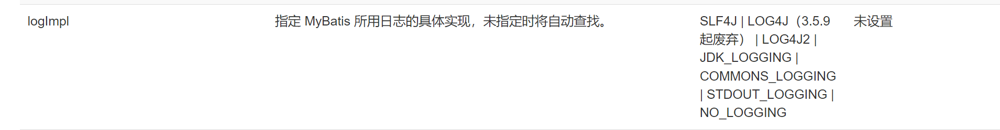
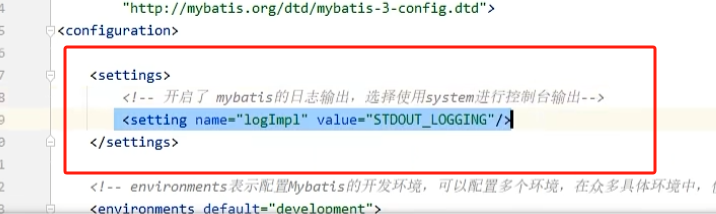
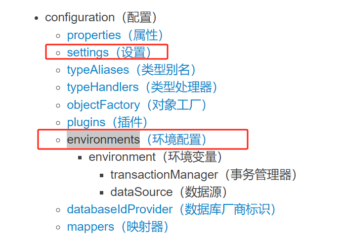
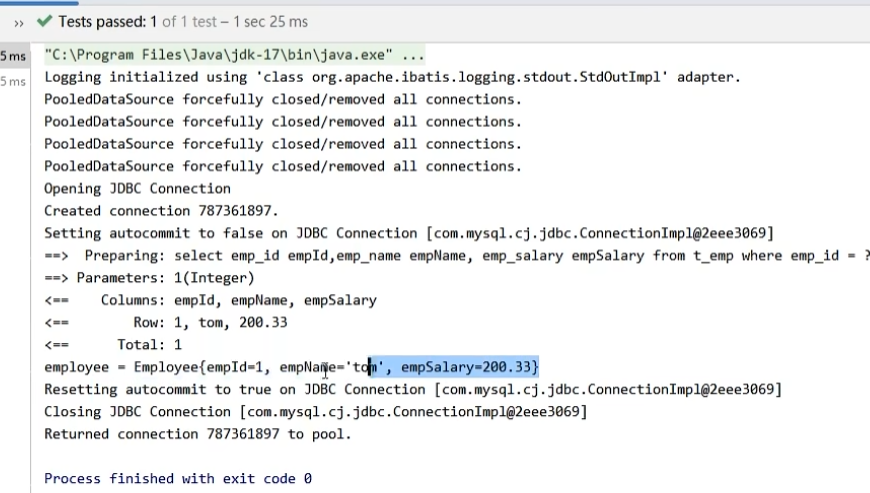
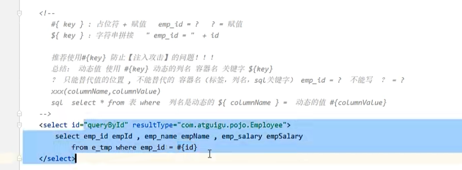

# 一、`mybatis` 日志输出配置

日志的配置，在 `mybatis-config.xml` 文件中进行设置，具体的是在 `settings` 配置项中设置以下标签：

> 注意：在 `configuration` 中的配置项都需要按照官方文档中的顺序进行排序，也就是说 `settings` 需要再 `environments` 的前面

开启日志功能后，就会输出运行：

# 二、如何向 `mapperXML` 文件的 `SQL` 语句传参

两种方式：1. 使用 #{ key} （占位符方式）   2. 使用 ${ key } （字符串拼接方式）

如果在 where 条件中：

1. 列名固定，值不固定，使用 #{}
2. 列名不固定，值也不固定，使用 ${}