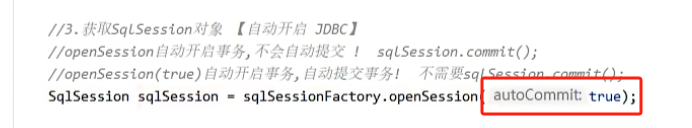

# 一、数据输入

本部分介绍传入的参数 #{ key} 和 ${ key} 中的 key的具体传入：

## 1.1 key 是简单数据类型


通常在 `MySQL` 中要求列名定义为蛇形 `emp_id` ，而在 `java` 中要求字段名为驼峰式 `empId`，为了防止名称不一致导致的匹配错误， `Mybatis` 提供了自动转换的机制，只需要在 `mybatis-config.xml` 的  `settings` 中配置以下选项为 true 即可。


## 1.2 key 是复杂数据类型


### 1.2.1 传入单个实体对象


此时通过 #{ key } 获取参数的时候，必须对应**实体对象的字段名**

### 1.2.2 传入多个简单类型


1. 方式一：通过 @Param() 注解


2. 方式二：通过 `mybatis` 默认机制


### 1.2.3 传入 `Map` 类型


${ key } 中的 key == map 中的 key 即可。

# 二、数据输出


## 2.1 返回单个简单类型


### 2.1.1 `mybatis` 提供的类型别名


### 2.1.2 为自定义的类定义别名

在 `mybatis-config.xml` 中添加 `<typeAliases>` 标签。

类型别名可为 Java 类型设置一个缩写名字。 它仅用于 XML 配置，意在降低冗余的全限定类名书写。例如：

```xml
<typeAliases>
  <typeAlias alias="Author" type="domain.blog.Author"/>
  <typeAlias alias="Blog" type="domain.blog.Blog"/>
  <typeAlias alias="Comment" type="domain.blog.Comment"/>
  <typeAlias alias="Post" type="domain.blog.Post"/>
  <typeAlias alias="Section" type="domain.blog.Section"/>
  <typeAlias alias="Tag" type="domain.blog.Tag"/>
</typeAliases>
```

当这样配置时，`Blog` 可以用在任何使用 `domain.blog.Blog` 的地方。

也可以指定一个包名，MyBatis 会在包名下面搜索需要的 Java Bean，比如：

```xml
<typeAliases>
  <package name="domain.blog"/>
</typeAliases>
```

每一个在包 `domain.blog` 中的 Java Bean，在**没有注解的情况**下，会**使用 Bean 的首字母小写的非限定类名**来作为它的别名。 比如 `domain.blog.Author` 的别名为 `author`；**若有注解，则别名为其注解值**。见下面的例子：

```java
@Alias("author")
public class Author {
    ...
}
```

## 2.2 返回单个实体类型

1. 使用实体的全限定符
2. 使用 `<typeAliases>` 进行类型别名设置

## 2.3 返回 `Map`


如上所示，`resultType` 设置为 `map` 即可，map 中：列名为 key；对应的值即为 value

## 2.4 返回集合类型


# 三、自动提交事务

对于 insert，delete 等 DML 语句，结束之前必须通过 `commit()` 提交事务，否则 DML 操作不会生效。

或者使用自动提交机制：



# 四、自增长主键回显


# 五、非自增长类型主键维护

如果数据的主键是 UUID 这种非自增长的主键，如果在 JAVA 程序中进行维护是比较麻烦的，`Mybatis` 提供了一种机制（**`selectKey` 标签**）在插入之间先生成一个 UUID 提供给插入语句使用：


- `order = before` 表示 `selectKey` 这个标签下的语句在 Insert 前执行
- `resultType = "string"` 表示返回值的类型，也就是 `SELECT` 语句对应返回的 UUID
- `keyProperty="tId"` 用来指示返回值传递给 Insert 语句的哪个属性

# 六、`MySQL` 列名与类字段名不一致的解决方案

## 6.1 为列名起别名


## 6.2 开启驼峰式映射

该方案仅在 `蛇形-- 驼峰式` 时生效。


## 6.3 使用 `resultMap` 自定义映射关系


