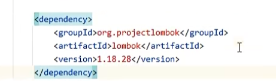
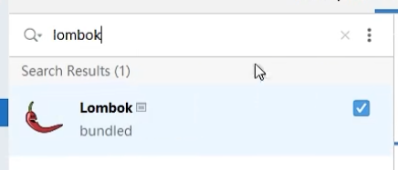
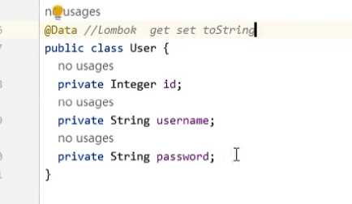
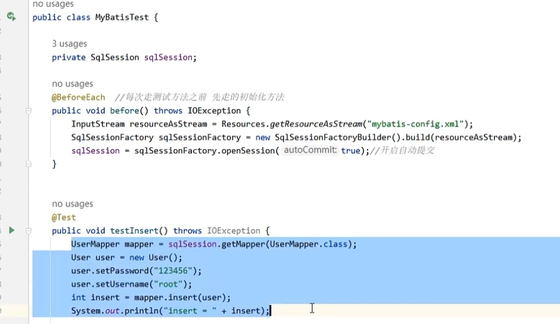
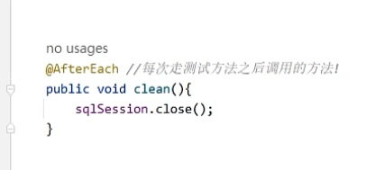

# 一、辅助实现类方法

插件 `Lombok` 可以帮助我们：为自定义的类，实现对应的 Setter 和 Getter 以及 toString 方法

对应的依赖：

对应的插件：

如下，在对应的类上添加 `@Data` 标签即可：

# 二、辅助测试

在测试类中，可以使用 `@BeforeEach` 和 `@AfterEach` 这两个标签来实现在每个测试方法之前和之后都执行的两个 Hook 方法：

如上，为了避免每次测试都需要重新创建 `sqlSession` ，我们可以在 `@BeforeEach` 中实现对 `sqlSession` 的创建，就不需要在测试方法中执行冗长的这部分代码了

同理，可以再 `@AfterEach` 中进行 `sqlSession.close()`：

