# 一、多表查询需要额外做的三件事情

多表查询操作流程和单表查询一样：

1. 设计实体类
2. 设计 Mapper 接口
3. 编写 MapperXML 文件，实现 SQL 语句
4. 编写 Mybatis-config.xml 文件
5. 在测试方法中调用 mybatis 的 API

但是也有一些注意事项：

1. 在 MapperXML 文件中，需要设计多表查询 SQL 语句
2. 设计实体类的时候，通常需要一个多层嵌套的类来承接查询结果
3. 必须使用 ResultMap 来完成多表结果映射

# 二、多表关系实体类设计

多表关系如下：

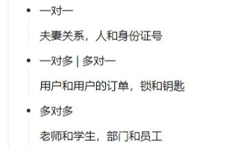

在进行实体类设计的时候，我们应该根据需要的数据进行**单向考虑**：

比如以，用户和订单 这个进行举例：

一个用户会对应多个订单（对多），而一个订单只会对应一个用户（对一）

如果我们需要查询：

1. 查询每个用户和该用户对应的所有订单集合，那么我们的实体类应该设计如下：

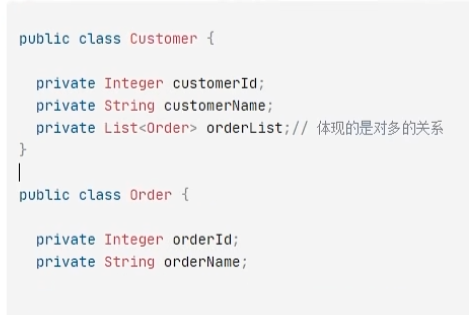

2. 查询每个订单和该订单对应的用户，那么实体类设计应该如下：

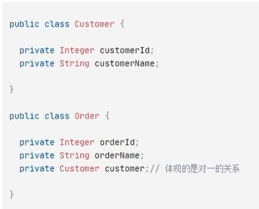

总结：

特别注意：两两关联的实体类之间，**不能同时体现**对对方的关系，否则会出现**循环套用**的情况，如下：

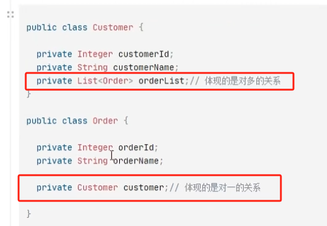

# 三、对一查询实现

现在我们要查询：每个订单和其对应的客户

## 3.1 实体类设计

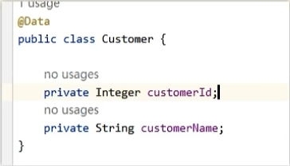

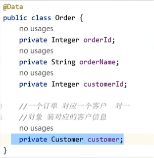

## 3.2 实现多表查询 SQL 语句

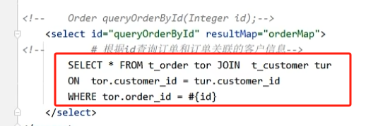

## 3.3 使用 ResultMap 完成多表结果映射

先写 `order` 对象的第一层属性的映射，然后在对第二层的 `customer` 对象的属性进行映射（使用 `<association>` 标签）

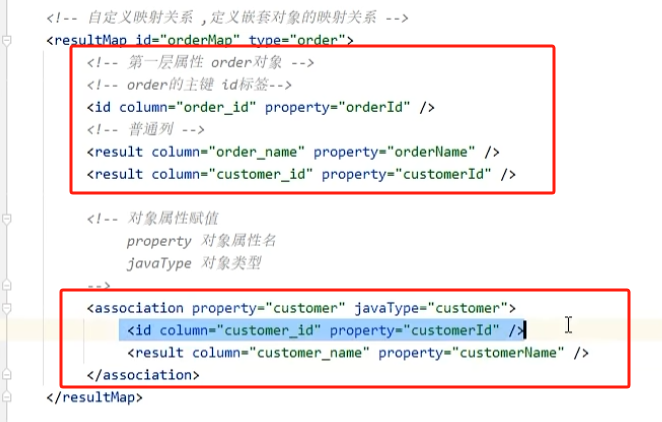

# 四、对多查询实现

现在我们查询：所有用户以及用户对应的所有订单信息

## 4.1 实体类设计

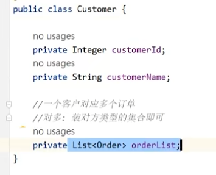

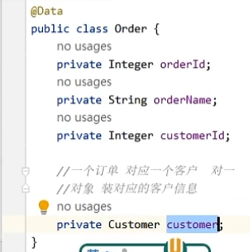

## 4.2 实现多表查询 SQL 

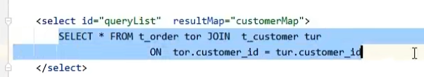

## 4.3 使用 ResultMap 完成多表结果映射

也是分成多层次，第一层就是 customer 的字段，第二层就是 order 集合

对于嵌套类型是集合的，使用标签 `<collection>`，内部是集合泛型类型的字段。

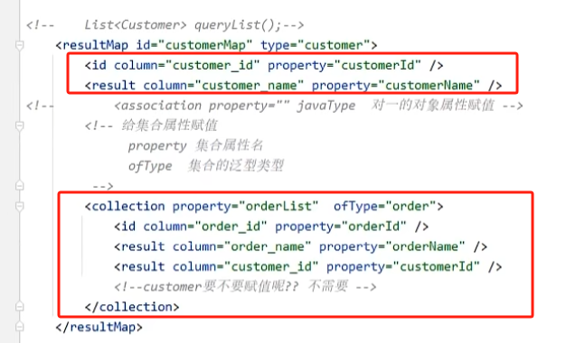

注意：**`order` 类的 `customer` 字段可以存在，但一定不能在 `<collection>` 标签内进行映射。**

# 五、多表映射优化

在存在多表关系的时候，在 `resultMap` 中我们需要在第二层自行完成嵌套关系的映射，但我们可以通过设置以下属性，使得 `mybatis` 自动帮助我们完成映射：

在 `<settings>` 中，增加下述属性，设置为 FULL

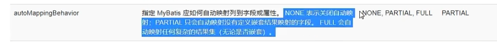

同时需要打开驼峰式映射：

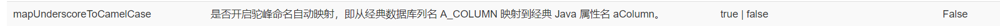

如下，开启后将不需要手动进行 `result` 的映射（但是对于主键的手动映射还是需要的）：

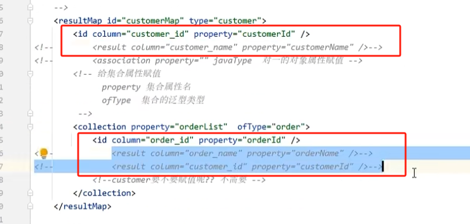