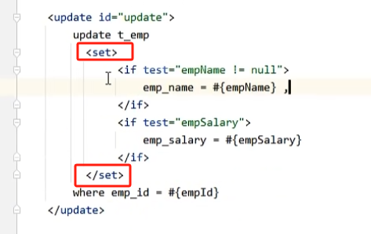

# 一、动态语句的需求和简介

> 简单来说，动态语句就是动态的为 SQL 增加 where 后的查询条件。

# 二、if 和where 标签

查询的 Mapper 接口：

针对上面这个接口，我们想要实现一种动态 SQL 语句，即：**如果传入属性就对该属性进行判断，如果不传入就不加此判断条件。**

为了实现这个效果，我们可以使用 `<if> ` 标签：

引入 `<if>` 标签的动态 SQL 语句如下：

在 `<test> ` 标签后面添加判断条件，如果输入的属性满足此条件，`<if>` 块内的语句才会被追加到 SQL 语句后。

但如果只使用 `<if>` 条件块，会出现以下问题：

`where and xxx` 和 `where` 都是不符合 SQL 语法的，我们还需要使用 `<where>` 标签：

# 三、set 标签

`set` 标签用于进行更新的动态 SQL 语句：

`<set>` 标签的作用：

1. 自动去掉多余的 `,`
2. 自动添加 `set` 关键字

# 四、`trim` 标签

1. `<trim>` 实现 `where` 作用

`<prefix="where">`：如果有一个 `<if>` 满足，则添加 `where` 前缀

`<perfixOverrides="and|or">`：去掉多余的 `and|or` 前缀

2. `<trim>` 实现 `set` 作用

# 五、`choose/when/otherwise` 标签

## 5.1 批量查询/删除

## 5.2 批量插入

## 5.3 批量更新

批量更新实际上就是让**一个标签内部执行多次 SQL 语句**，为了实现这样的效果，我们还需要再 JDBC 数据库连接的 url 后面添加允许批量请求的选项：

# 六、`SQL` 标签

