# 一、`mapper` 按批量扫描

之前在 `mybatis-config.xml` 文件中， 我们是依次导入所有的 `mapper.xml` 文件，可以通过批量的方式，一次性导入某个包下的所有 `mapper.xml` 文件。

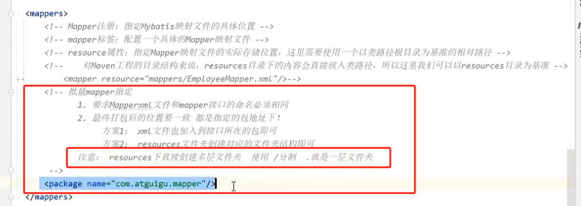

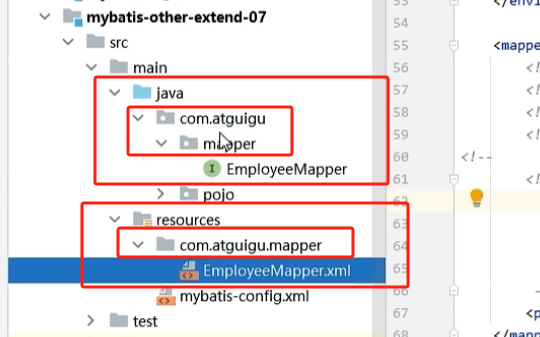

注意：`mapper` 接口的 `java` 文件必须和 `mapper.xml` 文件必须在同一包下。

# 二、分页插件的使用

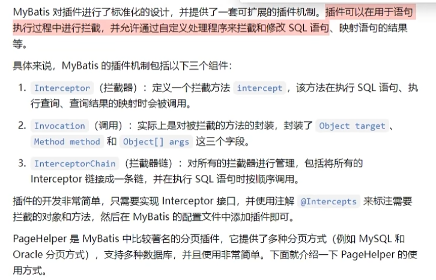

## 2.1 导入依赖

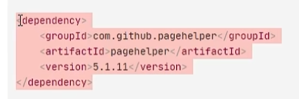

## 2.2 `mybatis-config.xml` 中配置分页插件

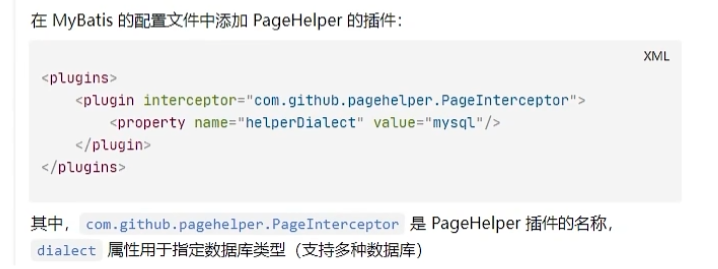

## 2.3 编写 SQL

注意：在 SQL 语句中不要使用 ；进行结尾，因为分页插件会在我们的 SQL 语句之后追加 limit 语句。

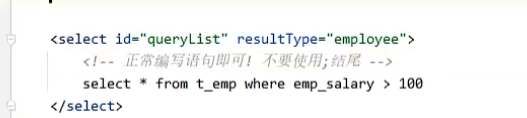

## 2.4 使用分页插件

如下所示，在**每次进行查询**之前，使用 `PageHelper.startPage()` 来指定：查询哪一页？每页的大小？

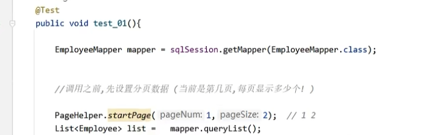

分页插件还提供了另一种功能：可以返回当前查询到信息的一些元数据：

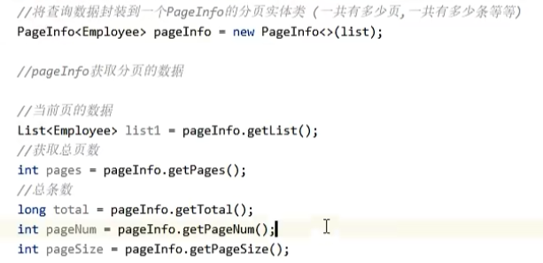

# 三、`ORM` 与 逆向工程

`mybatis` 是一个半 `ORM` 框架，还需要用户手动完成 `SQL` 语句的编写。

可以通过使用逆向工程插件 `MyBatisX` 帮助我们跳过手动编写 `SQL` 语句的过程，我们只需要使用 Java 程序即可完成对数据库的修改，实现全 `ORM` 框架。

> `MyBatisX` 只能用于单表，如果是多表还需要手动编写 `mapper.xml`

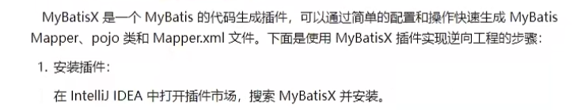\

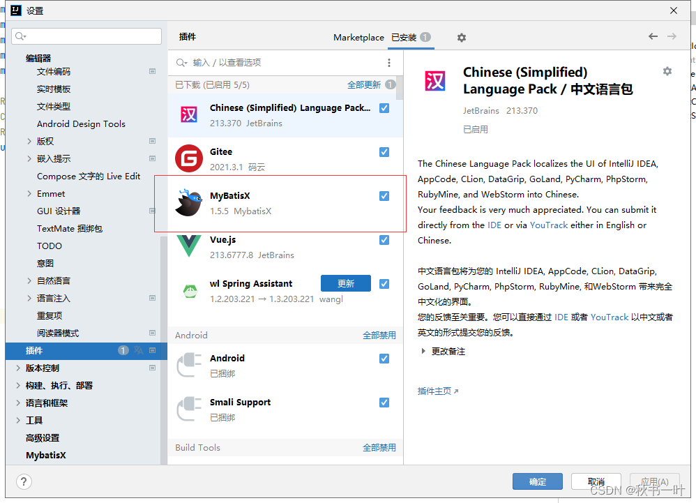

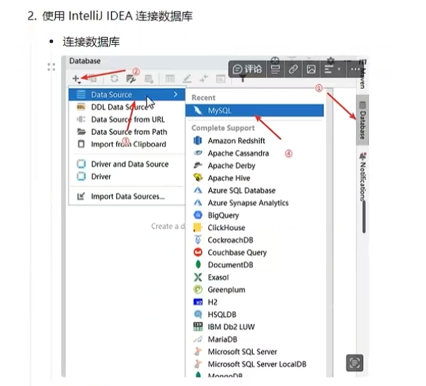

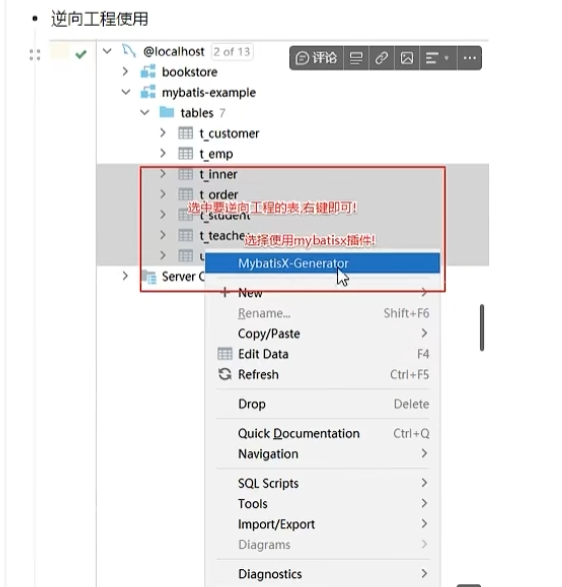

点击后进入实体类生成，其中部分参数说明：

- module path：模块路径，此处填写项目所在路径，生成的代码会在相应位置。

- basepackage：填写项目的包
- encoding：编码，使用UTF-8即可
- base path：代码所在路径
- **relative package：决定实体类会被生成在哪里，默认生成在domain包中，可以修改为其他包但不要为空。**
- extra class suffix：生成的实体类后面会加上里面的内容。举例：图中如果这里写入Test，最后生成实体类会叫FilesTest
- ignore table prefix：生成实体类相应字段中忽略指定的前缀
- ignore table suffix：生成实体类相应字段中忽略指定的后缀

点击下一步后进入mapper及service的生成，其中部分参数说明：

- annotation：生成的代码中是否加上注解（例如，@TableName等注解）。None为没有注解，其他为字面意思。

- options各选项经过尝试后，作用大致如下
- toString/hashCode/equals：是否生成相应的方法。
- **Lombok：勾选后实体类自动添加Lombok的@Data注解。**
- Actual Column：勾选后，生成的实体类属性名和表中字段名大小写会保持一致。例如，表中有字段classID，勾选该选项后生成的属性名也为classID，未勾选则为classid。
- Actual Column Annotation：是否对所有属性名都加上注解标明对应字段，例如@TableName。
- JSR310:Data API：是否使用新标准的时间日期API，包括 Instant、Clock、LocalDateTime、DateTimeFormatter、ZonedDateTime 以及替换 Calendar 的 Chronology 等类。
- template：生成mapper、service等相关代码所使用的模板。

如果没有使用MybatisPlus，可以选择default-empty模板。或自定义其他模板。

默认情况下，可以按照下述方式填写：

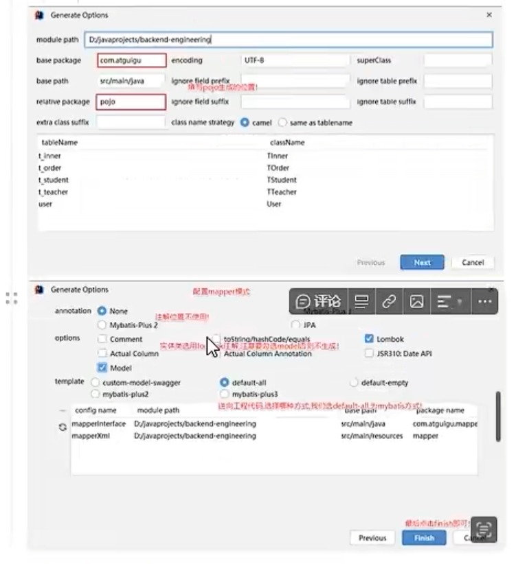

成功逆向后，可以获得一个 `src` 文件夹：

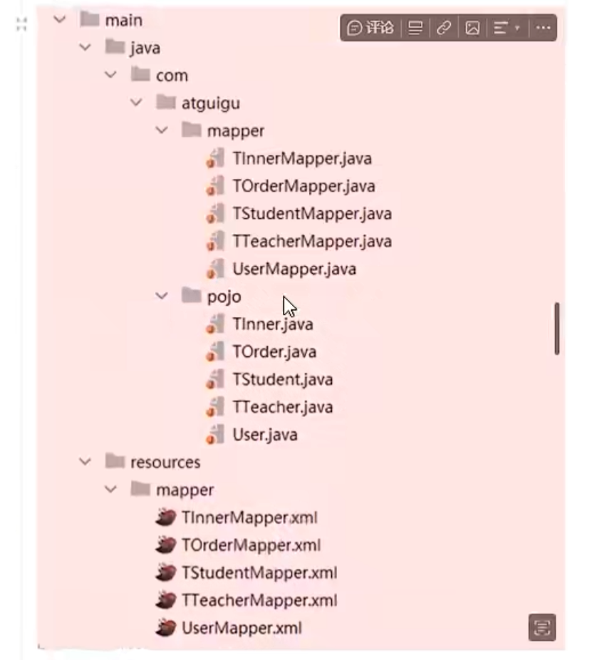
