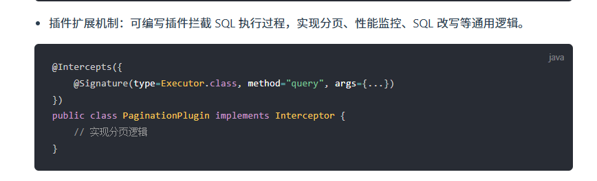

## 与传统的JDBC相比，MyBatis的优点？


## MyBatis觉得在哪方面做的比较好？

MyBatis 在 SQL 灵活性、动态 SQL 支持、结果集映射和与 Spring 整合方面表现卓越，尤其适合重视 SQL 可控性的项目。





## 还记得JDBC连接数据库的步骤吗？


以下是一个简单的示例代码：

```java
import java.sql.*;

public class Main {
    public static void main(String[] args) {
        try {
            // 加载数据库驱动程序
            Class.forName("com.mysql.cj.jdbc.Driver");

            // 建立数据库连接
            Connection connection = DriverManager.getConnection("jdbc:mysql://localhost:3306/mydatabase", "username", "password");

            // 创建 Statement 对象
            Statement statement = connection.createStatement();

            // 执行 SQL 查询
            ResultSet resultSet = statement.executeQuery("SELECT * FROM mytable");

            // 处理查询结果
            while (resultSet.next()) {
              // 处理每一行数据
            }

            // 关闭资源
            resultSet.close();
            statement.close();
            connection.close();
        } catch (ClassNotFoundException e) {
            e.printStackTrace();
        } catch (SQLException e) {
            e.printStackTrace();
        }
    }
}
```

## MybatisPlus和Mybatis的区别？


## MyBatis运用了哪些常见的设计模式？

