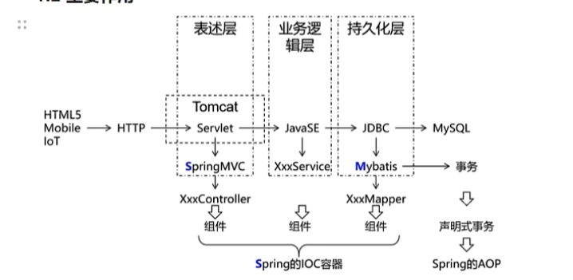
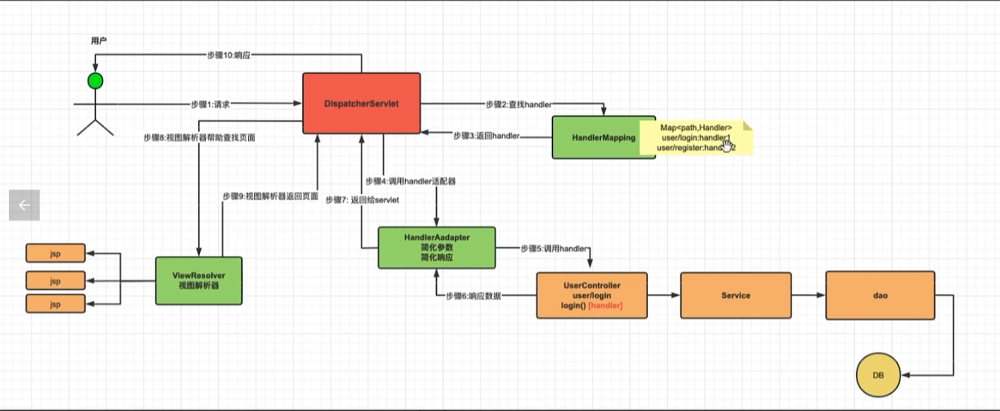
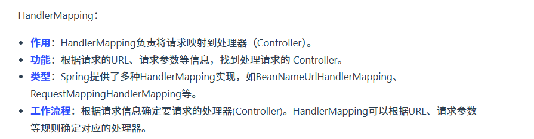
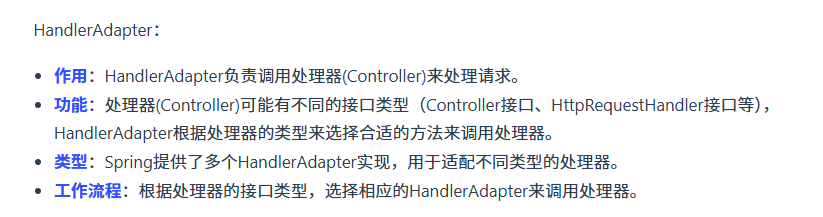
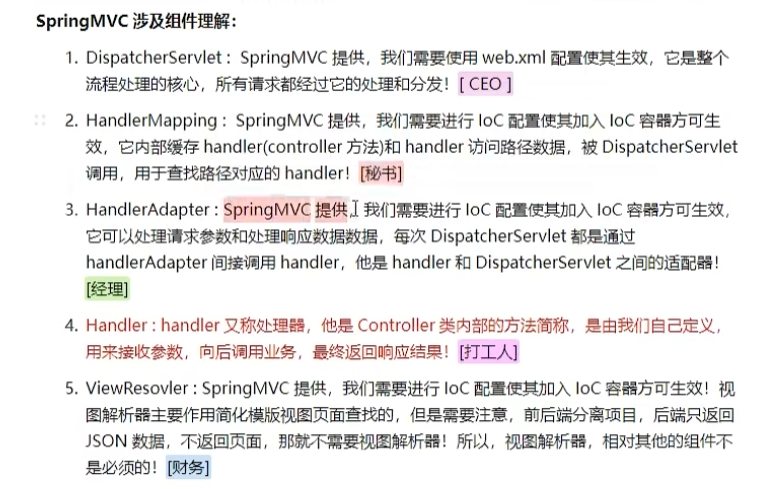

# 一、MVC与Spring-MVC介绍

MVC（Model-View-Controller，模型-视图-控制器）是一种软件设计模式，广泛应用于开发用户界面。它通过将应用程序分割为三个核心组件来分离关注点，这三个组件分别是：

- **Model（模型）**：代表一个存取数据的对象或 JAVA POJO（Plain Old Java Object，简单java对象）。它也可以带有逻辑，主要用于承载数据，并对用户提交请求进行计算的模块。模型分为两类，一类称为数据承载 Bean，一类称为业务处理Bean。所谓数据承载 Bean 是指实体类（如：User类），专门为用户承载业务数据的；而业务处理 Bean 则是指Service 或 Dao 对象， 专门用于处理用户提交请求的。
- **View（视图）**：负责显示数据，即用户界面部分。它从模型中获取数据显示给用户，并向用户发送信息。
- **Controller（控制器）**：用于将用户请求转发给相应的 Model 进行处理，并根据 Model 的计算结果向用户提供相应响应。它使视图与模型分离。

流程步骤：

1. 用户通过View 页面向服务端提出请求，可以是表单请求、超链接请求、AJAX 请求等；
2. 服务端 Controller 控制器接收到请求后对请求进行解析，找到相应的Model，对用户请求进行处理Model 处理； 
3. 将处理结果再交给 Controller（控制器其实只是起到了承上启下的作用）；
4. 根据处理结果找到要作为向客户端发回的响应View 页面，页面经渲染后发送给客户端。

Spring MVC是Spring框架的一个模块，它实现了MVC架构模式，专门用于构建Web应用程序。Spring MVC利用了MVC设计模式的优势，提供了更清晰的分层结构，有助于提高代码的可维护性和可扩展性。以下是Spring MVC如何体现MVC模式的几个关键点：

- **DispatcherServlet（前端控制器）**：作为Spring MVC的核心组件，它类似于MVC中的控制器角色，但它的职责更广泛，包括接收所有的HTTP请求，然后根据配置将这些请求分配给相应的处理器（Handler）。
  
- **Controller（控制器）**：在Spring MVC中，开发者定义的控制器类主要负责处理具体的业务逻辑，包括准备模型数据以及选择要呈现的视图名称。不同于传统的MVC模式，这里的控制器更加专注于业务逻辑处理。

- **Model（模型）**：包含需要展示给用户的数据信息。在Spring MVC中，控制器负责填充模型数据，然后将其传递给视图进行渲染。

- **View（视图）**：在Spring MVC中，视图是由模板引擎（如JSP、Thymeleaf等）生成的HTML页面，用来展示模型数据给用户。视图解析器（View Resolver）帮助找到正确的视图进行渲染。

# 二、主要作用

spring-mvc 的主要作用总结如下：

# 三、`spring-mvc` 的内部流程与核心组件

内部流程如下，spring-mvc 位于用户和 controller 层之间，简化用户调用 controller 层以及从 controller 层返回的过程

Spring MVC的工作流程如下： 

1. 用户发送请求至前端控制器DispatcherServlet 
2. DispatcherServlet收到请求调用处理器映射器HandlerMapping。
3. 处理器映射器根据请求url找到具体的处理器，生成处理器执行链HandlerExecutionChain(包括处理器对象和处理器拦截器)一并返回给DispatcherServlet。
4. DispatcherServlet根据处理器Handler获取处理器适配器HandlerAdapter执行HandlerAdapter处理一系列的操作，如：参数封装，数据格式转换，数据验证等操作 
5. 执行处理器Handler(Controller，也叫页面控制器)。 
6. Handler执行完成返回ModelAndView 
7. HandlerAdapter将Handler执行结果ModelAndView返回到DispatcherServlet
8. DispatcherServlet将ModelAndView传给ViewReslover视图解析器 
9. ViewReslover解析后返回具体View 
10. DispatcherServlet对View进行渲染视图（即将模型数据model填充至视图中）。
11.  DispatcherServlet响应用户。

组件介绍如下：

