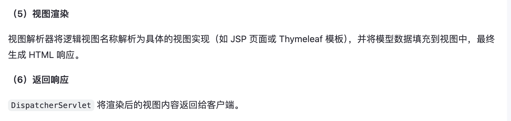
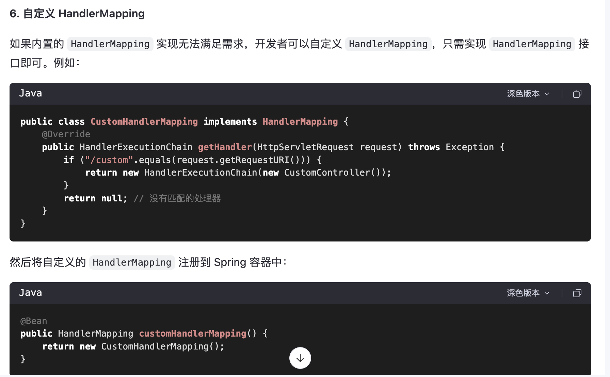
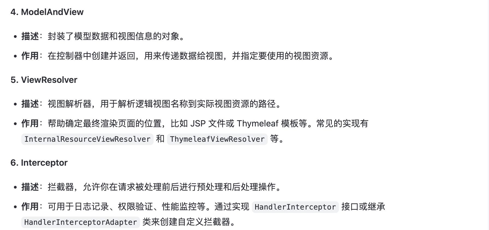

# 一、MVC与Spring-MVC介绍

MVC（Model-View-Controller，模型-视图-控制器）是一种软件设计模式，广泛应用于开发用户界面。它通过将应用程序分割为三个核心组件来分离关注点，这三个组件分别是：

- **Model（模型）**：代表一个存取数据的对象或 JAVA POJO（Plain Old Java Object，简单java对象）。它也可以带有逻辑，主要用于承载数据，并对用户提交请求进行计算的模块。模型分为两类，一类称为数据承载 Bean，一类称为业务处理Bean。所谓数据承载 Bean 是指实体类（如：User类），专门为用户承载业务数据的；而业务处理 Bean 则是指Service 或 Dao 对象， 专门用于处理用户提交请求的。
- **View（视图）**：负责显示数据，即用户界面部分。它从模型中获取数据显示给用户，并向用户发送信息。
- **Controller（控制器）**：用于将用户请求转发给相应的 Model 进行处理，并根据 Model 的计算结果向用户提供相应响应。它使视图与模型分离。


流程步骤：

1. 用户通过View 页面向服务端提出请求，可以是表单请求、超链接请求、AJAX 请求等；
2. 服务端 Controller 控制器接收到请求后对请求进行解析，找到相应的Model，对用户请求进行处理Model 处理； 
3. 将处理结果再交给 Controller（控制器其实只是起到了承上启下的作用）；
4. 根据处理结果找到要作为向客户端发回的响应View 页面，页面经渲染后发送给客户端。


Spring MVC是Spring框架的一个模块，它实现了MVC架构模式，专门用于构建Web应用程序。Spring MVC利用了MVC设计模式的优势，提供了更清晰的分层结构，有助于提高代码的可维护性和可扩展性。以下是Spring MVC如何体现MVC模式的几个关键点：

- **DispatcherServlet（前端控制器）**：作为Spring MVC的核心组件，它类似于MVC中的控制器角色，但它的职责更广泛，包括接收所有的HTTP请求，然后根据配置将这些请求分配给相应的处理器（Handler）。
  
- **Controller（控制器）**：在Spring MVC中，开发者定义的控制器类主要负责处理具体的业务逻辑，包括准备模型数据以及选择要呈现的视图名称。不同于传统的MVC模式，这里的控制器更加专注于业务逻辑处理。

- **Model（模型）**：包含需要展示给用户的数据信息。在Spring MVC中，控制器负责填充模型数据，然后将其传递给视图进行渲染。

- **View（视图）**：在Spring MVC中，视图是由模板引擎（如JSP、Thymeleaf等）生成的HTML页面，用来展示模型数据给用户。视图解析器（View Resolver）帮助找到正确的视图进行渲染。


# 二、主要作用

spring-mvc 的主要作用总结如下：


# 三、`spring-mvc` 的内部流程与核心组件

内部流程如下，spring-mvc 位于用户和 controller 层之间，简化用户调用 controller 层以及从 controller 层返回的过程


Spring MVC的工作流程如下： 

1. 用户发送请求至前端控制器DispatcherServlet 
2. DispatcherServlet收到请求调用处理器映射器HandlerMapping。
3. 处理器映射器根据请求url找到具体的处理器，生成处理器执行链HandlerExecutionChain(包括处理器对象和处理器拦截器)一并返回给DispatcherServlet。
4. DispatcherServlet根据处理器Handler获取处理器适配器HandlerAdapter执行HandlerAdapter处理一系列的操作，如：参数封装，数据格式转换，数据验证等操作 
5. 执行处理器Handler(Controller，也叫页面控制器)。 
6. Handler执行完成返回ModelAndView 
7. HandlerAdapter将Handler执行结果ModelAndView返回到DispatcherServlet
8. DispatcherServlet将ModelAndView传给ViewReslover视图解析器 
9. ViewReslover解析后返回具体View 
10. DispatcherServlet对View进行渲染视图（即将模型数据model填充至视图中）。
11.  DispatcherServlet响应用户。


## DispatcherServlet

DispatcherServlet 是 Spring MVC 框架的核心组件，是整个框架的“前端控制器”（Front Controller）。它负责接收所有的 HTTP 请求，并将这些请求分发给相应的处理器（Controller）进行处理。作为 Spring MVC 的入口点，DispatcherServlet 在 Web 应用中起到了统一管理和协调的作用。




## HandlerMapping

HandlerMapping 是 Spring MVC 框架中的一个核心接口，负责将 HTTP 请求映射到具体的处理器（Controller 方法）。它是 DispatcherServlet 的重要组成部分之一，决定了请求的路由规则。




## HandlerAdapter

`HandlerAdapter` 是 Spring MVC 框架中的一个核心接口，用于适配不同类型的处理器（Controller 方法）。它是 `DispatcherServlet` 和处理器之间的桥梁，负责调用处理器方法，并处理其参数和返回值。通过 `HandlerAdapter`，Spring MVC 实现了对多种处理器类型的支持，同时保持了框架的灵活性和可扩展性。

`HandlerAdapter` 的主要职责是：
- **调用处理器方法**：根据请求信息调用处理器（Controller 方法）。
- **参数解析**：将 HTTP 请求中的数据绑定到处理器方法的参数上。
- **返回值处理**：处理处理器方法的返回值，将其转换为适当的响应格式（如视图名称、JSON 数据等）。

**2. 核心方法**

`HandlerAdapter` 接口定义了以下核心方法：

（1）`boolean supports(Object handler)`

- **作用**：判断当前 `HandlerAdapter` 是否支持给定的处理器。
- **返回值**：`true` 表示支持，`false` 表示不支持。

（2）`ModelAndView handle(HttpServletRequest request, HttpServletResponse response, Object handler) throws Exception`

- **作用**：调用处理器方法，并返回一个 `ModelAndView` 对象。
- **参数**：
  - `request`：HTTP 请求对象。
  - `response`：HTTP 响应对象。
  - `handler`：处理器对象（通常是 Controller 方法）。
- **返回值**：包含模型数据和逻辑视图名称的 `ModelAndView` 对象。

（3）`long getLastModified(HttpServletRequest request, Object handler)`

- **作用**：获取资源的最后修改时间（用于缓存控制）。
- **返回值**：资源的最后修改时间（以毫秒为单位）。

**3. 常见实现类**

Spring MVC 提供了多种 `HandlerAdapter` 的实现类，支持不同的处理器类型：

（1）**RequestMappingHandlerAdapter**

- **描述**：最常用的实现类，支持基于注解的处理器（如 `@RequestMapping`、`@GetMapping` 等）。
- **特点**：
  - 自动解析处理器方法的参数（如 `@RequestParam`、`@PathVariable` 等）。
  - 支持返回多种类型的响应（如 `String`、`ModelAndView`、`ResponseEntity` 等）。
- **适用场景**：现代 Spring MVC 应用中使用注解驱动的控制器。

（2）**SimpleControllerHandlerAdapter**

- **描述**：支持实现了 `Controller` 接口的传统处理器。
- **特点**：
  - 需要处理器显式实现 `Controller` 接口。
  - 已逐渐被注解驱动的方式取代。
- **适用场景**：遗留项目或需要显式接口支持的场景。

（3）**HttpRequestHandlerAdapter**

- **描述**：支持实现了 `HttpRequestHandler` 接口的处理器。
- **特点**：
  - 处理器直接操作 `HttpServletRequest` 和 `HttpServletResponse`。
  - 适合需要完全控制请求和响应的场景。
- **适用场景**：文件下载、流式响应等。

（4）**WebSocketHandlerAdapter**

- **描述**：支持 WebSocket 处理器。
- **特点**：
  - 用于处理 WebSocket 协议的请求。
- **适用场景**：实时通信应用。

**4. 参数解析与返回值处理**

`HandlerAdapter` 的一个重要功能是对处理器方法的参数和返回值进行解析和处理。以下是具体的机制：

（1）**参数解析**

`HandlerAdapter` 使用 `HandlerMethodArgumentResolver` 来解析处理器方法的参数。例如：
- `@RequestParam`：解析查询参数。
- `@PathVariable`：解析路径变量。
- `@RequestBody`：解析请求体中的 JSON 数据。
- `Model`：用于传递模型数据。

（2）**返回值处理**

`HandlerAdapter` 使用 `HandlerMethodReturnValueHandler` 来处理处理器方法的返回值。例如：
- 返回 `String`：表示逻辑视图名称。
- 返回 `ModelAndView`：包含模型数据和视图名称。
- 返回 `ResponseEntity`：直接写出响应内容（如 JSON 数据）。
- 返回 `void`：通常用于异步处理或直接写入响应。

**5. 工作流程**

当 `DispatcherServlet` 找到合适的处理器后，它会调用 `HandlerAdapter` 来执行处理器方法。具体流程如下：

1. **检查支持性**：
   - `DispatcherServlet` 调用 `supports()` 方法，确认当前 `HandlerAdapter` 是否支持该处理器。

2. **调用处理器方法**：
   - 如果支持，则调用 `handle()` 方法执行处理器逻辑。

3. **处理返回值**：
   - `HandlerAdapter` 将处理器方法的返回值转换为 `ModelAndView` 或其他响应格式。

4. **生成响应**：
   - `DispatcherServlet` 使用 `ViewResolver` 渲染视图，或将响应内容直接返回给客户端。

**6. 自定义 HandlerAdapter**

如果内置的 `HandlerAdapter` 实现无法满足需求，开发者可以自定义 `HandlerAdapter`，只需实现 `HandlerAdapter` 接口即可。例如：
```java
public class CustomHandlerAdapter implements HandlerAdapter {
    @Override
    public boolean supports(Object handler) {
        return handler instanceof CustomController;
    }

    @Override
    public ModelAndView handle(HttpServletRequest request, HttpServletResponse response, Object handler) throws Exception {
        CustomController controller = (CustomController) handler;
        String result = controller.handleRequest(request, response);
        return new ModelAndView("viewName", "modelKey", result);
    }

    @Override
    public long getLastModified(HttpServletRequest request, Object handler) {
        return -1; // 不支持缓存
    }
}
```

然后将自定义的 `HandlerAdapter` 注册到 Spring 容器中：
```java
@Bean
public HandlerAdapter customHandlerAdapter() {
    return new CustomHandlerAdapter();
}
```


## Controller

在 Spring MVC 框架中，`Controller` 是负责处理 HTTP 请求并返回响应的核心组件。它是 MVC 架构中的“控制器”部分，充当了用户请求与业务逻辑之间的桥梁。通过 `Controller`，开发者可以定义如何接收请求、调用业务逻辑、处理数据，并最终生成响应。

以下是关于 `Controller` 的详细介绍：

**1. Controller 的作用**

`Controller` 的主要职责包括：
- **接收请求**：处理来自客户端的 HTTP 请求（如 GET、POST、PUT、DELETE 等）。
- **调用业务逻辑**：根据请求参数调用服务层的业务逻辑。
- **返回响应**：将处理结果返回给客户端，通常以视图或数据的形式呈现。

**2. 实现方式**

Spring MVC 提供了多种实现 `Controller` 的方式，以下是最常见的两种：

（1）**基于注解的控制器**

这是现代 Spring MVC 应用中最常用的方式，通过注解简化了控制器的开发。
- 使用 `@Controller` 或 `@RestController` 注解标记类为控制器。
- 使用 `@RequestMapping` 或其派生注解（如 `@GetMapping`、`@PostMapping` 等）定义请求映射规则。

示例：

```java
@Controller
public class MyController {

    @GetMapping("/hello")
    public String sayHello(Model model) {
        model.addAttribute("message", "Hello, World!");
        return "hello"; // 返回逻辑视图名称
    }
}
```
- **特点**：
  - 简洁易用。
  - 支持灵活的参数绑定和返回值处理。
  - 推荐用于现代 Spring 应用。

（2）**基于接口的传统控制器**

早期的 Spring MVC 版本中，控制器需要实现 `Controller` 接口。
- 实现 `handleRequest(HttpServletRequest request, HttpServletResponse response)` 方法来处理请求。

示例：

```java
public class MyOldController implements Controller {
    @Override
    public ModelAndView handleRequest(HttpServletRequest request, HttpServletResponse response) throws Exception {
        ModelAndView modelAndView = new ModelAndView("hello");
        modelAndView.addObject("message", "Hello, World!");
        return modelAndView;
    }
}
```
- **特点**：
  - 需要显式实现接口。
  - 较为繁琐，已逐渐被注解驱动的方式取代。

**3. 常见注解**

在基于注解的控制器中，Spring 提供了丰富的注解来简化开发。以下是一些常用的注解及其功能：

（1）**@Controller**

- 标记一个类为控制器。
- 通常用于传统的 MVC 应用，返回视图名称。

（2）**@RestController**

- 标记一个类为 RESTful 控制器。
- 自动将返回值序列化为 JSON 或 XML 格式（等同于 `@Controller + @ResponseBody`）。

（3）**@RequestMapping**

- 定义请求映射规则（URL、HTTP 方法等）。
- 可以作用于类或方法级别。

（4）**派生注解**

- `@GetMapping`：处理 GET 请求。
- `@PostMapping`：处理 POST 请求。
- `@PutMapping`：处理 PUT 请求。
- `@DeleteMapping`：处理 DELETE 请求。

（5）**参数绑定注解**

- `@RequestParam`：绑定查询参数。
- `@PathVariable`：绑定路径变量。
- `@RequestBody`：绑定请求体中的 JSON 数据。
- `@ModelAttribute`：绑定表单数据到模型对象。

（6）**返回值注解**

- `@ResponseBody`：将返回值直接写入响应体。
- `@ResponseStatus`：指定 HTTP 响应状态码。

**4. 处理流程**

当一个 HTTP 请求到达时，`Controller` 的处理流程如下：

1. **请求匹配**：
   - `DispatcherServlet` 根据 `HandlerMapping` 找到与请求匹配的处理器方法。

2. **参数解析**：
   - `HandlerAdapter` 解析请求参数，并将其绑定到处理器方法的参数上。

3. **调用处理器方法**：
   - 调用 `Controller` 中的方法，执行业务逻辑。

4. **返回结果**：
   - 处理器方法返回一个结果（如视图名称、JSON 数据等）。

5. **视图渲染或响应写出**：
   - 如果返回的是视图名称，则由 `ViewResolver` 渲染视图。
   - 如果返回的是数据（如 JSON），则直接写入响应体。

**5. 视图与数据的返回**

`Controller` 的返回值决定了最终的响应内容。以下是常见的返回类型及其用途：

（1）**返回视图名称**

- 返回一个字符串，表示逻辑视图名称。
- 示例：
  ```java
  @GetMapping("/home")
  public String home() {
      return "home"; // 返回逻辑视图名称
  }
  ```

（2）**返回 ModelAndView**

- 返回一个包含模型数据和视图名称的对象。
- 示例：
  ```java
  @GetMapping("/user")
  public ModelAndView getUser() {
      ModelAndView modelAndView = new ModelAndView("user");
      modelAndView.addObject("name", "John");
      return modelAndView;
  }
  ```

（3）**返回 JSON 数据**

- 使用 `@RestController` 或 `@ResponseBody` 将返回值序列化为 JSON。
- 示例：
  ```java
  @GetMapping("/api/user")
  @ResponseBody
  public User getUser() {
      return new User("John", 30); // 返回 JSON 数据
  }
  ```

**6. RESTful 风格支持**

Spring MVC 对 RESTful 风格提供了全面的支持，允许开发者轻松构建基于资源的 Web 服务。

示例：

```java
@RestController
@RequestMapping("/api/users")
public class UserController {

    @GetMapping("/{id}")
    public User getUser(@PathVariable Long id) {
        return userService.getUserById(id);
    }

    @PostMapping
    public ResponseEntity<User> createUser(@RequestBody User user) {
        User savedUser = userService.saveUser(user);
        return ResponseEntity.status(HttpStatus.CREATED).body(savedUser);
    }
}
```

## 其他组件




