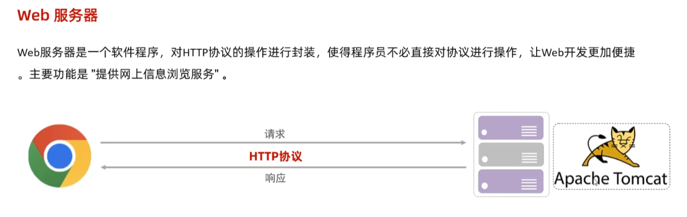
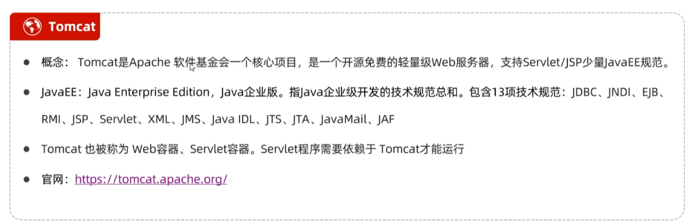
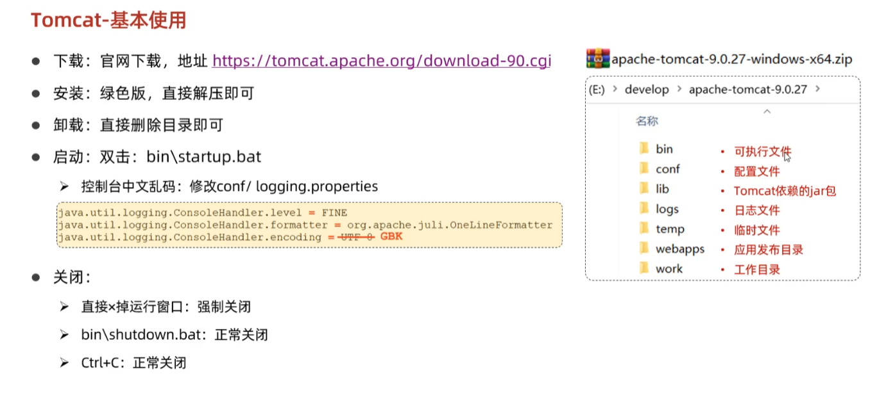
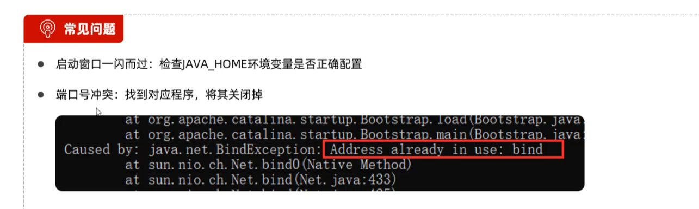
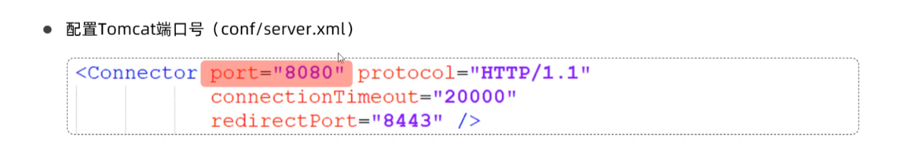
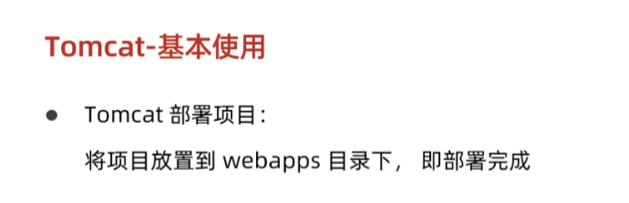
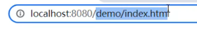

# 一、tomcat的作用

对于一个 JavaWeb 项目，需要放置在 tomat 的webapps目录下，而 tomcat 则运行在我们的 Web 服务器上，这样用户可以通过 JavaWeb 在 tomcat 中的路径，即可访问该 JavaWeb 项目。

# 二、tomcat 的安装

# 三、常见问题

# 四、使用方式

项目 demo 放在 webapps 目录下：

