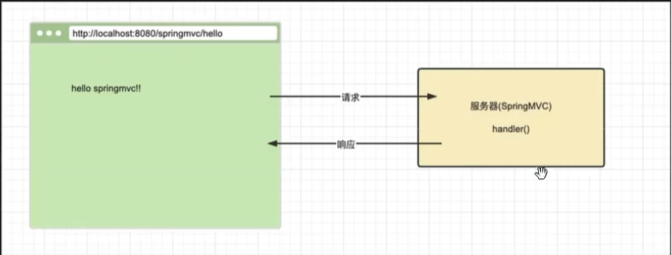

# 一、需求展示



# 二、主要工作


# 三、部署步骤

## 3.1 创建项目


## 3.2 导入依赖

总共需要三个依赖：


## 3.3 Controller 声明


`@Controller` 的作用是将其加入到 ioc 容器

`@RequestMapping()` 的作用是为该方法绑定路由地址

`@ResponseBody` 的作用是表明该方法返回的结果直接以字符串形式返回，而不需要通过视图解析器。

## 3.3 配置类的设置

ioc 容器的配置类：

1. 将 `controller` 配置到 ioc 容器
2. 将 `handlerMapping` 和 `handlerAdapter` 配置到 ioc 容器


## 3.4 创建 ioc 容器

我们需要初始化创建一个 ioc 容器(**用于以编程方式配置 `DispatcherServlet`**)，在 spring-mvc 中的方式如下：

我们需要新建一个类，这个类需要继承 `AbstractAnnotationConfigDispatcherServletInitializer` 这个类，并重写三个方法，这样这个类在项目启动的时候就会被自动调用。

spring-mvc 自动帮助我们根据配置类生成一个 ioc 容器（调用 `getServletConfigClasses() ` 方法），同时完成对 servlet 的配置（调用 `getServletMapping()` 方法）。


# 四、运行项目

将我们的项目在 tomcat 中运行：

1. 点击右上角Add Configurations


2. 添加( + )tomcat  Local到Configurations，点击Apply再点OK 


3. 点Deployment添加（ + )选第一个，点击Apply再点OK


> 因为上面我们的 servlet 地址设置为了 `/` ，因此 `Application context` 也需要是 `/`

# 五.  原理介绍

## 5.1 AbstractAnnotationConfigdispatchsevletinitializer

`AbstractAnnotationConfigDispatcherServletInitializer` 是 Spring MVC 提供的一个便捷基类，用于以编程方式配置 `DispatcherServlet`，尤其是在基于 Java 的配置环境中。这个类简化了在 Servlet 3.0 及以上版本的容器中初始化和配置 Spring 应用的过程，而无需使用传统的 `web.xml` 配置文件。

**主要用途**

通过继承 `AbstractAnnotationConfigDispatcherServletInitializer` 类，开发者可以快速设置 Spring MVC 应用程序，并指定根应用上下文（Root Application Context）和 Servlet 应用上下文（Servlet Application Context），同时还可以定义其他重要的配置项，如过滤器、监听器等。

**核心方法**

该类提供了几个需要子类覆盖的方法，以便自定义应用程序的启动行为：

1. `getRootConfigClasses()`

- **作用**：指定根应用上下文的配置类。这些配置类通常包含服务层组件、数据访问层组件等非 Web 相关的 Bean 定义。
- **返回值**：一个包含配置类的数组。
- **示例**：
  ```java
  @Override
  protected Class<?>[] getRootConfigClasses() {
      return new Class<?>[]{RootConfig.class};
  }
  ```

2. `getServletConfigClasses()`

- **作用**：指定 Servlet 应用上下文的配置类。这些配置类通常包含控制器、视图解析器等与 Web 层相关的 Bean 定义。
- **返回值**：一个包含配置类的数组。
- **示例**：
  ```java
  @Override
  protected Class<?>[] getServletConfigClasses() {
      return new Class<?>[]{WebConfig.class};
  }
  ```

3. `getServletMappings()`

- **作用**：指定 `DispatcherServlet` 应该映射到哪些 URL 模式。这意味着你可以控制哪些请求会被 `DispatcherServlet` 处理。
- **返回值**：一个包含 URL 模式的字符串数组。
- **示例**：
  ```java
  @Override
  protected String[] getServletMappings() {
      return new String[]{"/"};
  }
  ```
  这个例子表示 `DispatcherServlet` 将处理所有进入的应用请求。

4. `registerContextLoaderListener(ServletContext servletContext)`

- **作用**：注册 `ContextLoaderListener`，它负责加载根应用上下文。默认情况下，此方法会自动调用，因此通常不需要重写它。

5. `onStartup(ServletContext servletContext) throws ServletException`

- **作用**：执行任何必要的启动代码。默认实现已经足够满足大多数情况下的需求，但在某些特殊情况下可能需要覆盖此方法以添加自定义逻辑。

示例代码

下面是一个简单的例子，展示了如何使用 `AbstractAnnotationConfigDispatcherServletInitializer` 来配置 Spring MVC 应用：

```java
public class MyWebAppInitializer extends AbstractAnnotationConfigDispatcherServletInitializer {

    // 加载根应用上下文的配置类
    @Override
    protected Class<?>[] getRootConfigClasses() {
        return new Class<?>[]{RootConfig.class};
    }

    // 加载 Servlet 应用上下文的配置类
    @Override
    protected Class<?>[] getServletConfigClasses() {
        return new Class<?>[]{WebConfig.class};
    }

    // 设置 DispatcherServlet 映射的 URL 模式
    @Override
    protected String[] getServletMappings() {
        return new String[]{"/"};
    }
}
```

在这个例子中：
- `RootConfig` 类可能包含了服务层和服务配置。
- `WebConfig` 类则包含了 MVC 相关的配置，如控制器、视图解析器等。
- `/` 表示 `DispatcherServlet` 将处理所有类型的 HTTP 请求。

## 5.2 RootConfig 和 WebConfig

在 Spring MVC 应用中，`RootConfig` 和 `WebConfig` 是两个常见的配置类，它们分别负责不同的职责范围。通常情况下，`RootConfig` 配置的是应用程序的根上下文（Root Application Context），而 `WebConfig` 配置的是 Servlet 上下文（Servlet Application Context）。以下是这两个类的具体内容和职责划分：

---

### **1. RootConfig 类**
`RootConfig` 主要用于配置应用的核心功能，包括服务层（Service Layer）、数据访问层（Data Access Layer）、安全配置等非 Web 相关的内容。它定义了整个应用程序的基础组件。

常见配置内容：

- **扫描包路径**：指定需要扫描的服务层和数据访问层所在的包路径。
- **数据源配置**：配置数据库连接池、事务管理器等。
- **其他基础组件**：如消息队列、缓存、定时任务等。

示例代码：

```java
@Configuration
@ComponentScan(basePackages = "com.example",
               excludeFilters = @ComponentScan.Filter(type = FilterType.ANNOTATION, classes = {Controller.class, ControllerAdvice.class}))
@EnableTransactionManagement
public class RootConfig {

    // 数据源配置
    @Bean
    public DataSource dataSource() {
        HikariDataSource dataSource = new HikariDataSource();
        dataSource.setDriverClassName("com.mysql.cj.jdbc.Driver");
        dataSource.setJdbcUrl("jdbc:mysql://localhost:3306/mydb");
        dataSource.setUsername("root");
        dataSource.setPassword("password");
        return dataSource;
    }

    // 事务管理器配置
    @Bean
    public PlatformTransactionManager transactionManager(DataSource dataSource) {
        return new DataSourceTransactionManager(dataSource);
    }

    // JPA EntityManagerFactory 配置（如果使用 JPA）
    @Bean
    public LocalContainerEntityManagerFactoryBean entityManagerFactory(DataSource dataSource) {
        LocalContainerEntityManagerFactoryBean emf = new LocalContainerEntityManagerFactoryBean();
        emf.setDataSource(dataSource);
        emf.setPackagesToScan("com.example.domain");
        emf.setJpaVendorAdapter(new HibernateJpaVendorAdapter());
        return emf;
    }
}
```

关键点：

- `@ComponentScan` 中通过 `excludeFilters` 排除了 Web 层相关的注解（如 `@Controller` 和 `@ControllerAdvice`），确保这些组件不会被加载到根上下文中。
- 数据源、事务管理器等与业务逻辑相关的 Bean 定义在此处。

---

### **2. WebConfig 类**
`WebConfig` 主要用于配置与 Web 层相关的内容，包括控制器（Controller）、视图解析器（ViewResolver）、静态资源处理、拦截器（Interceptor）等。它是 Servlet 上下文的一部分，专注于 MVC 框架的功能。

常见配置内容：

- **扫描包路径**：指定需要扫描的控制器所在的包路径。
- **视图解析器配置**：定义如何将逻辑视图名称解析为具体的视图文件（如 JSP、Thymeleaf 等）。
- **静态资源处理**：配置对 CSS、JavaScript、图片等静态资源的访问。
- **拦截器配置**：添加全局或特定路径的拦截器。
- **消息转换器**：配置 HTTP 请求和响应的消息转换器（如 JSON 转换器）。

示例代码：

```java
@Configuration
@EnableWebMvc
@ComponentScan(basePackages = "com.example.web", useDefaultFilters = true,
               includeFilters = @ComponentScan.Filter(type = FilterType.ANNOTATION, classes = {Controller.class}))
public class WebConfig implements WebMvcConfigurer {

    // 视图解析器配置
    @Bean
    public ViewResolver viewResolver() {
        InternalResourceViewResolver resolver = new InternalResourceViewResolver();
        resolver.setPrefix("/WEB-INF/views/");
        resolver.setSuffix(".jsp");
        return resolver;
    }

    // 静态资源配置
    @Override
    public void addResourceHandlers(ResourceHandlerRegistry registry) {
        registry.addResourceHandler("/resources/**")
                .addResourceLocations("/resources/");
    }

    // 消息转换器配置（例如返回 JSON 格式的数据）
    @Override
    public void configureMessageConverters(List<HttpMessageConverter<?>> converters) {
        converters.add(new MappingJackson2HttpMessageConverter());
    }

    // 拦截器配置
    @Override
    public void addInterceptors(InterceptorRegistry registry) {
        registry.addInterceptor(new LoggingInterceptor())
                .addPathPatterns("/**");
    }
}
```

关键点：

- `@EnableWebMvc` 启用了 Spring MVC 的核心功能，例如请求映射、参数绑定、视图解析等。
- `@ComponentScan` 指定了只扫描带有 `@Controller` 注解的类。
- 配置了视图解析器、静态资源处理、拦截器等功能，专注于 Web 层的需求。

---

### 3. **职责划分总结**

| **配置类**     | **职责范围**                     | **常见配置内容**                                             |
| -------------- | -------------------------------- | ------------------------------------------------------------ |
| **RootConfig** | 根上下文，非 Web 相关的配置      | 数据源、事务管理器、服务层、数据访问层、缓存、消息队列等     |
| **WebConfig**  | Servlet 上下文，Web 层相关的配置 | 控制器、视图解析器、静态资源、拦截器、消息转换器、跨域支持等 |

---

### 4. **运行时的工作机制**
1. **根上下文初始化**：
   - 在应用启动时，Spring 容器会首先加载 `RootConfig`，并创建根上下文（Root Application Context）。
   - 根上下文包含了所有与 Web 无关的 Bean，如服务层、数据访问层等。

2. **Servlet 上下文初始化**：
   - 接着，Spring 容器会加载 `WebConfig`，并创建 Servlet 上下文（Servlet Application Context）。
   - Servlet 上下文是根上下文的子上下文，继承了根上下文中的所有 Bean，同时可以定义自己的 Web 层专用 Bean。

3. **DispatcherServlet 初始化**：
   - `DispatcherServlet` 使用 Servlet 上下文来处理 HTTP 请求，并调用相应的控制器方法。

---

### 5. **总结**
- **RootConfig** 是应用的核心配置，负责非 Web 相关的功能（如服务层、数据访问层、事务管理等）。
- **WebConfig** 是 Web 层的配置，专注于 MVC 功能（如控制器、视图解析器、静态资源、拦截器等）。
- 这种分离的设计使得代码结构更加清晰，便于维护和扩展，同时也符合 Spring 的分层架构理念。