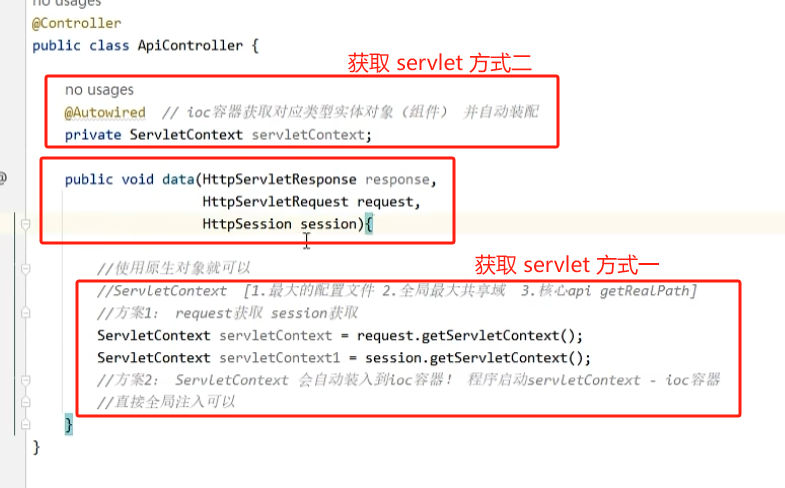

# 一、路由方法的注册

通过注解 `@RequestMapping()`的方式，将 Controller 层的方法注册到 `DispatchServlet`

> 如果某一个类方法 index ，它的路由地址就等同于类上设置的路由地址，那么它的注解就是 `@RequestMapping`，不需要添加其他后续字符串。对于类方法，必须要使用 `@RequestMapping` 注解，否则不会被注册。

# 二、接收参数

## 2.1 `param` 和 `json` 参数比较

## 2.2 接收 `param` 参数

### 2.2.1 直接接收

### 2.2.2 注解指定接收

使用注解指定，可以做到以下：

1. url 中的 param 参数和路由方法的形参参数名称可以，只需要额外指定即可
2. 指定参数必须有，或者指定参数可以没有并为其指定默认值

1. 在 url 中的是 `account` ，在路由方法的参数中是 `username`，两个不相同，需要通过 `@RequestParam(value="account")` 进行指定
2. `account` 必须传，因为`@RequestParam()` 默认就是必须传（`requied = true`）
3. `page` 参数可以不传，并为其指定默认值为1。

### 2.2.3 特殊值接值

比如，param 是一键多值，此时必须使用注解`@RequestParam`

### 2.2.4 实体对象接值

我们需要准备一个实体类，该实体类的字段必须和 param 参数的所有要接受的 key 对应，并为其实现 setter 和 getter 方法

## 2.3 接收路径参数

上述的：第一种是 param 参数格式，第二种是路径参数。

路径参数的 root 和 123456，这两个位置上填写我们的动态参数（这里的两个动态参数就分别是 root 和 123456）

1. 为了区别路径参数和 Param 参数，必须使用 `@PathVarible` 注解
2. 路径参数的名称 和 路由方法参数 也可以不同名称，但需要通过 `@PathVarible(value="")` 进行注解
3. 也可以使用 `required` 和 `defalutValue` 指定是否必须以及默认值

## 2.4 接收 `json` 参数

1. 我们需要根据 `json` ，创建一个对应的实体类（key 和 类字段对应），并为该实体类实现 setter 和 getter 方法
2. 为了与 Param 接收实体相区分，`json` 接收实体类必须添加 `@RequestBody` 注解
3. Java 原生的 API 不支持接收 json 参数，我们需要额外导入 jackson 包，同时将其配置到 `handlerAdapter` 作为 json 转换器：

在配置类上添加 `@EnableWebMvc` 注解：

### 2.4.1 `@EnableWebMvc`

此注解除了为 `handlerAdapter` 配置 json 转换器，还会将 `handlerMapping` 和 `handlerAdapter` 加载到 ioc 容器中，因此使用了这个注解，我们不在需要手动在配置类中将这两个通过 `@Bean` 注解添加到 ioc 容器中：

## 2.5 接收 cookie

接收客户端的 cookie：

使用 `@CookieValue()` 注解

## 2.6 接收客户端的请求头

对于客户端发送的请求报文，可以随意提取报文请求头中的任意属性。

比如，这里我们提取请求头中的 `Host`：

使用 `@RequestHeader("xxx")` 注解，"xxx" 就是希望获取的请求头字段的 key

## 2.7 获取 `http` 原生对象

如果我们想要从客户端请求报文中，获取诸如：`HttpServletResponse` 和 `HttpServletRequest` 等对象，可以直接获取并使用：

