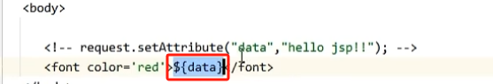
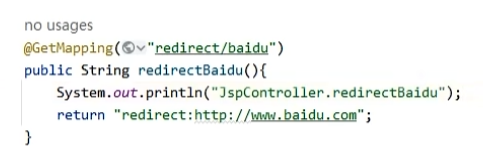
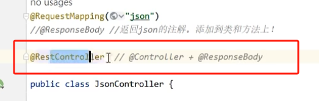

# 一、快速返回逻辑视图（混合开发模式，前后端不分离）

## 1.1 开发模式

## 1.2 `jsp` 技术

只能返回动态的 html 页面，只能由浏览器访问。

## 1.3 `jsp` 依赖

## 1.4 创建一个 `jsp` 模板页面

`jsp` 页面可以**从共享域获取数据**。

下面就是从共享域获取名为 `data` 的数据，并标红：

## 1.5 配置视图解析

在配置类中配置视图解析器：

1. 让配置类实现 `WebMvcConfigurer` 接口
2. 配置类重写 `configureViewResolvers()` 方法
3. 因为使用的是 `jsp` ,因此指定 jsp 文件的前后缀 

## 1.6 初始化 ioc 容器

新建一个类，这个类需要继承 `AbstractAnnotationConfig…………` 这个类，并重写三个方法

## 1.7 实现 controller 层

> 返回值正好是 `jsp` 指定的前缀后的页面名称，通过拼接方式获取 `html` 页面的真实 `url`：`/WEB-INF/views/index.html`

# 二、实现资源访问的转发

返回值使用 `"forward:/转发地址"`

# 三、实现资源访问的重定向

返回值使用 `"redirect:/重定向地址"`

> java-web 开发中，重定向属于是二次请求，必须是完整的资源路径，因此必须要添加项目的根路径（`Application context`），而转发不需要添加项目的根路径。
>
> 当使用了 `spring-mvc` 进行开发时，自动的为我们省去了在重定向中添加项目根路径的行为，因此也不需要添加根路径。

重定向除了项目下的资源，还可以到其他任意可以访问到的其他资源：

# 四、返回 `json` 数据

要返回 `json` 数据：

1. 直接返回对象即可
2. 方法上添加 `@ResponseBody` 注解（注意：和 `@RequestBody` 进行区分）

如果要返回的是集合，也同理：

`@ResponseBody` 可以直接加在类上，如果类中所有方法都返回 `json` 数据的话，可以这样做：

也可以直接使用 `@RestController` 注解：

这个注解等同于 `@ResponseBody` + `@Controller`

**注意：**

# 五、返回静态资源

我们在 `webapp` 下放置我们的静态资源 `mi.png` ：

如果使用的是 `spring-mvc` ，我们通过路径 `/images/mi.png` 是无法访问到这张图片的，原因是：

`DispatchServlet` 在处理所有的资源访问请求时，都会先去 `HandlerMapping` 去查找资源 url 对应的 handler，这里的静态资源明显没有在 `HandlerMapping` 中进行注册，因此 `HandlerMapping` 找不到对应的记录，就会返回 404 错误。

为了实现静态资源查找功能了，按如下方式设置我们的配置类：

其底层的原理是：如果根据资源地址找不到对应的 handler，就会通过**转发**的方式在当前项目资源路径下去找静态资源。