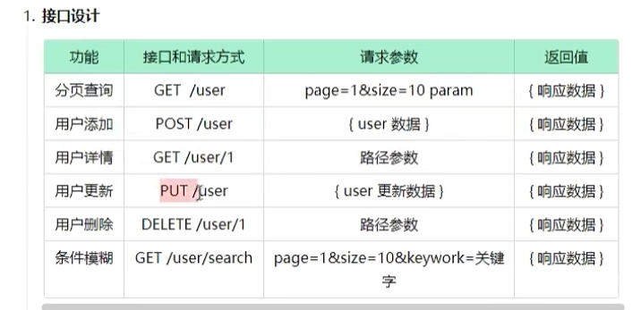
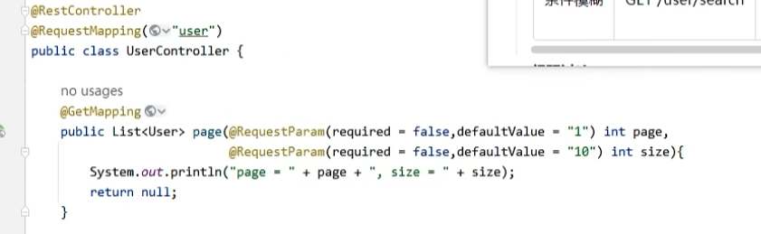

# 一、`Restful` 风格特点

## 1.1 URL 路径风格要求

## 1.2 风格好处

# 二、实战演练

## 2.1 需求分析

## 2.2 `Restful` 风格接口设计

> 总结：查询的是单条数据就用路径参数；查询的是一个集合，就用 Param 参数

1. GET 和 DELETE 通常都没有请求体，使用路径参数或者 param 参数
2. POST 和 PUT 通常都携带请求题，使用 json 作为请求体

## 2.3 后台接口实现

