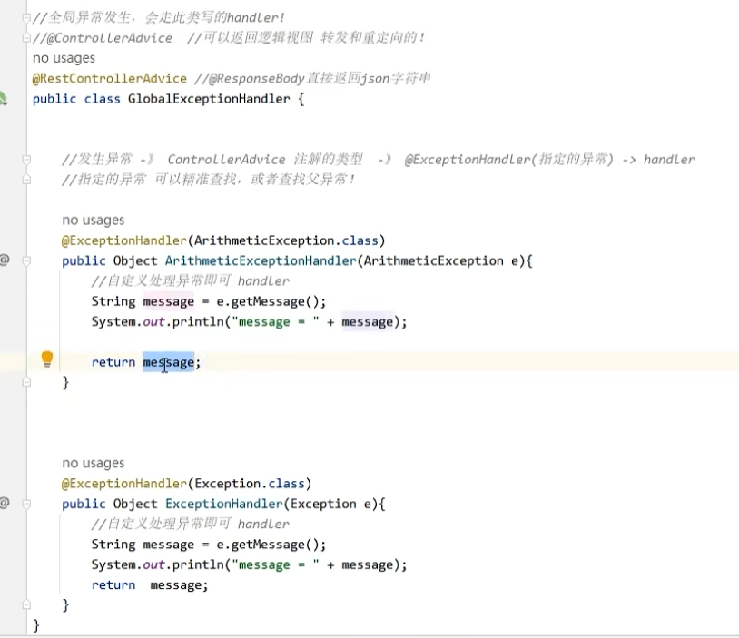

`contoller` 层在业务处理的时候，可能会遇到异常，通常情况下我们的做法是使用 `try catch` 对遇到的异常进行处理，但这种方式比较麻烦，需要针对每一个函数都进行 `try catch`。

为此，我们可以使用 `spring-mvc` 提供的异常集中处理机制：

当 `controller` 层遇到错误的时候，就会跳转至该异常类，执行对应的异常处理函数。

注意以下几点：

1. 这个异常处理类也是与 `controller` 层的 `handler` 等价的，当 `controller` 层执行遇到异常的时候，就会到这个异常类中匹配对应的异常处理函数。
2. 在类上需要添加注解：`@ControllerAdvice` 或者 `@RestControllerAdvice`。前者用于返回逻辑视图、转发和重定向；后者则直接返回 `json` 字符串。
3. 在异常处理函数上添加注解 `@ExceptionHandler(xxxx)`，`xxx` 用于指定该函数需要处理的异常类。
4. 当错误到达异常类，在进行类型匹配的时候，正常情况下进行精准匹配，但如果匹配不到也会对当前异常的父类进行匹配，找到父类的异常处理函数进行执行。