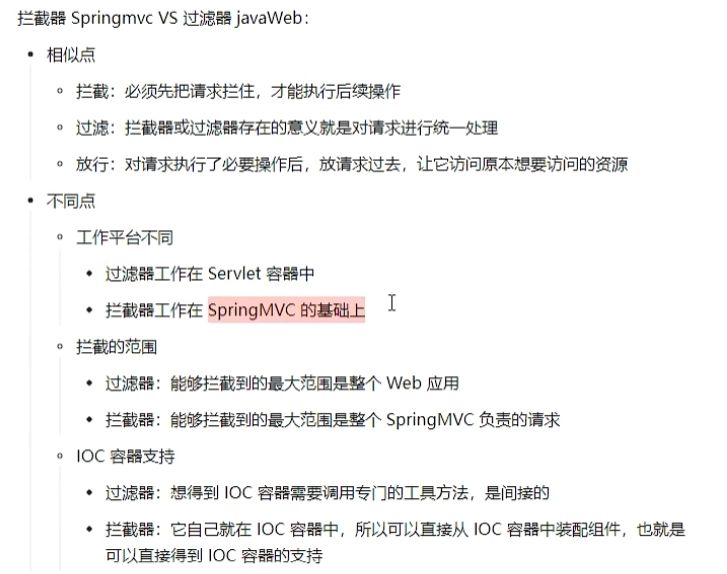
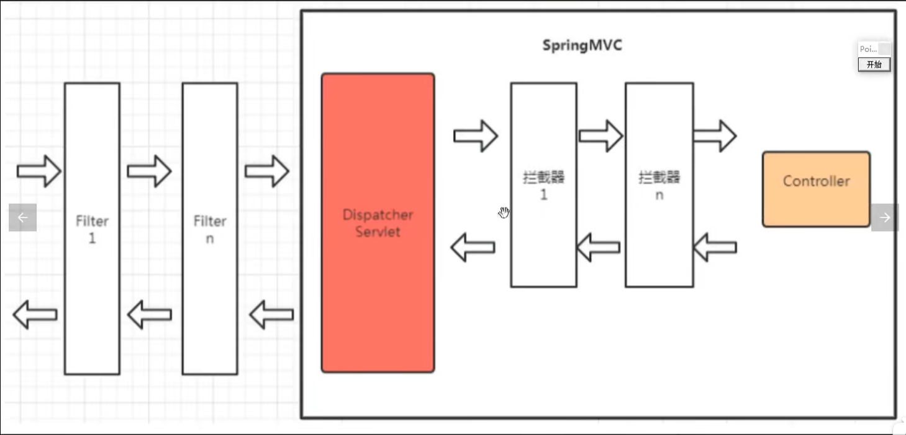
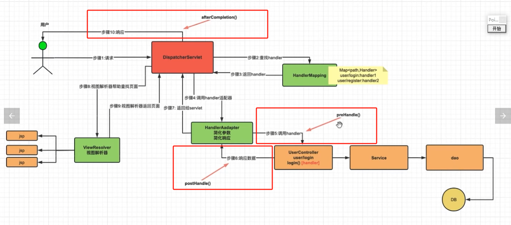
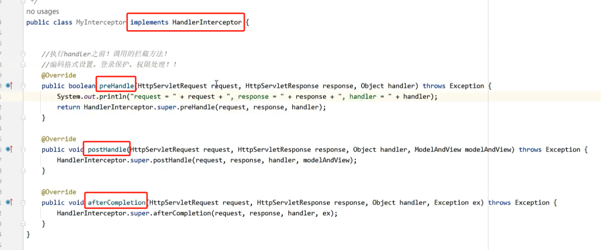
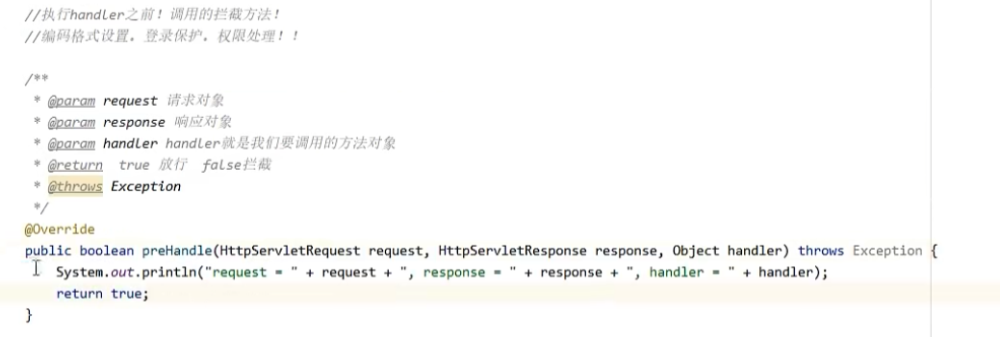
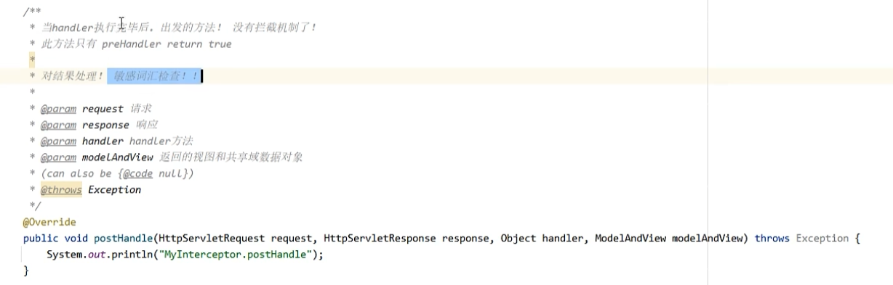
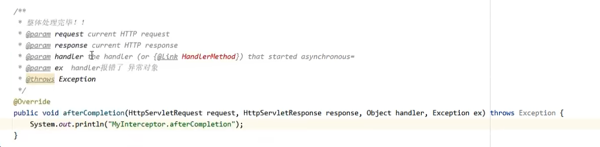
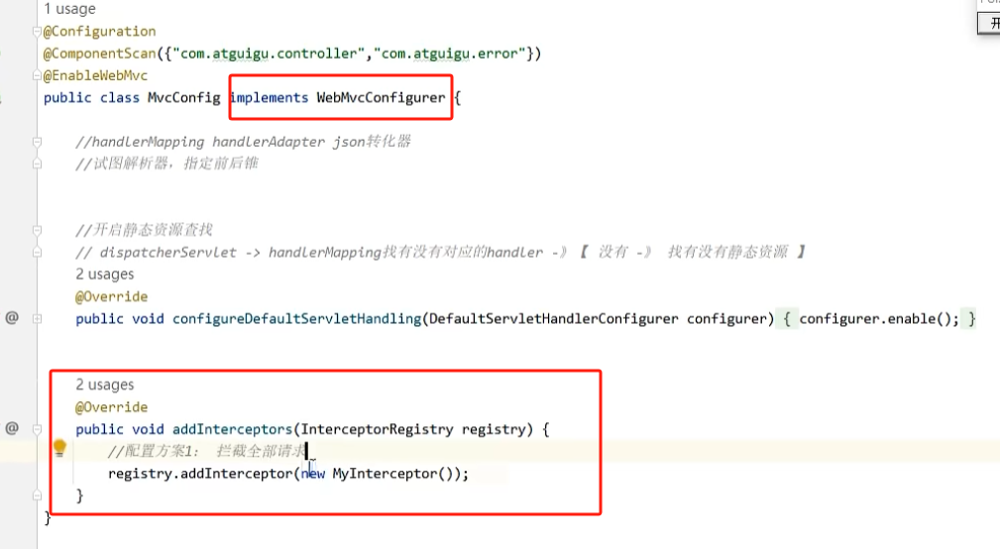
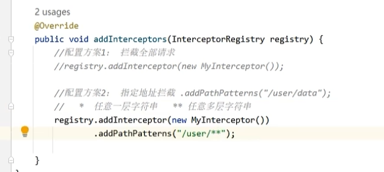
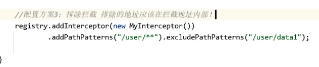

# 一、拦截器概念

拦截器的作用是：在执行 handler 之前，之后以及返回结果给请求端之前，在这三个时机进行消息拦截，并进行自定义处理。

通常被用于做：1. 权限认证   2. 登录认证 等。。

拦截器和过滤器这两个东西功能目标是一样的，只不过前者是 `spring-mvc` 特有的，后者则是 `javaWeb` 开发中使用的。

下面总结了拦截器和过滤器在 `spring-mvc` 中分别起作用的位置：

# 二、拦截器的使用

## 2.1 创建拦截器类

拦截器需要重写三个方法，`preHandle()`，`postHandle()` 以及 `afterCompletion()` ，这三个方法分别作用在：调用 `handler` 之前，之后以及向请求端返回时。

只有 `preHandle()` 方法能够起到拦截或者方向的作用，这一点根据返回值来实现（true：放行   false：拦截）

## 2.2 拦截器注入 `ioc` 容器

在配置类中，完成对拦截器的注入：

需要实现 `WebMvcConfigurer` 接口，并且重写 `addInterceptors()` 方法。

默认情况下，拦截器将拦截所有的请求。

## 2.3 选择性拦截请求

如下，可以仅对 `/user/**` 的请求进行拦截（其他请求不走拦截器）

也可以在上面的基础上，再排除一些请求：

需要注意，被排除的请求必须包含在被拦截的请求的范围内。

## 2.4 多个拦截器的执行顺序

如果有多个拦截器，在执行顺序上：

1. 对于 `prehandle()`，先注册的拦截器先执行
2. 对于 `posthandle()` 和 `afterCompletion()` 恰好相反，后注册的拦截器先执行。