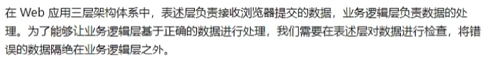

# 一、参数校验

JSR 303 针对与请求端传入的 json 数据进行校验，我们只需要在接收对象的对应字段添加校验注解，在将 json 数据转化为实体对象时就会进行参数校验。

常用的几种校验注解如下：

# 二、校验注解的使用

## 2.1 导入依赖

## 2.2 对接收实体类进行注解

需求如下：

根据此需求定义的类如下：

## 2.3 在 `controller` 层定义方法

如上所示，使用 `User` 实体类去接受请求方的 json 数据。需要注意：对于需要进行校验的接受实体类，必须添加 `@Validated` 注解

## 2.4 存在的问题：异常抛到前端

在进行数据校验的时候，出现异常直接被抛到前端页面，这是不合理的，我们可以通过以下方式，在 `controller` 层校验不通过时，进行额外的处理：

