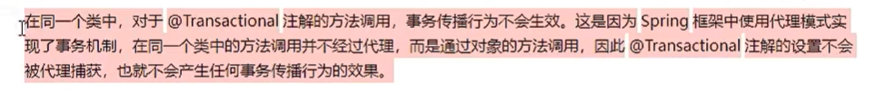
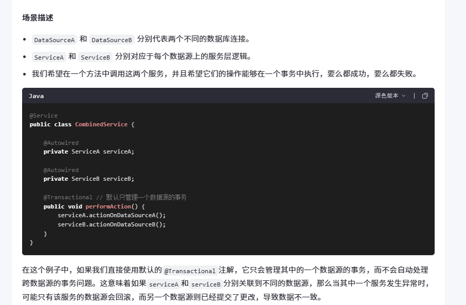

# 一、基本程序搭建

1. 依赖


2. 配置类


3. `DAO` 层


4. 业务层


业务层的 `changeInfo` 方法同时操作两条 `SQL` 语句

# 二、事务注解的添加

1. 在**配置类**中选择一个**具体的事务管理器实现类**放入到 `ioc` 容器


2. 在配置类中开启事务类注解支持


3. 在目标方法上添加事务注解，开启事务


如上所示，`1/0` 会出错，因此整个事务会回滚。

# 三、高级设置

## 3.1 只读模式设置


## 3.2 事务超时时间设置


## 3.3 事务异常指定问题

**默认情况**下，当方法内部发生 **运行时异常（非受检异常）** 时，事务才算失败，然后回滚（对于 IO 异常时不会出现回滚）


默认情况下，下述方法的事务不会发生回滚（因为发生的是 IO 异常）：


经过异常范围扩大后，就会发生回滚：


`noRollbackFor` 的作用：回滚异常范围内，控制某个异常不回滚：


## 3.4 事务隔离级别


## 3.5 事务传播行为

事务的传播行为定义了在一个事务上下文中，当一个事务方法被另一个事务方法调用时，应该如何处理这些事务。

### 3.5.1 场景


### 3.5.2 举例说明


### 3.5.3 `propagation` 属性


以下是所有事务传播行为的例子及其说明：

#### 1. `REQUIRED`（默认）

- **行为**：如果当前存在事务，则加入该事务；如果不存在事务，则创建一个新的事务。
- **适用场景**：大多数业务逻辑操作，这是最常用的传播行为。

```java
@Transactional(propagation = Propagation.REQUIRED)
public void methodA() {
    // 方法逻辑
}
```

#### 2. `SUPPORTS`

- **行为**：如果当前存在事务，则加入该事务；如果不存在事务，则以非事务方式继续运行。
- **适用场景**：对于那些不需要事务支持的操作，但可以在事务上下文中执行的情况。

```java
@Transactional(propagation = Propagation.SUPPORTS)
public void methodB() {
    // 方法逻辑
}
```

#### 3. `MANDATORY`

- **行为**：如果当前存在事务，则加入该事务；如果不存在事务，则抛出异常。
- **适用场景**：确保方法必须在事务中执行，否则程序应该停止并报告错误。

```java
@Transactional(propagation = Propagation.MANDATORY)
public void methodC() {
    // 方法逻辑
}
```

#### 4. `REQUIRES_NEW`

- **行为**：创建一个新事务，并暂停当前事务（如果有）。无论是否存在事务，都会创建新的事务。
- **适用场景**：需要独立于外部事务的新事务，例如日志记录或发送通知等不应受到主业务逻辑影响的操作。

```java
@Transactional(propagation = Propagation.REQUIRES_NEW)
public void methodD() {
    // 方法逻辑
}
```

#### 5. `NOT_SUPPORTED`

- **行为**：以非事务方式执行操作，并挂起当前事务（如果有）。
- **适用场景**：对于那些不应该在事务中执行的操作，如查询操作，避免事务开销。

```java
@Transactional(propagation = Propagation.NOT_SUPPORTED)
public void methodE() {
    // 方法逻辑
}
```

#### 6. `NEVER`

- **行为**：以非事务方式执行操作；如果当前存在事务，则抛出异常。
- **适用场景**：确保方法绝对不能在事务中执行，用于那些明确要求不在事务中运行的操作。

```java
@Transactional(propagation = Propagation.NEVER)
public void methodF() {
    // 方法逻辑
}
```

#### 7. `NESTED`

- **行为**：如果当前存在事务，则在嵌套事务内执行。如果当前没有事务，则其行为类似于`REQUIRED`。
- **适用场景**：希望在现有事务中执行部分回滚时使用，比如保存点机制，允许子事务回滚而不影响父事务。

```java
@Transactional(propagation = Propagation.NESTED)
public void methodG() {
    // 方法逻辑
}
```

> NESTED传播行为的核心特点
>
> - 嵌套事务：
>   - 子事务是嵌套在父事务中的，使用数据库的保存点（Savepoint）机制来实现。
>   - 如果子事务失败，可以回滚到保存点，而父事务仍然可以继续执行或提交。
> - 依赖于父事务：
>   - 子事务不能独立存在，它必须依赖于父事务。
>   - 如果父事务最终提交，则所有嵌套事务也会一起提交；如果父事务回滚，则所有嵌套事务也会被回滚。
> - 部分回滚：
>   - 当子事务失败时，仅回滚子事务的操作，父事务可以继续执行其他逻辑。
>
> 注意事项
>
> - 数据库支持：
>   - NESTED传播行为依赖于数据库的保存点（Savepoint）机制，因此需要确保底层数据库支持保存点（如MySQL InnoDB、PostgreSQL等）。
> - 性能开销：
>   - 使用保存点可能会带来一定的性能开销，尤其是在频繁使用嵌套事务的情况下。
> - 与REQUIRES_NEW的区别：
>   - NESTED是嵌套在父事务中的，依赖于父事务的提交或回滚。
>   - REQUIRES_NEW则是完全独立的新事务，不受父事务的影响。


### 3.5.4 注意



在Spring中，事务管理是通过AOP（面向切面编程）实现的，默认情况下使用的是基于**动态代理**的方式。这种动态代理的机制决定了事务传播行为的工作方式。以下是对这个问题的详细解释：

---

#### 1. **Spring事务传播行为依赖于代理对象**

Spring事务的核心是通过动态代理来拦截方法调用，并在方法执行前后添加事务管理逻辑。例如：
- 如果一个方法被标记为`@Transactional`，Spring会为该方法生成一个代理对象。
- 当调用该方法时，实际上是通过代理对象来执行的，而不是直接调用目标对象的方法。


- **代理对象的作用**：代理对象负责开启、提交或回滚事务。
- **内部调用问题**：如果一个类中的方法直接调用了同一个类中的另一个`@Transactional`方法，则不会经过代理对象，因此事务传播行为不会生效。

---

#### 2. **为什么父方法和子方法需要位于不同的类中？**

如果父方法和子方法位于同一个类中，并且父方法直接调用子方法（如`this.method()`），那么子方法的调用不会经过代理对象，事务传播行为将失效。

**示例1：父方法和子方法在同一个类中**

```java
@Service
public class OrderService {

    @Transactional(propagation = Propagation.REQUIRED)
    public void parentMethod() {
        System.out.println("Parent method executed");
        childMethod(); // 直接调用子方法
    }

    @Transactional(propagation = Propagation.REQUIRES_NEW)
    public void childMethod() {
        System.out.println("Child method executed");
    }
}
```

在这个例子中：
- `parentMethod()`直接调用了`childMethod()`。
- 由于调用发生在同一个类内部，`childMethod()`的调用不会经过代理对象，因此`REQUIRES_NEW`传播行为不会生效。

---

#### 3. **如何解决内部调用问题？**

为了让事务传播行为生效，可以采取以下几种方式：

**方法1：将子方法移到另一个类中**

通过将子方法移到另一个类中，确保调用通过代理对象完成。

```java
@Service
public class OrderService {

    @Autowired
    private InventoryService inventoryService;

    @Transactional(propagation = Propagation.REQUIRED)
    public void parentMethod() {
        System.out.println("Parent method executed");
        inventoryService.childMethod(); // 调用另一个类中的方法
    }
}

@Service
public class InventoryService {

    @Transactional(propagation = Propagation.REQUIRES_NEW)
    public void childMethod() {
        System.out.println("Child method executed");
    }
}
```

在这个例子中：
- `InventoryService`是一个独立的类，`OrderService`通过依赖注入调用它。
- 调用`inventoryService.childMethod()`时，会经过代理对象，因此`REQUIRES_NEW`传播行为生效。

**方法2：使用`AopContext.currentProxy()`获取当前代理对象**

如果必须在同一个类中调用子方法，可以通过`AopContext.currentProxy()`显式获取当前代理对象，然后通过代理对象调用方法。

```java
@Service
public class OrderService {

    @Transactional(propagation = Propagation.REQUIRED)
    public void parentMethod() {
        System.out.println("Parent method executed");

        // 获取当前代理对象
        OrderService proxy = (OrderService) AopContext.currentProxy();
        proxy.childMethod(); // 通过代理对象调用子方法
    }

    @Transactional(propagation = Propagation.REQUIRES_NEW)
    public void childMethod() {
        System.out.println("Child method executed");
    }
}
```

注意：
- 需要在配置中启用暴露代理对象的功能（`expose-proxy="true"`）。
- 这种方式虽然可以解决问题，但代码可读性较差，通常不推荐。

---

#### 4. **总结**

- **默认情况下**，Spring事务传播行为要求方法调用通过代理对象完成。
- 如果父方法和子方法位于同一个类中，并且父方法直接调用子方法，则事务传播行为会失效。
- 解决方案：
  - 将子方法移到另一个类中，确保调用通过代理对象完成。
  - 使用`AopContext.currentProxy()`显式获取代理对象并调用子方法。


# 四、Spring的事务什么情况下会失效

Spring事务管理在某些情况下可能会失效，导致预期的事务行为（如回滚）没有发生。以下是一些常见的原因：

- **异常捕获后未重新抛出**：
  - 如果在受控环境（如`try-catch`块）中捕获了异常，并且没有重新抛出（例如，没有传播给Spring AOP），则Spring不会知道有异常发生，因此不会触发回滚。

> #### 例子1：异常未被捕获（事务正常回滚）
>
> 假设我们有一个服务类`OrderService`，其中包含一个方法`createOrder`用于创建订单。如果在这个方法中发生了运行时异常，并且没有捕获该异常，Spring将自动回滚事务。
>
> ```java
> @Service
> public class OrderService {
> 
>     @Transactional
>     public void createOrder() {
>         // 模拟订单创建逻辑
>         if (true) { // 假设某些条件导致失败
>             throw new RuntimeException("Order creation failed");
>         }
>     }
> }
> ```
>
> 在这个例子中，由于`RuntimeException`未被捕获，Spring会自动回滚事务。
>
> #### 例子2：捕获异常但未重新抛出（事务不会回滚）
>
> 如果我们修改上面的例子，在`createOrder`方法中捕获了异常但没有重新抛出，那么Spring将不会知道有异常发生，因此不会触发事务回滚。
>
> ```java
> @Service
> public class OrderService {
> 
>     @Transactional
>     public void createOrder() {
>         try {
>             // 模拟订单创建逻辑
>             if (true) { // 假设某些条件导致失败
>                 throw new RuntimeException("Order creation failed");
>             }
>         } catch (Exception e) {
>             // 异常被捕获，但是没有重新抛出
>             System.out.println("Caught exception: " + e.getMessage());
>         }
>     }
> }
> ```
>
> 在这个情况下，尽管`RuntimeException`被抛出了，但由于它在`createOrder`方法内部被捕获，并且没有再次抛出，Spring不会回滚事务。
>
> #### 解决方案
>
> 如果你想确保即使在捕获异常的情况下也能回滚事务，可以手动标记当前事务为回滚状态：
>
> ```java
> import org.springframework.transaction.annotation.Transactional;
> import org.springframework.transaction.interceptor.TransactionAspectSupport;
> 
> @Service
> public class OrderService {
> 
>     @Transactional
>     public void createOrder() {
>         try {
>             // 模拟订单创建逻辑
>             if (true) { // 假设某些条件导致失败
>                 throw new RuntimeException("Order creation failed");
>             }
>         } catch (Exception e) {
>             // 手动标记事务进行回滚
>             TransactionAspectSupport.currentTransactionStatus().setRollbackOnly();
>             System.out.println("Caught exception and marked transaction for rollback: " + e.getMessage());
>         }
>     }
> }
> ```
>
> 通过调用`TransactionAspectSupport.currentTransactionStatus().setRollbackOnly();`，我们可以明确地告诉Spring需要回滚当前的事务，即使异常已经被捕获。这在你想要控制哪些异常导致回滚时非常有用。

- **非检查型异常被忽略**：
   - 默认情况下，Spring只会在遇到运行时异常（`RuntimeException`）和错误（`Error`）时自动回滚事务。对于受检异常（继承自`Exception`但不是`RuntimeException`的异常），默认不会触发回滚，除非特别配置。

- **使用不支持事务的存储引擎**：
   - 如果底层数据库表使用的存储引擎不支持事务（例如MySQL的MyISAM），那么即使配置了Spring事务管理，也无法实现事务功能。

- **代理问题**：
   - Spring AOP默认使用JDK动态代理来为类提供AOP功能。如果目标类的方法是通过内部调用（即this.method()）的方式调用的，则不会经过代理对象，从而导致事务失效。

- **事务传播行为设置不当**：
   - 在嵌套事务场景下，若传播行为设置不当（如`REQUIRES_NEW`、`NESTED`等），可能导致子事务无法正确地从父事务中分离出来，或者反之，影响事务的行为。

> 事务传播行为（Propagation Behavior）决定了在一个事务上下文中调用另一个事务方法时，应该如何处理事务。Spring提供了多种事务传播行为选项，如`REQUIRED`、`REQUIRES_NEW`、`NESTED`等。如果传播行为设置不当，可能会导致一些非预期的行为，比如事务没有按照预期的方式回滚或提交。
>
> ### 例子1：`REQUIRED`与`REQUIRES_NEW`
>
> 假设我们有一个服务类`OrderService`和一个辅助服务类`InventoryService`。`OrderService`负责创建订单，而`InventoryService`负责更新库存。我们希望在创建订单的过程中，即使库存更新失败，订单创建的操作也能成功提交。
>
> #### 不当的传播行为配置
>
> ```java
> @Service
> public class OrderService {
> 
>     @Autowired
>     private InventoryService inventoryService;
> 
>     @Transactional(propagation = Propagation.REQUIRED)
>     public void createOrder() {
>         // 创建订单的逻辑
>         System.out.println("Order created");
> 
>         try {
>             inventoryService.updateStock();
>         } catch (Exception e) {
>             System.out.println("Failed to update stock: " + e.getMessage());
>         }
>         // 如果这里inventoryService抛出异常，但被catch住了，根据REQUIRED策略，外部事务不会回滚。
>     }
> }
> 
> @Service
> public class InventoryService {
> 
>     @Transactional(propagation = Propagation.REQUIRED)
>     public void updateStock() {
>         // 更新库存的逻辑
>         throw new RuntimeException("Failed to update stock");
>     }
> }
> ```
>
> 在这个例子中，尽管`updateStock()`方法抛出了异常，但由于它被`createOrder()`方法捕获了，所以整个事务不会回滚，这可能不是我们期望的结果。
>
> #### 正确的传播行为配置
>
> 如果我们希望`updateStock()`方法独立于`createOrder()`方法的事务，可以使用`REQUIRES_NEW`：
>
> ```java
> @Service
> public class InventoryService {
> 
>     @Transactional(propagation = Propagation.REQUIRES_NEW)
>     public void updateStock() {
>         // 更新库存的逻辑
>         throw new RuntimeException("Failed to update stock");
>     }
> }
> ```
>
> 这样，当`updateStock()`方法执行时，会启动一个新的事务，并且这个新事务是独立于`createOrder()`方法的事务的。如果`updateStock()`方法抛出异常，只会导致它自己的事务回滚，而不会影响到`createOrder()`方法的事务。
>
> ### 例子2：`REQUIRED`与`NESTED`
>
> 假设我们需要支持嵌套事务，即在当前事务中开启一个子事务，如果子事务失败，则仅回滚子事务部分，而不影响父事务。
>
> #### 使用`NESTED`传播行为
>
> ```java
> @Service
> public class OrderService {
> 
>     @Autowired
>     private InventoryService inventoryService;
> 
>     @Transactional
>     public void createOrder() {
>         // 创建订单的逻辑
>         System.out.println("Order created");
> 
>         inventoryService.updateStockNested();
>         // 假设这里的updateStockNested()方法失败，我们希望只有它的操作被回滚，而不是整个createOrder()的事务。
>     }
> }
> 
> @Service
> public class InventoryService {
> 
>     @Transactional(propagation = Propagation.NESTED)
>     public void updateStockNested() {
>         // 更新库存的逻辑
>         throw new RuntimeException("Failed to update stock in nested transaction");
>     }
> }
> ```
>
> 在这种情况下，如果`updateStockNested()`方法抛出异常，只会回滚其保存点（savepoint），而不会影响到`createOrder()`方法的事务。这种方式非常适合需要细粒度控制事务回滚范围的场景。
>
> ### 总结
>
> 选择正确的事务传播行为对于确保应用程序按预期工作至关重要。不同的传播行为适用于不同的业务需求，了解它们之间的区别并正确应用可以避免许多潜在的问题，如事务未能按预期回滚或提交。通过上面的例子可以看出，错误地配置事务传播行为可能导致事务管理不符合预期，因此理解每种传播行为的作用及其适用场景是非常重要的。

- **`@Transactional`注解放置位置不对**：
   - `@Transactional`注解需要放在public方法上，而且通常应该放在接口或具体实现类上。如果放在private方法或未被Spring管理的bean的方法上，事务将不会生效。

- **多数据源配置问题**：
   - 在多数据源环境下，如果没有正确配置事务管理器，也可能导致事务管理不起作用。

> 多数据源事务失效：
>
> 默认情况下，Spring的事务管理器（如DataSourceTransactionManager）是针对单个数据源设计的。当你尝试在一个事务中操作多个数据源时，需要特别注意如何管理和协调这些事务。
>
> 假设我们有一个应用程序需要同时对两个数据库进行操作，并希望这两个操作能够在同一个事务中完成。如果配置不当，可能导致其中一个操作提交而另一个操作回滚，从而破坏事务的原子性。
>
> 

- **异步方法**：
  - 使用`@Async`注解的方法会异步执行，这会导致该方法不受当前事务管理，因为它们是在不同的线程中执行的。


