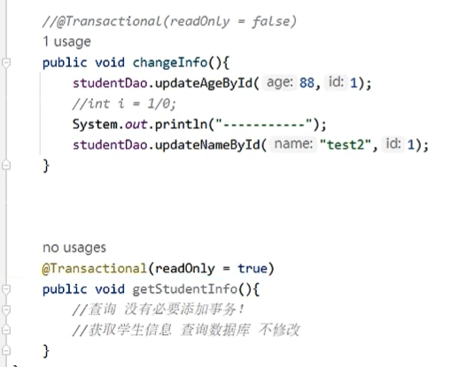

# 一、基本程序搭建

1. 依赖

2. 配置类

3. `DAO` 层

4. 业务层

业务层的 `changeInfo` 方法同时操作两条 `SQL` 语句

# 二、事务注解的添加

1. 在**配置类**中选择一个**具体的事务管理器实现类**放入到 `ioc` 容器

2. 在配置类中开启事务类注解支持

3. 在目标方法上添加事务注解，开启事务

如上所示，`1/0` 会出错，因此整个事务会回滚。

# 三、高级设置

## 3.1 只读模式设置

## 3.2 事务超时时间设置

## 3.3 事务异常指定问题

**默认情况**下，当方法内部发生 **运行时异常** 时，事务才算失败，然后回滚（对于 IO 异常和不会出现回滚）

默认情况下，下述方法的事务不会发生回滚（因为发生的是 IO 异常）：

经过异常范围扩大后，就会发生回滚：

`noRollbackFor` 的作用：回滚异常范围内，控制某个异常不回滚：

## 3.4 事务隔离级别

## 3.5 事务传播行为

1. 场景

2. 举例说明

3. `propagation` 属性

4. 注意

父方法与子方法要位于**不同的类**中才可以实现事务传播行为。

5. 其他传播行为值

