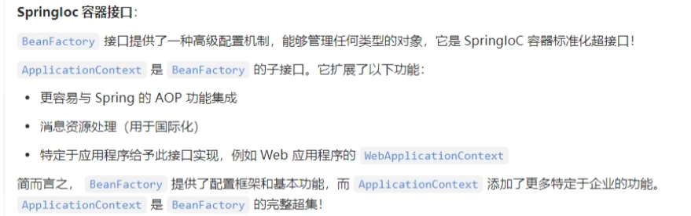
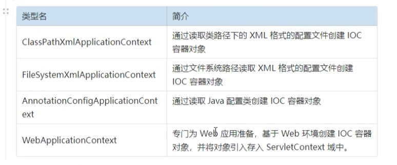
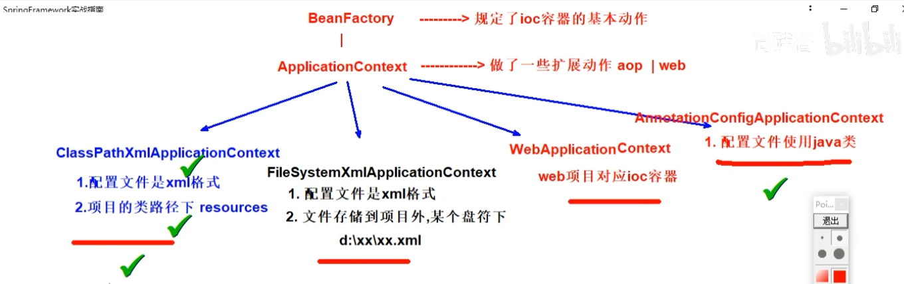
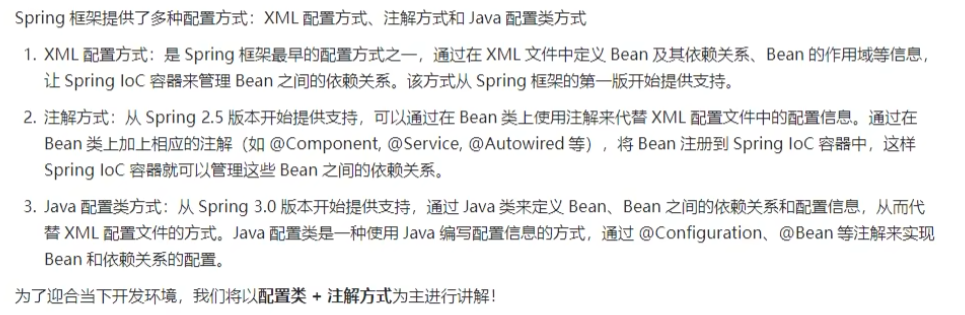

# `SpringIoc` 介绍

# `SpringIoc`  容器

借助于IOC思想，Spring实现了IOC容器，其主要功能包括：

1. **自动装配（Dependency Injection, DI）**：这是IOC的一个关键特性，允许你通过构造函数、工厂方法或属性注入的方式自动地向一个类提供它所依赖的对象，而不是让这个类自己去创建或寻找它的依赖。

2. **Bean的管理和配置**：在Spring中，被IOC容器管理的对象称为Bean。IOC容器负责根据配置元数据（如XML文件、注解或Java配置类）创建和初始化Bean，并且可以管理它们的整个生命周期。

3. **Bean的作用域和生命周期管理**：IOC容器还支持不同作用域的Bean定义，例如单例（Singleton）、原型（Prototype）、请求（Request）、会话（Session）等，同时能够管理Bean的创建、使用及销毁过程。

4. **集成和扩展能力**：IOC容器为开发者提供了强大的集成和扩展能力，使得第三方库或服务可以轻松地与Spring应用整合。

通过使用IOC容器，Spring框架帮助开发者编写更加松散耦合、更易于测试和维护的代码。由于依赖关系由容器自动处理，因此开发者可以专注于业务逻辑的实现，而不必担心底层的基础设施问题。

# `SpringIoc`  容器具体接口和实现类

# `SpringIoc` 容器管理配置方式

