# 一、组件( `Bean` ) 信息声明配置（`Ioc`）

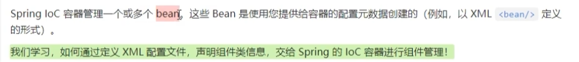

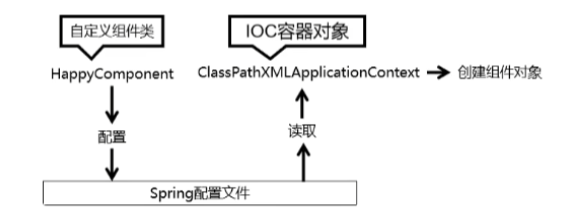

## 1.1 准备项目

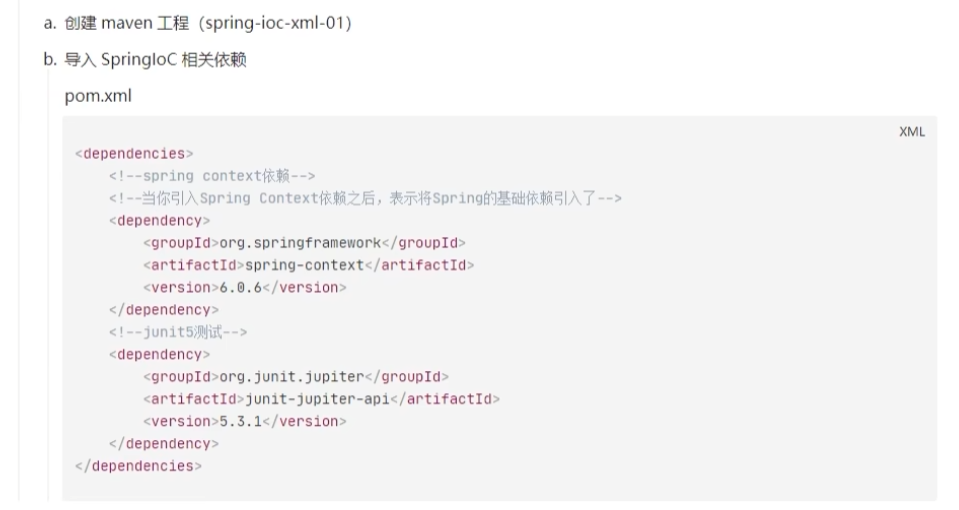

## 1.2 基于类的无参构造函数

1. 创建一个基于无参构造函数的类

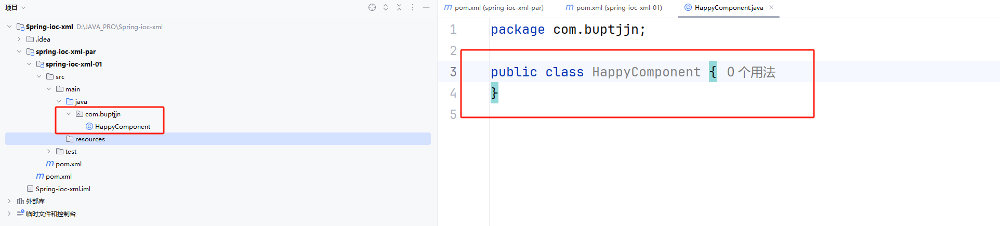

2. 生成 Spring 配置文件

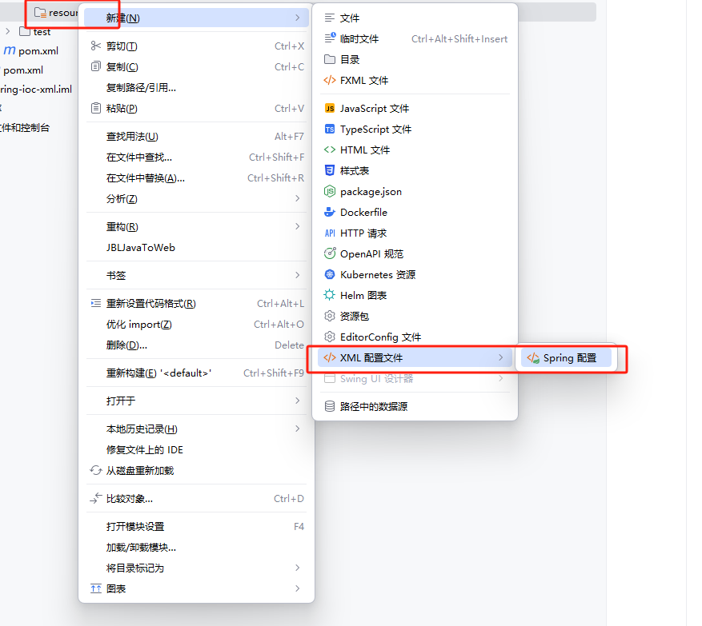

3. 在配置文件中进行声明

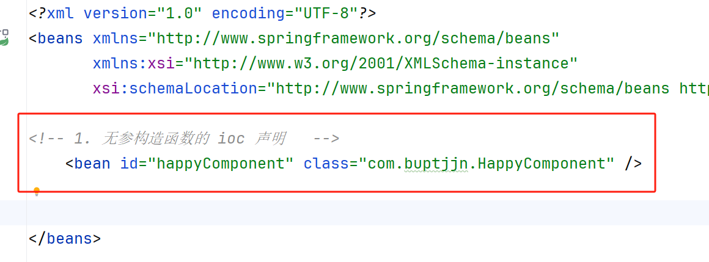

一条 `bean` 创建一个对象，`id` 表示后期该 `bean` 组件的名称，`class` 表示组件对应的类的全限定符。

## 1.3 基于静态工厂方法实例化

1. 创建基于静态工厂模式的类

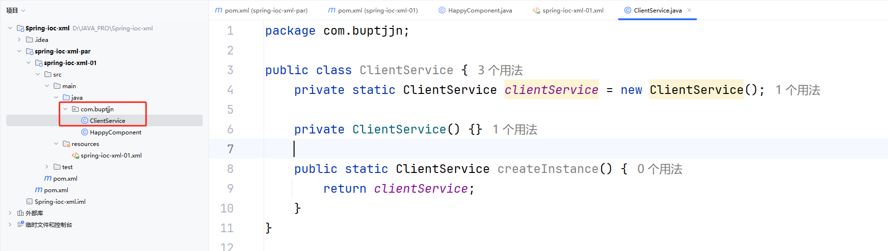

2. 在配置文件中进行声明

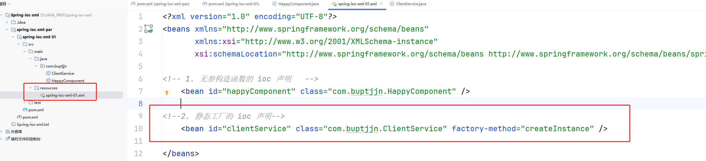

`factory-method` 用于表示获取类的静态工厂方法。

## 1.4 基于实例工厂方法实例化

1. 创建基于实例工厂实例化的类

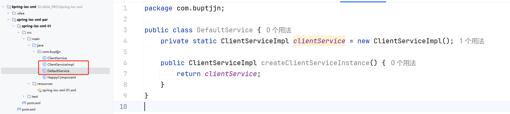

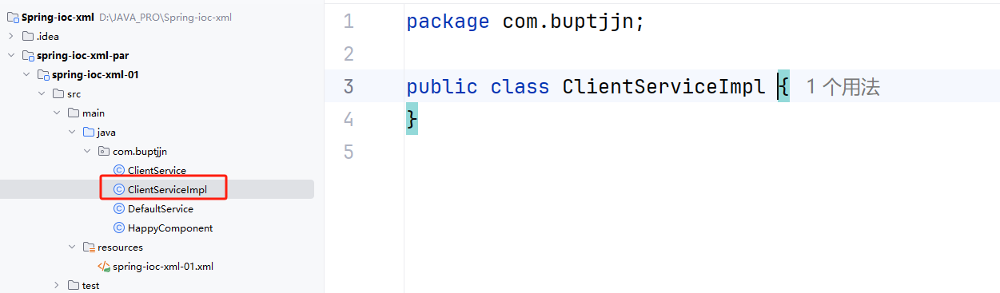

2. 在配置文件中进行声明

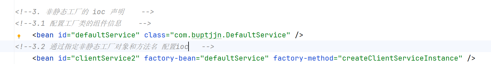

# 二、组件的依赖注入（`di`）

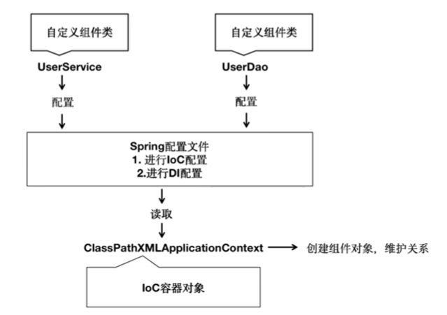

```java
//User_DAO.java
package com.buptjjn.ioc_02;

public class User_DAO {
}
```

```java
//User_Service.java
package com.buptjjn.ioc_02;

public class User_Service {
    private User_DAO userDao;
    private int age;
    private String name;

    public User_Service() {

    }


    public User_Service(User_DAO userDao) {
        this.userDao = userDao;
    }

    public User_Service(User_DAO userDao, int age, String name) {
        this.userDao = userDao;
        this.age = age;
        this.name = name;
    }

    public void setAge(int age) {
        this.age = age;
    }

    public void setName(String name) {
        this.name = name;
    }
    public void setUserDao(User_DAO userDao) {
        this.userDao = userDao;
    }
}
```

## 2.1 构造函数（单参数）的注入

```xml
<!-- 1. 单个构造参数注入   -->
    <bean id="userDao" class="com.buptjjn.ioc_02.User_DAO" />
    <bean id="userService" class="com.buptjjn.ioc_02.User_Service">
      <!-- 1.1 构造参数传值 di 的配置  value 和 ref 只能二选一
      <constructor-arg value="" /> 传入直接数据类型
      <constructor-arg ref="" /> 传入引用数据类型
      -->
        <constructor-arg ref="userDao"/>
    </bean>
```

## 2.2 构造函数（多参数）的注入

```xml
<!-- 2. 多个构造参数注入 -->
    <bean id="userService2" class="com.buptjjn.ioc_02.User_Service">
        <!-- 2.1 按照参数顺序依次注入       -->
        <constructor-arg ref="userDao" />
        <constructor-arg value="18"/>
        <constructor-arg value="小米"/>
    </bean>
    <bean id="userService3" class="com.buptjjn.ioc_02.User_Service">
        <!-- 2.2 按照指定的参数名称进行注入       -->
        <constructor-arg name="age" value="18" />
        <constructor-arg name="name" value="小兰"/>
        <constructor-arg name="userDao" ref="userDao"/>
    </bean>
    <bean id="userService4" class="com.buptjjn.ioc_02.User_Service">
        <!-- 2.3 按照指定的参数下标进行注入       -->
        <constructor-arg index="0" ref="userDao" />
        <constructor-arg index="1" value="18"/>
        <constructor-arg index="2" value="小可"/>
    </bean>
```

## 2.3 setter 方法注入

```xml
<!-- 3. 基于 Setter 方法进行依赖注入   -->
    <bean id="userService5" class="com.buptjjn.ioc_02.User_Service">
<!-- 3.1  name="xxx" xxx 应该是对应的 Setter 方法去掉 Set，同时将剩余的单词首字母小写后的样子  -->
<!-- 3.2  ref="" 或者 value="" 是二选一的     -->
        <property name="userDao" ref="userDao" />
        <property name="age" value="20"/>
        <property name="name" value="小刚"/>
    </bean>
```

