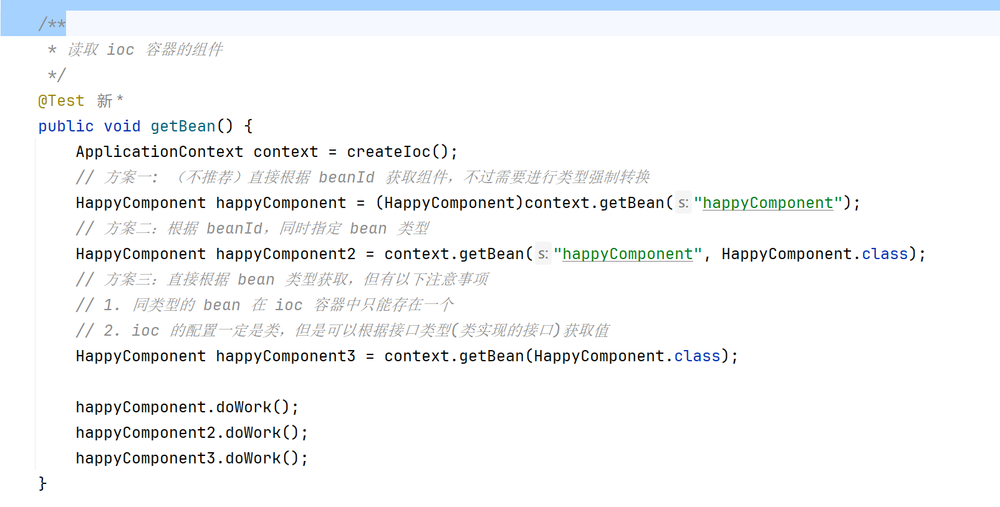

# 一、创建测试工程

源项目和测试项目需要对应（软件包名须一致`com.buptjjn`）


测试需要的依赖：

```xml
<dependency>
    <groupId>junit</groupId>
    <artifactId>junit</artifactId>
    <version>RELEASE</version>
    <scope>test</scope>
</dependency>
```

# 二、`Ioc` 容器的创建

两种方式：


# 三、`Ioc` 容器的使用

三种方式：



**对于需要进行执行的方法，这里就是 `getBean()` 方法，需要在方法之上，添加 `@Test` 注解**