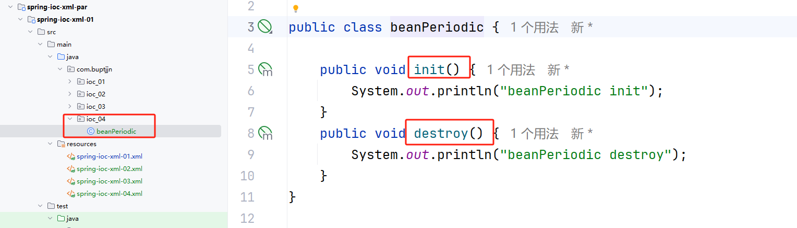
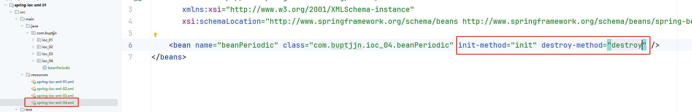
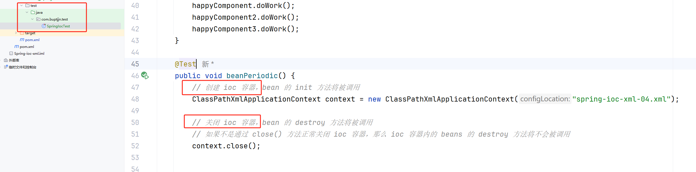
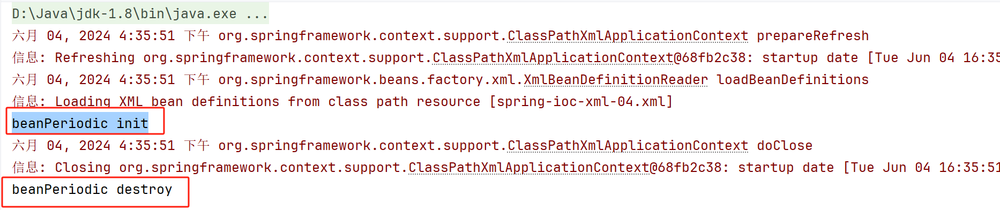
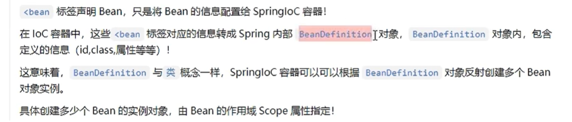
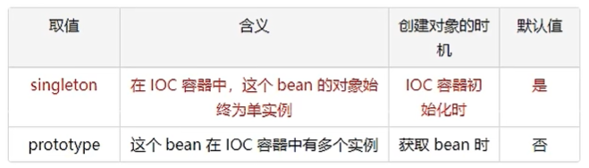
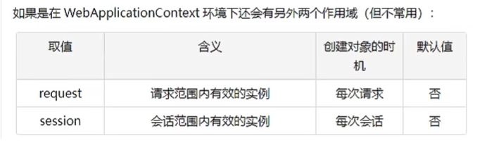
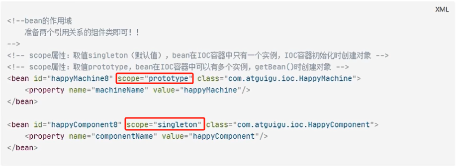

# 一、周期方法配置

## 1.1 周期方法概念

## 1.2 周期方法声明

必须是 `public void` 且不能有传入参数

## 1.3 周期方法配置

## 1.4 测试运行

# 二、作用域配置

## 2.1 作用域概念

## 2.2 作用域可选值

分别对应对象的 `单例模式` 和 `多例模式`。单例就是从 `ioc` 容器中 `getBean` 时总是获取的同一个对象；多例就是每次调用 `getBean` 都会创建并返回一个新的对象。

## 2.3 如何使用

