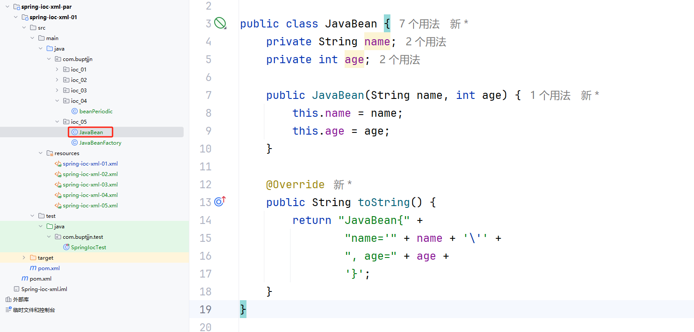
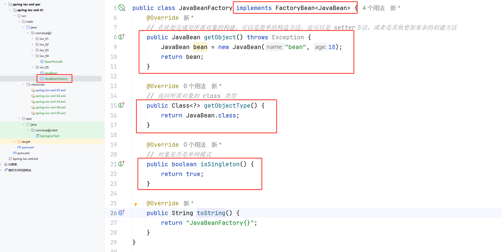
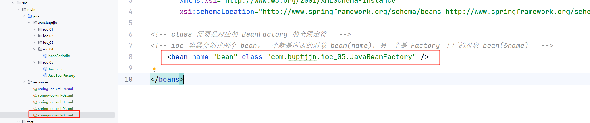
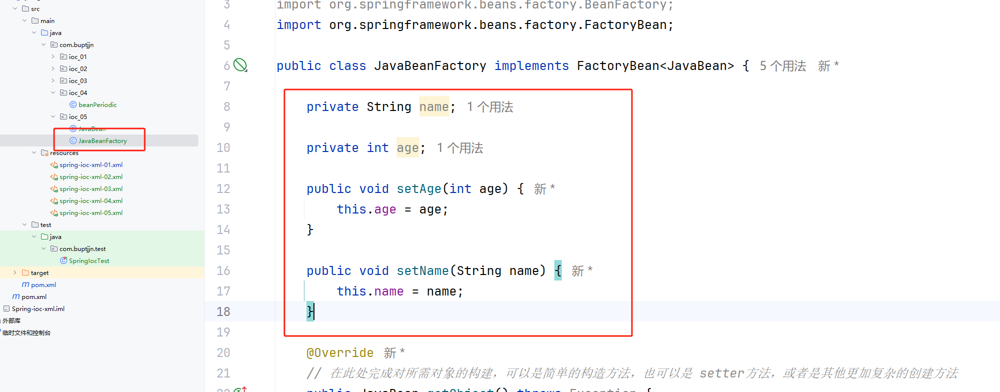
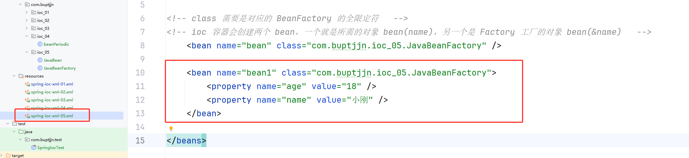
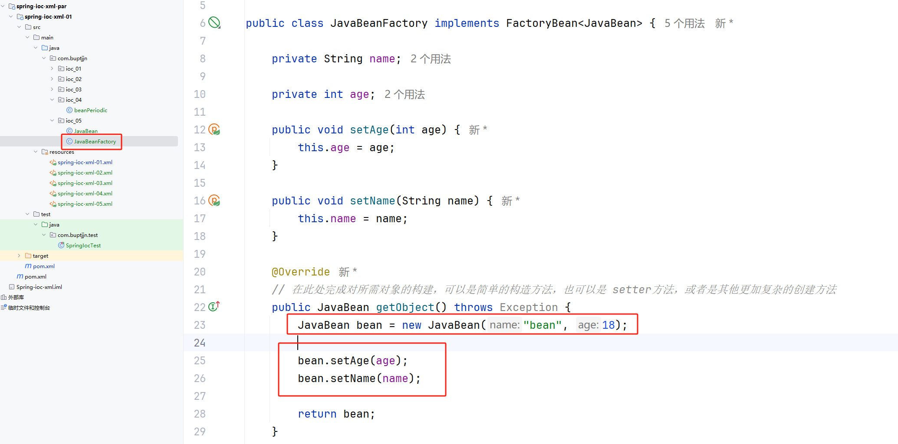
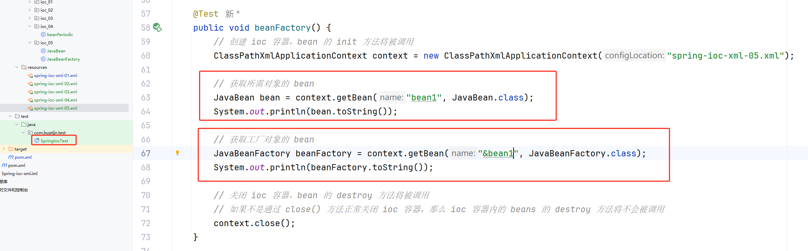
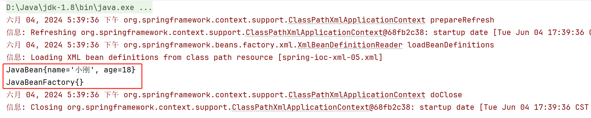

# 一、问题

组件的声明有两种方式：1. 基于构造函数   2.基于 Setter 方法

一般来说，基于构造函数的比较简单；但是基于 Setter 方法的有时候比较复杂，可能还会涉及到其他对象的创建。

为了更加便于组件 bean 的声明，提出了 `factoryBean` 的组件声明方式。

`FactoryBean` 是 Spring 框架中的一个接口，它的提出主要是为了解决某些对象的创建过程比较复杂，不能通过简单的 new 操作符来完成实例化的情况。通过 `FactoryBean` 接口，可以将对象的创建逻辑封装起来，提供一种更加灵活、可配置的方式来管理 Bean 的创建过程。

以下是 `FactoryBean` 提出的主要目的：

1. **复杂的初始化逻辑**：当 Bean 的创建需要复杂的初始化逻辑时，使用 `FactoryBean` 可以将这些逻辑封装起来。例如，连接池、缓存等资源的初始化往往涉及多个步骤，使用 `FactoryBean` 能够更好地组织和管理这些步骤。

2. **依赖于外部配置或运行时信息**：某些 Bean 的创建可能依赖于外部配置文件（如数据库连接信息）或者运行时才能确定的信息（如当前环境）。`FactoryBean` 允许根据这些动态因素定制化地创建对象。

3. **抽象实现细节**：`FactoryBean` 提供了一种方式来隐藏对象创建的复杂性，使得业务代码不需要关心对象是如何被创建的，只需要知道如何获取到这个对象即可。这样可以提高代码的可读性和可维护性。

4. **支持单例或多例模式**：通过实现 `FactoryBean` 接口，可以灵活地控制 Bean 的创建方式，无论是作为单例还是每次请求都创建新的实例。

5. **增强框架功能**：`FactoryBean` 也是 Spring 框架自身用来实现一些高级特性的基础之一，比如 AOP 代理对象的生成等。

总之，`FactoryBean` 通过提供一个创建对象的工厂方法，让 Spring 容器能够更灵活地管理 Bean 的生命周期和创建逻辑，提高了 Spring 应用程序的灵活性和扩展性。

# 二、使用

## 2.1 目标类实现

## 2.2 `factoryBean` 类的实现

需要实现 `FactoryBean<T>` 接口

## 2.3 配置文件声明

需要注意：这里的 `bean行` 对应的工厂类，如果使用 `property` 对应的也是工厂类的 `Setter` 方法，例如：

通过 `property` 获取到值的是 `JavaBeanFactory` 类，而不是 `JavaBean` 类。

但是我们可以通过转接的方式实现对 `JavaBean` 类的 Setter：

## 2.4 测试使用

