# 一、需求分析


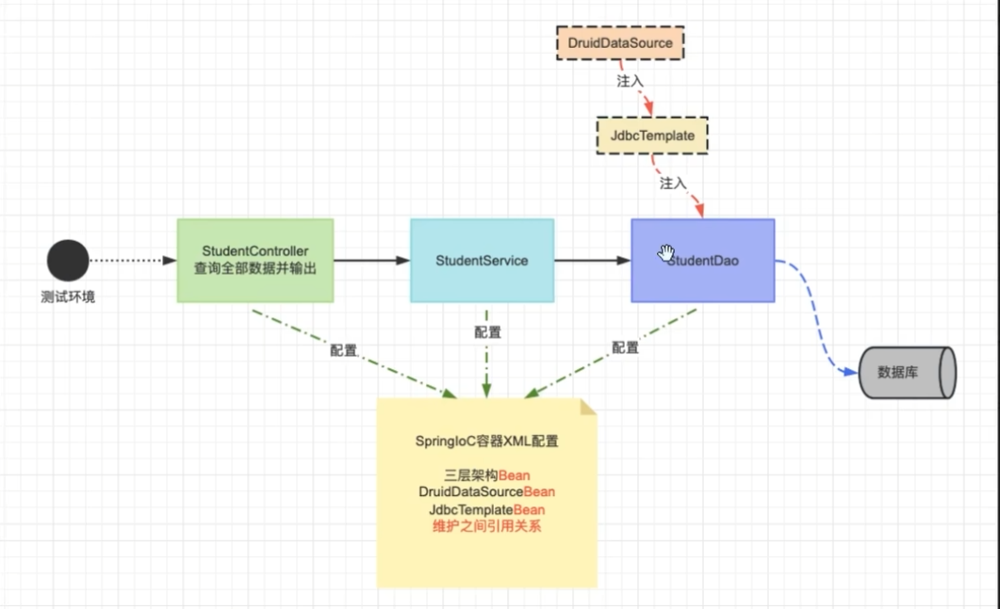

# 二、数据库准备

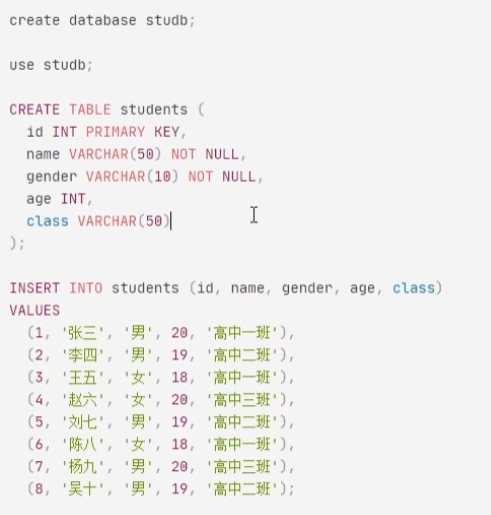

# 三、项目准备

## 3.1 依赖导入

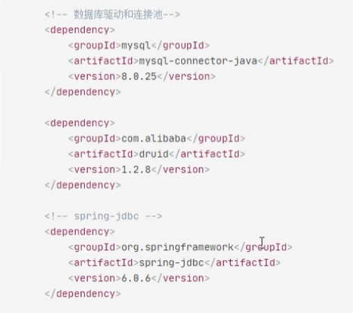

## 3.2 实体类准备

```java
public class Student {
    private Integer id;
    private String name;
    private String gender;
    private Integer id;
    private String classes;

    …………对应的 set 和 get 方法
}
```

## 3.3 `jdbcTemplate` 的使用

作用：简化数据库的 crud 操作

```java
// 1.实例化对象
JdbcTemplate jdbcTemplate = new JdbcTemplate();

jdbcTemplate.setDataSource(连接池对象)

// 2.调用方法即可
jdbcTemplate.update();  // DDL DML DCL ... 非查询语句
jdbcTemplate.queryForObject();    // DQL 查询单个对象
jdbcTemplate.query()   // DQL 查询一个集合
```

## 3.4 `druid` 使用

`jdbcTemplate` 不提供连接池，无法与 `MySQL` 数据库进行连接。因此需要使用额外的技术完成连接。

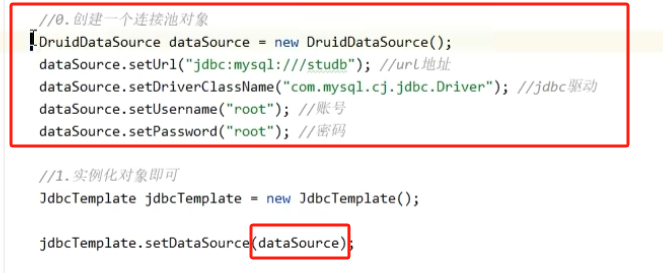

## 3.5 由 `XML` 配置文件完成上述操作

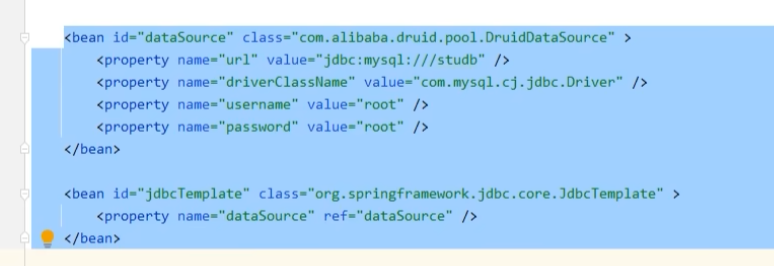

**进阶：**

数据库相关信息存储在配置文件中，`xml` 去读该配置文件，而非直接写入到 `xml` 文件中：

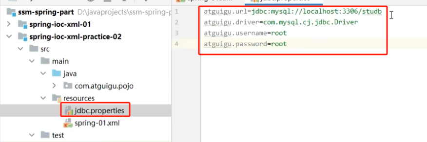

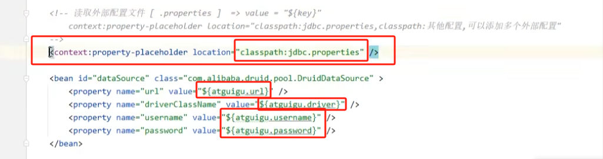

## 3.6 测试

1. 初始化资源

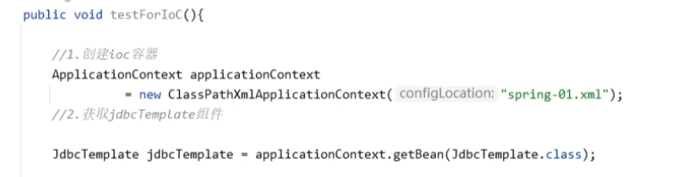

2. 插入操作

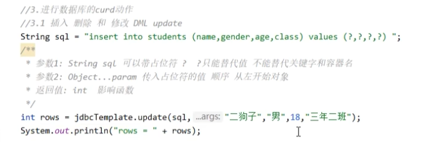

3. 单行查询操作

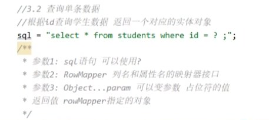

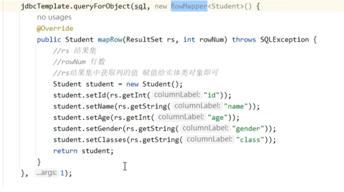

> 这里要注意 `mapRow` 的实现，他的作用其实就是将从数据库查询获得的数据转成自定义的返回结果（通常是以对象的形式）给上层调用者。
>
> 注意，这里的数据库的 class 列对应着结构体的 classes 列（因为 java 中 class 是一个关键字）

4. 查询所有学生数据

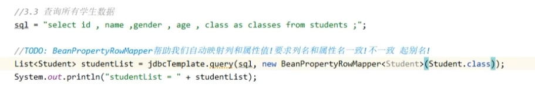

> 这里直接使用了 `BeanPropertRowMapper` 类，这个类已经实现了 `mapRow` 接口。他会按照查询数据的 `列名` 匹配类中的 `字段`，原则是两者重名，如果不重名需要在 `sql` 中为 `列名` 起别名(如：class as classes)

# 四、实现三层架构

## 4.1 实现数据层（`DAO` 层）

结构：

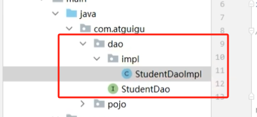

接口（`StudentDao`）：

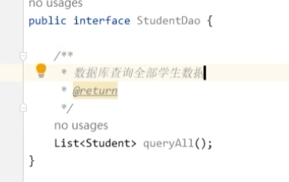

实现类（`StudentDaoImpl`）：

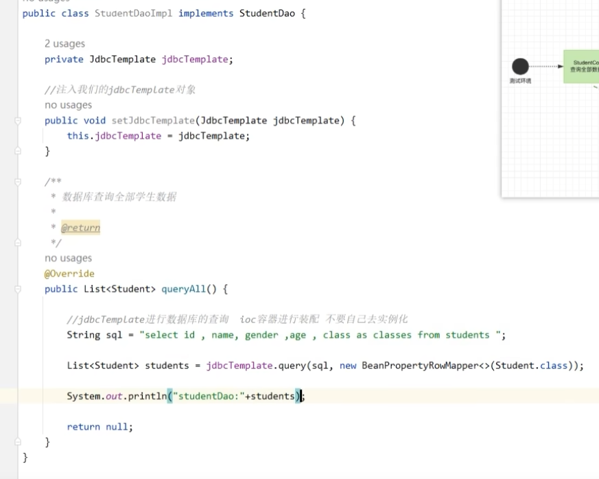

> 注意：`StudentDaoImpl` 需要依赖于 `JdbcTemplate` 对象完成对数据库的操作。在这里，我们需要采用 ioc 方式，采用注入（di） 的方式（setter + xml），而不是在 `StudentDaoImpl` new 一个 `JdbcTemplate`

## 4.2 实现业务层（`Service`）

结构：

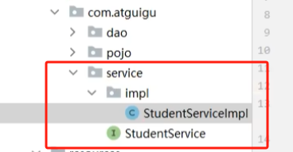

接口：

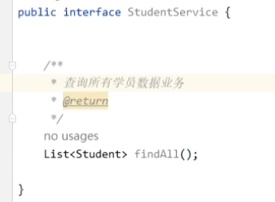

实现类：

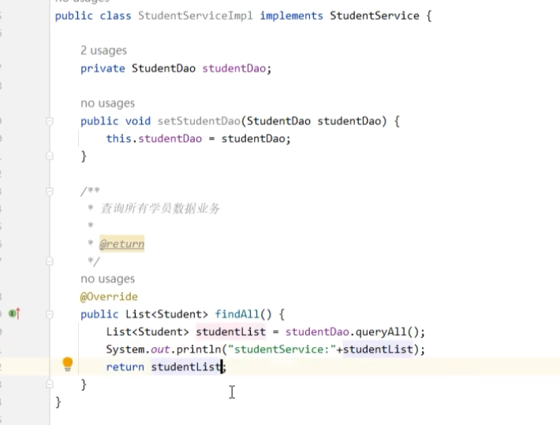

> 同理，对于 `StudentDao` 的依赖，等待由 ioc 完成即可

## 4.3 实现控制层（`controller`）

结构：

`controller` 一般只有实现类，没有接口

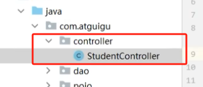

类：

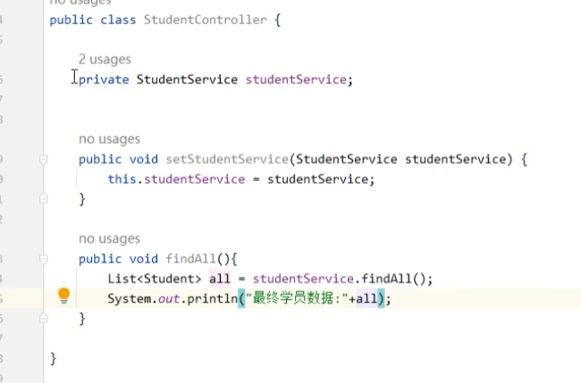

## 4.4 `ioc-xml` 文件的配置

都是基于 `setter` 函数完成 di 注入

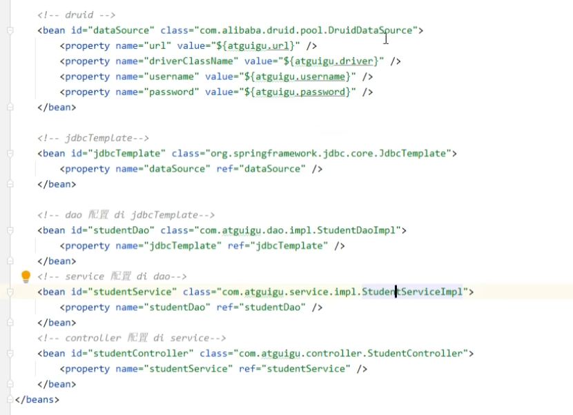

## 4.5 测试

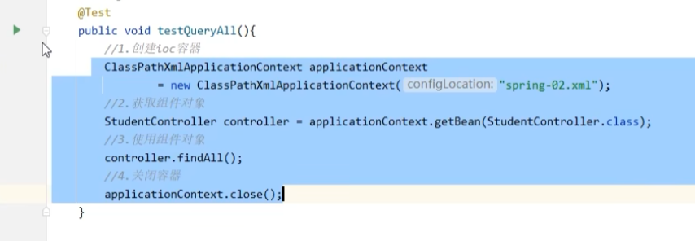