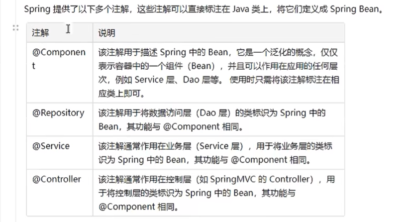
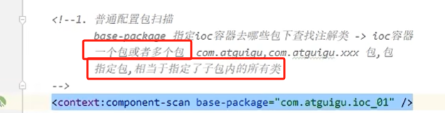
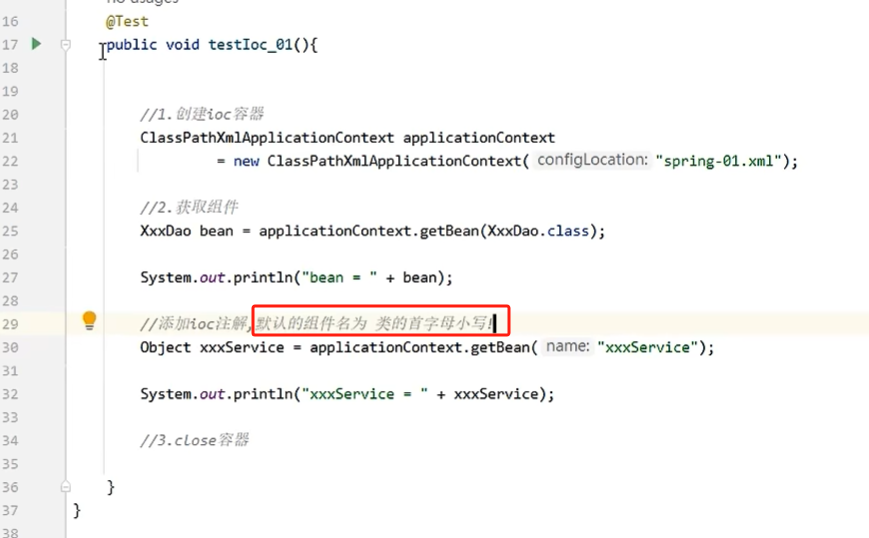
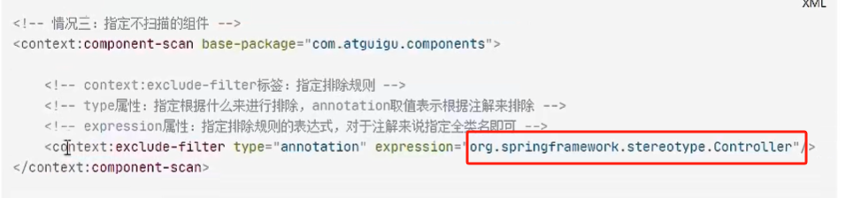
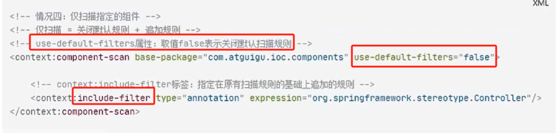
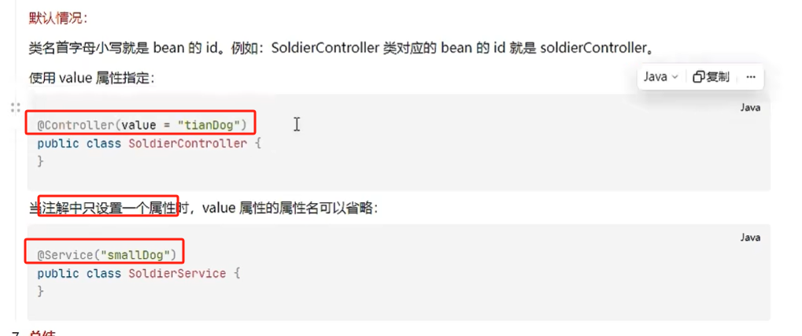

# 一、如何通过注解完成 `ioc` 配置

通过两步完成：

1. 在类的上面添加注解标记
2. 在 xml 文件中标注哪些包下的注解可用

## 1.1 组件标记注解的类型

实际上，下面三类注解：`Repository` , `Service` ，`Controller` 和 `Component` 的作用和地位是完全一样的，只不过是名字不一样，用于区分程序的不同模块而已。

如果类不属于三层架构中的任何一个，那么就用 `Component` 注解即可。

## 1.2 `xml` 配置文件

## 1.3 测试使用

# 二、进阶操作

## 2.1 `xml` 文件中指定排除组件

可以在 `xml` 文件中人为指定不读取某些注解

下面是指定不读取 `@Controller` 注解

## 2.2 指定扫描组件

在 `xml` 文件中只扫描指定类型的组件：

## 2.3 自定义 `bean` 的名称

默认情况下，类通过注解获得的 `bean` 的 id 就是类名但首字母小写，可以通过以下方式自定义 `bean` 的 id：

