# 一、配置类

配置类的作用是为了完全取代 `xml` 的存在，代替 `xml` 方式完成以下功能：

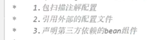

## 1.1 如何声明配置类

配置类作为一个类，需要放在源代码区域。

1. 通过 `@Configuration` 进行注解，向 `ioc` 容器表名这是一个配置类
2. 使用 `@ComponentScan()` 代替 `xml` 完成对指定包下（可以有多个包）注解的扫描
3. 使用 `@PropertySource()` 代替 `xml` 完成对外部配置文件的读取
4. 在配置类内部使用方法完成对第三方类的声明和引入（加入到 `ioc` 容器）

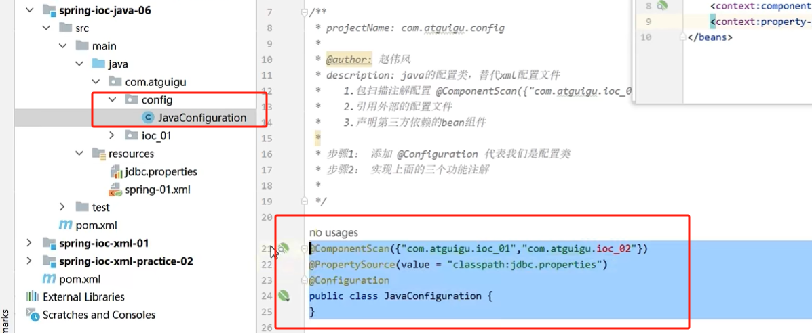

## 1.2 如何使用配置类

参数是 `类.class`

也有两种方式 

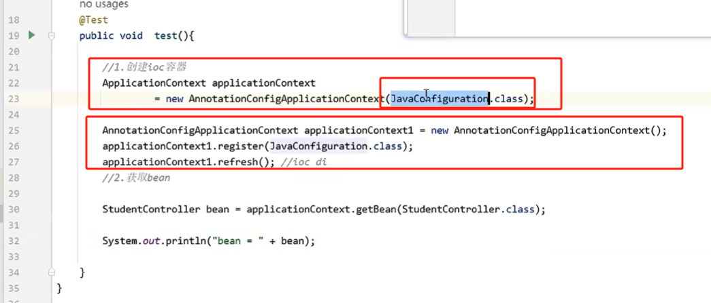

## 1.3 第三方类的引入

1. `@Value` 从外部文件读取配置信息

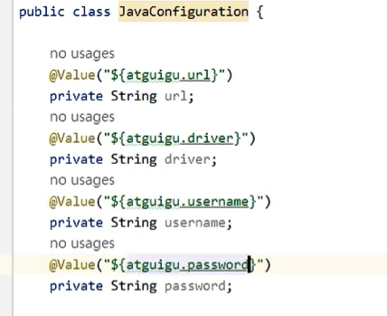

2. 第三方类作为 `bean` 加入到 `ioc` 容器

- 引入第三方类的方法需要添加 `@Bean` 注解
- 方法需要将第三方类作为返回值进行返回
- 在方法内部完成第三方类的创建和初始化（从文件中获取的 val 值进行初始化）
- 产生的 `bean` 的 id 默认是方法名

# 二、`@Bean` 详细介绍

## 2.1 如何自定义 `bean id`

默认情况下，产生的 `bean` 的 id 是方法名。

可以通过 `name` 或 `value` 自定义 `bean` 的 id：

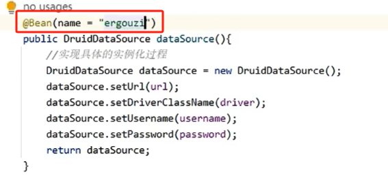

## 2.2 周期方法如何指定

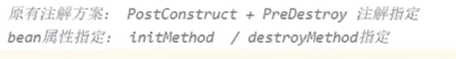

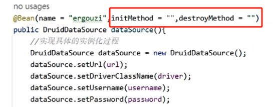

## 2.3 作用域指定

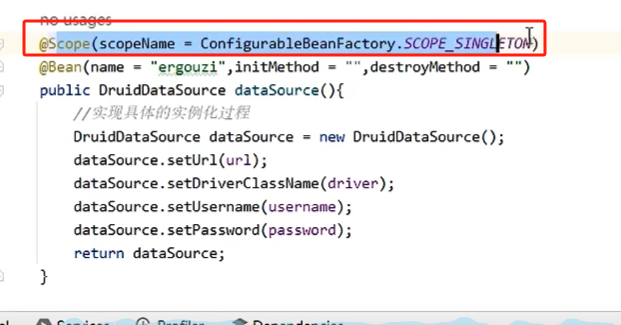

## 2.4 如何去引用其他的 `ioc` 组件

### 2.4.1 方法一

对方组件也是 `@Bean` 方法引入的，可以直接调用该方法

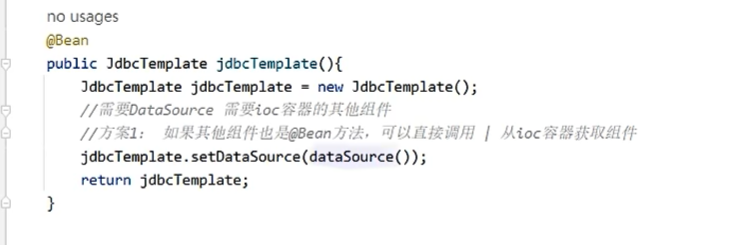

### 2.4.2 方法二

通过在形参列表中引入：

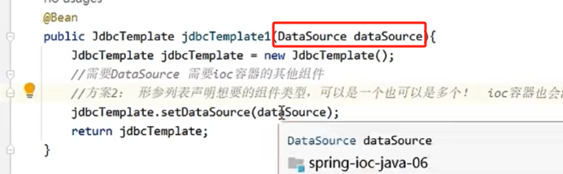

基于这种方式，如果存在多个 `ioc` 组件匹配的情况，就不能基于类型进行引入，而是需要通过自定义 `bean id` 的方式进行引入：

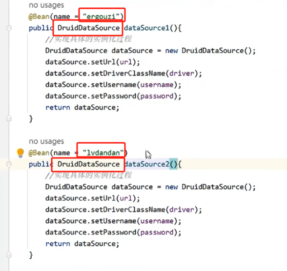

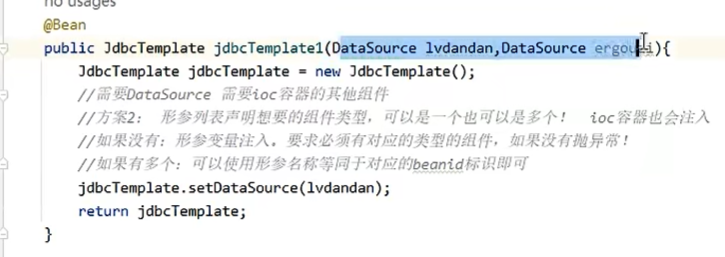

# 三、`@Import` 的使用

假设有两个配置类 `JavaConfigurationA` 和 `JavaConfigurationB`

正常情况下，需要一次导入这两个配置类：

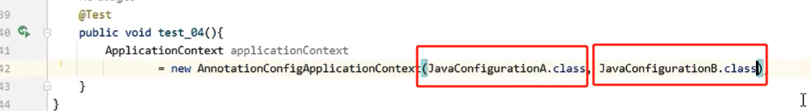

如果使用 `@Import` ，在 `JavaConfigurationA` 中导入 `JavaConfigurationB`，那么最后在使用的时候就只需要导入 `JavaConfigurationA` 即可：

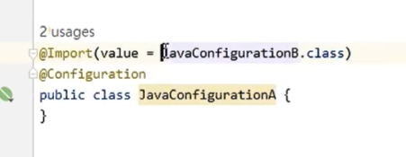